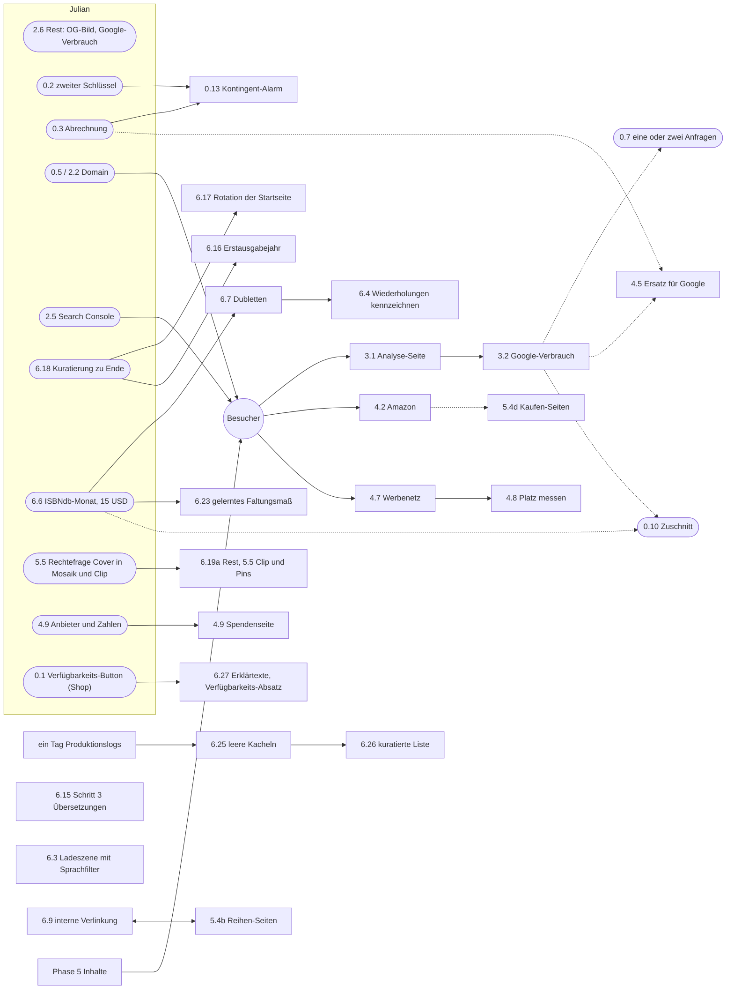

# Beautiful Books – Roadmap

Stand: 2026-09-10, nach dem Umbau (Julian: „überprüfe die Abhängigkeiten, sortiere die Phasen neu, fasse die angehakten Punkte kürzer, baue eine Steuerungsübersicht"). Die Seite ist seit dem 2026-09-08 online. **Jeder Punkt steht hier genau einmal, mit seiner Nummer, offen oder erledigt.** Die Nummern bleiben für immer, weil Code, Historie und Commits sie zitieren; die *Reihenfolge* der Phasen im Dokument folgt den Abhängigkeiten, nicht den Nummern. Ein erledigter Punkt bleibt stehen, auf wenige Zeilen gekürzt — Ergebnis, Datum, Verweis —, sein voller Text liegt im [Archiv](docs/roadmap-archive.md), seine Messungen in der [Historie](docs/history.md).

*Wer* steht bei jedem Punkt: **Julian** (Konten, Geld, Recht, Produktentscheidungen), **Claude** (Code, Messung, Text) oder beide. Punkte mit **[T*n*]** stammen aus dem [Testbericht vom 2026-09-07](docs/tests/2026-09-07-durchklick.md).

---

## Steuerung

### Wo was steht

| Frage | Dokument |
|---|---|
| **Was die Seite ist und sein soll** | [SPEC.md](SPEC.md) — [§1 Produkt](SPEC.md#1-produktidee) · [§2 Domänenmodell](SPEC.md#2-domänenmodell) (Work, Edition, Cover, Kauf-Links, Index) · [§3 Funktionen F1–F6](SPEC.md#3-funktionale-anforderungen) · [§4 Regeln N1–N13](SPEC.md#4-nicht-funktionale-anforderungen) · [§5 Gestaltung](SPEC.md#5-gestaltung) · [§6 Entscheidungen E1–E20](SPEC.md#6-entscheidungen) · [§7 Gemessene Grenzen](SPEC.md#7-gemessene-grenzen-stand-2026-09-07) · [§8 Nummern-Konkordanz](SPEC.md#8-nummern-konkordanz) |
| **Was sie heute kann** | [docs/features.md](docs/features.md) — je Funktion: seit wann, Spec-Stelle, Roadmap-Punkt, Code |
| **Was offen ist, in welcher Reihenfolge** | dieses Dokument: [Nächste Schritte](#nächste-schritte), [Abhängigkeiten](#abhängigkeiten), dann die Phasen |
| **Was gebaut und gemessen wurde** | [docs/history.md](docs/history.md), chronologisch, mit den Zahlen |
| **Erledigte Punkte in voller Länge** | [docs/roadmap-archive.md](docs/roadmap-archive.md) |
| **Die Pläne** (ausführliche Fassung eines Punkts) | [docs/plans/README.md](docs/plans/README.md) — offen: [Phase 5](docs/plans/PLAN-5-reichweite.md), [Einnahmen](docs/plans/PLAN-4-einnahmen.md), [Speicher §3–5](docs/plans/PLAN-speicher.md) |
| **Experimente neben der Seite** | [lab/README.md](lab/README.md) — Kuratieren, Duell, Mosaik, Ladebilder, Faltung, Palette |
| **Welche Session woran arbeitet** | `npm run worktrees` schreibt [docs/worktrees.md](docs/worktrees.md): alle Worktrees und Branches, Stand gegen Produktion, Themen aus den Commits (git-ignoriert, also nie veraltet) |
| **Arbeitsregeln** | [CLAUDE.md](CLAUDE.md) |
| **Recherchen** | [Recht der Hobbyseite](docs/recht-hobbyseite.md) · [Domain-Namen](docs/domain-recherche.md) · [Suche nach ISBN und Stichwort](docs/suche-isbn-und-stichwort.md) · [Buchrücken](docs/spine-research.md) · [Testbericht 2026-09-07](docs/tests/2026-09-07-durchklick.md) |

### Stand

- **Online seit 2026-09-08: https://beautifulcovers.vercel.app**, Hobby-Modus (E20), Vercel Hobby, Funktionen in Frankfurt, Web Analytics an.
- **Produktion ist `origin/main`.** Ein Push dorthin ist ein Deploy. Am 2026-09-10 arbeiteten **drei Sessions parallel**: eine schob 6.19a direkt nach `origin/main`, eine baute 6.29 auf dem lokalen `main`, eine baute 6.28 auf einem Branch — und das lokale `main` lag zeitweise sechs Commits vor und fünfzehn hinter Produktion, ohne dass es irgendwo stand. Seither zusammengeführt und am selben Abend deployt (`b43904b`); `npm run worktrees` zeigt, ob das wieder passiert, und ist vor jedem Merge nach `main` zu lesen.
- **53 Punkte offen, 35 erledigt.** Phase 1 ist bis auf Julians Stichprobe (1.8) leer, Phase 2 hat nur noch Julians Konten und die Abnahme. Der größte offene Block ist Phase 6, und dort zuerst die Fehler, die ein Leser sieht.
- **Der Engpass ist nicht die Technik, sondern dass niemand die Seite kennt:** sie steht in keiner Suchmaschine (2.5) und unter einem Namen, den niemand behält (0.5).

### Nächste Schritte

Sortiert danach, was am meisten kostet, wenn es liegen bleibt.

| | Was | Wer | Aufwand | Warum jetzt |
|---|---|---|---|---|
| 1 | **2.6 zu Ende**: OG-Bild in einem Messenger, Google-Verbrauch eines Tages aus der Cloud-Konsole | Julian | zehn Minuten | Der Deploy vom 2026-09-10 ist geprüft, der CDN-Treffer gemessen; die zwei Reste kann nur Julian sehen |
| 2 | **2.5 Search Console und Bing**, dazu **0.2** zweiter Google-Schlüssel und **0.13** Kontingent-Alarm | Julian | 30 Minuten | Jeder Tag ohne Sitemap ist ein verlorener Tag; ein Schlüssel für Arbeit *und* Betrieb verbraucht das Kontingent der Besucher |
| 3 | **0.5 / 2.2 Domain** kaufen und verbinden | Julian | 20 Minuten plus DNS | Reichweite auf `vercel.app` muss später umgeleitet werden; Vorschläge in [docs/domain-recherche.md](docs/domain-recherche.md) |
| 4 | ~~**6.25 leere Kacheln**~~ — erledigt 2026-09-11, mitgelesen: 132 Bildanfragen, keine gescheitert | — | — | Wieder offen, wenn Julian erneut leere Kacheln sieht |
| 5 | **6.5** Mosaik-Ausfall sichtbar machen, ~~**6.8** „All languages“-Pille~~ (erledigt 2026-09-11) | Claude | je ein bis zwei Stunden | Phase 1 ist leer; das sind die zwei kleinen Punkte aus 6.A und 6.C ohne Abhängigkeit |
| 6 | **6.18 Kuratierung zu Ende**, danach **6.17 Rotation** und das Jahr für **6.16** | Julian, dann Claude | ein Abend, dann eine Sitzung | Die Startseite ist das Erste, was ein Besucher sieht |
| 7 | **6.15 Schritt 3**, die Stichprobe zu Übersetzungen | Claude | eine Sitzung | 6.13 ist seit dem 2026-09-11 erledigt: die Wand lädt, was die Karte zusammenfasst. Offen ist, ob etwas Datensätze mit **anderem** Titel zusammenführen darf |
| 8 | **3.1 Analyse-Seite** | Claude | zwei Tage | Erst sinnvoll mit einer Woche echter Besucher |
| 9 | **Phase 5**, beginnend mit 5.3 an der fertigen Gattung 5.4a | beide | Wochen | Die eigentliche Reichweite |

**Aus dem Testbericht vom 2026-09-11** ([Telefon gegen Produktion](docs/tests/2026-09-11-mobil.md), elf Befunde) folgt diese Reihenfolge, die vor Zeile 5 der Tabelle geht:

| | Was | Wer | Befund |
|---|---|---|---|
| a | **6.25a deployen** (`35b171d`, fertig, nicht gepusht) | Julian sagt ja | M6: die Wand übernimmt fast leer |
| b | ~~**`bb.img` mitlesen**~~ — erledigt 2026-09-11: 132 Bildanfragen, keine gescheitert; 6.25 abgehakt. Ob die Wand-Dubletten (M9) damit seltener werden, zeigt die nächste Beobachtung | beide | M7 |
| c | ~~**6.32** fehlende Signatur ergibt nie „anderes Cover"~~ — erledigt 2026-09-11 | Claude | M8 |
| d | ~~**6.31** zweiter Versuch einer Kachel, **6.33** die alte Wand weg~~ — erledigt 2026-09-11 | Claude | M7, M11 |
| e | ~~**6.30** Startseite auf dem Telefon~~ — erledigt 2026-09-11; offen **6.30a**, dieselbe Messung über die übrigen Seiten | Claude | M1–M3 |
| f | ~~**6.34** Karten ohne Dubletten, Größe M~~ — erledigt 2026-09-11 | Claude | M4, M5 |
| g | ~~**6.35** E-Books fallen weg (E21)~~ — erledigt 2026-09-11 | Claude | M10 |
| h | **6.36** gleicher Entwurf, verschiedene Verlage | Julian entscheidet | M9 |

**Nicht als Nächstes, mit Grund:** 6.6 (zwei Tage und ein ISBNdb-Monat, also Julians Geld — und 6.7, 6.4, 6.23 warten darauf), Phase 4 (ohne Besucher bringt ein Kauf-Link nichts, und der Umschalttag verlangt volles Impressum und Pro-Plan), 0.10 (nach 3.2 billiger zu entscheiden), 6.19a-Rest (die Rechtefrage aus 5.5 steht davor), 0.8a und 1.8 (brauchen Julian am Gerät, halten aber nichts auf).

**Zwei Punkte haben an Wert verloren, ohne angefasst zu werden:** 6.12 ist seit dem gebauten Index nur noch ein Randfall für Werke außerhalb der Liste; der `priority`-Teil von 6.5 wurde von 1.3 verschoben, nicht gelöst — vor dem Anfassen neu messen.

### Abhängigkeiten

Was auf was wartet, nur die offenen Punkte. Rechtecke sind Claudes, abgerundete Julians; ein gestrichelter Pfeil heißt „braucht Zahlen von“.

### Phasen

In der Reihenfolge, in der sie hier stehen; die Regel bleibt: **die vorderste Phase mit einem Punkt, der nicht auf Julian wartet, zuerst — Phase 6 darf jederzeit dazwischen.**

| Phase | Was | offen | erledigt | wartet vor allem auf |
|---|---|---|---|---|
| [0 Entscheidungen](#phase-0--entscheidungen-die-nur-julian-treffen-kann) | Konten, Geld, Recht, Produktfragen | 10 | 4 | Julian |
| [2 Betrieb](#phase-2--betrieb-domain-sichtbarkeit-abnahme) | Domain, Suchmaschinen, Überwachung, Abnahme | 4 | 3 | Julian (Konten), ein Deploy |
| [1 Vor echtem Verkehr](#phase-1--vor-echtem-verkehr) | Was ein erster Besucher noch nicht sehen soll | 1 | 11 | Julian (1.8) |
| [6 Qualität](#phase-6--qualität-jederzeit-dazwischen) | Fehler, Daten, Oberfläche, Startseite | 19 | 16 | teils 6.6 (Geld), teils 6.18 (Julian) |
| [3 Messen](#phase-3--messen) | Analyse-Seite, Verbrauch, Conversion | 3 | 0 | Besucher |
| [5 Reichweite](#phase-5--reichweite) | Seitengattungen, Fabrik, Kanäle | 8 | 0 | Inhalte, Rechtefrage |
| [4 Geld](#phase-4--geld) | Partnerprogramme, Werbung, Spenden | 8 | 1 | Besucher, Umschalttag |
| [Zurückgestellt](#zurückgestellt-mit-auslöser) | mit benanntem Auslöser | — | — | den Auslöser |

---

## Phase 0 — Entscheidungen, die nur Julian treffen kann

Keine davon ist Code. Für den Hobby-Betrieb sind 0.1, 0.6, 0.9 und 0.11 beantwortet. **0.2, 0.5 und 0.13 kosten Minuten und blockieren Messbares** — sie stehen deshalb in den [nächsten Schritten](#nächste-schritte). 0.7, 0.10 und 0.12 warten auf Zahlen aus Phase 3 und sind ausdrücklich **nicht jetzt** zu entscheiden; sie sammeln nur die Argumente.

- [ ] **0.1 Verfügbarkeits-Button** (SPEC F2.10, E12). Vor dem ersten Deployment entscheiden, denn auf `localhost` schadet er niemandem, öffentlich schon: vier von sechs Händlern verbieten den abgefragten Pfad in ihrer robots.txt, Amazons Partnerbedingungen untersagen automatisierte Zugriffe, und er sagt nur für etwa zwei von sechs Händlern überhaupt etwas.

  | Option | Was passiert | Aufwand |
  |---|---|---|
  | (a) Entfernen | Button und Route raus, `scripts/check-buylinks.ts` bleibt für die Prüfung vor dem Start | 20 Minuten |
  | (b) Beschränken | Nur Händler, die den Pfad erlauben: heute allein Hugendubel, dessen Antwort nichts aussagt. Der Button wäre leer | 30 Minuten, wertlos |
  | (c) Behalten | Risiko bewusst tragen; dazu ein ehrlicher User-Agent mit Kontaktadresse statt des Browser-Strings | 30 Minuten |

  Empfehlung: (a). Das Risiko trifft die Partnerbeziehungen, die in Phase 4 Geld bringen sollen. Julian hat am 2026-09-07 entschieden, ihn vorerst zu behalten; das hier ist die Grundlage für den zweiten Blick vor dem Deployment. **Für den Hobby-MVP (2.0) ist die Frage beantwortet: der Hobby-Modus hat keinen Button und keine Route, also Option (a).** Offen bleibt sie nur für die Shop-Variante.

- [ ] **0.2 Zweiter Google-Schlüssel für die Entwicklung.** Heute bedient ein Schlüssel Arbeit und Betrieb; am 2026-09-07 kamen 305 von 1.000 Anfragen allein aus der Entwicklung. Ein zweites Cloud-Projekt mit eigenem Schlüssel verdoppelt faktisch das Budget des Betriebs. Codeseitig nichts zu tun, nur ein anderer Wert in `.env.local`. Anleitung im [README](README.md). Drei Minuten.

- [ ] **0.3 Abrechnung im Cloud-Projekt aktivieren und das Kontingent erneut ablesen.** Der einzige unerprobte Weg über 1.000 Anfragen pro Tag: der Selbstbedienungsweg („anpassbar“) endet in der Hilfe für die Google-Suche, und die Books API wird nicht pro Anfrage verkauft. Bei anderen Google-APIs hängt das höhere Kontingent an aktivierter Abrechnung, für die Books API ist es unbelegt. Ein Abrechnungskonto allein löst für diese API keine Gebühr aus; das Risiko ist die hinterlegte Zahlungsmethode. Vorgehen: Konto verknüpfen, Kontingentseite neu laden, Zahl hier eintragen, so oder so. Ändert sich nichts, kann die Verknüpfung bleiben oder wieder gelöst werden. Bleibt es bei 1.000, gilt Punkt 4.5.

- [ ] **0.4 Angaben für Impressum und Datenschutzerklärung:** Name, Anschrift, Kontakt (§ 5 DDG, Pflicht für jede nicht rein private Seite, mit Affiliate-Links ohnehin). Privatadresse vermeidbar über einen Impressum-Service mit c/o-Adresse (5–10 EUR/Monat). Die Texte selbst baut Claude in Phase 2. **Recherche 2026-09-08 ([docs/recht-hobbyseite.md](docs/recht-hobbyseite.md)): auch die Hobby-Seite braucht Name und ladungsfähige Anschrift (§ 18 Abs. 1 MStV), ein Postfach genügt nicht; die E-Mail-Adresse dazu, und § 5 DDG ist gleich mit erfüllt. Der Hobby-Modus erspart die Anschrift nicht.**

- [ ] **0.5 Domain.** *Namensrecherche vom 2026-09-08 nach Saras Vorschlag (Griechisch/Latein für Schönheit, dazu literarische Frauenfiguren) in [docs/domain-recherche.md](docs/domain-recherche.md), mit Verfügbarkeit und Preisen. Kurzfassung: alle Einzelwörter sind als `.com` vergeben; frei und empfohlen sind **kalloscovers.com** (11,25 USD), **kallos.ink** (2,99) und **thecoverwall.com** (11,25). `calli-` verbindet Schönheit und Schrift schon von sich aus (Kalligrafie, Kalliope); aus der zweiten Spur trägt nur **Zuleika** — mit einem gleichnamigen Londoner Verlag als Haken. Kaufen muss Julian.* *Julian, 2026-09-08 abends: die Hobby-Variante soll schnell auf eine eigene Domain; im [MVP-Plan](docs/plans/PLAN-2-mvp-hobby.md) §5 ist das der erste Punkt nach dem Deploy, nicht davor.* Namen wählen und kaufen (Kandidaten: beautifulbooks.*, coverwall.*; `.com` bevorzugt, `.app` oder `.io` als Ausweichlösung). Registrar: Cloudflare Registrar (Einkaufspreis) oder INWX. DNS bei Cloudflare, Proxy **aus** für Vercel-Records.

- [ ] **0.7 Produktentscheidung, erst mit echten Besuchern: kostet eine Detailseite eine oder zwei Google-Anfragen?** Fiele die Titelsuche auf Seite 0 weg (`WorkPageOptions.googleBooks`, eine Zeile), verdoppelte sich die Kapazität von rund 500 auf rund 1.000 kalte Detailseiten pro Tag.

  **Die Rechnung ist enger, als sie aussah [T3].** Am 2026-09-07 gemessen: ein Klick auf ein Cover kostet **eine Anfrage pro ISBN, die dieses Cover trägt** — bei einem Cover mit vier Ausgaben waren es fünf, bei einem anderen zwei. Ein Besuch, der bis zu den Kauf-Links führt, kostet also 3 bis 6 Anfragen, nicht 2. Die „500 kalten Detailseiten“ gelten für reines Stöbern. Zwei Hebel entschärfen das, bevor Cover geopfert werden: Punkt 1.1 (keine automatische Auswahl) spart die Anfrage bei jedem, der nur schaut, und eine Deckelung auf die erste ISBN eines gefalteten Covers spart den Rest — zum Preis, dass das Verdikt für die übrigen ISBNs desselben Covers unbekannt bleibt. Beides ist billiger als der Verzicht auf die Titelsuche, denn deren Preis wären Cover: gemessen über das ganze Werk bei *1984* 4 von 282 (1,4 %), bei *Beloved* 12 von 72 (17 %), dazu die Beschreibungen und Vorschau-Links überall.

  **1.1 ist seit dem 2026-09-09 erledigt und hat den ersten Hebel eingelöst:** wer eine Detailseite öffnet und nur schaut, kostet jetzt **1** Anfrage statt 2 bis 6 (gemessen 0 Anfragen an `/api/isbn` beim kalten Öffnen). Die Frage dieses Punktes ist damit kleiner geworden — sie betrifft nur noch die Titelsuche auf Seite 0.

  **Empfehlung:** erst 0.2 wirken lassen, dann den Verbrauch aus Phase 3 ansehen, und erst danach entscheiden.

- [ ] **0.8a Der Rest der Tastaturprobe: Tab-Reihenfolge, Enter auf einer Kachel, Fokus-Ringe.** *Abgetrennt von 0.8 am 2026-09-10, weil Enter beantwortet ist und diese drei es nicht sind.* Alle drei brauchen dieselbe Sorte Prüfung wie 0.8 — einen Menschen an einer echten Tastatur — und dieselbe Begründung: **das Browser-Panel kann es nicht.** Es schickt Tastendrücke ohne Tastenwert, und einen Fokus-Ring, den es per `focus()` setzt, macht es nicht sichtbar.

  Zu prüfen, zwei Minuten: (a) führt Tab vom Suchfeld über die Sprach-Pillen zur ersten Karte, ohne unsichtbar irgendwohin zu springen; (b) öffnet Enter auf einer fokussierten Cover-Kachel deren Ausgabe; (c) sieht man den Fokus-Ring überhaupt — er ist heute `2px solid var(--accent)` mit 2 px Abstand, und der Akzent ist seit 6.22 dunkler und weicher, was den Ring auf Papier eher besser sichtbar macht (Kontrast 4,56 → 5,29), auf einer Cover-Kachel aber gegen ein Bild steht und nicht gegen Papier. Kommt dabei etwas heraus, wird daraus ein Punkt in Phase 6.

- [ ] **0.10 Die Grundsatzfrage: hat das Projekt seinen eigenen Zuschnitt überholt?** (Julian, 2026-09-07, beim Abnicken von E18: „nimm auf, ob diese Frage nicht grundsätzlich überdacht werden muss mit dem Scope.") **Jetzt nicht entscheiden** — hier stehen die Argumente, damit die Entscheidung später billig ist.

  E6 und der Ausschluss der „eigenen Buchdatenbank" in §1 stammen vom 2026-09-06, als das Produkt eine Suchmaske über zwei fremde Kataloge war. Seitdem ist einiges dazugekommen, das in dieselbe Richtung zeigt: ein Index über Cover-Signaturen (6.10), Autoren- und Verlagsregister (6.9), eine kuratierte Liste von 500 Werken (5.1), redaktionelle Seiten, die daraus schöpfen (5.4), Zähler für die Analyse (3.1) und ein Bild-Cache (1.3). E18 hält davon ein Stück auf Distanz — ein gebauter Index ist keine Datenbank —, aber die Frage dahinter ist damit nicht beantwortet, sondern vertagt.

  **Was für einen eigenen Datenbestand spricht**, alles gemessen und nicht vermutet:
  - **Die Quellen sind unzuverlässig.** Vier von rund vierzehn kalten Suchen liefen in den Timeout; ein Abruf von *Mumbo Jumbo* kam leer zurück und beim nächsten Versuch vollständig. Ein eigener Bestand wäre schnell und immer da.
  - **Das Google-Kontingent ist die harte Grenze vor dem Start** — 1.000 am Tag, nicht erhöhbar, rund 500 kalte Detailseiten (N9).
  - **Die Faltung scheitert an fremden Metadaten.** „Henry Holt" gegen „Holt Paperbacks" ist für uns nicht dasselbe Haus, weil die Verlagsnamen so ankommen, wie sie ankommen (6.7). Mit eigener Normalisierung wäre es lösbar.
  - **Sechs offene Punkte hängen an einem Index**, der ohne Traffic-Argument nicht zu rechtfertigen war und mit E18 nun doch geht.

  **Was dagegen spricht:**
  - **Jede Kopie muss frisch gehalten werden**, und Veralten ist für diese Seite eine Form von Unehrlichkeit (N12). Der Zähler auf der Detailseite lebt davon, dass er den heutigen Stand der Quelle nennt.
  - **Die Lizenzen sind nicht gleich.** Open-Library-Daten sind offen, **Google-Books-Inhalte sind nicht weitergabefähig**. Ein eigener Bestand müsste sauber trennen, was gespeichert werden darf und was nur durchgereicht werden darf — sonst entsteht genau das Problem, das 6.11 bei Goodreads schon beantwortet hat.
  - **Betrieb kostet.** Ein Bestand, den niemand pflegt, ist schlechter als eine langsame Quelle. Solange es keine Besucher gibt, gäbe es auch niemanden, für den sich der Aufwand lohnt.
  - **Das Produktversprechen hängt nicht daran.** „Judge a book by its covers" braucht keine eigene Datenbank, sondern gute Cover und ehrliche Texte.

  **Wann die Frage sinnvoll zu entscheiden ist — und nicht früher:**
  1. **Nach 6.6**, wenn gemessen ist, was andere Quellen leisten. Löst eine davon Dubletten und Abdeckung, erübrigt sich die Frage weitgehend.
  2. **Nach Phase 3**, wenn Zahlen zeigen, wie viele Besucher es überhaupt gibt und was ein Tag an Kontingent wirklich kostet.
  3. **Sofort dagegen**, wenn keine der beiden Messungen Not zeigt. Dann bleibt es bei zwei fremden Katalogen plus dem Index aus E18, und das ist die richtige Größe für dieses Projekt.

  **Wonach zu entscheiden wäre**, wenn es so weit ist: nicht „hätten wir gern", sondern ob eine dieser drei Zahlen es verlangt — Ausfallquote der Quellen über eine Woche, tatsächlicher Kontingentverbrauch, und wie viele Leser eine Seite verlassen, bevor die Wand steht.

- [ ] **0.12 Vercel Pro oder ein anderer Hoster, wegen des Auftragsverarbeitungsvertrags.** (Aus der Recherche vom 2026-09-08, [docs/recht-hobbyseite.md](docs/recht-hobbyseite.md) §5.) Vercels DPA gilt nur für Pro und Enterprise; auf Hobby fehlt der Vertrag nach Art. 28 DSGVO, die DPF-Zertifizierung deckt nur den Transfer. **Julian hat am 2026-09-08 entschieden, das Restrisiko für den Hobby-MVP zu tragen.** Neu zu entscheiden, sobald eines eintritt: die Shop-Variante geht in Production (Pro ist dann ohnehin wegen der kommerziellen Nutzung fällig, 0.6), die Seite nimmt irgendetwas vom Leser entgegen (Formular, Konto, Kommentar), oder eine Aufsichtsbehörde oder ein Leser fragt nach. Wege mit Preis: Pro 20 USD/Monat (DPA gilt automatisch), Cloudflare Pages (DPA für Self-Serve, kostenlos, kommerziell erlaubt, Umbau auf OpenNext ein bis zwei Tage), Hetzner mit Coolify (deutscher Hoster, AV-Vertrag im Kundenkonto, eigener Betrieb). Bis dahin nennt die Datenschutzerklärung Vercel als Hoster mit DPF.

- [ ] **0.13 Alarm, bevor das Google-Kontingent voll ist.** (Julian, 2026-09-09: „stelle mir Vercel so ein, dass ich Bescheid bekomme, bevor mein Google-Tageslimit gesprengt wird.“) **Vercel kann das nicht** — und das ist keine Einstellung, die man findet, sondern eine Eigenschaft der Lage: Vercel sieht nur die eigenen Anfragen, nicht Googles Zähler, und die Seite selbst darf nicht mitzählen (Datencache, N9). Dazu die Grenzen des Hobby-Plans, am 2026-09-09 nachgelesen: **Cron nur einmal am Tag** und höchstens zwei je Projekt, mit einer Stunde Streuung; **Log Drains und Log-Alarme erst ab Pro**, und dann noch mit einem fremden Ziel (Datadog, Axiom) davor. Ein Alarm über Vercel wäre also teurer, gröber und ungenauer als der, den Google verschenkt.

  **Der Alarm gehört in Cloud Monitoring, weil dort der einzige ehrliche Zähler steht** — er zählt, was wirklich bei Google ankam, nicht was diese Seite abgeschickt hat. Kostenlos: Google berechnet Alarmrichtlinien frühestens ab dem 1. September 2027 (dann 0,35 USD im Monat je Metrik-Verweis). Zehn Minuten in der Konsole:

  1. **IAM & Verwaltung → Kontingente und Systemlimits**, nach Dienst `Books API` filtern, Zeile **„Queries per day"** (das Limit aus der Fehlermeldung `quota metric 'Queries' … of service 'books.googleapis.com'`).
  2. Rechts im Zeilenmenü **„Nutzungswarnung erstellen"** (*Create usage alert*), Schwelle **80 %**, als Kanal die eigene **E-Mail**, anlegen.
  3. **Einmal prüfen, dass die Mail wirklich kommt:** Schwelle vorübergehend auf einen Wert unter dem heutigen Verbrauch setzen (5 %), auf die Mail warten, dann zurück auf 80 %. Ein Alarm, von dem niemand weiß, ob er auslöst, ist keiner.
  4. Ergebnis hier eintragen: hat die Zeile das Menü, wie lange lag die Mail hinter dem Verbrauch, und bei welchem Stand kam sie.

  **Von Hand, falls die Vorlage fehlt** (nicht jeder Dienst liefert Kontingent-Metriken): Monitoring → Alerting → Richtlinie mit PromQL, `quota/rate/net_usage` gegen `quota/limit`, Verhältnis > 0,8. Für ein Tageslimit ist der **Ausrichtungszeitraum 23 Stunden**, nicht 24 — PromQL darf nur 25 Stunden Daten verlangen und der Aligner legt eine Stunde drauf.

  **Drei Haken, die dazugehören:**
  - Der Alarm setzt vermutlich ein **verknüpftes Abrechnungskonto** voraus (0.3). Das kostet für die Books API nichts, ist aber eine Entscheidung und keine Nebensache — zuerst 0.3, dann dieser Punkt.
  - 80 % sind **200 Anfragen Rest**, unter Last Minuten. Die Mail ist ein Anlass hinzusehen, kein Puffer.
  - Solange ein Schlüssel Arbeit und Betrieb bedient (**0.2**), schlägt der Alarm auch bei einer Entwicklungssitzung an, und der Betrieb merkt nichts davon.

  *Codeseitig erledigt 2026-09-09 (Claude): `lib/googlequota.ts` schreibt jetzt **eine ungeschützte Zeile** `bb.google {"event":"daily-limit"|"rate-limit","pausedForS":…,"until":…,"at":…}`, genau eine je Öffnung des Automaten, nach dem Muster von `lib/clicks.ts`. Vorher stand dort ein `debug()`-Aufruf, und weil `DEBUG` in der Produktion nicht gesetzt ist, hinterließ der Tag, an dem Google zumachte, **keine Spur außer in der Cloud-Konsole**. Das ist die Nachricht „es ist passiert", nicht „es passiert gleich" — die kann nur Google geben. Tests in `lib/__tests__/googlequota.test.ts`; SPEC N9 nachgezogen.*

### Erledigt in Phase 0

- [x] **0.6 Vercel-Plan.** Erledigt mit 2.0: Hobby-Plan für den Hobby-Modus, Pro am Umschalttag. Dass Vercel auf Hobby keinen Auftragsverarbeitungsvertrag bietet, trägt Julian bewusst (2026-09-08); die Frage steht als 0.12. → [Recht](docs/recht-hobbyseite.md) · [Archiv](docs/roadmap-archive.md#06)

- [x] **0.8 Geht Enter im Suchfeld?** Beantwortet 2026-09-10 von Julian am Gerät: ja. Zwei automatisierte Anläufe konnten es nicht, weil das Browser-Panel Tastendrücke ohne Tastenwert schickt. Tab-Reihenfolge, Enter auf einer Kachel und Fokus-Ringe sind **nicht** mitbeantwortet und stehen als 0.8a. → [Historie](docs/history.md#2026-09-10--enter-sendet-ab) · [Archiv](docs/roadmap-archive.md#08)

- [x] **0.9 Speichermodell.** Erledigt 2026-09-07 als **E18**: gebaute, nur lesbare Daten im Repo sind kein Speicher im Sinne von E6; ein Speicher, in den die laufende Seite schreibt, bleibt zurückgestellt. → [Historie](docs/history.md#2026-09-07--speichermodell-durchdacht-es-sind-zwei-bedürfnisse-nicht-eines) · [PLAN-speicher](docs/plans/PLAN-speicher.md) · [Archiv](docs/roadmap-archive.md#09)

- [x] **0.11 Ordnerstruktur.** Erledigt 2026-09-08, Option A: Website im Root, Experimente in `lab/`, eine Lint-Regel verbietet Importe aus `lab/`, `/scratch-*` ist git-ignoriert. → [PLAN-struktur](docs/plans/PLAN-struktur.md) · [lab/README](lab/README.md) · [Archiv](docs/roadmap-archive.md#011)

---

## Phase 2 — Betrieb: Domain, Sichtbarkeit, Abnahme

*Bis zum 2026-09-08 hieß diese Phase „Online gehen“; seit dem Deploy ist sie der Betrieb der laufenden Seite.* Was hier offen ist, kostet Reichweite, solange es liegt: ohne eingereichte Sitemap indexiert niemand, ohne Domain wird jeder geteilte Link später umgeleitet, und ohne Abnahme ist der Bild-Cache aus 1.3 gebaut, aber nicht belegt.

- [ ] **2.2 Domain und DNS** aus 0.5 verbinden. **Dringender als gedacht (2026-09-08): `beautifulbooks.vercel.app` gehört jemand anderem** — dort liegt eine fremde Vite-Anwendung, die sich ebenfalls „Beautiful Books" nennt. Vercel hat uns deshalb `beautifulcovers.vercel.app` gegeben. Der erste Deploy lief mit dem geratenen Namen in `NEXT_PUBLIC_SITE_URL`, wodurch Canonical, OG-Bild, Sitemap und robots.txt auf die **fremde** Seite zeigten; korrigiert am selben Abend. **Beim Umzug auf die eigene Domain ist `NEXT_PUBLIC_SITE_URL` erneut zu ändern und neu zu bauen** — die Variable wandert zur Bauzeit in Canonical, Sitemap und OG-Bild —, danach die Sitemap in der Search Console neu einreichen.

- [ ] **2.5 Search Console und Bing Webmaster Tools ab Tag 1**, Sitemap einreichen.

- [ ] **2.4 Betrieb.** UptimeRobot (kostenlos) auf `/api/search?q=1984`; Fehler vorerst über die Vercel-Logs, Sentry erst bei Bedarf. **Vorher zu wissen (gemessen 2026-09-09):** wiederholte automatische Abrufe derselben Adresse lösen Vercels Bot-Abwehr aus — die Antwort ist dann **403 mit `x-vercel-mitigated: challenge`** und einer Seite „Vercel Security Checkpoint". Ein echter Browser löst die Aufgabe unbemerkt und kommt durch, `curl` und ein Überwachungsdienst nicht. **Eine Überwachung, die das nicht kennt, meldet also einen Ausfall, den es nicht gibt.** Zu klären, bevor UptimeRobot eingerichtet wird: ob dafür eine Ausnahmeregel in der Firewall nötig ist, und ob im Projekt der „Attack Challenge Mode" aus ist — der würde **jeden** Besucher und jeden Crawler vor die Aufgabe stellen und damit Phase 5 im Kern treffen. Nachsehen unter Firewall im Vercel-Dashboard; Claude konnte es nicht prüfen, weil die Anmeldung im Browser-Panel verloren war.

- [ ] **2.6 Abnahme nach dem ersten Deployment.** *Erster Durchgang 2026-09-08 abends, gegen https://beautifulcovers.vercel.app; Messwerte in der [Historie](docs/history.md).*

  | Geprüft | Ergebnis |
  |---|---|
  | Startseite, About, Impressum, Datenschutz, Detailseite | alle 200, 0,33–0,72 s |
  | `/book/OL99999999W` | **404** — 1.7 damit live belegt, nachdem es lokal an einem Open-Library-Ausfall gescheitert war |
  | `/api/availability` | 404, der Hobby-Modus greift |
  | Kauf-Links auf Seite 0 von *Gatsby* | 78 Links, **kein einziger mit Provisionsparameter** |
  | `/go/thalia/<isbn>` | 302 auf thalia.de, ohne Parameter |
  | Fußzeile und About | kein Provisionssatz, „No link on this site earns anything" |
  | Suche `/api/search?q=1984` | antwortet, *Nineteen Eighty-Four* zuerst, 537 Ausgaben |
  | OG-Bild | 200, PNG, 914 KB |
  | robots.txt | sperrt `/api/` und `/go/` |

  **Nach der Umstellung auf Frankfurt nachgemessen:** statische Seiten 0,24–0,49 s; kalte Suchen 1,1–1,2 s, einmal 13,4 s mit greifender Wiederholung; unbekannte Work-ID fünf von fünf mit 404 (1,6–9,3 s), ein sechster Versuch aber **200 nach 20,6 s**, weil Open Library gerade schwieg — der von 1.7 gewollte Soft-404 während einer Ausfall-Episode, gemessen und in der [Historie](docs/history.md) begründet. Der Böll-Testfall aus 6.15 liefert live **4 Karten statt 6**.

  **Nach dem Deploy vom 2026-09-10 nachgemessen** (Stand `b43904b`, einmal, nicht in der Schleife): die Bildroute liefert dasselbe Cover beim zweiten Abruf aus dem CDN — **`x-vercel-cache: MISS` in 2,12 s, dann `HIT` in 0,24 s** (`/img/M/ol-13498737`, 24 KB, `age: 1`); damit ist 1.3 belegt. Canonical und OG-Bild der Werkseite tragen `beautifulcovers.vercel.app`, die Sitemap 253 Adressen, `/_vercel/insights/script.js` antwortet 200, About ist `PRERENDER` mit genau einem Suchfeld in der Kopfzeile (6.28 live).

  **Offen:** das OG-Bild in einem Messenger ansehen; abends den Google-Verbrauch in der Cloud-Konsole ablesen und in die Historie schreiben; die restliche Tastaturprobe am Gerät (0.8a).

### Erledigt in Phase 2

- [x] **2.0 Der Hobby-MVP.** Erledigt 2026-09-08: ein Schalter `NEXT_PUBLIC_SITE_MODE` (E20), Hobby ohne Provisionsparameter und ohne Verfügbarkeits-Button; seither online unter https://beautifulcovers.vercel.app. Der Umschalttag auf `shop` braucht 0.4 und 0.12. → [Historie](docs/history.md#2026-09-08--der-hobby-modus-ein-schalter-statt-zweier-branches-roadmap-20-dazu-17-und-615-schritt-12) · [PLAN-2](docs/plans/PLAN-2-mvp-hobby.md) · [Archiv](docs/roadmap-archive.md#20)

- [x] **2.1 Vercel-Projekt.** Erledigt 2026-09-08: Projekt `beautifulbooks`, Funktionen in Frankfurt, Web Analytics (Hobby: keine Custom Events). Die Adresse heißt `beautifulcovers`, weil `beautifulbooks.vercel.app` einer fremden Seite gehört — der erste Deploy zeigte mit Canonical und Sitemap dorthin. → [Historie](docs/history.md#2026-09-08--der-erste-deploy-und-die-fremde-seite-auf-die-wir-gezeigt-haben-roadmap-21-26) · [Archiv](docs/roadmap-archive.md#21)

- [x] **2.3 Impressum und Datenschutzerklärung.** Erledigt 2026-09-08 aus `IMPRINT_*`, in der Fußzeile verlinkt, kein Cookie-Banner nötig. Der Affiliate-Hinweis fehlt bewusst: im Hobby-Modus wäre er falsch. → [Recht](docs/recht-hobbyseite.md) · [Archiv](docs/roadmap-archive.md#23)

---

## Phase 1 — Vor echtem Verkehr

*Bis zum 2026-09-08 hieß diese Phase „Vor dem Deployment bauen“.* Elf ihrer zwölf Punkte sind gebaut; offen ist nur noch Julians Stichprobe von Hand (1.8).

- [ ] **1.8 Händler-URLs Hugendubel und genialokal von Hand im Browser prüfen.** Beide antworten dem Skript mit 200 und rendern die Treffer erst im Browser; ihre URL-Muster sind weder bestätigt noch widerlegt. Zehn Minuten, beim Prüfen im sichtbaren Browser-Panel.

### Erledigt in Phase 1

- [x] **1.9 Der leere Platz oben rechts auf der Startseite.** Erledigt 2026-09-10 als Fächer aus vier Covern von *Dune*; **am 2026-09-11 zum Rondell aus sieben umgebaut** (Julian: „wie wäre es mit einem Rondell?“ und „7 ist aber eine gute Zahl“).
  - **Platz:** ab `lg` rechts neben Überschrift und Suchfeld, als Link auf die Wand.
  - **Bildunterschrift:** „Dune · Frank Herbert“, also Titel und Autor, **keine Zahl** (N12).
  - **Bewegung:** Es kreist in 40 s einmal von selbst. Unter dem Zeiger folgt das Cover unter dem Zeiger der Maus: vorne und hinten entgegengesetzt, und ein Kreis mit der Maus dreht den Ring ganz herum.
  - **Auswahl:** Die sieben sind aus dem Index nach Abstand gewählt. Jedes Paar liegt bei ≥ 26 Bit, **über der lockersten Schwelle der Seite** (20 Bit), wie Julian es verlangte; ein Test hält das.
  - **Unterhalb von `lg`:** nicht mehr per CSS versteckt, sondern gar nicht gerendert. Vorher lud ein Telefon alle Cover eines Bildes, das es nie zeigte.
  → [Historie 2026-09-10](docs/history.md#2026-09-10--der-leere-platz-oben-rechts-vier-gesichter-eines-buchs-roadmap-19) · [Historie 2026-09-11](docs/history.md#2026-09-11--das-rondell-sieben-gesichter-die-der-maus-folgen-roadmap-19) · [Archiv](docs/roadmap-archive.md#19)
  - [ ] **Nachtrag 2026-09-11, offen (Julian: „das sollte noch ein bisschen tiefer liegen … wie wäre es mit einem Rondell?").** Im Worktree `hero-rondell` gebaut: der Fächer 2 rem tiefer (`lg:mt-6` statt `lg:-mt-2`), ein **Rondell** und ein **Stapel** zum Vergleich. **Julian wählte das Rondell**, „minimal kleiner", mit der Frage nach einer ungeraden Zahl und dem Wunsch, dass Hover es nicht anhält, sondern hin und her bewegen lässt.
    - **Bau:** `components/HeroRondell.tsx` schreibt einen Winkel `--turn` pro Frame; der Ring dreht um ihn, jedes Cover zurück, so bleibt jedes dem Leser zugewandt. Allein eine Runde in 40 s; unter dem Zeiger folgt ein Ziel der Mausbewegung (240° über die volle Breite) und der Ring gleitet ihm nach (140 ms), beim Verlassen dreht er von dort weiter. Unter `prefers-reduced-motion` dreht er nicht von selbst, folgt aber der Maus. Ohne Skript steht er bei 0° als fertiges Bild. Cover 4,5 rem, Ring 8,5 rem, 18° von oben (bei 7,5 rem und 12° lagen die Cover als Haufen übereinander und die hintere Reihe verschwand).
    - **Auswahl:** die vier des Fächers plus bis zu fünf nach derselben Abstandswahl (greedy farthest-point, Pool ohne leere Scans und ohne das untere Viertel an Sättigung und Kontrast), jedes ≥ 0,34 im Farbabstand und ≥ 23 Bit von allen anderen; der Test prüft 7, 8 und 9.
    - **Gemessen auf dem Dev-Server des Worktrees:** Maus 256 px nach rechts → −191,9° (erwartet −192°), ruhender Zeiger hält den Ring (221,68° → 221,65° in 1 s). Bei 1024 px ragen die Cover 15 px über ihren Kasten, bleiben 41 px vor dem Fensterrand, kein seitliches Scrollen, 8 px Luft zur Bildunterschrift. **Sieben** liest sich am ruhigsten: die hintere Reihe steht versetzt zwischen den vorderen; bei acht steht hinten eines genau hinter dem vorderen, bei neun überdecken sich die vorderen.
    - **Vor dem Merge:** Julians Wahl der Zahl, den `?hero=`/`?ring=`-Schalter aus `app/page.tsx` entfernen, Fächer- und Stapel-Code und das Stapel-CSS löschen, Historie, Archiv, features.md.

- [x] **1.1 Beim Öffnen kein Cover vorauswählen.** Erledigt 2026-09-09 nach Kandidat 2 des Plans: bis zur ersten Auswahl zeigt die zweite Spalte das **Werk** (`WorkPanel`). Gemessen: **0** statt mindestens 1 ISBN-Anfrage beim kalten Öffnen, eine Detailseite kostet damit 1 Google-Anfrage statt 2. → [Historie](docs/history.md#2026-09-09--beim-öffnen-ist-nichts-mehr-ausgewählt-roadmap-11) · [PLAN-1.1](docs/plans/PLAN-1.1-keine-vorauswahl.md) · [Archiv](docs/roadmap-archive.md#11)

- [x] **1.2 Die Kauf-Links waren in der Seitenleiste nicht auffindbar.** Erledigt 2026-09-09 zusammen mit 1.11: **5 statt 14** sichtbare Bedienelemente, das Cover an der Fensterhöhe gedeckelt. Spalteninhalt bei *Beloved* 2.351 → 851 px, der erste Kauf-Knopf steht im Fenster statt 437 px darunter. → [Historie](docs/history.md#2026-09-09--die-spalte-die-einer-türkischen-isbn-fünf-amerikanische-läden-anbot-roadmap-111-und-12) · [Archiv](docs/roadmap-archive.md#12)

- [x] **1.3 Bild-Cache vor Open Library und Google.** Erledigt 2026-09-09 als Route `/img/<S|M|L>/<ol-…|gb-…>` mit 30 Tagen CDN-Cache — die Cover-ID im Pfad, nie eine URL. Grund: 151 Bilder je *Gatsby*-Seite, 5,9–16 s je Bild aus Deutschland. **In Produktion belegt am 2026-09-10:** derselbe Abruf `MISS` in 2,12 s, dann `HIT` aus dem CDN in 0,24 s (2.6). → [Historie](docs/history.md#2026-09-09--ein-bild-in-sechzehn-sekunden-roadmap-13) · [Archiv](docs/roadmap-archive.md#13)

- [x] **1.4 Ein Ausfall der Suche heißt nicht mehr „No books found“.** Erledigt 2026-09-07: `SourceUnavailableError`, 503 ohne Cache, „The catalogue did not answer“ mit *Try again*; Deckel 12 s statt 8, weil drei von zwölf gültigen Antworten zwischen 9 und 10 s lagen. → [Historie](docs/history.md#2026-09-07--ein-ausfall-der-suche-heißt-nicht-mehr-nichts-gefunden-roadmap-14) · [Archiv](docs/roadmap-archive.md#14)

- [x] **1.5 Die Sätze, die etwas Falsches sagten.** Erledigt 2026-09-07: die Verdikte stehen nur in `lib/verdicts.ts`, About zitiert alle fünf Zustände, das Erscheinungsjahr ist ein Zitat („Open Library dates it to …“). → [Historie](docs/history.md#2026-09-07--die-falschen-sätze-und-die-zwei-kaputten-bilder-roadmap-15-und-16) · [Archiv](docs/roadmap-archive.md#15)

- [x] **1.6 Die zwei Bilder, die nach einem Fehler aussahen.** Erledigt 2026-09-07: hohe Mosaik-Kacheln passen das Cover ein statt es zu halbieren; Karte und Teilbild zeigen ein Cover je Druck. Nicht lösbar ohne Hashing: zwei Verlage mit derselben lizenzierten Gestaltung (→ 6.7). → [Historie](docs/history.md#2026-09-07--die-falschen-sätze-und-die-zwei-kaputten-bilder-roadmap-15-und-16) · [Archiv](docs/roadmap-archive.md#16)

- [x] **1.7 Zwei Antworten, die nicht stimmten.** Erledigt 2026-09-08: unbekannte Work-ID → 404, aber nur bei sicherem „gibt es nicht“; `?offset=` jenseits der Kappung → leere Seite mit dem gelieferten Offset. Live belegt am 2026-09-08 (2.6). → [Historie](docs/history.md#2026-09-08--der-hobby-modus-ein-schalter-statt-zweier-branches-roadmap-20-dazu-17-und-615-schritt-12) · [Archiv](docs/roadmap-archive.md#17)

- [x] **1.10 Eine gescheiterte Suche einmal wiederholen.** Erledigt 2026-09-08: zweiter Versuch nur bei Schweigen, nie bei 4xx, 20 s Gesamtdeckel; Such-Cache 24 h statt 1 h. Die Messung danach — 80 Suchen, kein Ausfall, Median 0,9 s — zeigte, dass Ausfälle Episoden sind und keine Quote. → [Historie](docs/history.md#2026-09-08--die-suche-wiederholt-sich-einmal-und-der-cache-hält-einen-tag-roadmap-110) · [Archiv](docs/roadmap-archive.md#110)

- [x] **1.11a Bei einer lebenden ISBN führt der ISBN-Link, nicht die Verlagssuche.** Erledigt 2026-09-10, und allgemeiner als gefragt: in derselben Stunde entschied Julian in der 1.11-Session „isbn immer zuerst, wenn isbn existiert" — gemessen an einer mexikanischen *Steppenwolf*-Ausgabe, 11 Angebote nach Nummer gegen 8 nach Titel, Verlag und Jahr. Seither fragt `linkPlan` jeden Laden **zuerst mit der ISBN**, sobald es eine gibt, und die Wortsuche folgt hinter der Klappe; die eine Ausnahme bleibt `differs`, wo der ISBN-Link nachweislich das andere Bild öffnet. Ein Laden, den man zweierlei fragen kann, sagt es im Label („AbeBooks · ISBN“, „AbeBooks · title & year“), damit die Regel „ein Label, ein Platz“ hart bleibt und trotzdem beide Fragen da sind. Der engere Bau dieser Session (nur bei `verified`) ging in dieser Regel auf und wurde beim Merge fallen gelassen. Im Browser belegt an Julians Fall: Markt DE, *Fahrenheit 451* Simon & Schuster 2012, ISBN `9781451673319` mit bestätigtem Verlagsbild → AbeBooks und Booklooker über `/go/<shop>/9781451673319`, statt „Simon & Schuster 2012" zu suchen. → [Historie](docs/history.md#2026-09-10--nach-dem-deploy-der-cdn-treffer-ein-protokoll-für-leere-kacheln-der-isbn-link-bei-lebender-isbn-und-die-scan-reihe-in-einer-zeile) · [Archiv](docs/roadmap-archive.md#111a)

- [x] **1.11 Kauf-Links, die ins Leere laufen.** Erledigt 2026-09-09 mit 1.2: die ISBN-Registrierungsgruppe entscheidet — vier Fälle **home / foreign / kdp / no-isbn** (`lib/linkplan.ts`), Marktplätze führen bei fremder ISBN, `differs` ersetzt die erste Reihe durch Suchen mit Titel, Autor, Verlag und Jahr, und unter einem gefalteten Cover führt der Druck, der den gezeigten Scan trug. Grundlage: **44 %** der Cover-Ausgaben tragen eine ISBN aus einem fremden Sprachraum. Offen bleibt allein Julians Stichprobe (1.8). → [Historie](docs/history.md#2026-09-09--die-spalte-die-einer-türkischen-isbn-fünf-amerikanische-läden-anbot-roadmap-111-und-12) · [PLAN-1.11](docs/plans/PLAN-1.11-kauflinks-ux.md) · [Archiv](docs/roadmap-archive.md#111)
  **Im Browser geprüft 2026-09-11** (Dev-Server auf dem Branch): *Der Steppenwolf*, mexikanische Ausgabe 9789681500955, Markt DE (`differs`) — Führung „AbeBooks · title & year“, „eBay · title & year“, Google Lens, genau ein Verdikt-Satz; *Going Postal* über die ISBN-Suche 9780857525086, vorgewählt „Doubleday UK 2017“ (`verified`) — kein Verdikt-Satz, Google-Books-Block außerhalb der Klappe. Auf keinem Knopf mehr eine „search“-Marke.
  **Die Seitenleiste entschlackt** (Julian, 2026-09-11, nach Screenshots der DE-Spalte): (1) **jeder Laden-Knopf nennt seine Frage** — auch eBay in DE, wo es nur nach Wörtern gefragt wird („eBay · title & year“), und Booklooker, das nur die Nummer nimmt („Booklooker · ISBN“); Werkzeuge wie Google Lens, TinEye, WorldCat bleiben schmucklos. (2) **Die „SEARCH“-Marke auf den Knöpfen ist weg** — sie kostete auf jedem Knopf ein zweites Wort; ob die URL eine Trefferliste oder eine Buchseite öffnet, steht weiter im Tooltip. (3) **Was Google Books über den Druck weiß** — Vorschau, Erscheinungsdatum, Seiten, Klappentext — steht offen unter eigenem Trennstrich statt hinter „Other ways to find it“, über „Or read it in another edition“. (4) **Nur `differs` bekommt einen Verdikt-Satz** (SPEC F2.9); die About-Seite erklärt weiter alle fünf Zustände.
  **Offen daran, als Notiz statt als Aufgabe** (Julian, 2026-09-10): die Selbstverlags-Erkennung in `searchablePublisher` ist eine **kuratierte Liste** (`Independently Published`, CreateSpace, Lulu, Kindle Direct, Amazon Digital, Books on Demand), während Rechtsform, Branchenwort und Klammerzusatz generische Regeln sind. Die Regeln altern nicht, die Liste schon: eine neue Plattform rutscht durch, bis sie jemand einträgt, und die gemessenen 40 % sind eine Momentaufnahme der Fixtures, keine Konstante. **Woran es auffallen würde:** ein Druck, dessen Verlagsname in der Wortkette steht und dessen Suche nichts findet. Ein Auslöser wäre eine Stichprobe über frische Katalogdaten statt über die Fixtures.
  **Verlagsnamen als Suchbegriff normalisiert** (Julian, 2026-09-10: die gelieferten Namen haben „zusätze oder andere schreibweisen, die die suche unnötig einschränken"). `searchablePublisher` in `lib/normalize.ts`, rein und getestet. Gemessen über die 581 Verlagsnennungen der Fixtures: **231, also 40 %, sind Selbstverlag** („Independently Published" allein 193, dazu CreateSpace, Lulu, Books on Demand) — die fallen als Suchbegriff ganz weg, weil sie nicht auf das Buch verengen, sondern auf eine Plattform. Von den 265 Schreibweisen fassen **zwölf** mehrere zusammen, sobald Rechtsform, Klammerzusatz und Branchenwort fallen: *HarperCollins Publishers Limited* zu *HarperCollins*, *Pan Books Ltd* zu *Pan Books*, *Penguin (Non-Classics)* zu *Penguin*. **Nur die Frage wird gekürzt, nie die Anzeige** — die Seitenleiste zeigt weiter den Namen, den der Katalog hält. Bewusst behalten: *Press* und *Books* als Namensbestandteil (*Viking Press*, *Bantam Books*) und *Verlag* (*Diogenes Verlag*).

---

## Phase 6 — Qualität, jederzeit dazwischen

Jeder Punkt eine Stunde bis einen halben Tag, ohne Phasenzwang. Seit dem Umbau am 2026-09-10 in vier Gruppen, damit die Reihenfolge lesbar ist: zuerst, **was ein Leser als Fehler sieht**, dann die **Datenfehler** (Werke, Faltung, Jahre — die hängen aneinander und zum Teil an 6.6), dann **Oberfläche und Texte**, zuletzt die **Startseite**, die auf Julians Kuratierung wartet. Die fünf Einzeiler ohne Nummer am Ende der alten Liste stehen jetzt unter [Zurückgestellt](#zurückgestellt-mit-auslöser).

### 6.A Was ein Leser als Fehler sieht

- [x] **6.25 Kacheln bleiben leer, obwohl im Ladebildschirm Cover zu sehen waren.** Erledigt 2026-09-11, auf Julians Urteil („ich denke, es ist behoben. Ich melde mich, falls ich wieder Probleme sehe"). Jeder Fehlschlag der Bildroute schreibt seither `bb.img`; mitgelesen nach dem Deploy von 6.30–6.33: **132 Bildanfragen, keine gescheitert**. Die leeren Kacheln vom 2026-09-10 waren nicht mehr nachzulesen (Hobby hält Logs eine Stunde); einen vorübergehenden Aussetzer fängt jetzt 6.31 ab. **Wieder offen, sobald Julian erneut leere Kacheln sieht — dann sofort mitlesen** (`vercel logs`, CLAUDE.md). → [Historie](docs/history.md#2026-09-11--vier-befunde-vom-telefon-behoben-roadmap-630-bis-633) · [Archiv](docs/roadmap-archive.md#625)

- [x] **6.31 Eine gescheiterte Kachel versucht es noch einmal.** Erledigt 2026-09-11. `CoverImage` fragt nach dem ersten Fehler 1,5 s später ein zweites Mal, bei der eigenen Route unter `?retry=1` (`retryCoverSrc`), und zeigt erst nach dem zweiten Fehler das Buch-Symbol. Gilt für jede Kachel, auch das Vorschaubild der Leiste. → [Historie](docs/history.md#2026-09-11--vier-befunde-vom-telefon-behoben-roadmap-630-bis-633) · [Archiv](docs/roadmap-archive.md#631)

- [x] **6.32 Eine fehlende Signatur ergibt nie „anderes Cover".** Erledigt 2026-09-11. Neuer Verdikt-Zustand `uncompared`: Googles Bild steht als eigene Kachel, aber einer der beiden Seiten fehlt die Signatur — dann zeigt die Seite das Bild und sagt, dass nicht verglichen werden konnte, statt `differs` zu behaupten. Die ISBN-Links behalten ihren Platz. Sechs neue Tests. → [Historie](docs/history.md#2026-09-11--vier-befunde-vom-telefon-behoben-roadmap-630-bis-633) · [Archiv](docs/roadmap-archive.md#632)

- [x] **6.33 Die alte pulsierende Wand verschwindet überall.** Erledigt 2026-09-11. `AssemblingWall` ist gelöscht; bis das Mosaik decodiert ist, steht die Überschrift über einer Fläche in Mosaikgröße, **die im Atem des fertigen Mosaiks pulsiert** (Julian: „das stehende Mosaik leicht pulsierend … ist das nicht besser?"), auch wenn das Mosaik nie kommt. Julian: **nur** die kleine Wand war gemeint, die übrigen Pulse bleiben. Kein Vorladen auf jeder Seite — das hätte jeden Besuch rund 90 KB gekostet. → [Historie](docs/history.md#2026-09-11--vier-befunde-vom-telefon-behoben-roadmap-630-bis-633) · [Archiv](docs/roadmap-archive.md#633)

- [x] **6.25a Die Ladeszene zeigte leere Kachelrahmen, und der Fächer flog auf leere Kacheln.** Erledigt 2026-09-11. Drei Ursachen, drei Reparaturen: der Vorlauf lud seit 1.3 eine **andere Adresse** als die Kachel (jetzt `proxiedCoverSrc`, 45 → 32 Anfragen, keine leere Fächer-Kachel mehr); die Übergabe wartete auf die **Daten** statt auf die Bilder der Wand (jetzt auf die ersten sechs Cover, die die Wand wirklich zeigt, mit 8 s Obergrenze — gemessen 6 von 6 statt 2 von 6); und der Fächer **begann mit einem anderen Bild** als dem, das die Karte schon hingestellt hatte (jetzt ist das Karten-Cover die erste Kachel, ohne neuen Einzug). Schritt 4 war unnötig. → [Historie](docs/history.md#2026-09-11--der-fächer-beginnt-mit-dem-bild-das-schon-steht-roadmap-625a) · [Archiv](docs/roadmap-archive.md#625a)

- [ ] **6.26 Die kuratierte Liste muss sich perfekt anfühlen.** (Julian, 2026-09-09: „die UX für alles was mit der kuratierten liste passiert muss perfekt sein. ich weiß nicht warum da manchmal noch lange ladezeiten sind oder einzelne kacheln leer bleiben.")

  **Warum dieser Punkt eigener ist als 6.25:** die kuratierten Werke sind die, die in der Sitemap stehen, die die Startseite zeigt und die eine Suchmaschine zuerst findet. Bei ihnen darf nichts hakeln, und bei ihnen **muss es auch nicht**: für sie liegt alles vorgerechnet bereit — Cover-IDs und Signaturen im gebauten Index (E18, seit `5385ddd` liest `getWorkPage` sie von dort, ohne ein Bild zu holen), das gewählte Cover in `data/curated.json`.

  **Zu messen, bevor gebaut wird, und zwar getrennt nach kuratiert und nicht kuratiert:** Zeit bis zur ersten Kachel, Zeit bis die Wand steht, Zahl der Kacheln ohne Bild. Wenn ein kuratiertes Werk sich messbar besser verhält als ein beliebiges, ist der Weg klar — mehr vorrechnen. Verhält es sich gleich, liegt es nicht am Index, sondern an 6.25, und dieser Punkt löst sich dort auf.

  **Ein bekannter Kandidat steckt schon in der Liste:** von den kuratierten Werken werden nur die achtzehn der Startseite vorgerendert (5.1); alle übrigen entstehen beim ersten Abruf. Für eine Liste, die klein und bekannt ist, ist das die falsche Sparsamkeit — hier wäre `generateStaticParams` über alle hundert zu messen, gegen die Bauzeit, die 5.1 als Grund dagegen nennt.

- [ ] **6.5 Kleinigkeiten aus dem Durchklick.** *Dazu am 2026-09-08 beim Prüfen von 6.1 im Browser gesehen: bei `alice in wonderland` antwortete eine der Mosaik-Anfragen (`/api/works/<id>?summary=1`) mit **503**, und die Karte blieb leer, ohne dass irgendwo stand, warum. Das ist derselbe Riss wie 1.4, eine Ebene tiefer: der Ausfall einer Quelle sieht aus wie ein Buch ohne Cover. Die Wiederholung aus 1.10 sitzt nur im Suchpfad. Entweder wiederholt die Mosaik-Anfrage einmal, oder die Kachel sagt, dass sie nicht geladen werden konnte. **Am 2026-09-09 im Code bestätigt:** `components/useCardCovers.ts` fängt jeden Fehler in ein leeres `catch` („never surface it") und kennt keinen zweiten Versuch — die Wiederholung aus 1.10 sitzt allein in `searchWorks`.* Tippfehler-Toleranz (`gatsbee` liefert null Treffer ohne Vorschlag; ein Abgleich gegen die kuratierten Titel und die letzten Suchen wäre billig). Ein sichtbares Label „about this book“ auf Karten mit Sekundärliteratur, statt sie nur nach hinten zu rechnen. Eine Verlaufskante an der seitlich scrollbaren Reiterzeile auf dem Telefon. Ein Weg von der Telefon-Schublade zurück zur Wand, ohne zu schließen, zu scrollen und neu zu tippen. `priority` auf den ersten Kacheln, die Konsole meldet auf jeder Seite LCP-Warnungen.

- [ ] **6.3 Die Ladeszene endet zu spät, wenn ein Sprachfilter gesetzt ist. [T15]** *1984* mit `lang=de`: über 20 Sekunden Bühne, weil `leadLanguagesSettled` auf die deutsche Gruppe wartet und deutsche Ausgaben bei Open Library erst auf Seite 3 bis 4 liegen; ohne Filter war dieselbe Seite nach 8 Sekunden da. Die Obergrenze greift, aber 20 Sekunden fühlen sich wie ein Hänger an. Kandidaten: die Wand früher zeigen und den gewünschten Reiter nachrücken lassen, sobald er da ist (das war genau das, was 2026-09-07 abgestellt wurde, also nur mit ruhigem Übergang); oder die Grenze von 300 geprüften Ausgaben auf 200 senken; oder während der Wartezeit sagen, worauf gewartet wird.

- [ ] **6.2 Den Titel zeigen, nach dem gesucht wurde. [T13]** `crime and punishment` zeigt «Преступление и наказание» von „Fiódor Dostoievski“, `die verwandlung` zeigt „Metamorphosis“, `the master and margarita` zeigt «Мастер и Маргарита». Jeweils das richtige Werk, aber in einer Sprache, die der Leser nicht gesucht hat, und bei Dostojewski steht auf Platz 2 ein Übersetzer als Autor. Billigste Lösung ohne Eingriff ins Ranking: die Karte zeigt den Katalogtitel und darunter den Titel der Ausgabe, die zur Suchsprache passt („Metamorphosis · Die Verwandlung“). Die Ausgabentitel liegen auf der Detailseite ohnehin vor; für die Karte wären sie neu und müssten aus der ohnehin geladenen Seite 0 kommen.

### 6.B Daten: Werke, Faltung, Jahre

- [x] **6.34 Die Trefferkarten zeigen keine Dubletten und laden kleine Bilder.** Erledigt 2026-09-11. Die Route schickt acht Kandidaten statt vier, der Browser hasht sie wie die Wand (`lib/dhash.ts`, dieselbe Rechnung wie der Server) und zeigt die ersten vier, die sich unterscheiden (Abstand > 8); bis dahin steht das Suchcover allein, keine Kachel wird vor den Augen getauscht. Bei „David Foster Wallace" fielen die drei Paare weg (*A supposedly fun thing*, *Oblivion*, *Consider the Lobster*). Viertelkacheln laden Größe M, die erste bleibt L (die Werkseite stellt sie als erstes Bild auf). → [Historie](docs/history.md#2026-09-11--karten-ohne-wiederholung-und-nur-gedruckte-bücher-roadmap-634-und-635) · [Archiv](docs/roadmap-archive.md#634)

- [x] **6.35 E-Book-ISBNs fallen weg, das Bild bekommt die Druck-ISBN (E21).** Erledigt 2026-09-11. Gemessen zuerst: **Googles `isEbook` meint nicht den Band** (25 von 100 Bänden, alle gedruckte Bücher mit E-Book-Fassung) und wird nicht benutzt. Eine Ausgabe, die Open Library als E-Book führt, verliert ihre ISBN, dieselbe Nummer auch bei einem Google-Band; das Cover bleibt. Hörbücher warf der Parser schon heraus. Suchlinks nennen Verlag und Jahr nur aus einem gedruckten Open-Library-Datensatz (`searchFacts`) — M10s Suche nach „Hachette UK 2011" wird damit zu Titel und Autor. **Nicht erkannt** bleibt ein E-Book, das kein Katalog als solches führt, wie 9780748130986 selbst. → [Historie](docs/history.md#2026-09-11--karten-ohne-wiederholung-und-nur-gedruckte-bücher-roadmap-634-und-635) · [Archiv](docs/roadmap-archive.md#635)

- [ ] **6.36 Soll derselbe Entwurf bei verschiedenen Verlagen eine Kachel sein?** — **Julian entscheidet.** ([Testbericht M8/M9](docs/tests/2026-09-11-mobil.md).) *Unendlicher Spaß* von Kiepenheuer & Witsch und dieselbe Gestaltung als Rowohlt-Taschenbuch liegen bei dHash 19 und 22; die Regel „nie über Verlagsgrenzen oberhalb von 8" hält sie getrennt, auch wenn alles funktioniert. Für Julian sind es Dubletten. Wer die Grenze lockert, riskiert, dass echte verschiedene Cover zusammenfallen — die Schwellen wurden durch Hinsehen gesetzt (6.10), also müsste man die Paare zwischen 8 und 22 über Verlagsgrenzen wieder ansehen. Nebenbei: die deutschen Ausgaben stehen unter „Unknown", weil Open Library ihnen keine Sprache gibt.

Die Reihenfolge ist eine Abhängigkeit: **6.6 steht vor 6.7, 6.4 und 6.23**, weil eine bessere Quelle die Dubletten an der Wurzel wegnehmen könnte und jede Schwellenarbeit davor verlorene Mühe wäre. 6.13 und 6.15 teilten sich die ersten Schritte; 6.13 ist erledigt, von 6.15 bleibt Schritt 3.

- [ ] **6.15 Fünf von sechs Karten sind dasselbe Buch. [Testfall „ansichten böll"]** *In Produktion am 2026-09-08 nachgemessen: **4 Karten statt 6**, der Roman trägt 16 statt 14 Ausgaben. Schritt 1 und 2 erledigt auf `mvp-hobby` ([Historie](docs/history.md)): Klammerzusätze am Titelende fallen weg, der Autoren-Key führt zusammen — und trennt ausdrücklich nicht, weil Open Library Reed unter zwei Keys führt und die Trennung Mumbo Jumbo gespalten hätte. Offen: Schritt 3, die Stichprobe zu Übersetzungen.* (Julian, 2026-09-08: „von 5 Ergebnissen sind 4 das richtige Buch, nur in einer anderen Sprache, das sollte so auch nicht passieren.") **Das widerspricht der Spec ausdrücklich**: §2.1 sagt, Sprache sei kein Teil der Werk-Identität und Übersetzungen seien Ausgaben desselben Werks. Die Umsetzung hält das nicht ein.

  **Gemessen am 2026-09-08**, Suche „ansichten böll", sechs Karten:

  | Karte | Was es ist |
  |---|---|
  | Ansichten eines Clowns (14 Ausg.) | das Werk, aus fünf OL-Datensätzen zusammengefasst |
  | The clown (2) | **dasselbe Buch**, englisch |
  | Opinioni di un clown (1) | **dasselbe Buch**, italienisch |
  | Opiniones de un payaso (2) | **dasselbe Buch**, spanisch |
  | Ansichten eines Clowns (Methuen's Twentieth Century German Texts) (2) | **dasselbe Buch**, kommentierte Schulausgabe |
  | Heinrich Böll–Ansichten eines Clowns, Bernd Balzer (1) | ein Buch **über** das Werk, zu Recht getrennt |

  Von 22 gefundenen Ausgaben gehören 21 zu einem einzigen Roman.

  **Warum die Regel nicht greift.** Identitätsregel 2 vergleicht normalisierten Titel **und** Erstautor. Eine Übersetzung hat einen anderen Titel, also greift sie nie. Der Fall der Schulausgabe scheitert an etwas Kleinerem: die Normalisierung schneidet Untertitel nach `:` ab, aber keine Klammerzusätze — „Ansichten eines Clowns (Methuen's …)" bleibt ein anderer Titel.

  **Was es an Verbindungen tatsächlich gibt, geprüft:**

  | Signal | Befund |
  |---|---|
  | Autoren-Key | **Bei allen fünf gleich** (`OL2633288A`). Notwendig, aber weit davon entfernt, hinreichend zu sein — sonst verschmölze Bölls ganzes Werk. |
  | `id_wikidata` | auf keinem Datensatz vorhanden |
  | Erstjahr | 1963, 1963, 1972, 1990 — Übersetzungen tragen das Jahr **ihrer** Ausgabe |
  | ISBN | keine Überschneidung, es sind verschiedene Bücher im Regal |
  | `id_librarything` | nur auf einem der fünf (`65736`) — LibraryThing gruppiert Übersetzungen sonst gut |
  | **LCC** | OL279833W: `PT-2603.00000000.O394 **A7**`, The clown: `PT-2603.00000000.O394 **A513**` — **gleiche Autoren-Cutter-Basis**, und die Ziffernfolge unterscheidet Original von Übersetzung. Die italienische Ausgabe hat gar keine LCC. |

  **Vorschlag, in drei Schritten und nach Sicherheit geordnet:**

  1. **Klammerzusätze normalisieren** (`lib/normalize.ts`): ein Titel, dem nur ein Reihen- oder Ausgabenzusatz in Klammern anhängt, ist derselbe Titel. Fängt die Methuen-Ausgabe, ist risikoarm und in einer Stunde erledigt. **Zuerst machen.**

     **Nachtrag 2026-09-09, beim Prüfen von 1.1 gesehen:** die Normalisierung wirkt nur beim *Vergleichen*, nicht beim *Anzeigen*. Überschrift und Karte lauten bei *The Great Gatsby* „**The Great Gatsby(Published In 1925)**“ — so steht der Titel wörtlich im Open-Library-Datensatz OL468431W, samt fehlendem Leerzeichen. Das trifft das meistbenutzte Testwerk der Spec und ist der erste Satz, den ein Besucher dort liest. Zwei Wege, die einander nicht ausschließen: den Klammerzusatz auch für die Anzeige abschneiden (dieselbe Regel wie in Schritt 1), und den Datensatz bei Open Library korrigieren — wozu die Seitenleiste seit 1.1 den Link anbietet.

     **Am 2026-09-09 im Katalog nachgeprüft und im Code verortet** (der erste Abruf antwortete 503, der zweite 200 — eine Episode wie in 1.10 beschrieben): `openlibrary.org/works/OL468431W.json` trägt als Titel wörtlich `The Great Gatsby(Published In 1925)`. Die Bereinigung existiert bereits, aber nur für den Vergleich: `stripTrailingBrackets` ist modulprivat in `lib/normalize.ts` und wird allein von `normalizeTitle` benutzt; auf dem Anzeigeweg wird der Rohtitel durchgereicht. Der Aufwand ist damit eine exportierte Hilfsfunktion plus die Stellen, die einen Werktitel anzeigen — **eine bis zwei Stunden für den ersten Satz, den ein Besucher auf dem meistbenutzten Testwerk der Spec liest.**
  2. **Nach Autoren-Key statt Autorennamen zusammenfassen.** Regel 2 vergleicht heute normalisierte Namen; der Key ist strenger und stabiler (Open Library führt dieselbe Person allerdings unter mehreren Keys, das bleibt zu beachten). Ändert an Böll nichts, macht aber 6.13 sicherer.
  3. **Übersetzungen: messen, dann entscheiden — und im Zweifel nicht verschmelzen.** Es gibt **keine verlässliche maschinelle Verbindung** zwischen diesen Datensätzen. Jede Regel, die stark genug wäre, „The clown" an „Ansichten eines Clowns" zu binden, bindet auch zwei verschiedene Bücher desselben Autors aneinander, und eine falsche Verschmelzung ist schlimmer als eine verpasste. Zu messen wäre, über eine Stichprobe von etwa dreißig übersetzten Werken:
     - wie oft die **LCC-Cutter-Basis** bei Original und Übersetzung übereinstimmt (die Hypothese, dass `A7` und `A513` systematisch zusammengehören, ist **zu prüfen**, nicht zu glauben),
     - wie oft `id_librarything` auf beiden Seiten steht.

     Trägt eines davon, wird es zur dritten Identitätsregel. Trägt keines, bleiben Übersetzungen **eigene Karten** — dann muss aber **§2.1 ehrlich umgeschrieben werden**, statt eine Regel zu behaupten, die der Code nicht einlöst, und die Werkseite bekommt eine Zeile „Auch erschienen als" mit den Karten, die denselben Autoren-Key und einen ähnlichen Erstveröffentlichungszeitraum haben.

  **Zusammenhang mit 6.13:** dort geht es um Datensätze mit **demselben** Titel, die die Karte bereits zusammenfasst und die Wand nicht lädt. Hier geht es um Datensätze mit **anderem** Titel, die niemand zusammenfasst. Schritt 1 und 2 gehören zu beiden.

- [ ] **6.16 Das Erstausgabedatum stimmt bei einem Drittel der Bücher nicht.** *Schritt 1 ist seit dem 2026-09-08 gebaut (Commit `03e5d48`, beim Umbau der Roadmap am 2026-09-10 übersehen und am 2026-09-11 nachgetragen): `lib/firstyear.ts` verwirft ein führendes Jahr, das mehr als 50 Jahre vor dem nächsten liegt; Suche und Werkseite benutzen es, `lib/__tests__/firstyear.test.ts` hält Lolita auf 1954. Offen sind Schritt 2 (ein von Hand geprüftes Jahr, hängt an Julians Kuratierung 6.18) und Schritt 3 (Wikidata, eine E10-Entscheidung).* (Julian, 2026-09-08: „bei Lolita steht 1777 als Erstausgabedatum drin. Es ist 1955.") **Gemessen am selben Abend an den zwölf kuratierten Werken, deren wahre Jahre bekannt sind:**

  | | wahr | Open Library | Lücken-Regel ≥50 J. |
  |---|---|---|---|
  | Lolita | 1955 | **1777** | 1954 |
  | Ulysses | 1922 | **1914** | 1914 |
  | Vom Kriege | 1832 | **1835** | 1835 |
  | The Great Gatsby | 1925 | **1920** | 1920 |
  | die anderen acht | | richtig | richtig |

  **Open Library liegt bei 4 von 12 daneben**, und die Ursache ist bei Lolita nachgewiesen: **ein einziger Ausgaben-Datensatz mit Verlag „Generic" und Datum `1777-01-01`** zieht das Jahr des ganzen Werks nach unten. Die nächstältere Ausgabe ist von 1954, die echte Erstausgabe (The Olympia Press) von 1955.

  **Was billig zu haben ist, und was nicht.** Die Suchantwort liefert neben `first_publish_year` auch **`publish_year`, die Liste aller Jahre** — ohne zusätzliche Anfrage, ohne Kontingent; das Feld muss nur in `SEARCH_FIELDS` aufgenommen werden. Damit lässt sich der absurde Ausreißer erkennen: fällt das älteste Jahr **mehr als 50 Jahre** vor das zweitälteste, ist es Datenmüll. Gemessen: die Regel repariert Lolita (1777 → 1954) und **verschlechtert nichts** — bei 30 Jahren Schwelle dagegen fielen *Moby Dick* (1851 → 1892) und *Vom Kriege* (1835 → 1873) hinein, weil eine echte alte Erstausgabe genauso einsam dasteht wie ein Fehler. **Die Regel macht die Zahl also nicht richtig, sondern nur nicht mehr absurd.**

  **Richtig wird sie nur mit einer zweiten Quelle oder von Hand.** Ulysses (1914) und Gatsby (1920) sind keine Ausreißer, sondern schlicht falsche Datensätze; keine lokale Regel findet das. Drei Wege, in dieser Reihenfolge: (1) die Lücken-Regel jetzt, eine Stunde; (2) **ein von Hand geprüftes Jahr für die 100 kuratierten Werke**, das nebenbei bei 6.18 mit abfällt — der Aufwand ist ein Feld mehr in der Kuratier-App; (3) Wikidata als dritte Quelle für alles Übrige, zu prüfen, aber ein neuer externer Aufrufer und damit eine Entscheidung nach E10. **Bis dahin bleibt die Zeile ein Zitat** („Open Library dates it to …", 1.5) — mit der Lücken-Regel darf sie das Zitat aber zurückhalten, statt Unsinn weiterzureichen.

- [ ] **6.6 Andere Datenbanken prüfen, bevor wir weiter an der Faltung schrauben.** (Julian, 2026-09-07: „ich denke wir sollten nochmal andere Databases testen, vielleicht lösen sich damit viele probleme".) **Dieser Punkt steht vor 6.7 und 6.4**: wenn eine zweite Quelle die Dubletten an der Wurzel wegnimmt oder die fehlenden Cover liefert, ist jede weitere Schwellenwert-Arbeit verlorene Mühe.

  **Was heute weh tut, und wer es lösen könnte:**

  | Problem | Heutiger Stand | Was eine andere Quelle beitragen könnte |
  |---|---|---|
  | Dubletten desselben Motivs | Mason & Dixon: 12 Kacheln, 6 Motive (6.7) | Eine Quelle mit *einem* kuratierten Bild je ISBN statt mehrerer Scans |
  | Fehlende Cover | Gatsby: 379 von 1.180 Datensätzen tragen ein Bild | Ein zweiter Bilderpool mit anderer Herkunft |
  | Verlagsnamen unbrauchbar für den Vergleich | „Henry Holt" gegen „Holt Paperbacks" (6.7) | Normdaten mit Verlag und Imprint |
  | Google-Kontingent 1.000/Tag | Bindet die ISBN-Nachschau (0.7, 4.5) | Eine Quelle ohne Tageslimit oder mit bezahlbarem |
  | Latenz und Ausfälle von Open Library | 4 von 14 kalten Suchen im Timeout | Eine schnellere Suchquelle |

  **Kandidaten, mit dem, was die Recherche vom 2026-09-07 ergeben hat:**

  - **ISBNdb** — rund 110 Millionen Titel, ein kuratiertes Cover je ISBN aus Verlagsdaten, Bulk-Abfrage von 100 bis 1.000 ISBNs pro Aufruf. Ab 14,99 USD im Monat, gestaffelt bis 299,99. Träfe drei Probleme auf einmal: ein Bild je ISBN statt mehrerer Scans, kein Tageslimit von 1.000, und die Bulk-Abfrage passt zur Wand, die ohnehin ISBN-weise fragt. Der Haken: ISBNdb kennt kein Werk und liefert **weniger** Cover je Buch, nicht mehr — es wäre die bessere Quelle für „welches Bild gehört zu dieser ISBN", nicht für „welche Gesichter hatte dieses Buch".
  - **Hardcover.app** — GraphQL unter `api.hardcover.app/v1/graphql`, Token aus den Kontoeinstellungen, dieselbe Schnittstelle, die deren eigene Apps benutzen. Kennt Werke **und** Ausgaben mit Verlag, ISBN-13, Format und Cover, ist also modellseitig das nächste Verwandte zu dem, was wir bauen. Nur lesend, keine Textsuche-Operatoren. Zu prüfen: Rate-Limit, Lizenz der Bilder und ob kommerzielle Nutzung erlaubt ist (die Doku war am 2026-09-07 nicht abrufbar, HTTP 403).
  - **LibraryThing Covers** — Mitglieder-Cover, per Entwicklerschlüssel unter `covers.librarything.com/devkey/KEY/large/isbn/…`, **1.000 Cover am Tag** und höchstens eines je Sekunde bei automatischem Abruf. Anderer Bilderpool als Open Library, also echter Zugewinn an Motiven; dasselbe Tageslimit wie Google, also keine Entlastung beim Kontingent. Fehlt ein Bild, kommt ein transparentes 1×1-GIF — das muss der Code erkennen, sonst zeigt die Wand leere Kacheln.
  - **K10plus / Deutsche Nationalbibliothek** — SRU unter `sru.k10plus.de/opac-de-627`, rund 80 Millionen Titel aus über 1.000 Bibliotheken; die DNB gibt ihre Titeldaten unter CC0 frei. **Keine Schutzumschläge**, aber die sauberste Quelle für Verlag, Imprint, Auflage und Jahr, die es umsonst gibt — genau die Felder, an denen unsere Faltung heute scheitert. Kandidat für das Problem in Zeile 3, nicht für die Bilder.
  - **Open-Library-Dumps** — monatlich, Editions-Datei 45 GB entpackt, rund 250 GB für einen vollständigen Import; **für Cover gibt es keinen laufenden Dump**. Würde Paging, Latenz und Ratenbegrenzung auf einen Schlag erledigen und Dubletten offline vorrechnen lassen, verlangt aber eine echte Datenbank und damit eine Infrastruktur, die dieses Projekt bisher bewusst nicht hat (E6). Nur interessant, wenn die Seite Traffic hat.
  - **Amazon Product Advertising API** — inhaltlich die beste Antwort auf „welches Bild bekommt der Käufer", aber erst nach drei qualifizierten Verkäufen freigeschaltet (4.2). Bleibt ein Henne-Ei-Problem.

  **Der Testfall, an dem sich eine Quelle beweisen muss: Arno Schmidt, *Aus julianischen Tagen*.** (Julian, 2026-09-07: „es hat ein wunderschönes cover und wir sollten eine seite bauen, die das auch findet.") Fischer Taschenbuch 1979, ISBN 9783596219261, seit rund 45 Jahren vergriffen. Der Umschlag existiert — Julian kennt ihn —, aber **keine der Quellen, die wir heute befragen, hat ihn.**

  Am 2026-09-07 abgefragt:

  | Quelle | Datensatz | Bild |
  |---|---|---|
  | Open Library (Werk und ISBN) | ja, **eine** Ausgabe | Scan der **Impressumsseite**, mitsamt Bibliotheksstempel |
  | Google Books | ja | Scan des **Schmutztitels** |
  | DNB über SRU (ohne Schlüssel, CC0) | ja, vollständig: Reihe „Fischer-Taschenbücher" Nr. 1926, beide ISBNs, 256 Seiten, Ladenpreis DM 7,80 | **keines**, kein 856-Feld |

  **Warum dieser eine Titel mehr aussagt als die acht oben.** Die acht messen Breite bei bekannten Büchern; dieser misst, ob eine Quelle den **langen Schwanz** kennt. Und er trennt die Kandidaten sauber in zwei Lager: Handelsdaten (ISBNdb, VLB, Amazon) führen, was verkauft wird oder wurde — ein Taschenbuch, das seit 1980 nicht mehr lieferbar ist, steht dort vermutlich gar nicht. Wer den Umschlag hat, sind eher **Leser und Sammler** (LibraryThing, wo Mitglieder ihr eigenes Exemplar fotografieren) oder antiquarische Marktplätze, die wir bewusst nicht abfragen (dieselbe Überlegung wie beim Verfügbarkeits-Button, 0.1). **Die naheliegende teure Antwort ISBNdb ist für diesen Fall vermutlich die falsche** — das zu wissen, bevor ein Abo läuft, ist der halbe Zweck der Prüfung.

  **Bestanden heißt:** eine Quelle liefert zu dieser ISBN den echten Umschlag, nicht wieder eine Innenseite. **Nicht bestanden ist auch ein Ergebnis** — dann ist belegt, dass der lange Schwanz mit keiner bezahlbaren Quelle zu holen ist, und die ehrliche Antwort der Seite bleibt, den Scan zu zeigen und ihn ans Ende zu sortieren, statt ihn zu löschen (E16).

  **Nebenbefund, der zu Phase 5 gehört:** die DNB führt die **Reihe samt Nummer** („Fischer-Taschenbücher 1926"), ein Feld, das Open Library nicht hat. Genau das brauchen die Reihen-Seiten aus 5.4b, die heute auf die unsaubere Verlagsfacette angewiesen sind. Wer 6.6 misst, prüft diese Spalte gleich mit.

  **Wie geprüft wird — Messung, nicht Lektüre.** Ein Skript unter `scripts/`, dieselben acht Werke für jede Quelle, damit die Zahlen vergleichbar sind: *The Great Gatsby*, *Nineteen Eighty-Four*, *Beloved*, *Mason & Dixon*, *Wolf Hall*, *Norwegian Wood*, *Die Verwandlung*, *Half of a Yellow Sun* — Klassiker und Neueres, englisch und deutsch, mit und ohne Übersetzungen — **und dazu der Testfall aus dem langen Schwanz oben.** Je Quelle und Werk wird festgehalten:

  1. **Wie viele Cover** kommen zurück, und wie viele **Motive** sind es nach unserer eigenen Hashing-Faltung (`lib/imagehash.ts`)? Das ist die entscheidende Zahl: viele Bilder mit wenigen Motiven ist der heutige Zustand und kein Fortschritt.
  2. **Auflösung** der Bilder, und wie viele davon Scans statt Verlagsbilder sind (`looksLikeScannedPage`).
  3. **ISBN-Abdeckung** und wie viele Ausgaben Verlag *und* Jahr tragen — das entscheidet, ob 6.7 lösbar wird.
  4. **Antwortzeit** im Median und im schlechtesten von zehn Versuchen, plus die Fehlerquote (gegen die 12 s aus F3.3).
  5. **Grenzen und Recht:** Tageslimit, Anfragen je Sekunde, Preis, Lizenz der Bilder, ob kommerzielle Nutzung und Zwischenspeichern erlaubt sind. Ohne diese Zeile ist eine Quelle nicht bewertet, sondern nur ausprobiert.

  **Was dabei herauskommen soll:** je Quelle ein Satz „nimmt uns Problem X ab, kostet Y" — und die Entscheidung, ob eine davon als **dritte** Quelle dazukommt, ob eine Google Books für die ISBN-Nachschau **ersetzt** (das entschärft 0.7 und 4.5), oder ob keine trägt und wir bei zwei Katalogen bleiben. Ein neuer Aufrufer kommt nur mit Zahlen hinein, wie E10 es für Google verlangt.

  **Aufwand:** ein Tag für Skript und Zugänge, ein zweiter für die Messung und die Auswertung. Kosten für den Versuch: der ISBNdb-Tarif für einen Monat, rund 15 USD, plus kostenlose Schlüssel bei Hardcover und LibraryThing.

- [ ] **6.7 Dubletten analysieren und beheben.** (Julian, 2026-09-07: „bei mason & dixon von pynchon waren noch einige dubletten-fehler" und „wenn ich nur nach pynchon gesucht hab, habe ich auch in den mosaiks dubletten gesehen".) Gemessen am selben Tag, und der Befund ist deutlicher als erwartet.

  **Auf der Wand.** *Mason & Dixon* (OL2636672W): 16 Cover roh, 12 nach dem Falten, alle 16 mit Signatur — es fehlten also keine Hashes, die Regeln selbst greifen nicht. Von den **12 gezeigten Kacheln sind 7 dasselbe Motiv**, der bekannte Schutzumschlag in verschiedenen Scans. Die zehn Paare, die stehen bleiben, zeigen drei verschiedene Ursachen:

  | Paar | Distanz | Warum es nicht gefaltet wurde |
  |---|---|---|
  | Henry Holt 1997 gegen Henry Holt 1997, **gleiche ISBN** 9780805037586 | 22 | Die ISBN-Stufe faltet bis 20. Zwei Scans **derselben Ausgabe** stehen nebeneinander |
  | Holt Paperbacks 1998 gegen Henry Holt 1997 | 10 | `samePublisher` vergleicht Wortmengen; {holt, paperbacks} und {henry, holt} ist keine Teilmenge der anderen, also greift die Verlagsstufe nicht — obwohl es dasselbe Haus ist |
  | Vintage 1998 (Sprache unbekannt) gegen Henry Holt 1997 | 11 | Verschiedene Verlage, also nur die Stufe bis 8; die fehlende Sprachangabe hilft auch nicht |

  Der vierte Fall ist **kein** Fehler und muss so bleiben: Rowohlt 1999 gegen Henry Holt 1997 bei Distanz 16 wird über die Sprachgrenze hinweg nie gefaltet, und das ist richtig so.

  **In den Mosaiken.** Suche `pynchon`, sechs Karten mit je vier Kacheln, die Kacheln nachträglich gehasht: bei *Inherent Vice* liegen Kachel 1 und 2 bei Distanz 13, bei *V.* liegen 1 und 4 bei 10 und zwei weitere Paare bei 20. **Zwei von sechs Karten** zeigen also sichtbar dasselbe Motiv zweimal. Das ist die in 1.6 dokumentierte Grenze: der Kurzpfad hasht nicht und kann nur Verlag und Jahr vergleichen.

  **Was zu tun ist, in dieser Reihenfolge:**
  1. **Erst 6.6.** Wenn eine Quelle ein Bild je ISBN liefert, verschwindet der erste Fall von selbst.
  2. **`samePublisher` um Imprint-Familien erweitern:** ein gemeinsames, nicht generisches Wort („Holt") sollte reichen, wenn Jahr und Sprache passen. Vorsicht bei Allerweltswörtern — „Books", „Verlag", „Press", „Editions" dürfen nie allein matchen.
  3. **Die ISBN-Stufe von 20 auf etwa 24 anheben** — aber nur belegt: §9.1 B hat gemessen, dass verschiedene türkische Verlage Layouts bei Distanz 17 bis 22 teilen. Bei **gleicher ISBN** ist dieses Risiko klein, weil es dieselbe Ausgabe ist; die Stufe über verschiedene Verlage hinweg bleibt bei 8. Vor und nach der Änderung dieselben acht Werke messen und die Zahlen hier eintragen.
  4. **Für die Mosaike** entweder Signaturen im Kurzpfad in Kauf nehmen (Kosten messen, es sind bis zu 20 Karten je Trefferliste) oder es bei der Metadaten-Regel belassen und die Grenze wie in 1.6 offen benennen. Nicht raten: erst die Kosten messen, dann entscheiden.

  Verwandt, aber nicht dasselbe: **6.4** kennzeichnet Wiederholungen, die bewusst stehen bleiben. Hier geht es um Wiederholungen, die nicht stehen bleiben sollten.

- [ ] **6.4 Wiederholungen in der Wand kennzeichnen. [T9]** *Wolf Hall* zeigt im englischen Reiter dreimal dasselbe rote Rosen-Cover und zweimal dasselbe weiße ([Bild](docs/tests/2026-09-07-seitenleiste.png)). Das ist die Regel aus Schritt 12 — über Verlagsgrenzen wird oberhalb Distanz 8 nie gefaltet — und sie ist gut begründet. Für den Leser sieht es trotzdem nach einem Fehler aus. Ein Hinweis an der Kachel („anderer Verlag, gleiches Motiv“) wäre ehrlicher als beides: als stilles Falten und als stilles Wiederholen. Kein Eingriff in die Schwellen.

- [ ] **6.23 Die Faltung braucht ein besseres Maß — vielleicht ein sehr kleines Netz.** (Julian, 2026-09-09: „ich glaube dass wir an der methode für die schwelle bei der faltung immer noch arbeiten müssen. ich sehe zu oft gleiche cover in leicht verschiedenen farbtönen oder mit scan-fehlern. Eine möglichkeit wäre ein sehr kleines neuronales netzwerk, dass nur für diese cover-unterscheidung zuständig ist.")

  **Der Befund, der dieses Item auslöst, ist ein negativer:** am 2026-09-09 wurde durchgemessen, dass sich die Schwelle **nicht** durch Drehen an einer Zahl reparieren lässt ([lab/fold](lab/fold/README.md), Tabelle in [SPEC](SPEC.md) §2.3). Weder ein höherer Abstand noch Autokontrast, Histogrammausgleich, ein 16×16- oder 32×32-Raster, eine Farbschranke oder eine Rauschmaske über den Bits trennen gleiche von verschiedenen Gestaltungen. Ein dHash über 64 Bit auf grauen Pixeln misst grobe Struktur, und genau daran scheitert der Fall, den Julian sieht: **derselbe Umschlag in zwei Scans ist für dieses Maß weiter entfernt als zwei verschiedene Bücher mit ähnlichem Layout.** Ein gelernter Deskriptor ist deshalb der nächste ernsthafte Ansatz, nicht die nächste Konstante.

  **Was ein Modell hier zu tun hätte, ist eng und damit machbar:** nicht „was ist auf dem Bild", sondern „sind das zwei Aufnahmen derselben Gestaltung". Das ist eine Ähnlichkeitsfunktion über Bildpaare, wie sie ein kleines Embedding-Netz mit kontrastivem Ziel liefert — ein paar hunderttausend Parameter reichen für diese Aufgabe, kein Sprachmodell und keine GPU zur Laufzeit.

  **Drei Bedingungen, die vor dem ersten Trainingslauf feststehen müssen:**

  1. **Wo es läuft.** Die Wand faltet **im Browser** (SPEC §2.3), also müsste ein Modell entweder klein genug für den Client sein (ONNX/WebAssembly, wenige hundert KB) — oder die Faltung wandert dorthin, wo die Jahrzehnte-Seite sie seit dem 2026-09-09 hat: in den **gebauten Index**, wo ein Skript vor dem Deploy rechnet und die Seite nur noch nachschlägt (E18). **Der zweite Weg ist der wahrscheinlichere und der billigere**, und er verträgt ein beliebig großes Modell, weil es nie ausgeliefert wird. Dann würde der Index statt eines dHash einen gelernten Vektor je Cover führen.
  2. **Woher die Labels kommen.** Heute existieren **17** von Hand einsortierte Paare (`lab/fold/pairs-labelled.json`), und das ist keine Trainingsmenge, sondern eine Stichprobe. Es braucht Größenordnungen mehr. Der billigste Weg dorthin ist ein Klickwerkzeug nach dem Muster von `lab/curate/` — zwei Cover, „gleich" oder „verschieden", weiter — gespeist aus den Abstandsbändern 9–24, wo die Fälle strittig sind. **Ein Nebeneffekt, der zu 5.8 passt:** dasselbe Werkzeug ist ein Minispiel, und fremde Urteile wären zugleich Labels. Dann stellt sich die Frage nach Verlässlichkeit fremder Klicks — vorher nicht.
  3. **Woran gemessen wird.** Dieselbe Prüfmenge wie in `lab/fold`, aber größer, und **zurückgehalten**: ein Modell, das auf seinen eigenen Trainingspaaren gut aussieht, sagt nichts. Die Messlatte ist die heutige Regel, nicht die Perfektion — gewonnen ist es, wenn bei gleicher Zahl falsch gefalteter Paare deutlich mehr echte Dubletten zusammenfinden.

  **Was dagegen spricht, und ehrlich dazugehört:** ein gelerntes Maß ist nicht mehr erklärbar. Heute steht in der Spec, warum zwei Cover zusammengefaltet wurden — Abstand, ISBN, Verlag, Jahr —, und ein Fehlurteil lässt sich nachrechnen. Ein Netz sagt 0,83 und sonst nichts. Für ein Projekt, dessen Regel N12 „nichts behaupten, was nicht geprüft ist" lautet, ist das ein echter Preis. **Möglicher Ausweg:** das Netz entscheidet nur im strittigen Band (9–24) und die harten Regeln bleiben darüber und darunter stehen, so dass ein Modellfehler nie eine ISBN-Gleichheit überstimmt.

  **Vorgeschlagene Reihenfolge**, jede Stufe für sich abbrechbar: (a) Klickwerkzeug in `lab/fold/`, 500–1.000 Paare labeln; (b) mit denselben Labels prüfen, ob ein **vortrainiertes** Embedding (CLIP-artig, offline im Index-Bau) die Trennung schon schafft — wenn ja, entfällt das Training ganz; (c) erst wenn nicht, ein eigenes kleines Netz. **Stufe (b) vor (c)**, weil sie ein Wochenende kostet statt eines Monats.

  **Zuerst aber nachsehen, ob es überhaupt die Schwelle ist.** Zweimal in Folge lag die Ursache woanders: die Jahrzehnte-Seite faltete gar nicht (5.4a), und auf der Wand bleiben Cover ungefaltet, die im Zeitbudget nicht gehasht wurden — die Coverzahl eines Werks sinkt deshalb beim zweiten Besuch (SPEC §2.3, dazu 6.12: Signaturen überleben keine Serverinstanz). **Wenn Julian dieselben Dubletten beim zweiten Aufruf nicht mehr sieht, ist es das Zeitbudget und kein Maß.** *Am 2026-09-09 lokal nachgemessen und damit **unwahrscheinlich geworden**: bei *Nineteen Eighty-Four* und *The Great Gatsby* kamen über die Seiten 0, 100, 200 und 300 **100 % der Cover mit Signatur** zurück, schon beim ersten Aufruf (25/25, 56/56, 52/52, 51/51 bzw. 17/17, 37/37, 81/81, 62/62). **Einschränkung:** gemessen gegen einen Dev-Server mit warmem Bildcache. Der wirklich kalte Fall — eine frische Instanz in Produktion — ist damit nicht geprüft, und genau dort greift das Budget am ehesten. Wer das abschließen will, misst es einmal live, nicht in der Schleife (Regel in CLAUDE.md).*

  Vorher: 6.6 (andere Datenbanken) kann dieselbe Frage billiger lösen, falls ein Katalog Ausgaben sauberer führt als Open Library — das steht dort schon als „bevor wir weiter an der Faltung schrauben" und gilt hier unverändert.

- [ ] **6.12 Signaturen überleben eine Serverinstanz nicht.** (Aus [PLAN-speicher.md](docs/plans/PLAN-speicher.md) §2 und §5, beim Durchgang am 2026-09-08 als eigener Punkt festgehalten.) `lib/coverhash.ts` merkt sich Signaturen in einer Modul-`Map`: sie lebt je Instanz, stirbt mit ihr und hat keine Obergrenze. Das ist die Ursache der in SPEC §7 hingenommenen Beobachtung, dass die Cover-Zahl erst beim zweiten Besuch sinkt — eine kalte Instanz hasht neu, und das 4-Sekunden-Budget reicht dann nicht für alle Bilder. **Der billigste Gewinn braucht keine Datei:** Signaturen in den Next-Datencache statt in die `Map` (`use cache` mit `cacheLife` in Next 16, sonst `unstable_cache`; welche greift, ist bei der Konfiguration ohne `cacheComponents` vorher zu prüfen). Dann sieht der erste Besucher, was heute erst der zweite sieht. Messen: dieselbe Wand kalt vor und nach der Änderung, Cover-Zahl auf Seite 0 und nach allen Seiten. Ein halber Tag. Für die kuratierten Werke erledigt es der gebaute Index aus 6.10 ohnehin; dieser Punkt gilt für alle anderen.

- [ ] **6.11 Goodreads: was geht, was nicht.** (Julian, 2026-09-07: bessere Anbindung, Editionsdaten, Rezensionen, Bewertungen.) Recherchiert am selben Tag, und die Antwort fällt klarer aus als erhofft.

  **Eine Schnittstelle gibt es nicht mehr.** Goodreads gibt seit dem 8. Dezember 2020 keine neuen Entwicklerschlüssel aus und hat die öffentliche API zurückgezogen. Was es gibt, sind Scraper von Dritten — die aber genau das tun, was die Nutzungsbedingungen untersagen.

  **Die Daten sind nicht frei.** Die Nutzungsbedingungen verbieten ausdrücklich, Inhalte des Dienstes zu kopieren, zu vervielfältigen, öffentlich anzuzeigen, zu verbreiten oder daraus Abgeleitetes herzustellen. Rezensionen gehören zwar ihren Verfassern, sind aber an Goodreads lizenziert und nicht freigegeben; der Weitergabe-Kanal für Dritte ist ein **bezahltes Abonnement** des Rezensions-Feeds, das etwa Google Play und Bibliotheken nutzen. Für uns heißt das: **Editionsdaten, Rezensionstexte und Bewertungszahlen von dort zu übernehmen, ist keine Option** — weder von Hand noch über den Scraper eines Dritten.

  **Der zusätzliche Grund, es nicht zu versuchen:** Goodreads gehört Amazon. Ein Verstoß gegen deren Bedingungen gefährdet dasselbe Konto, an dem 4.2 hängt — Amazon Associates und die Product Advertising API, die das beste Handelsbild liefern würde. Ein paar Bewertungssterne sind das nicht wert.

  **Was erlaubt ist und trotzdem etwas bringt: verlinken.** Ein Link auf die Goodreads-Seite eines Buchs ist gewöhnliche Verlinkung und kein Kopieren. Er passt zu den „Find this exact cover"-Links, die es schon gibt: eine Zeile „Reviews at Goodreads" neben WorldCat und Open Library, gebaut aus der ISBN (`goodreads.com/search?q=<isbn>`), ohne dass ein einziges Datum von dort bei uns landet.

  **Und die Bewertungen, die wir längst haben.** Open Library liefert bei jeder Suche `ratings_count`, `readinglog_count` und `want_to_read_count` mit — wir holen sie heute schon und benutzen sie **nur** fürs Ranking (F1.4), zeigen sie aber nie an. Das ist eine offene, frei nutzbare Quelle, die nichts kostet und keine zusätzliche Anfrage braucht. „8.491 Leser bei Open Library" auf einer Karte wäre dieselbe Information, um die es geht, nur ohne Rechtsproblem.

  **Zu entscheiden, bevor gebaut wird:** SPEC §1 schließt „Bewertungen" ausdrücklich aus dem Produkt aus. Gemeint sind erkennbar **eigene** Bewertungen — Leser, die bei uns Sterne vergeben — und nicht das Anzeigen einer fremden, benannten Zahl. Der Satz ist trotzdem zu schärfen, bevor irgendwo eine Zahl erscheint. Zwei Dinge stehen dabei fest: die Quelle wird genannt, und **im JSON-LD hat eine fremde Bewertung nichts zu suchen** — `aggregateRating` gilt dort als Aussage der Seite über sich selbst, und `bookJsonLd` lässt es aus genau diesem Grund weg (F2.13).

### 6.C Oberfläche und Texte

- [x] **6.30 Das Telefon so gut wie der Desktop: Startseite (N14).** Erledigt 2026-09-11 für die Startseite. Gemessen bei 390 px: Platzhalter 194 px in 212 px Platz (vorher 218 in 196), **0 von 18 Titeln abgeschnitten** (vorher 9), 40 px vor der Fußzeile (vorher 96); der Desktop bei 1280 px unverändert, 0 abgeschnitten. Titel und Autor zweizeilig, der Alternativtitel („; or, …") fällt auf Kacheln weg (`tileTitle`). → [Historie](docs/history.md#2026-09-11--vier-befunde-vom-telefon-behoben-roadmap-630-bis-633) · [Archiv](docs/roadmap-archive.md#630)

- [ ] **6.30a Dieselbe Messung über Suche, Werkseite und Jahrzehnte-Seite (N14).** Die Startseite ist nur die, die Julian fotografiert hat. Messen bei 390 und 1280 px: abgeschnittene Zeilen, Platzhalter gegen Feld, leere Flächen, Zustände, die nur ein Gerät hat. Die Messung aus 6.30 (ein Stück JavaScript im Browser, im [Historie-Eintrag](docs/history.md#2026-09-11--vier-befunde-vom-telefon-behoben-roadmap-630-bis-633) festgehalten) als wiederverwendbares Werkzeug. Zwei Stunden, Claude.

- [x] **6.8 Eine „All languages"-Pille am Ende der Sprachreiter.** Erledigt 2026-09-11, nach Weg 1 (Julian): die Reiter **brechen auf beiden Geräten um**, statt auf dem Telefon seitlich zu scrollen, und „All languages" steht am Ende, auch am Telefon sichtbar (N14). Die Pille zeigt die ganze Wand, neuester Druck zuerst, Scans von Textseiten zuletzt (`coversNewestFirst`); ein Cover dort anzutippen bleibt in der Gesamtansicht. Die Pillen belegen **am Telefon höchstens zwei, am Desktop höchstens drei Zeilen** (Julian, 2026-09-11; gemessen, nicht gezählt: `lib/rowfit.ts`, `useRowFit`) — was nicht hineinpasst, steht hinter „+n more"; **„Unknown" und „All languages" werden nie weggeklappt** (Julian: „unter Unknown verstecken sich oft noch Sachen"). Nicht in der URL, wie kein Sprachreiter. → [Historie](docs/history.md#2026-09-11--all-languages-auf-beiden-geräten-roadmap-68) · [Archiv](docs/roadmap-archive.md#68)

- [ ] **6.27 Die übrigen Erklärtexte auf N13 durchgehen.** (Aus Julians Sprachregelung vom 2026-09-09, jetzt SPEC **N13**: in einem Erklärtext steht höchstens, was zu sehen ist, woher es kommt und der Weg zurück — keine Schwellen, keine Sortierordnungen, keine Beteuerungen über die eigene Arbeitsweise.)

  *Stand 2026-09-11: die zwei Verdikt-Zusätze aus der Tabelle entfernt der Branch `worktree-kauflink-leiste` (1.11, seit dem 2026-09-11 in `main`). Der Satz zur Händlerreihenfolge wartete auf diesen Branch, weil er `lib/linkplan.ts` umbaut, und ist jetzt dran; danach ist hier nur noch der Verfügbarkeits-Absatz offen, und der wartet auf 0.1.*

  Zwei Stellen sind am selben Tag schon umgeschrieben: die **Fußzeile der Jahrzehnte-Seite** (aus fünf Sätzen mit Schwelle, Sortierordnung und „counted, not estimated" wurden zwei plus der Rückverweis) und der **Satz unter der Scan-Reihe** (6.14a). Die übrigen Kandidaten, absteigend nach Verstoß:

  | Stelle | Was daran Methode statt Anschauung ist |
  |---|---|
  | Der Absatz zum Verfügbarkeits-Button (`BookDetail`) | Erklärt das Verfahren mit der unmöglichen Kontroll-ISBN in vier Zeilen. Steht nur im Shop-Modus und hinter der Klappe; **0.1 könnte ihn ganz entfernen**, deshalb erst danach anfassen |
  | Der Satz zur Händlerreihenfolge (`lib/linkplan.ts`) | „Marketplaces that list copies from anywhere come first" ist die Regel. Die Tatsache („registered in India") und die Einschränkung („no shop was asked") dürfen bleiben — die About-Seite trägt die Begründung seit 1.11 ausführlich |
  | Die Verdikt-Zusätze (`BookDetail`, nicht `lib/verdicts.ts`) | „Shops list by number and mostly use that image" erklärt, warum das Verdikt etwas wert ist. Grenzfall: es ist die Einschränkung der Aussage, also eher N12 als N13 |
  | Der Satz unter der Wand | „Covers come from Open Library and Google Books. Most edition records carry no scan…" — hält N13 bereits ein, dient als Muster |

  **Nicht betroffen ist die About-Seite** (N13 nimmt sie ausdrücklich aus): dort gehört die Arbeitsweise hin, und was aus der Oberfläche verschwindet, muss dort auffindbar bleiben. **Beim Durchgang mitprüfen**, dass keine Aussage ersatzlos wegfällt, die N12 verlangt — die Verneinung von Vollständigkeit ist keine Erklärung, sondern eine Einschränkung, und bleibt.

- [ ] **6.9 Interne Verlinkung: „Mehr von diesem Autor", „Andere Ausgaben dieses Verlags".** *Stand bis 2026-09-07 als 5.3 in der Reichweiten-Phase; hierher verschoben, weil es zuerst der Seite selbst nützt und erst in zweiter Linie der Auffindbarkeit.* Wer eine Cover-Wand ansieht, will oft von dort weiter — zum nächsten Buch desselben Autors, oder zu dem, was derselbe Verlag im selben Jahr gestaltet hat. Heute endet jede Werkseite in einer Sackgasse.

  **Die Abhängigkeit, wegen der es hier und nicht weiter vorn steht:** beide Links brauchen einen Index, den es nicht gibt. Wir laden Daten je Werk und wissen nichts über „alle Werke dieses Autors" oder „alle Ausgaben dieses Verlags". Zwei Wege: Open Librarys Facetten (`author_key:` und `publisher:`, beide geprüft ergiebig — siehe 5.4b) kosten je Seite eine zusätzliche Anfrage, sind aber sofort verfügbar; ein eigener Index über die kuratierten Werke ist schneller und teurer zu bauen; seit E18 ist er als gebaute Datei erlaubt und für 6.10 in Arbeit.

  **Wer den Index baut, baut beides:** die Reihen-Seiten aus 5.4b brauchen genau dieselbe Verlagsabfrage. Deshalb diese beiden Punkte zusammen angehen, egal in welcher Phase sie stehen.

### 6.D Startseite

- [ ] **6.17 Die Startseite zeigt 100 Werke im Wechsel statt immer derselben zwölf.** (Julian, 2026-09-08: „ich will die 12 Startseitenbücher kuratieren. Lass uns eine Liste von 100 erstellen, die im Wechsel dort auftauchen bei einem neuen Laden, aber schon vorgeladen sind, damit es schnell geht.") Heute stehen zwölf feste Werke in `lib/curated.ts`, jedes mit einer von Hand gewählten Cover-ID.

  **Die Liste gibt es schon halb:** `data/index-works.json` führt **100 Werke** (12 kuratierte, 88 nach Leser- und Ausgabenzahl gewählt), und `data/cover-index.json` kennt zu ihnen **10.362 Cover** mit Signaturen — offline, ohne eine einzige Anfrage. Daraus wird die Liste, sobald zu jedem Werk ein Cover feststeht (6.18).

  **Zu bauen:** `data/curated.json` mit Werk-ID, Titel, Autor, gewählter Cover-ID (und dem geprüften Jahr aus 6.16); `lib/curated.ts` liest sie und gibt **zwölf** davon aus. Die Auswahl muss serverseitig geschehen und darf nicht bei jedem Rendern anders sein, sonst springt die Startseite beim Hydrieren; Vorschlag: ein Zeitfenster (die Reihenfolge dreht sich stündlich weiter), damit dieselbe Auslieferung stabil ist und ein Wiederkehrer trotzdem etwas Neues sieht. **Vorgeladen heißt hier zweierlei**: die Bilder der zwölf über `<link rel=preload>` oder `priority`, und der Weg nach dem Klick — die Detailseite der zwölf sollte vorgerendert sein (`generateStaticParams` macht das heute für die zwölf; mit Rotation über 100 wären es 100 vorgerenderte Seiten, was zur ISR-Frist passt, aber den Build verlängert; zu messen).

  **1984 fliegt raus** (Julian, ausdrücklich). Damit sind es 99; das hundertste Werk kommt beim nächsten Bau des Cover-Index dazu, weil die App nur Cover zeigen kann, die der Index kennt.

  **Teilweise erledigt am 2026-09-08 spät:** die Wand zeigt **18 Kacheln statt zwölf** (drei volle Reihen zu sechs, Julian: „ich will trotzdem eine volle Startseite"), und sie nimmt sie aus `data/curated.json` — Julians eigenen Wahlen aus der Kuratier-App —, aufgefüllt aus der alten Handliste, damit die Wand vom ersten Tag des Kuratierens an voll ist. **Was noch fehlt, ist die Rotation**, und sie hängt an einer Entscheidung, nicht an Code: die Startseite wird vorgerendert, eine hier gewürfelte Reihenfolge stünde also im HTML anders als im Browser und React risse sie wieder ein. Drei Wege: (a) stündlich über ISR (`revalidate`), dann sieht ein Wiederkehrer alle Stunde etwas Neues, jeder Aufruf innerhalb der Stunde dasselbe — billig, statisch; (b) die Auswahl in einer Server-Komponente treffen und als Prop hineinreichen, dann rotiert es je Auslieferung, aber die Seite wird dynamisch und kostet je Aufruf eine Funktion; (c) nach dem Hydrieren im Browser tauschen — dann flackert die erste Reihe. **Empfehlung: (a)**, weil „vorgeladen und schnell" Julians eigene Bedingung war und (b) genau die aufgibt.

### Erledigt in Phase 6

- [x] **6.13 Die Karte zeigt ein zusammengefasstes Werk, die Wand nur eines davon.** Erledigt 2026-09-11 nach Weg (1): Seite 0 sucht einmal gezielt nach Titel und Autoren-Key (0,5 s im Median, neben der Editions-Seite, also ohne zusätzliche Wartezeit), wendet Identitätsregel 2 an, und die Wand lädt die Ausgaben der Geschwister nach ihren eigenen — **ohne Google**, höchstens zwölf, die größten zuerst. Gemessen über 47 Suchen: 22 Karten fassen mehrere Datensätze zusammen, 2,9 % aller Ausgaben liegen in Geschwistern, bei *Siddhartha* aber 86 von 292. **Testfall hält:** *Ansichten eines Clowns* — Karte 16 Ausgaben, Wand „9 covers from 16 editions“ (vorher 8), jedes Cover der Karte auf der Wand. Grenzen: ein Datensatz unter einem anderen Autoren-Key wird nicht gefunden (3 von 47), und die Jahrzehnte-Seiten zählen weiter nur einen Datensatz. → [Historie](docs/history.md#2026-09-11--die-wand-lädt-was-die-karte-verspricht-roadmap-613) · [Archiv](docs/roadmap-archive.md#613)

- [x] **6.1 Gleichnamige Ableitungen und Sekundärliteratur nach hinten.** Erledigt 2026-09-08: vier Regeln statt einer, `SAME_TITLE_EDITION_RATIO` = 30 abgelesen (Fenster 17–65); über 15 Suchen 7 verbessert, 8 unverändert, keine verschlechtert. Offen bleibt der fremdsprachige Haupttitel (`crime and punishment`), dieselbe Wurzel wie 6.13/6.15. → [Historie](docs/history.md#2026-09-08--vier-regeln-gegen-gleichnamige-ableitungen-roadmap-61) · [Archiv](docs/roadmap-archive.md#61)

- [x] **6.10 „Cover, die so aussehen wie dieses“.** Erledigt 2026-09-08, seither auf alle veröffentlichten Werke erweitert: ein gebauter Index (`data/cover-index.json`, E18) beantwortet `/api/similar/<coverId>` ohne externen Aufruf; zwei Tore (Farbe ≤ 0,055, Struktur ≤ 0,28), **erlaufen, nicht errechnet**. Dabei gemessen und verneint: ob ein anderes Maß die Faltung schärft ([lab/fold](lab/fold/README.md)) — es bleibt bei dHash 8. → [Historie](docs/history.md#2026-09-08--der-gebaute-cover-index-und-was-er-über-sieht-aus-wie-gelehrt-hat-roadmap-610) · [PLAN-speicher](docs/plans/PLAN-speicher.md) · [Archiv](docs/roadmap-archive.md#610)

- [x] **6.10a Ein einzelnes „Looks like this“ wurde zur unscharfen Riesenkachel.** Erledigt 2026-09-09: drei feste Spalten statt `flex-1`, Bild in `-M`; die Kachel ist 118 statt 373 px breit. → [Historie](docs/history.md#2026-09-09--ein-cover-das-man-nicht-sehen-konnte-und-eines-das-man-zu-groß-sah-roadmap-614-und-610a) · [Archiv](docs/roadmap-archive.md#610a)

- [x] **6.14 Ein gefaltetes Cover war nirgends zu sehen.** Erledigt 2026-09-09: „The same cover, N scans“ unter dem großen Cover, jeder Scan anklickbar, die Quelle des gezeigten Scans wird genannt. Dabei erst wirklich gelöst: der Druck, der den gezeigten Scan trug, führt die Ausgabenliste (`carriedBy`), weil zwei Vintage-Datensätze dieselbe ISBN und damit dasselbe Verdikt tragen. → [Historie](docs/history.md#2026-09-09--ein-cover-das-man-nicht-sehen-konnte-und-eines-das-man-zu-groß-sah-roadmap-614-und-610a) · [Archiv](docs/roadmap-archive.md#614)

- [x] **6.14a Die Scan-Reihe scrollt seitwärts statt umzubrechen.** Erledigt 2026-09-10 (der kürzere Satz schon am 2026-09-09 mit N13): eine Reihe mit `overflow-x: auto` und Scroll-Snap, dazu eine **Verlaufskante rechts, die nur erscheint, solange es weitergeht** und am Ende verschwindet (`components/useOverflowsX.ts`, ein `ResizeObserver` auf Kasten *und* Inhalt). Gemessen an *Fahrenheit 451* mit zehn Scans: Inhalt 504 px in einem 369 px breiten Kasten, eine Zeile von 64 px statt zwei. → [Historie](docs/history.md#2026-09-10--nach-dem-deploy-der-cdn-treffer-ein-protokoll-für-leere-kacheln-der-isbn-link-bei-lebender-isbn-und-die-scan-reihe-in-einer-zeile) · [Archiv](docs/roadmap-archive.md#614a)

- [x] **6.18 Eine Kuratier-App zum Durchklicken.** Gebaut 2026-09-08 und in Benutzung (`lab/curate/`): 150 Werke im Werkzeug, Reihenfolge per Drag & Drop mit Dreier- und Sechser-Vorschau, Vorschläge aus der eigenen Suche, „streichen“ neben „überspringen“. Julians Durchgang ist zu rund zwei Dritteln fertig; daran hängen 6.17 und 6.16. → [Historie](docs/history.md#2026-09-08--kuratieren-und-was-daraus-für-die-startseite-folgt-roadmap-617-618) · [Historie](docs/history.md#2026-09-09--zwanzig-vorschläge-die-keine-waren-roadmap-618) · [Archiv](docs/roadmap-archive.md#618)

- [x] **6.19 Ein Ladebildschirm für die Suche, und der der Wand, der auf dem Telefon nicht passte.** Erledigt 2026-09-09: `AssemblingWall` (kleine sich bauende Wand aus den Startseiten-Covern) für Suche und Werkseite ohne Vorschau; der Cover-Fächer rechnet in Bildschirmbreiten und scrollt nicht mehr seitlich. → [Historie](docs/history.md#2026-09-09--beide-ladebildschirme-und-was-das-telefon-dabei-zeigte-roadmap-619) · [Archiv](docs/roadmap-archive.md#619)

- [x] **6.19a Das Mosaik als Ladebild.** Erledigt 2026-09-09/10 als MVP in einer eigenen Session: zwanzig Vorlagen (zehn Autorinnen, zehn Autoren) in `public/loading`, je Anzeige **eine** JPEG-Datei von 83–159 KB und ein Manifest, null Google; Es wartet vor der Suche, der Jahrzehnte-Seite und der von außen aufgerufenen Werkseite; der Cover-Fächer bleibt nur, wo eine Karte ein Cover mitgegeben hat, und der Rückweg von der Jahrzehnte-Seite zeigt gar kein Ladebild mehr (F2.12, repariert 2026-09-10: die Szene spielte vier Sekunden Einzug über einer fertigen Wand); unter `prefers-reduced-motion` atmet das fertige Bild statt sich aufzubauen. **Vertagt, nicht beantwortet:** die Rechtefrage aus 5.5 und der N12-Einwand (ein großes Porträt neben einer Suche); nicht auf einem Telefon gemessen; 4,56 MB im Repository. → [Historie](docs/history.md#2026-09-09--das-mosaik-erreicht-die-suche-roadmap-619a) · [Historie](docs/history.md#2026-09-10--der-zufall-war-keiner-und-was-das-telefon-zeigte-roadmap-619a) · [lab/loading](lab/loading/README.md) · [Archiv](docs/roadmap-archive.md#619a)

- [x] **6.20 Die Teilen-Vorschau zeigte nicht das gewählte Cover.** Erledigt 2026-09-09 über eine eigene Adresse `/book/<werk>/cover/<cover>` mit eigenem OG-Bild; Canonical zeigt auf die Werkseite, die Detailseite bleibt statisch. → [Archiv](docs/roadmap-archive.md#620)

- [x] **6.21 Teilen-Knöpfe für soziale Netze.** Erledigt 2026-09-09: ein Menü aus reinen Links — Link kopieren, `navigator.share`, Pinterest vorn, WhatsApp, Bluesky, X, E-Mail —, kein fremdes Skript, kein Cookie. Der Knopf steht am Cover, ohne Auswahl in der Kopfzeile. → [Archiv](docs/roadmap-archive.md#621)

- [x] **6.22 Das Farbschema.** Erledigt 2026-09-09: sanfteres Terrakotta `#945138` / `#dbac94` (Kontrast 4,56 → 5,29), und `ink-3` von 3,28 auf 4,55 — es verfehlte WCAG AA seit dem ersten Tag. `lib/__tests__/contrast.test.ts` liest `globals.css` selbst und prüft sechs Paare in beiden Modi. → [Historie](docs/history.md#2026-09-09--vier-färbungen-derselben-wand-und-ein-kontrast-der-schon-durchfällt-roadmap-622) · [lab/palette](lab/palette/README.md) · [Archiv](docs/roadmap-archive.md#622)

- [x] **6.29 Eine ISBN führt zu ihrer Ausgabe.** Erledigt 2026-09-10 in einer eigenen Session, Weg 2 aus [docs/suche-isbn-und-stichwort.md](docs/suche-isbn-und-stichwort.md): die Form der Eingabe wird vor der Suche erkannt (`lib/queryshape.ts`, rein, ohne eigene Anfrage); bei **genau einem** Treffer führt die Karte mit `?isbn=` und die Detailseite wählt das Cover dieser Ausgabe vor, eine Work-ID führt direkt auf ihre Seite. Der Befund beim Bauen: eine unbekannte ISBN ergibt keine null Treffer, sondern eine Ziffernsuche mit acht Büchern — deshalb zählt nur der einzelne Treffer als gefunden (N12). → [Archiv](docs/roadmap-archive.md#629)

- [ ] **6.38 Soll `uncompared` in der Seitenleiste sprechen?** — **Julian entscheidet.** (Offen seit 2026-09-11, beim Zusammenführen von `main` mit Produktion.) Julian legte für 1.11 fest: „es sollte nur eine anmerkung geben bei differs“. Am selben Tag führte 6.32 in einer anderen Sitzung den Zustand `uncompared` ein: Die Faltung konnte zwei Bilder nicht vergleichen, also steht das Bild des Verlags neben der Notiz, und der Leser entscheidet selbst. Beim Merge prallten die beiden Umbauten von `VerdictNote` aufeinander. **Heute sprechen beide**, `differs` und `uncompared`, jeweils mit Bild über den Knöpfen; bei `uncompared` bleiben die Knöpfe die der ISBN. Die Alternative: `uncompared` schweigt wie `verified`, `pending` und `unavailable`, und der Leser sieht das Verlagsbild dann nicht. **Nicht im Browser angesehen**, nur mit Tests und Build geprüft. Vor der Entscheidung ein Buch mit `uncompared` öffnen und beide Varianten zeigen. Code: `components/BookDetail.tsx` (`VerdictNote` und die Stelle, die sie aufruft); Spec F2.9.

- [ ] **6.37 Doppelte React-Keys auf der Detailseite.** (Gefunden 2026-09-11 beim Browser-Check von 1.11.) Auf *Going Postal* (`/book/OL453733W?isbn=9780857525086`) meldet React zweimal „Encountered two children with the same key“ für `gb:WkePEAAAQBAJ`. Cover- und Ausgaben-IDs sind an zwei Stellen in `components/BookDetail.tsx` Keys: im Streifen „The same cover, N scans“ (`key={id}` über `[cover.id, ...similarIds]`) und in der Ausgabenliste (`key={edition.id}`). Vermutlich steht die Google-ID doppelt in `similarIds`, oder dieselbe Google-Ausgabe kommt zweimal an. **Nicht durch 1.11 verursacht** — dessen Diff fügt keinen Key hinzu. Folge laut React: Kinder können doppelt erscheinen oder fehlen. Erst die Ursache finden, dann entdoppeln, nicht umgekehrt: eine doppelte ID ist ein Hinweis auf eine doppelte Ausgabe.

- [x] **6.24 Der Zurück-Knopf von der Jahrzehnte-Seite spielte die Ladeszene noch einmal ab.** Erledigt 2026-09-10 in der Ladebild-Session, unter F2.12: die Ursache war nicht die Vorschau aus der Karte, sondern `useLoadingScene`, das zwei Cover im Takt verlangte, ehe es aufhören durfte — vier Sekunden Einzug über einer fertigen Wand. Sind die Cover bekannt und Seite 0 gehasht, endet die Szene jetzt sofort; der Rückweg landet ohne Ladebild auf der Wand. → [Historie](docs/history.md#2026-09-10--der-rückweg-spielte-vier-sekunden-einzug-die-niemand-brauchte-roadmap-619a-f212) · [Archiv](docs/roadmap-archive.md#624)

- [x] **6.28 Ein Suchfeld in der Kopfzeile, auf jeder Seite außer der Suche.** Erledigt 2026-09-10: ein einziges Eingabefeld, per CSS sichtbar ab `sm`, auf dem Telefon über eine Lupe; der Zurück-Link heißt „Results“ bzw. „Home“. `useSearchParams` hätte About, Datenschutz und die Jahrzehnte-Seiten dynamisch gemacht — der Sprachfilter wird beim Absenden aus `window.location` gelesen. → [Historie](docs/history.md#2026-09-10--ein-suchfeld-in-der-kopfzeile-roadmap-628) · [Archiv](docs/roadmap-archive.md#628)

---

## Phase 3 — Messen

Nichts davon lohnt ohne Besucher: auf `localhost` misst man sich selbst. Vercels eigene Zählung beantwortet keine der Fragen aus 3.1 (Hobby: keine Custom Events).

- [ ] **3.1 Eine Analyse-Seite für diese Website.** (Julian, 2026-09-07.) Vorläufiger Plan in [docs/plans/PLAN-B.md](docs/plans/PLAN-B.md), Abschnitt nach B4. Die Klick-Logs zeigen nur, *dass* geklickt wird; sie sind kurzlebig und nicht auswertbar. Fertige Werkzeuge beantworten „wie viele Besucher, woher, welche Seite“; die Fragen dieser Seite sind andere, und keine ist eine Seitenzahl:

  | Frage | Warum |
  |---|---|
  | Wie viele Cover hat ein Leser gesehen, bevor er ging? | Eine nach Seite 0 verlassene Detailseite hat versagt, zählt aber als Aufruf |
  | Wie oft endet eine Suche ohne Klick, und auf welcher Position wird geklickt? | Das Vertrauensversprechen, direkt gemessen |
  | Welcher Händler wird geklickt, je Markt und Linkart? | Der einzige Hebel für die Reihenfolge, Grundlage jeder Partnerbewerbung |
  | Wie oft wird ein Cover gewählt, dessen ISBN der Verlag anders zeigt? | Wird das Verdikt gelesen, schreckt `differs` ab? |
  | Wie viele Google-Anfragen kostet ein Tag wirklich? | Entscheidet 0.7 |
  | Welche Werke werden gesucht, die wir schlecht bedienen? | Die Liste der nächsten Verbesserungen und der kuratierten 500 (5.1) |

  Technik: Zähler in einem Schlüssel-Wert-Speicher (Vercel KV / Upstash), ein enger Endpunkt `/api/event` mit fester Liste erlaubter Typen, ein Sender über `navigator.sendBeacon`, der beim Verlassen genau einmal feuert, eine Seite `/admin/insights` hinter einem Token. **Keine Kennung des Lesers** (E14). Ein Tag für Speicher, Endpunkt und die drei serverseitigen Zahlen, ein zweiter für die drei clientseitigen. Auf `localhost` misst man sich selbst, deshalb erst nach Phase 2. **Vercels eigene Analytics helfen dabei nicht weiter, als sie es tun:** auf Hobby gibt es keine Custom Events (2.1), also beantwortet sie keine der sechs Fragen oben — sie zählt Aufrufe, mehr nicht. Das ist genau die Lücke, die 3.1 füllt.

- [ ] **3.2 Google-Verbrauch mit echten Besuchern** eine Woche lang ablesen; danach 0.7 entscheiden.

- [ ] **3.3 Conversion** aus den Partner-Dashboards monatlich in eine Tabelle; nach drei Monaten Händler ohne Conversion nach hinten sortieren, sofern das mit dem Satz auf der About-Seite vereinbar bleibt (1.2).

---

## Phase 5 — Reichweite

Eine Suchseite ohne eigene Inhalte bekommt keinen organischen Traffic. Die Grundlage (statische Work-Seiten, Titel, Schema.org, OG-Bild, Sitemap, robots) steht seit 2026-09-07; die Inhalte fehlen.

**Detailplan: [docs/plans/PLAN-5-reichweite.md](docs/plans/PLAN-5-reichweite.md).** Dort steht, welche Seitengattungen aus welchen Daten entstehen, die sechsstufige Kette, mit der Claude-Agenten sie herstellen, und vor allem die **zehn Regeln gegen Slop** — ohne die wäre die Automatisierung nicht zu verantworten. Kurzfassung des Grundsatzes: auf einer Seite über Buchcover ist der Text die Bildunterschrift, nicht der Inhalt; die Maschine schreibt keine Artikel, sie stellt Belege zusammen.

- [ ] **5.1 Die Liste der ~500 Werke.** *Erster Teil erledigt 2026-09-09: die **105 von Hand gewählten Werke** stehen in der Sitemap, die damit von 22 auf **109 Adressen** wächst — vorher waren 87 von 105 Wänden für einen Crawler nicht vorhanden, weil nichts auf sie zeigte. Vorgerendert werden weiterhin nur die achtzehn der Startseite: hundert Seiten im Build hieße hundert Open-Library-Anfragen darin, und ein Build während einer der stillen Episoden des Katalogs lieferte hundert Seiten ohne Titel, einen Tag lang gecacht. Der Rest entsteht beim ersten Abruf. **Offen bleibt die Verlängerung auf ~500**, und dafür ist die Kuratierung der falsche Weg — sie kostet Julians Zeit je Buch.* Eine schlichte Liste von Open-Library-Work-IDs. **Der Anfang steht seit dem 2026-09-08**: `data/curated.json` führt hundert Werke, jedes mit einem von Hand gewählten Cover (6.18); die Startseite zeigt achtzehn davon. 5.1 ist die Verlängerung auf rund 500 — für die Sitemap, nicht für die Wand. **Am 2026-09-09 um einen zweiten Weg erweitert** (Julians Vorschlag): ein Buch, das sich im Betrieb als tragfähig erweist, lässt sich mit `npx tsx scripts/promote.ts <workId>` in die Liste befördern — Werk in die Publikationsliste, Cover-Signaturen bauen, Schwelle messen, committen. **Indexliste und Publikationsliste sind seit dann dieselbe Datei** (`lib/published.ts`), weil ein Werk ohne Signaturen eine Jahrzehnte-Seite rendert, die nichts faltet. Erster Lauf: Sitemap **193 → 253 Adressen**, 139 Werkseiten statt 105, 110 Jahrzehnte-Seiten statt 84; *Nineteen Eighty-Four* und *Pride and Prejudice* hatten längst volle Seiten, auf die nichts zeigte. **Die Quelle fehlt noch:** Vercel Web Analytics zählt `/book/<id>`-Pfade, aber es gibt keinen Verkehr, aus dem sich etwas ablesen ließe — bis dahin trägt der Weg über die Katalogpopularität, der keinen Besucher braucht.
  **Obergrenze für den Cover-Index: 10 MB** (Julian, 2026-09-09) — bis dahin wird befördert, danach wird neu überlegt statt weiter angehängt. Gemessen am 2026-09-09 kostet ein Werk **6,4 KB**, die Grenze liegt also bei rund **1.600 Werken**; heute stehen 139 darin, das sind 9 %. Ein Test in `lib/__tests__/coverindex.test.ts` bricht, wenn die Datei sie überschreitet — die Zahl soll auffallen, wenn sie reißt, und nicht in einer Notiz stehen. **Was dann zu entscheiden ist:** die Datei wird bei jedem Kaltstart geparst und liegt im Funktions-Bundle, also geht es dann um Aufteilen nach Werk, ein anderes Format oder einen echten Speicher (E6/E18) — drei verschiedene Antworten, die erst an der Grenze gegeneinander zu wiegen sind.

  **Wozu.** Die Sitemap enthält heute **14 Adressen**: Startseite, About und die zwölf kuratierten Werke. Mehr kann Google nicht indexieren, denn eine Suche ist kein Dokument (`/?q=…` steht bewusst nicht drin) und eine Werkseite existiert für einen Crawler erst, wenn ihn jemand auf sie hinweist. Jede Werkseite ist aber echter eigener Inhalt: eine Wand von Covern, die es so nirgends gibt, mit einem Titel, den Leute wirklich eingeben („1984 book covers", „gatsby editions"). 500 Werke sind also 500 Chancen zu ranken statt zwölf.

  **Warum nicht einfach alle.** Open Library kennt Millionen Werke, und für die meisten wäre unsere Seite schlecht: ein Datensatz mit einer Ausgabe und einem Cover ergibt eine leere Wand. Eine Sitemap voller solcher Seiten ist schlimmer als eine kurze — sie führt einen Crawler auf dünne Seiten und beschädigt das Urteil über die ganze Domain. Die Liste muss deshalb aus Werken bestehen, bei denen **unsere** Seite gut ist.

  **Das Auswahlkriterium fällt damit aus dem Produkt:** viele Ausgaben, viele davon mit Cover, und genug Bekanntheit, dass überhaupt jemand danach sucht. Konkret als Skript: Open Library nach `readinglog_count` absteigend, gefiltert auf `edition_count` über einer Schwelle, je Autor gedeckelt (sonst stehen vierzig Agatha Christies drin), Sekundärliteratur und Ableitungen raus über die Regeln aus 6.1. Danach einmal von Hand durchsehen. Später kommen die Suchen dazu, die auf unserer eigenen Seite ohne guten Treffer endeten (3.1) — das ist die ehrlichste Quelle, aber sie braucht erst Besucher.

  **Drei Verwendungen, die nicht dasselbe sind** und im alten Eintrag durcheinandergingen:
  1. **Sitemap** — alle 500. Kostet nichts, es sind nur URLs.
  2. **Beim Build vorrendern** (`generateStaticParams`) — **nicht** alle 500. Jede Seite kostet zwei Open-Library-Anfragen, und Open Library braucht 2 bis 7 Sekunden pro Anfrage; 500 Seiten wären rund 1.000 Anfragen und ein Build von zehn Minuten aufwärts. Vorrendern lohnt für die vordersten 30 bis 50; der Rest entsteht beim ersten Besuch und liegt danach 24 Stunden im ISR-Cache. **Keine Google-Anfrage**, weil die Metadaten mit `googleBooks: false` laufen.
  3. **Kandidaten für die Inhalte** aus 5.4 — dieselbe Liste, andere Schwelle: dort zählt nicht Bekanntheit, sondern ob genug Cover für eine Beobachtung da sind.

  **Getrennt halten von der Startseiten-Wand.** Die zwölf Werke in `lib/curated.ts` sind von Hand nach Aussehen gewählt und bleiben zwölf; die 500 sind eine andere Liste mit einem anderen Zweck und gehören in eine eigene Datei.

- [ ] **5.2 Seite 0 serverseitig rendern**, falls die Indexierung schwach bleibt. Heute stehen Titel, JSON-LD und OG-Bild im HTML, die Wand lädt im Browser; Google rendert JavaScript, aber nicht garantiert. **Nicht auf Verdacht bauen** — erst wenn die Search Console zeigt, dass die Cover nicht ankommen.

- [ ] **5.3 Die Fabrik: Kandidaten, Faktenblatt, Entwurf, Prüfung, Freigabe.** Die Kette aus Abschnitt 4 des Plans, an der ersten Gattung (5.4a) gebaut und dort gemessen. Zwei Skripte (`find-candidates.ts`, `factsheet.ts`, beide ohne Modell), zwei Agenten-Aufträge (Entwurf und gegnerische Prüfung), ein Pull Request je Woche. **Die Prüfstufe ist der Kern**, nicht die Entwurfsstufe: mehr als zwei unbelegte Sätze, oder ein unbelegter Satz mit einer Zahl darin, und der Entwurf wird verworfen statt repariert.

- [ ] **5.4 Die Seitengattungen**, in dieser Reihenfolge. Schwellen und Datenlage je Gattung im Plan.
  - **(a) Ein Buch durch die Jahrzehnte** `/book/<id>/decades` — vollständig aus vorhandenen Daten, ohne Google-Aufruf und ohne Modell. Deshalb die erste: daran lässt sich die Kette bauen, bevor Prosa ins Spiel kommt. Ab 20 Covern über vier Jahrzehnte. **Gebaut am 2026-09-09**, 90 der 105 kuratierten Werke tragen eine Seite. **Am selben Tag repariert:** in Produktion antwortete sie 404, wo lokal 200 stand — der Ladepfad warf bei jeder fehlschlagenden Folgeseite, faltete die Cover serverseitig und fragte entgegen dem eigenen Kommentar doch Google ([Historie](docs/history.md)). Kalt jetzt 4,5 s. **Seit dem 2026-09-09 faltet sie auch** (Julian: „hier fallen ähnliche cover schneller auf"): nicht durch Hashen im Request, sondern aus dem gebauten Index — dieselbe Regel wie die Wand, ohne eine Anfrage. Gemessen 148 → 114 Kacheln (*Brave New World*), 135 → 123 (*Der Proceß*), 121 → 94 (*Lolita*). **Damit tragen 84 statt 90 Werke eine Seite** — sechs rutschten unter die Schwelle, weil jetzt die gefalteten Zahlen zählen, also die, die der Leser sieht. Sitemap: 193 Adressen. **Nach dem Deploy nachgemessen:** 404 und Sitemap stimmen, aber *Brave New World* rendert aus 41 statt 130 Datensätzen — der Lauf gab bei der ersten stummen Ausgabenseite auf und ISR fror das ein. Ein zweiter Versuch je Seite ist eingebaut (`fetchPageWithRetry`) und **nach dem Deploy bestätigt**: dieselbe Seite rendert jetzt 114 Cover aus 130 Datensätzen in 6,9 s. **Offen:** ein unvollständiger Lauf sollte nicht 24 Stunden gecacht werden, siehe [Historie](docs/history.md). Die Schwelle für „hochsetzen" hat sich dabei **nicht** bestätigt, siehe 6.10.
  - **(b) Reihen-Seiten** `/reihe/<slug>` — der stärkste Hebel bei der Suche. Möglich ohne eigenen Index, weil Open Librarys Verlagsfacette trägt (geprüft 2026-09-07: Penguin Classics 2.239 Werke, Folio Society 2.227, Manesse 705). Je Reihe braucht es eine kurze, von Julian bestätigte Liste von Verlagsschreibweisen; „Penguin Clothbound Classics" etwa findet der Katalog nicht, weil es ein Reihen- und kein Verlagsname ist. **Möglicher Ausweg, in 6.6 mitzuprüfen:** die Deutsche Nationalbibliothek führt Reihe und Nummer als eigenes Feld (bei Arno Schmidt Fischer-Taschenbücher 1926), wo Open Library nur den Verlagsnamen hat.
  - **(c) Sprachvergleich** `/book/<id>/sprachen` — ein Cover je Sprache. Vollständig automatisch, ab sechs Sprachen.
  - **(d) „Welche Ausgabe soll ich kaufen?"** `/kaufen/<slug>` — die Frage, für die es die Seite gibt, und die einzige Gattung, die auf Phase 4 einzahlt. **Erst nach Phase 4**, sonst zeigt sie Kauf-Links ohne Provision. Einzige Gattung, die das Google-Kontingent belastet (eine Anfrage je geprüfter ISBN), deshalb mit Wochenobergrenze.
  - **(e) Gleiches Motiv, verschiedene Bücher** — die eine Idee, die sonst niemand hat: dasselbe Public-Domain-Gemälde auf den Covern verschiedener Bücher, gefunden über unsere Signaturen. Braucht einen Signatur-Index über Werke hinweg, den es nicht gibt. **Ganz zuletzt.**

  Bewusst gestrichen: Verlagsporträts und Gestalter-Seiten (keine Daten, also reine Modellprosa) und „Die 10 schönsten Cover von X" (ein erfundenes Ranking ist die reinste Form von Slop). Kuratiert Julian selbst, gern.

- [ ] **5.5 Pinterest, und Bewegtbild von Hand.** Der einzige Kanal, dessen Material vollständig aus den Daten fällt: ein zweites Format 1000×1500 aus derselben Maschinerie, die das OG-Bild erzeugt, ergibt einen Pin je Werk. Pins leben Monate, das passt zum langsamen Aufbau. Vor dem automatischen Hochladen prüfen, ob Pinterests Bedingungen das erlauben. Clips für Instagram und TikTok („30 Cover von Dune in 15 Sekunden") lassen sich mit ffmpeg aus der Coverliste bauen; **erzeugen ja, posten von Hand.** Ein Prototyp des Clips ist als erstes Experiment in [docs/plans/PLAN-struktur.md](docs/plans/PLAN-struktur.md) §4 beschrieben (Storyboard rein und getestet, Render über ffmpeg); sein Platz ist seit 0.11 `lab/video/` (2026-09-08: angelegt ist nur `lab/`, der Clip wartet auf Julians Startzeichen). **Zweites Experiment, Julian 2026-09-08: das Riesenmosaik** — ein schemenhaftes Motiv (die bekannteste Jacke des Buchs oder ein gemeinfreies Autorenporträt), gebaut aus den Covern desselben Buchs als Kacheln, als Bild für Instagram oder Pinterest. **Gebaut und gemessen am 2026-09-08** ([lab/mosaic/README.md](lab/mosaic/README.md)): es funktioniert. Aus 222 Kacheln von *1984* entsteht ein erkennbares Porträt **ohne jede Überblendung** — die Messlatte erlaubte 25 %, gebraucht wurden 0 %; das meistbenutzte Cover trägt 0,8 % der Zellen (erlaubt: 5 %), keine Zelle musste einen Nachbarn wiederholen, ein Render dauert 12 s bei warmem Bildcache und kostet **null Google-Anfragen**. Zwei Befunde, die im Plan falsch standen: das Zielbild muss nach **Kontrast** gewählt werden statt nach Ausgabenzahl (die bekannteste Jacke von *1984* ist fast einfarbig, Helligkeit 57,5 bis 90,2 — daraus wird kein Motiv), und das Raster muss der Form des Ziels folgen, sonst wird ein Porträt in die Länge gezogen. Dazu der Fund, der die Auswahl künftig steuert: **ein Foto ergibt ein Gesicht, ein Buchumschlag ein Plakat** aus Farbblöcken, weil ein Umschlag schon Grafik ist und kein Bild von etwas. **Erweitert am selben Tag auf Julians Vorschlag, das Gesicht eines Autors aus den Covern mehrerer seiner Werke zu bauen:** `--author` nimmt die acht ausgabenstärksten Werke, deren **Erstautor** die gesuchte Person ist (Sekundärliteratur fällt über dieselbe Regel wie im Ranking heraus). Für Orwell sind das 509 Kacheln statt 222 aus *1984* allein — bei gleichem Raster ein um ein Viertel besserer Sitz (mittlerer Abstand 653 statt 866), halb so viel Wiederholung (5,9 statt 11,8 Zellen je Cover) und **null** unerreichbare Zellen statt 2,6 %. Kosten: 57 s, weiterhin keine Google-Anfrage. Offen: eine Silhouette statt eines Fotos, mehr als acht Werke, die Untergrenze der Palette, und dieselbe Rechtefrage wie beim Clip, vor dem Posten. Die Rechtefrage — Cover in einem Clip auf einer fremden Plattform — ist vor dem ersten Posten zu beantworten und gehört hierher.

- [ ] **5.6 Launch-Momente und Reddit, beides von Hand.** Show HN, Product Hunt, r/InternetIsBeautiful; Book-Blogger und BookTok-Accounts mit einem vorbereiteten Link auf „ihr" Buch. Bei Reddit liegt der Nutzen darin, bei „welche Ausgabe soll ich kaufen?"-Fragen die passende Seite zu verlinken — willkommen ist das nur, wenn ein Mensch es tut. **Kein Kommentar, kein Beitrag, keine E-Mail und keine Antwort an einen Menschen kommt aus einer Maschine.** Das ist keine Frage der Qualität, sondern des Anstands, und es ist die Grenze, an der Plattformen sperren.

- [ ] **5.7 Messen, und Gattungen einstellen.** Nach acht Wochen je Seitengattung Impressionen, Klicks und mittlere Position in der Search Console, dazu Referrer pro Kanal. **Eine Gattung unter 50 Impressionen pro Woche wird eingestellt, nicht verbessert.** Dazu die Ablehnungsquote aus der Freigabe: über ein Drittel abgelehnt heißt, die Schwellen sind zu weich. Und die Frage über allem, die 3.1 ohnehin misst: bringt eine erzeugte Seite jemanden dazu, ein Buch zu öffnen?

- [ ] **5.8 Das Kuratieren als Minispiel — Reichweite aus dem Werkzeug.** (Julian, 2026-09-08: „die Kuratier-App ist auch eine Idee für eine Reichweiten-Aktion. Vielleicht kann man daraus ein Minispiel bauen … zB kuratieren, um dann Vorschläge zu bekommen. Oder Vergleich mit einem Freund (beide klicken auf den gleichen generierten Link, bekommen die gleiche Auswahl und am Ende einen Vergleich). Lass technische Einwände erstmal außen vor.") **Das Werkzeug aus 6.18 ist schon das Spiel** — ein Cover nach dem anderen, klicken, weiter; wer es einmal aufmacht, hört nicht nach fünf Büchern auf. Was fehlt, ist ein Grund, es zu teilen.

  **Drei Spielarten, von der kleinsten zur größten:**

  1. **Der Geschmackstest.** Zwanzig Bücher, je ein Raster von Covern, eine Wahl. Am Ende: „Du wählst Serifen, dunkle Grundfarben und Fotos statt Zeichnungen" — abgeleitet aus den Signaturen, die der Index ohnehin hat (Farbigkeit, Kontrast, Helligkeit, Farbwinkel), und dazu drei Bücher, deren Cover dazu passen. Das ist die Empfehlung, die Julian meint, und sie kommt ohne Konto, ohne Kennung und ohne Modell aus: sie ist ein Mittelwert über Zahlen, die schon dastehen.
  2. **Der Vergleich zu zweit.** Ein Link trägt einen Startwert, aus dem sich dieselbe Auswahl an Büchern und dieselbe Reihenfolge der Cover ergibt; zwei Menschen klicken sie unabhängig durch und sehen am Ende, wo sie übereinstimmten und wo nicht. Der Reiz ist die Übereinstimmung als Zahl und das eine Cover, bei dem beide dasselbe wollten. **Das ist die Variante mit dem stärksten Grund zu teilen**, weil das Teilen der Spielzug ist und nicht die Belohnung.
  3. **Das tägliche Buch.** Ein Werk am Tag, für alle dasselbe, vier Cover zur Wahl, danach sieht man die Verteilung aller Stimmen. Wordle-Form: kurz, wiederkehrend, mit einem Ergebnis, das sich in einer Zeile teilen lässt.

  **Was daran zum Produkt passt:** es benutzt genau das, was die Seite ohnehin kann und was sonst niemand hat — viele Cover desselben Buchs nebeneinander —, und es behauptet nichts über Bücher, sondern nur etwas über den, der klickt. Es füttert außerdem zwei offene Punkte: die Kuratierung der hundert (6.17) und die Frage, welche Cover Menschen tatsächlich wählen, die heute niemand beantworten kann.

  **Spielart 2 gibt es seit dem 2026-09-09 als Prototyp** in [`lab/duel/`](lab/duel/README.md), spielbar: `npx tsx lab/duel/serve.ts`, beide öffnen `/?seed=<wort>&me=<name>`. Der Startwert im Link bestimmt Bücher, Reihenfolge und die sechs Cover je Buch — **zwei Menschen sehen dasselbe, ohne dass etwas gespeichert werden muss**, und der Vorrat kommt offline aus dem Cover-Index. **Was fehlt, ist die eine Zahl, für die das Experiment da ist:** wie oft zwei Menschen dasselbe Cover wählen. Der Zufall liegt bei sechs Covern auf 17 %; unter 25 % ist die Spielart tot, über 70 % langweilig. Die simulierte Probe bestätigte nur die Rechnung, nicht das Spiel. Erspielen kann sie nur Julian mit jemandem.

  **Zu klären, bevor gebaut wird** (Julian hat die technischen Einwände ausdrücklich vertagt, sie sind hier nur notiert, nicht gewichtet): ein Vergleich zu zweit braucht einen Ort, an dem das Ergebnis des Ersten liegt, bis der Zweite fertig ist — das ist der Speicher, den E6 zurückstellt, und der Auslöser wäre genau dieser Punkt; Stimmen zählen heißt schreiben, und N11 erlaubt das nur ohne jede Kennung des Lesers; und die Cover verlassen dabei nichts, sie bleiben auf unserer Seite. Ein halber bis ein Tag je Spielart, Claude; die Entscheidung, *welche*, gehört zu Phase 5 und damit hinter die Inhalte.

- [ ] **5.9 Gebrauchsspuren auf andere Cover legen — ein Lab-Experiment.** (Julian, 2026-09-11, an einem Open-Library-Scan des *Infinite Jest* mit Knicken, abgestoßenen Kanten und eingerissener Ecke: „Diesen Effekt auf andere Cover legen können → neues Lab-Projekt".) **Die Frage:** lässt sich die Abnutzung eines echten, fotografierten Exemplars — Knickfalten, Weißbruch an den Kanten, eine umgeschlagene Ecke — von einem Scan lösen und auf ein sauberes Cover übertragen, so dass es aussieht wie *dieses* Buch nach zwanzig Jahren im Regal? **Warum es passt:** die Wand zeigt Cover als Bilder aus Katalogen, fast alle sauber; ein abgegriffenes Exemplar ist das, was man tatsächlich in der Hand hatte, und es wäre ein teilbares Bild (5.5). **Zu messen im Lab:** ob eine Maske aus einem Scan (Helligkeitsabweichung gegen das saubere Cover desselben Entwurfs, das die Faltung ja findet) auf ein anderes Cover übertragen glaubwürdig wirkt, oder ob es eine gezeichnete Textur braucht. Ordner `lab/wear/`, noch nicht angelegt. **Vor jeder Veröffentlichung** gilt die Rechtefrage aus 5.5: ein verändertes Cover ist eine Bearbeitung eines fremden Werks. Claude, sobald Phase 5 dran ist; das Experiment selbst ist phasenfrei.

---

## Phase 4 — Geld

Prinzip (SPEC 2.4): Affiliate-Parameter aus Umgebungsvariablen pro Markt; ohne Variable der neutrale Link. Reihenfolge der Beantragung: erst US, dann UK, dann DE.

**Warum die Phase hinter der Reichweite steht:** 4.2 und 4.7 verlangen Traffic, den es erst nach Phase 5 gibt, und der Umschalttag auf `shop` braucht 0.4 und 0.12. **Ohne Wartezeit** sind nur 4.1 (die Bewerbung bei Bookshop.org) und, sobald Julian Anbieter und Zahlen bestimmt hat, 4.9.

- [ ] **4.1 Bookshop.org zuerst** (US, und UK falls getrennt geführt). Höchste Provision (~10 %), passt zur Zielgruppe, und die ID repariert nebenbei einen kaputten Link: ohne sie zeigt Bookshop auf eine Suchseite, die per robots.txt gesperrt ist und nichts einbringt; mit ID auf eine Produktseite. Die Bewerbung verlangt eine erreichbare Seite, also nach Phase 2 (oder mit der Preview-URL versuchen). Danach `AFFILIATE_BOOKSHOP_ID_US|UK` in Vercel eintragen; die Tabelle schaltet den Linktyp von selbst um, ein Test deckt das ab.

- [ ] **4.2 Amazon Associates (US) / PartnerNet (DE) / UK erst mit etwas Traffic.** Drei qualifizierte Verkäufe in 180 Tagen, sonst wird das Konto geschlossen. Pro Marktplatz ein Konto. Zweiter Grund: die **Product Advertising API** liefert zur ISBN das Bild, das der Handel wirklich ausliefert, und würde das Verdikt bei den heute 12 von 20 unbekannten ISBNs von „unknown“ auf eine Aussage heben. Pflichten: Hinweis-Wortlaut, keine Preise ohne deren API, keine Links in E-Mails.

- [ ] **4.3 Weitere Programme:** AbeBooks (über Impact; wichtig für vergriffene Ausgaben, also die mit den interessanten Covern), Thalia / Hugendubel / genialokal über Awin oder Adcell, eBay Partner Network für Sammlerausgaben. Dazu die Händler, die selbst spenden und Provision zahlen (PLAN-4-einnahmen, Abschnitt 3 D): **buch7.de** (75 % des Gewinns an soziale Projekte; Partnerprogramm existiert, Satz nicht veröffentlicht, anfragen; robots.txt des Zielpfads vorher prüfen, das Problem aus 4.1 nicht wiederholen) und **Better World Books** (über Impact prüfen). Für den DE-Markt wäre buch7 der einzige Link, der Provision bringt und dem Leser zugleich etwas Gutes tut.

- [ ] **4.4 Steuer und Gewerbe.** Affiliate-Einnahmen sind Einkünfte aus Gewerbebetrieb; ab Absicht Gewerbeanmeldung, Kleinunternehmerregelung prüfen.

- [ ] **4.5 Falls das Google-Kontingent nicht trägt** (nach 0.3 und 3.2): Ersatz für die ISBN-Nachschau, in dieser Reihenfolge: **ISBNdb** (ab ~15 USD/Monat, ersetzt sie eins zu eins), **Amazon PA-API** (kostenlos, aber erst nach 4.2), oder **Verzicht**, dann zeigt das Verdikt nur noch „unknown“ und die Seite funktioniert mit kleinerem Versprechen.

- [ ] **4.7 Ein Werbenetzwerk ohne Kennung anfragen, sobald es Reichweite gibt** (fünfstellige Impressionen in der Search Console, aus 3.1 / Phase 3). Kandidaten: Carbon Ads, EthicalAds, BuySellAds. **Vorher die entscheidende Frage klären** (PLAN-4-einnahmen, Frage 6.4): liefert das Netzwerk ohne Cookie und ohne Wiedererkennung, was verlässt den Browser des Lesers, reicht ein Satz in der Datenschutzerklärung, lassen sich Kategorien ausschließen? Fällt eine Antwort negativ aus, gibt es den Platz nicht (E19). Bei Zusage baut Claude Komponente, Platz (unterhalb der Seitenleiste und in der Fußzeilen-Zone der Startseite, nie in der Schublade, **nicht** der Platz aus 1.9), Datenschutztext und About-Satz; ein halber Tag. Dazu, mit 2.3 und zwei Minuten: ob die Fußzeile einen Satz mit Spendenlink zu **Open Library** bekommt. *Die Spendenzeile für die Seite selbst stand hier bis 2026-09-09 als halber Satz; sie ist zu **4.9** geworden, weil Julian eine eigene Seite dafür will.* Julian fragt an, Claude baut.

- [ ] **4.8 Den Platz messen** (drei Monate nach 4.7). Auszahlung und Klickrate; bringt der Platz weniger, als er an Aufmerksamkeit kostet, wird er entfernt, nicht die Regeln. Die Spendenzeile im selben Zeitraum behalten oder streichen. **Programmatic Display, Direktvermarktung, Bezahlfunktionen mit Google-Daten und Merch aus Cover-Wänden bleiben ausgeschlossen**, solange N11, E19, die Google-Bedingungen und die Bildrechte gelten; die Begründung steht im Plan.

- [ ] **4.9 Ein Spenden-Knopf neben „Privacy", und eine Seite, die die Kosten offenlegt.** (Julian, 2026-09-09: „donation button neben privacy. führt zu einer unterseite, die unsere monatlichen kosten auflistet und anzeigt, wie viel diesen monat schon gespendet wurde.")

  **Warum das zu dieser Seite passt und nicht bloß ein Knopf ist:** die Seite lebt von zwei offenen Katalogen und sagt an jeder Stelle, woher sie etwas weiß und was sie nicht weiß. Eine Kostenseite ist dieselbe Haltung, auf den Betrieb angewandt — und sie ist der einzige ehrliche Grund, um Geld zu bitten: nicht „unterstütze uns", sondern „das kostet der Betrieb, so viel ist zusammengekommen". Sie ersetzt damit die halbe Zeile in 4.7 („ob eine Spendenzeile mitläuft"), die hiermit hierher wandert.

  **Drei Fragen, die vor dem Bauen zu beantworten sind, zwei davon von Julian:**
  1. **Über wen?** Ko-fi, Liberapay, GitHub Sponsors, Stripe. Zu prüfen ist, ob der Anbieter ohne fremdes Skript und ohne Cookie auf **unserer** Seite auskommt — ein Knopf, der zu ihm führt, ist ein Link; ein eingebettetes Widget wäre das Ende von N11 und der Anfang eines Cookie-Banners, genau wie bei den Teilen-Knöpfen (6.21). **Nur die Link-Variante kommt in Frage.**
  2. **Welche Zahlen stehen drauf?** Die Kosten sind bekannt und klein (Vercel Hobby 0, Domain ~12 USD/Jahr, Google Books 0). Sie zu nennen ist leicht; sie *aktuell* zu halten ist die eigentliche Arbeit. Vorschlag: eine von Hand gepflegte Datei im Repo mit Posten, Betrag und Stand — kein Speicher, kein Abgleich mit einem Zahlungsdienst, ein Deploy hält sie fest.
  3. **Und der Spendenstand?** Das ist die Frage, die es schwer macht. Eine Zahl „diesen Monat" muss von irgendwoher kommen. **Von Hand eintragen** ist ehrlich, aber veraltet (und N12 verlangt dann ein sichtbares Datum: „Stand 1. März"). **Automatisch abrufen** hieße eine API des Anbieters bei jedem Aufruf oder ein Speicher — der Auslöser für E6, den 5.8 schon einmal berührt hat. *Empfehlung: von Hand, mit Datum daneben.* Erst wenn jemand spendet, lohnt die Frage nach Automatik.

  **Was die Seite nicht tun darf:** keine Zahl behaupten, die niemand geprüft hat, kein Fortschrittsbalken auf ein erfundenes Ziel, und kein Wort, das nach Not klingt, solange der Betrieb 12 USD im Jahr kostet. Ein halber Tag Claude, sobald 1 und 2 entschieden sind.

### Erledigt in Phase 4

- [x] **4.6 Werberegeln in die Spec.** Erledigt 2026-09-08 als **E19**: höchstens ein Platz je Seite, nur wenn ein Netzwerk ihn automatisch füllt, ohne Kennung des Lesers, außerhalb von Wand, Ergebnis und Händlerliste. → [PLAN-4](docs/plans/PLAN-4-einnahmen.md) · [Historie](docs/history.md#2026-09-08--einnahmen-die-entscheidung-und-ein-durchgang-durch-pläne-spec-und-code) · [Archiv](docs/roadmap-archive.md#46)

---

## Zurückgestellt, mit Auslöser

Nichts davon wird begonnen, bevor sein Auslöser eintritt.

| Punkt | Auslöser |
|---|---|
| **F1.8 Query-Parsing** in Titel + Autor (E3) | Eine Akzeptanz-Query ist mit reinem Ranking nicht stabil |
| **Alternativtitel desselben Works** (*1984* vs. *Nineteen Eighty-Four*): Google-Ausgaben mit anderem Titel werden dem Work nicht zugeordnet; Lösung wäre eine Alias-Liste aus den Titeln der OL-Ausgaben | Auf Detailseiten fehlen sichtbar Google-Cover |
| **Weitere Cover-Quellen:** ISBNdb, Amazon PA-API, Community-Upload mit Moderation | 4.5, oder die Mehrheit „unknown“ im Verdikt stört |
| **Filter auf der Detailseite:** Format, Jahrzehnt, Verlag | Nutzer fragen danach, oder Werke mit über 300 Covern sind unübersichtlich |
| **Goodreads-CSV-Import** („Meine Bibliothek in allen Covern“) | Keiner bisher |
| **Redis / KV** für geteilten Cache, Hashes und Rate-Limit (E6) | Ein Deploy löscht spürbar den Cache, oder das Rate-Limit muss über Instanzen hinweg gelten |
| **Mehrere ISBN-13 pro Datensatz** („also as ISBN …“) | Betrifft 1 von 300 Datensätzen; keiner |
| **Cover-Wand horizontal auf dem Telefon** (E13) | Julian stößt E13 um; eine Stunde |
| Cover-Vergleich: zwei Ausgaben nebeneinander | Julian stößt es an, oder es stört nach Nutzung sichtbar |
| View Transitions zwischen Karte und Detailseite (das Cover „fliegt“ mit) | Julian stößt es an, oder es stört nach Nutzung sichtbar |
| Ladeszene: sanfter Übergang, wenn das Falten Kacheln umsortiert, sobald Signaturen eintreffen | Julian stößt es an, oder es stört nach Nutzung sichtbar |
| Feinjustierung nach Nutzung: Größe der Kacheln auf der Detailseite, Kontrast der Chips im Dark Mode | Julian stößt es an, oder es stört nach Nutzung sichtbar |
| Mosaik: gescannte Textseiten erkennen (bei *Dune* zwei von achtzig Bildern), nur wenn es sichtbar stört; die Kurzantwort hasht absichtlich nicht | Julian stößt es an, oder es stört nach Nutzung sichtbar |

*Die letzten fünf Zeilen standen bis zum 2026-09-10 als Einzeiler ohne Nummer am Ende von Phase 6; sie haben weder Plan noch Auslöser und gehören deshalb hierher.*
