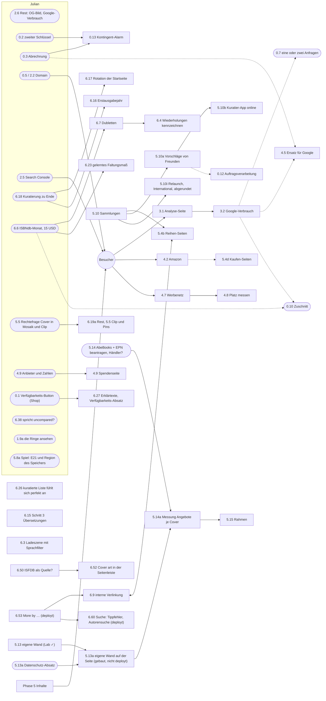

# Beautiful Books – Roadmap

Stand: 2026-10-03 (Stand, Nächste Schritte und Zählung nachgezogen; die Doppelnummer 6.82 aufgelöst: das Cover-Spiel behält sie, die deutsche Oberfläche heißt 6.85); davor 2026-09-26, aufgeräumt (lange abgehakte Punkte gekürzt und ihr Text ins Archiv, abgehakte Punkte in die Erledigt-Abschnitte, ein Erledigt-Abschnitt für Phase 5, die beim Abhaken von 5.10c verlorene Überschrift der Phase 4 wiederhergestellt, Stand, Bewertung und Abhängigkeiten nachgezogen, Zahlen neu gezählt); davor geordnet am 2026-09-12 und der Umbau vom 2026-09-10 (Julian: „überprüfe die Abhängigkeiten, sortiere die Phasen neu, fasse die angehakten Punkte kürzer, baue eine Steuerungsübersicht"). Die Seite ist seit dem 2026-09-08 online. **Jeder Punkt steht hier genau einmal, mit seiner Nummer, offen oder erledigt.** Die Nummern bleiben für immer, weil Code, Historie und Commits sie zitieren; die *Reihenfolge* der Phasen im Dokument folgt den Abhängigkeiten, nicht den Nummern. Ein erledigter Punkt bleibt stehen, auf wenige Zeilen gekürzt — Ergebnis, Datum, Verweis —, sein voller Text liegt im [Archiv](docs/roadmap-archive.md), seine Messungen in der [Historie](docs/history.md).

*Wer* steht bei jedem Punkt: **Julian** (Konten, Geld, Recht, Produktentscheidungen), **Claude** (Code, Messung, Text) oder beide. Punkte mit **[T*n*]** stammen aus dem [Testbericht vom 2026-09-07](docs/tests/2026-09-07-durchklick.md).

---

## Steuerung

### Wo was steht

| Frage | Dokument |
|---|---|
| **Was die Seite ist und sein soll** | [SPEC.md](SPEC.md) — [§1 Produkt](SPEC.md#1-produktidee) · [§2 Domänenmodell](SPEC.md#2-domänenmodell) (Work, Edition, Cover, Kauf-Links, Index) · [§3 Funktionen F1–F6](SPEC.md#3-funktionale-anforderungen) · [§4 Regeln N1–N13](SPEC.md#4-nicht-funktionale-anforderungen) · [§5 Gestaltung](SPEC.md#5-gestaltung) · [§6 Entscheidungen E1–E21](SPEC.md#6-entscheidungen) · [§7 Gemessene Grenzen](SPEC.md#7-gemessene-grenzen-stand-2026-09-07) · [§8 Nummern-Konkordanz](SPEC.md#8-nummern-konkordanz) |
| **Was sie heute kann** | [docs/features.md](docs/features.md) — je Funktion: seit wann, Spec-Stelle, Roadmap-Punkt, Code |
| **Was offen ist, in welcher Reihenfolge** | dieses Dokument: [Nächste Schritte](#nächste-schritte), [Abhängigkeiten](#abhängigkeiten), dann die Phasen |
| **Was gebaut und gemessen wurde** | [docs/history.md](docs/history.md), chronologisch, mit den Zahlen |
| **Erledigte Punkte in voller Länge** | [docs/roadmap-archive.md](docs/roadmap-archive.md) |
| **Die Pläne** (ausführliche Fassung eines Punkts) | [docs/plans/README.md](docs/plans/README.md) — offen: [Alltag 6.63–6.81](docs/plans/PLAN-6.63-alltag.md), [2.4 Firewall](docs/plans/PLAN-2.4-firewall.md), [Phase 5](docs/plans/PLAN-5-reichweite.md), [Einnahmen](docs/plans/PLAN-4-einnahmen.md), [Speicher §4–5](docs/plans/PLAN-speicher.md) |
| **Experimente neben der Seite** | [lab/README.md](lab/README.md) — Kuratieren, Sammlungen, Duell, Hot or Not, Mosaik, Ladebilder, Faltung, Palette, ISFDB, internationale Cover |
| **Was jeder offene Punkt wert ist** | [Bewertung der offenen Punkte](#bewertung-der-offenen-punkte-2026-09-12): Urteil, Aufwand und Grund je Punkt; das Brett liest die Tabelle |
| **Was offen ist, als Brett — und das ganze Projekt auf einer Seite** | `npm run cockpit` schreibt das **Cockpit** (`docs/cockpit.html`, git-ignoriert) und öffnet es über einen kleinen Server nur auf 127.0.0.1 (6.54): Übersicht, Brett nach Thema × Status, Sammlungen & Synchronisation, Werkzeuge zum Starten, Dienste & Einstellungen, Funktionen, Website-Karte, Lab, Artefakte, Hinweise. `npm run kanban` bleibt als Alias (nur die Datei, `#board`). **Eine Ansicht, kein zweiter Ort** — eine Karte bewegt sich, indem der Punkt hier bearbeitet wird; ein falsches Thema korrigiert `Thema: …` in der Zeile des Punkts. Das ältere [Roadmap-Brett](https://claude.ai/code/artifact/3871e261-34bc-4e25-976e-f858406046fa) als Artefakt ist ein Schnappschuss |
| **Welche Session woran arbeitet** | `npm run worktrees` schreibt [docs/worktrees.md](docs/worktrees.md): alle Worktrees und Branches, Stand gegen Produktion, Themen aus den Commits (git-ignoriert, also nie veraltet) |
| **Arbeitsregeln** | [CLAUDE.md](CLAUDE.md) |
| **Anleitungen** | [Partnerprogramme bis zum Umschalttag](docs/guides/affiliate-programme.md) · [Partnerprogramme: Sätze und Netzwerke](docs/guides/affiliate-programme-recherche.md) · [Gewerbe und Steuer](docs/guides/gewerbe-anmeldung.md) · [Bookshop.org](docs/guides/bookshop-affiliate.md) |
| **Durchsichten des Codes** | [Zuschnitt 2026-10-03](docs/refactoring-2026-10-03.md) · [Sicherheit 2026-10-02](docs/sicherheit-2026-10-02.md) |
| **Recherchen** | [Risikoregister: was das Projekt kaputt machen könnte](docs/risiken-2026-09-12.md) · [Best Practices Websites und Claude Code](docs/best-practices-2026-09-12.md) · [Recht der Hobbyseite](docs/recht-hobbyseite.md) · [Domain-Namen](docs/domain-recherche.md) · [Visuelle Identität und Cover-Rechte im Logo](docs/identitaet.md) · [Suche nach ISBN und Stichwort](docs/suche-isbn-und-stichwort.md) · [Buchrücken](docs/spine-research.md) · [Vergleich whichedition.com und deren Affiliate-Links](docs/vergleich-whichedition.md) · [Was an der Seite nach Claude aussieht](docs/gestaltung-ki-anmutung.md) · [Testbericht 2026-09-07](docs/tests/2026-09-07-durchklick.md) · [Alltagstauglichkeit, zwei Durchsichten 2026-09-28](docs/tests/2026-09-28-alltagstauglichkeit.md) · [Sicherheit und störungsfreier Betrieb, Durchsicht 2026-10-02](docs/sicherheit-2026-10-02.md) |

### Stand

- **Online seit 2026-09-08**, Hobby-Modus (E20), Vercel Hobby, Funktionen in Frankfurt, Web Analytics an. **Seit dem 2026-10-02 heißt die Seite „Buy Its Covers“** (0.5, E7-Namensregel in `lib/seo.ts`); `buyitscovers.com` und fünf Weiterleitungs-Domains sind gekauft und im Vercel-Projekt angelegt, `NEXT_PUBLIC_SITE_URL` zeigt schon auf `https://buyitscovers.com` — **bis Julian die A-Einträge bei INWX setzt (2.2), ist die Seite nur unter https://beautifulcovers.vercel.app erreichbar und Canonical, OG-Bild und Sitemap zeigen ins Leere.**
- **Seit dem 2026-10-03 spricht die Seite auch Deutsch** (6.85, SPEC §2.6, E23): Knopf oben rechts, Cookie, Spiegelbaum `app/de/`, Katalog-Test als Wartung. Seit dem 2026-10-04 ist die ganze Oberfläche übersetzt (839 Sätze); englisch bleiben nur Daten, Metadaten und die Fehlersätze der API-Routen.
- **Produktion ist `origin/main`.** Ein Push dorthin ist ein Deploy. Am 2026-09-10 arbeiteten **drei Sessions parallel**: eine schob 6.19a direkt nach `origin/main`, eine baute 6.29 auf dem lokalen `main`, eine baute 6.28 auf einem Branch — und das lokale `main` lag zeitweise sechs Commits vor und fünfzehn hinter Produktion, ohne dass es irgendwo stand. Seither zusammengeführt und am selben Abend deployt (`b43904b`); `npm run worktrees` zeigt, ob das wieder passiert, und ist vor jedem Merge nach `main` zu lesen.
- **5.8a, das Cover-Spiel, steht seit dem 2026-09-19 auf dem lokalen `main`** (`/versus`, SPEC F7; der Branch `worktree-session-2026-09-11` ist mit Produktion zusammengeführt, 594 Tests und Build grün). **Seit dem 2026-09-22 live: https://beautifulcovers.vercel.app/versus** (Deploy `9ad93c5`, mit ihm die 46 übrigen Commits von `main`). In Production stehen `HOTORNOT=on` und **derselbe** Speicher wie in der Preview; die Produktion antwortete beim einen Prüfabruf mit `"store":"redis"`, **581 Stimmen** und 980 Covern im Spiel — die Stimmen der Freunde sind mitgekommen. Seit dem 2026-09-26 spielt es mit **2000 Covern aus 499 Büchern** (`24b2b69`, in `origin/main`; in Produktion nicht eigens nachgesehen). Julians Entscheidung **E21** und die Region des Speichers für die Datenschutzerklärung stehen noch aus.
- **Seit dem 2026-09-24 in Produktion: die thematischen Sammlungen** (`/collections`, 5.10, SPEC F8) — veröffentlicht sind SF Masterworks 1–73, Feminist Press und Tiptree Award, sechs weitere liegen als Entwürfe (Relaunch, International, abgerundete Ausgaben, edition suhrkamp, Penguin Clothbound, Hugo Award); Freunde bauen mit `/curate` und `/suggest` mit (5.10a, 5.10b), Julian veröffentlicht aus `/curate` ohne Deploy (5.10g). Daneben lokal das **Cockpit** (`npm run cockpit`, 6.54).
- **111 Punkte offen, 81 erledigt** (gezählt am 2026-10-03 per `grep` über die Kästchen; am 2026-09-26 waren es 74 und 57 — der Zuwachs sind die Durchsichten vom 2026-09-28 und 10-02, der Vergleich mit whichedition.com und die Sicherheits-Durchsicht). Phase 1 ist bis auf 1.9a leer, Phase 2 hat Julians DNS, Konten und die Abnahme. Der größte offene Block ist Phase 6, und dort zuerst die Fehler, die ein Leser sieht.
- **Der Engpass ist nicht die Technik, sondern dass niemand die Seite kennt:** sie steht in keiner Suchmaschine (2.5), und ihre Domain antwortet noch nicht (2.2). Der Name ist seit dem 2026-10-02 entschieden.

### Nächste Schritte

Sortiert danach, was am meisten kostet, wenn es liegen bleibt.

| | Was | Wer | Aufwand | Warum jetzt |
|---|---|---|---|---|
| 1 | **2.6 zu Ende**: OG-Bild in einem Messenger, Google-Verbrauch eines Tages aus der Cloud-Konsole | Julian | zehn Minuten | Der Deploy vom 2026-09-10 ist geprüft, der CDN-Treffer gemessen; die zwei Reste kann nur Julian sehen |
| 2 | **2.5 Search Console und Bing** (eingerichtet 2026-10-04, wartet nur auf Googles ersten Abruf der Sitemap), dazu **0.2** zweiter Google-Schlüssel, **0.13** Kontingent-Alarm und **2.4** Firewall auf *Log* ([Plan](docs/plans/PLAN-2.4-firewall.md)) | Julian | 45 Minuten | Jeder Tag ohne Sitemap ist ein verlorener Tag; ein Schlüssel für Arbeit *und* Betrieb verbraucht das Kontingent der Besucher |
| 3 | **2.2 DNS bei INWX setzen** (sieben A- und CNAME-Einträge, Tabelle in [docs/domain-recherche.md §20](docs/domain-recherche.md), Prompt in [docs/prompt-dns-inwx.md](docs/prompt-dns-inwx.md)), danach Sitemap unter der neuen Domain einreichen | Julian | 15 Minuten plus Zertifikat | Seit dem Deploy vom 2026-10-02 zeigen Canonical, OG-Bild und Sitemap auf `buyitscovers.com`, das noch die INWX-Parkseite ist: jeder geteilte Link hat bis dahin keine Vorschaukarte |
| 3a | **4.1 Bookshop.org bewerben** ([Anleitung](docs/guides/affiliate-programme.md)) | Julian | 20 Minuten | Einzige Bewerbung ohne Reichweite; ohne ID ist der Bookshop-Link heute kaputt. Umgeschaltet wird erst nach 0.12, 4.4, 4.12 |
| 4 | **6.5** Kleinigkeiten: Tippfehler-Toleranz, Label „about this book“, ein Weg aus der Telefon-Schublade zurück zur Wand, `priority` auf den ersten Kacheln (Mosaik-Ausfall und 6.8 erledigt 2026-09-11) | Claude | je etwa eine Stunde | ohne Abhängigkeit; `priority` vorher neu messen, 1.3 hat es verschoben |
| 5 | **6.18 Kuratierung zu Ende**, danach **6.17 Rotation** und das Jahr für **6.16** | Julian, dann Claude | ein Abend, dann eine Sitzung | Die Startseite ist das Erste, was ein Besucher sieht |
| 6 | **Aus den [zwei Durchsichten](docs/tests/2026-09-28-alltagstauglichkeit.md) vom 2026-09-28** zuerst 6.63 (nachstellen), 6.80 (Hörbücher), 6.64, 6.71, 6.78, 6.66, dann 6.70, 6.81, 6.65, 6.69 ([Plan](docs/plans/PLAN-6.63-alltag.md)) | Claude | je ½ h bis ½ Tag | Was ein Fremder als Fehler sah, in der Reihenfolge des Plans; die Entscheidungen daraus (6.67, 6.68 Teil 2, 6.72 Wörter, 6.81 Rest, 5.8c, 0.15, N11, erste Reihe der Wand) sind Julians; 6.75, 6.76, 6.77, 6.79 und der erste Teil von 6.81 sind seit dem 2026-09-29 gebaut |
| 7 | **6.15 Schritt 3**, die Stichprobe zu Übersetzungen | Claude | eine Sitzung | 6.13 ist seit dem 2026-09-11 erledigt: die Wand lädt, was die Karte zusammenfasst. Offen ist, ob etwas Datensätze mit **anderem** Titel zusammenführen darf |
| 8 | **3.1 lesen**: `/admin/insights` nach einer Woche | Julian | zehn Minuten | Deployt 2026-10-04; ab jetzt entstehen Zahlen. Erst mit 100 Besuchen tragen die Raten |
| 9 | **Phase 5**, beginnend mit 5.3 an der fertigen Gattung 5.4a | beide | Wochen | Die eigentliche Reichweite |

**Aus dem [Testbericht vom 2026-09-11](docs/tests/2026-09-11-mobil.md)** (Telefon gegen Produktion, elf Befunde) sind alle abgearbeitet — 6.25, 6.25a, 6.30, 6.31, 6.32, 6.33, 6.34, 6.35, das Mitlesen von `bb.img` und zuletzt **6.36**, gleicher Entwurf bei verschiedenen Verlagen (M9: Julian entschied am 2026-09-23 „falten“, gebaut am 2026-09-24) — und stehen als erledigte Punkte in Phase 6. Aus 6.30 ist außerdem **6.30a** geworden: dieselbe Messung über Suche, Werkseite und Jahrzehnte-Seite.

**Nicht als Nächstes, mit Grund:** 5.8b (was die Stimmen des Cover-Spiels dem Rest der Seite bringen — der Weg steht, aber mit 51 Stimmen (am 2026-09-22 waren es 581) trägt keine Auswertung; er beginnt mit dem Export nach `data/cover-ranking.json`, damit die Produktion nie den Speicher fragt), 6.6 (zwei Tage und ein ISBNdb-Monat, also Julians Geld — und 6.7, 6.4, 6.23 warten darauf), Phase 4 (ohne Besucher bringt ein Kauf-Link nichts, und der Umschalttag verlangt volles Impressum und Pro-Plan), 0.10 (nach 3.2 billiger zu entscheiden), 6.19a-Rest (die Rechtefrage aus 5.5 steht davor). *(0.8a und 1.8 standen hier, weil sie Julian am Gerät brauchten; beide sind seit dem 2026-09-26 über Claude in Chrome erledigt, 6.41.)*

**Zwei Punkte haben an Wert verloren, ohne angefasst zu werden:** 6.12 ist seit dem gebauten Index nur noch ein Randfall für Werke außerhalb der Liste; der `priority`-Teil von 6.5 wurde von 1.3 verschoben, nicht gelöst — vor dem Anfassen neu messen.

### Bewertung der offenen Punkte (2026-09-12)

Julian: „gehe nochmal durch die offenen Punkte und bewerte sie in ihrer Sinnhaftigkeit." Maßstab war dreierlei: das Produkt aus SPEC §1 (Cover nebeneinander sehen, die Ausgabe finden, nichts behaupten), die gemessenen Grenzen (Kontingent, Katalog-Latenz, kein Speicher) und der Engpass aus dem Stand oben — **niemand kennt die Seite**. Ein Punkt ist sinnvoll, wenn er einen Leser trifft, den es gibt oder bald gibt; er ist es nicht, wenn er auf einen Besucher, ein Konto oder eine Entscheidung wartet, die noch niemand getroffen hat.

Die Urteile sind ein festes Vokabular, weil das Brett des Cockpits (`npm run cockpit`) sie liest: **tun** (sinnvoll, so wie er steht), **entscheiden** (nur Julian kann weiter), **zusammenlegen** (ist ein Teil eines anderen Punkts), **zurückstellen** (richtig, aber sein Auslöser fehlt noch — bleibt mit Nummer stehen, verlässt die aktiven Spalten des Bretts), **streichen** (Empfehlung; Julian entscheidet), **erledigt?** (sieht fertig aus und ist nur nicht abgehakt), **aufteilen** (ein lebender und ein toter Teil). Zusammenlegen, Streichen und die Fragezeichen sind Vorschläge, keine Änderungen — die Nummern bleiben, bis Julian es sagt.

*Nachgezogen am 2026-09-26:* die Zeilen der seither erledigten Punkte (0.8a, 1.8, 6.36, 6.41, 6.55, 6.56) sagen, was daraus wurde; 1.9a, 5.8a, 5.10, 5.10e, 6.4, 6.9 und 6.38 auf den heutigen Stand; neu bewertet sind die Punkte, die seit dem 2026-09-12 dazukamen und keine Zeile hatten (0.14, 5.8b, 5.9a, 5.10f, 5.10i, 6.50–6.54). Die Bilanz darunter ist die vom 2026-09-12.

**Die Bilanz:** von 55 offenen Punkten (vor den sechs neuen aus der [Recherche](docs/best-practices-2026-09-12.md), 6.39–6.44) sind **22 zu tun**, 4 warten auf eine Entscheidung, **22 sind zurückzustellen**, weil ihr Auslöser fehlt, und 7 sind Zusammenlegungen, Aufteilungen oder Fragezeichen. Der aktive Vorrat ist also halb so groß, wie die Zahl 55 behauptet — und die vier wertvollsten Minuten des ganzen Dokuments sind 2.5, 0.2, 0.5 und 0.13, alle bei Julian.

| Punkt | Urteil | Aufwand | Warum |
|---|---|---|---|
| 2.9 | tun | 1 h | Sicherheits-Durchsicht: Next und `sharp` nachziehen, Build und Tests sagen, ob etwas bricht |
| 2.10 | entscheiden | 1 h Julian | Konten und Ausgaben absichern — nur Julian hat die Konten |
| 2.11 | tun | ½ Tag | Von der Redis gibt es keine Kopie; ein Export-Skript nach `data/` wie beim Spiel (5.8b) reicht für die Größe |
| 2.12 | tun | 1 h | Antwort-Header und `security.txt`: eine Datei und ein `headers()`-Block in `next.config.ts` |
| 2.13 | tun | 30 min | Dependabot-Alarme lesen, mit 2.9 zusammen erledigen |
| 2.14 | tun | 10 min Julian | SPF, DMARC, Null-MX bei INWX, zusammen mit den A-Einträgen aus 2.2 |
| 4.12 | entscheiden | ein Abend Julian | Bedingung für den Shop-Modus: Julian schreibt die erste Person, Claude baut ein |
| 5.10j | zurückstellen | — | Recherche liegt vor; die nächste Reihe erst, wenn die sechs Entwürfe veröffentlicht sind |
| 5.13k | erledigt? | — | Gebaut und deployt 2026-09-28; offen nur, weil nicht abgehakt — Julian sieht nach |
| 6.59 | erledigt? | — | Gebaut und deployt 2026-09-26; was offen bleibt, steht im Punkt (Julians Blick, 1.9a) |
| 6.61 | entscheiden | — | Schrift ist gebaut (Xanh, Jost), die Bildmarke steht; offen ist nur Julians Wort zum Rest |
| 6.71b | tun | 1 h | Der Zähler der Wand läuft beim Nachladen — gleiche Wurzel wie 6.71 (a), die Zahl erst zeigen, wenn die Seite fertig ist |
| 6.87 | entscheiden | 10 min Julian | Ob Open Librarys robots.txt mit `/search` auch `search.json` meint — Julian fragt nach oder entscheidet, dass die API-Nutzung gemeint bleibt; bis 2026-10-03 das zweite 6.63 |
| 6.86 | tun beim Anfassen | — | Vier Schnitte, je mit der Datei, die ohnehin geändert wird; nie als eigener Umbau (docs/refactoring-2026-10-03.md) |
| 0.1 | streichen | 30 min | Für den MVP beantwortet: der Hobby-Modus hat keinen Button. Bis zur Shop-Variante ist der Code (`lib/availability.ts`, Route, Absatz in `BookDetail`) totes Gewicht, das 6.27 mitschleppt. Empfehlung: Option (a) jetzt, Skript behalten, Punkt schließen |
| 0.2 | tun | 3 min | Verdoppelt faktisch das Kontingent des Betriebs; heute zehrt jede Entwicklungssitzung vom Budget der Besucher |
| 0.3 | tun | 10 min | Der einzige unerprobte Weg über 1.000 am Tag, und Voraussetzung für 0.13 |
| 0.4 | erledigt? | — | 2.3 ist gebaut „aus `IMPRINT_*`", die Seite ist online. Stehen dort Name und ladungsfähige Anschrift, ist der Punkt erledigt und nur nicht abgehakt; stehen dort Platzhalter, ist er dringend (§ 18 MStV) |
| 0.5 | erledigt 2026-10-02 | — | Buy Its Covers, sechs Domains gekauft; der Rest ist 2.2 |
| 0.7 | zurückstellen | — | Seit 1.1 geht es nur noch um die Titelsuche auf Seite 0; ohne Zahlen aus 3.2 nicht entscheidbar. Auslöser: 3.2 |
| 0.8a | erledigt 2026-09-26 | — | In Julians Chrome über die Erweiterung geprüft (6.41): Tab-Reihenfolge, Enter auf einer Kachel und Fokus-Ringe stimmen; zwei Befunde wurden 6.55 und 6.56 |
| 0.10 | zurückstellen | — | Sagt selbst „jetzt nicht entscheiden". Auslöser: 6.6 und Phase 3. In der aktiven Liste stiftet der Punkt nur Unruhe |
| 0.12 | zurückstellen | — | Entschieden, Restrisiko tragen; drei benannte Auslöser (Shop-Variante, Eingaben vom Leser, Anfrage einer Behörde) |
| 0.13 | tun | 10 min | Die Codeseite ist fertig; der Alarm in Cloud Monitoring ist der einzige Zähler, der zählt, was bei Google ankommt. Nach 0.3 |
| 2.2 | tun | 15 min + Zertifikat | Der letzte Schritt des Domainvorgangs: sieben DNS-Einträge bei INWX; bis dahin zeigen Canonical, OG-Bild und Sitemap auf eine Parkseite (Stand 2026-10-03) |
| 2.4 | tun | 1 h | Ohne Überwachung merkt niemand einen Ausfall. Reihenfolge: erst Attack Mode prüfen (der Entwurf liegt auf `claude/firewall-2.4`), dann UptimeRobot — sonst meldet er Ausfälle, die es nicht gibt |
| 2.5 | tun | 20 min | Der höchste Wert je Minute im ganzen Dokument: ohne Sitemap in der Search Console existiert die Seite für Google nicht |
| 2.6 | tun | 10 min | Zwei Reste (OG-Bild in einem Messenger, Google-Verbrauch ablesen), dann abhaken |
| 1.8 | erledigt 2026-09-26 | — | Im echten Chrome: genialokal stimmte, Hugendubels Suchadresse fand nichts und ist auf `?q=` umgestellt — eine Reparatur, keine neue Funktion |
| 1.9a | entscheiden | Julians Blick | Teil (2) ist erledigt: das Rondell ist seit dem 2026-09-11 zusammengeführt (`4a929a5`), sieben Cover wie gewählt, keine `?hero=`/`?ring=`-Schalter mehr in `app/page.tsx`. Übrig ist Julians Blick auf die Ringe — am 2026-09-25 fand er bei einem eine Dublette, die übrigen sind nicht einzeln angesehen |
| 6.26 | tun | 1 h Messung | Julians eigene Bedingung („muss perfekt sein"). Erst messen, kuratiert gegen nicht kuratiert — seit 6.25 und 1.3 könnte die Klage erledigt sein; dann schließen |
| 6.5 | aufteilen | je 1 h | Die Verlaufskante ist seit 6.8 gegenstandslos (die Reiter brechen um, nichts scrollt seitwärts) — streichen. Tippfehler-Toleranz und der Weg aus der Schublade zurück treffen echte Leser — behalten. `priority` erst neu messen |
| 6.3 | tun | ½ Tag | 20 Sekunden Bühne treffen genau die deutschen Leser, die Julians Publikum sind. Die dritte Variante — sagen, worauf gewartet wird — ist die billigste und die ehrlichste |
| 6.2 | tun | ½ Tag | Ein russischer Titel auf der Karte für `crime and punishment` ist ein sichtbarer Fehler; die Lösung braucht keinen Eingriff ins Ranking |
| 6.36 | erledigt 2026-09-24 | — | Julian entschied am 2026-09-23 „falten“; gebaut als vierte Stufe (≤ 13 Bit, Kontrast ≥ 30, Farbe ≤ 0,52), 0 Fehlfaltungen an 56 angesehenen Paaren |
| 6.15 | tun | 1 Sitzung | Schritt 3 ist eine Messung mit zwei guten Ausgängen: eine dritte Identitätsregel, oder §2.1 wird ehrlich umgeschrieben |
| 6.16 | aufteilen | 1 h / — | Schritt 2 (ein Jahr-Feld in der Kuratier-App) ist billig und macht die kuratierten hundert richtig — tun. Schritt 3 (Wikidata) ist ein neuer externer Aufrufer (E10) — zurückstellen |
| 6.6 | tun, kleiner | 1 Tag statt 2 | Blockiert 6.7, 6.4 und 6.23. Erst die kostenlosen Kandidaten (Hardcover, LibraryThing, DNB) messen; ISBNdb nur, wenn die drei am Schmidt-Testfall scheitern — der Punkt sagt selbst, dass ISBNdb dort vermutlich die falsche Antwort ist |
| 6.7 | aufteilen | 1 h | Schritt 2 (Imprint-Familien in `samePublisher`) hängt nicht an 6.6 und repariert den gemessenen Holt-Fall — jetzt. Schritte 1, 3 und 4 warten auf 6.6 |
| 6.4 | entscheiden | — | Der Auslöser ist eingetreten: Julian hat bei 6.36 „falten“ entschieden, und nach dieser Zeile entfiele der Punkt damit. Aber die vierte Stufe faltet nur 12 von 34 echten Dubletten über Verlagsgrenzen; ob die übrigen gekennzeichnet werden oder auf 6.23 warten, entscheidet Julian |
| 6.23 | zurückstellen | ein Wochenende (Stufe b) | Echtes Problem, aber hinter 6.6 und 6.36; wenn dran, nur die Stufen (a) und (b) — ein vortrainiertes Embedding vor jedem eigenen Netz |
| 6.12 | zurückstellen | ½ Tag | Für die kuratierten Werke durch den Index erledigt, lokal 100 % Signaturen beim ersten Aufruf gemessen. Auslöser: eine kalte Produktionsmessung, die ungehashte Cover zeigt |
| 6.11 | aufteilen | 5 min / Entscheidung | Die Recherche ist fertig — als Punkt erledigt. Übrig: ein Goodreads-Link neben WorldCat (tun, fünf Minuten) und ob „8.491 Leser bei Open Library" auf die Karte darf — eine §1-Frage, Julian |
| 6.30a | tun | 2 h | N14 ist Regel; die Startseite ist gemessen, drei Seiten nicht. Der Vorbefund (Kopfzeile bricht bei 320 px) zeigt, dass es Funde gibt |
| 6.27 | zusammenlegen | — | mit 0.1: der einzige Rest ist der Verfügbarkeits-Absatz. Fällt 0.1, fällt er mit |
| 6.9 | zurückstellen | — | Die Reihen-Hälfte wartet nicht mehr auf 5.4b (die Reihen sind seit 5.10 Sammlungen), sondern auf Besucher: interne Verlinkung lohnt, wenn 2.5 die Seite in die Suche bringt. Die Autoren-Hälfte ist gebaut (6.53, 2026-09-27) |
| 6.38 | entscheiden | eine Minute + ein Schalter | Claude bereitet beide Varianten als Screenshot vor; dann ist es ein Blick. Am 2026-09-26 ließ sich `uncompared` im echten Chrome nicht herbeiführen (der Rowohlt-Fall faltet heute) — für die Vorführung braucht es einen lokalen Schalter, der den Zustand erzwingt |
| 6.17 | tun | 2 h | Rotation stündlich über ISR (Weg a) ist billig und erfüllt Julians Bedingung „vorgeladen"; die Liste liegt bereit |
| 3.1 | erledigt 2026-10-04 | — | Gebaut und deployt, bevor es Besucher gibt, weil die Klickzahlen sonst verloren gingen (Logs eine Stunde) |
| 3.2 | zurückstellen | 5 min am Tag | Sobald es Besucher gibt; entscheidet 0.7. Auslöser: 2.5 |
| 3.3 | zurückstellen | — | Setzt Partnerprogramme voraus (Phase 4) |
| 5.1 | tun | ½ Tag | Der Weg über Katalogpopularität braucht keinen Besucher; 139 → 500 Adressen sind 500 Chancen zu ranken. Sichtbar wird das erst mit 2.5 |
| 5.2 | zurückstellen | — | Sagt selbst „nicht auf Verdacht". Auslöser: Search Console zeigt, dass Cover nicht ankommen |
| 5.3 | zurückstellen | — | Die Fabrik lohnt, wenn 5.4a Besucher zeigt (5.7) |
| 5.4 | aufteilen | 1 h (Fehler) | In (a) steckt ein offener **Fehler**: ein unvollständiger Lauf wird 24 h gecacht — ein Ausfall als Befund (N12). Gehört als eigener kleiner Punkt vor alles Übrige in 5.4. (b) braucht Julians Reihenliste, (c) ist billig und automatisch, (d) nach Phase 4, (e) zuletzt |
| 5.5 | zurückstellen | — | Rechtefrage zuerst (Julian); Mosaik und Clip liegen fertig im Lab |
| 5.6 | tun, nach 0.5 | von Hand | Ohne eigene Domain verschenkt jeder Launch-Link Reichweite an `vercel.app` |
| 5.7 | zurückstellen | — | Acht Wochen nach der ersten Gattung |
| 5.8 | zusammenlegen | — | mit 5.8a: Spielart 1 ist gebaut, Spielart 2 ist Prototyp. Offen ist nur, welche live geht |
| 5.8a | entscheiden | Julian | Live seit 2026-09-22 (`/versus`, von der Startseite verlinkt, indexiert), seit dem 2026-09-26 mit 2000 Covern aus 499 Büchern. Offen sind nur noch Julians E21 und die Region des Speichers für die Datenschutzerklärung |
| 5.9 | zurückstellen | — | Lab-Idee, phasenfrei, Rechtefrage; wenn Julian Lust hat |
| 5.10 | erledigt? | — | In Produktion seit 2026-09-24; drei Sammlungen veröffentlicht (SF Masterworks, Feminist Press — die frühere `women-writers` —, Tiptree Award), eine Sammlungskachel öffnet ihr eigenes Cover auf der Wand. Der Punkt wartete auf Julians Wand und `published` — sieht fertig aus, abhaken entscheidet Julian |
| 5.10a | erledigt bis auf Nutzung | — | Live seit 2026-09-24; Datenschutz entschieden (nur Freunde, 0.12 bleibt zurückgestellt) |
| 5.10e | Julian | — | Entwürfe stehen: edition suhrkamp (200 ab Band 471, von Julian selbst kuratiert) und Penguin Clothbound Classics (63). Offen ist das Veröffentlichen |
| 5.10c | erledigt 2026-09-25 | — | SF Masterworks 1–73 veröffentlicht, alle im Originaldesign; die Neuauflage ist als 5.10i weitergegangen |
| 5.10b | erledigt bis auf Nutzung | — | `/curate` für Freunde, gebaut 2026-09-24; Julian übernimmt Entwürfe in seiner App |
| 5.10f | tun | je Liste eine Sitzung | Feminist Press ist daraus als eigene Sammlung veröffentlicht, Hugo Award liegt als Entwurf; Penguin Modern, die Preis-Tags und Library of America warten auf Julians Wahl |
| 5.10i | Julian | — | Relaunch 182 von 182, International 135 von 182, abgerundete Ausgaben 10 von 10 — alle als Entwürfe, mit ISFDB-Künstlern. Wartet auf Julians Blick und `published` |
| 5.8b | zurückstellen | — | Braucht genug Stimmen für eine Rangliste, die mehr sagt als „Too early to say“. Auslöser: die Kronenregel (F7.5) vergibt die erste Krone |
| 5.9a | zurückstellen | — | Lab-Idee, phasenfrei; wenn Julian Lust hat. Baut auf `lab/mosaic/` |
| 5.16 | benutzen, wenn Julian will | — | Lab-Werkzeug `lab/calibre/` gebaut 2026-10-03, auf einer Probe-Kopie durchgespielt (9 Schreibvorgänge, 9 Rücknahmen, danach alle 423 Cover bytegleich). Erster echter Lauf am selben Abend: *Ubik* und *The Invisible Man*, auf Julians Wort; einmal versehentlich mit `undo.ts --all` zurückgenommen (bytegleich wie vorher), dann wieder geschrieben — der ganze Kreis läuft, die zwei Cover stehen in der Bibliothek. Offen: eine eigene Sammlung als Quelle; größere Bilder gibt es bei Open Library nicht |
| 5.16a | benutzen | — | Lokale App `npm run calibre` (2026-10-03): die Calibre-Bibliothek als Cover-Wand, je Buch das Werk finden, aus den Covern des Werks wählen, mit den Sicherungen aus 5.16 schreiben. Geprüft schauend an der echten Bibliothek, schreibend auf einer Probe-Kopie. Fragt seit 2026-10-04 über die Website (deren Open-Library-Modus, nie Google) und hält die Antworten 30 Tage auf dem Mac |
| 5.16b | benutzen; Sync mit Reader prüfen | Julian, 5 min | „Calibre Covers.app" (eigenes Fenster um die App aus 5.16a) und der Knopf „PocketBook highlights", der Julians Sync-Skript startet; alles in `lab/calibre/` mit `site.ts` als einziger Tür zum Rest, damit es später einzeln weitergeführt werden kann. Der Sync ist mit angeschlossenem Reader noch nicht gelaufen |
| 5.17 | Julian: ansehen | Julian, 20 min | Lab-Werkzeug `lab/calibre-import/` gebaut und gemessen 2026-10-03; einmal gegen die echte Seite als Test-Besucher (`/c/y3lsl27ot5`, verfällt am 2026-10-05). Seit 2026-10-04 kann es jeder Leser auf `/create` selbst (5.17a, gebaut, nicht deployt) — das Lab-Werkzeug bleibt für den Rückweg in Calibre (5.16) |
| 5.11 | messen | Julian (Schlüssel, fünf Fotos) | Lab-Prototyp Regalfoto → Sammlung gebaut 2026-09-26; braucht `ANTHROPIC_API_KEY` und fünf echte Fotos für die Messung |
| 5.11a | Schritte 1–3 deployt 2026-10-01 | Julian: ein Umschlagfoto; B2 oder Kanten-Lab entscheiden | Strom Rücken für Rücken, Suchen zu dritt, „maybe“ statt vorgehakt, Logzeile, 80 je Foto und 300 je Tag; Streifen aus Reihe und Mitte treffen auf dem Brett jeden dritten Rücken — Schwelle verfehlt, Kantensuche als Lab-Nächstes; [Plan](docs/plans/PLAN-5.11a-regalfoto-zuverlaessig.md) |
| 5.12 | ansehen | Julian, dann ½ Tag Handprüfung | „Buy from a local bookshop": Julian wählte Deep Links als zweiten Abschnitt (2026-09-26); [Plan](docs/plans/PLAN-5.12-buy-local.md) und lokale Fassung gebaut, nicht gepusht — Julian sieht sie lokal an, dann die unbestätigten Adressen von Hand (Plan §4) |
| 5.13 | ansehen | Julian | Lab-Prototyp „eigene Wand ohne Konto" gebaut 2026-09-28, auf Besucher-ID umgebaut (E22); Plan für den ganzen Funnel (kuratieren → kaufen → rahmen) in [PLAN-5.13](docs/plans/PLAN-5.13-wand-funnel.md) |
| 5.13a | Julian | Datenschutz-Absatz, `WALLS=on`, Schlüssel für Fotos | Das MVP ist gebaut (2026-09-28, Branch), nicht deployt; Tor zu 5.14: 30 Wände mit ≥ 6 Covern in vier Wochen |
| 5.13b | mit 5.13a | — | Links auf Startseite und Sammlungen gebaut; drei weitere Stellen vorgeschlagen |
| 5.13c | mit 5.13a | — | Picker auf `/walls`, sechs Zufallscover, Fotoupload sichtbar; gebaut |
| 5.13d | Julian | Schwelle, Index, Startseite | „Collections by readers“ ohne Freigabe, gemischte Reihenfolge, Nachladen; gebaut |
| 5.16 | messen | Julian (Foto neu hochladen, dann fünf Regalfotos) | Lab-Prototyp „Regal nach Farben“ im Regal-Ablauf von 5.11: gedrehte Rechtecke, Ausgabe vom Rücken, sortiertes Regal am Ende (2026-09-29, in `main` seit 2026-10-03). Nächster Schritt: dasselbe Foto in Chrome noch einmal — liest das Modell den Verlag wieder (3 statt 25)? |
| 5.13e | Julian | — | Aufbewahrung und Grenze je Browser; gemessen, Vorschlag steht |
| 5.13f | Julian | Nachfrage-Schwelle | Schritt 2 als ein Stück: Bücher auf Keilen in einem Rahmen, Bücher finden, Nachfrage zählen; gebaut |
| 5.13g | Julian | Penguin fragen, Rechtsprüfung | Drucke statt Bücher: Recherche fertig — ohne Lizenz nicht erlaubt, Provision kaum zu haben, Bilder zu klein |
| 5.13n | erledigt 2026-09-29 | — | Google-Cover dürfen in eigene Sammlungen; ein stummes Google heißt Platzhalter |
| 5.13m | erledigt 2026-09-29 | — | Editor `/c/<id>/edit` mit Suche, Foto, Ideen und Arrange; Buchseite mit Häkchen je Sammlung; Telefon als Leiste unten; deployt |
| 5.13o | Julian entscheidet | Blick auf `/create/review` | „To buy“ als stehende Sammlung je Browser statt „die erste Sammlung ist die Kaufliste“ und statt eines zweiten Knopfs; Abwägung steht im Eintrag |
| 5.14 | zurückgestellt | nach dem MVP (Julian) | Kaufen über offizielle Schnittstellen und Fotoabgleich; zuerst 5.14a messen |
| 5.15 | zurückgestellt | nach dem MVP | Rahmen; 5.15a Wandplan mit Maßen zuerst |
| 0.14 | zurückstellen | — | Gemessen „noch nicht“ (Index 2,6 MB am 2026-09-26, Grenze ~5 MB). Auslöser 2 — die Seite schreibt mehr als Stimmen — ist mit 5.10a/b eingetreten (Vorschläge und Entwürfe), aber in derselben Redis und ohne dass eine Datenbank nötig wurde |
| 4.1 | tun, klein | 10 min | Die Bewerbung ist heute möglich; die ID wirkt erst im Shop-Modus, kostet aber nichts vorab |
| 4.2 | zurückstellen | — | Drei Verkäufe in 180 Tagen ohne Traffic sind ein Kontoverlust |
| 4.3 | zurückstellen | — | nach 4.1 und 4.2 |
| 4.4 | zurückstellen | — | Erst mit der Absicht auf Einnahmen |
| 4.5 | zurückstellen | — | Bedingt („falls"). Auslöser: 0.3 und 3.2 |
| 4.7 | zurückstellen | — | Fünfstellige Impressionen sind weit |
| 4.8 | zurückstellen | — | Drei Monate nach 4.7 |
| 6.39 | tun | 1 h | Vier „jedes Mal“-Regeln wurden trotz CLAUDE.md gebrochen; ein Hook kann nicht vergessen werden. Der übertragbarste Befund der Recherche |
| 6.40 | tun | 1 h | Das Abhaken hat fünf Schritte, und drei Sitzungen haben Teile ausgelassen — ein Befehl statt einer Erinnerung |
| 6.41 | erledigt 2026-09-26 | 5 min + 1 h | Julian installiert die Erweiterung; damit fallen 0.8a, 1.8 und 6.38 auf einmal |
| 6.42 | entscheiden | 30 min | Der Ort der Arbeitskopie ist Julians; der `tsc`-Ausschluss ist der Behelf, bis sie umzieht |
| 6.43 | erledigt 2026-09-30 | — | Abgebrochener Lauf wird nicht mehr gecacht, Ausfall nicht mehr 404 |
| 6.44 | tun | 1 h | 3.571 Wörter, und die Anleitung sagt, dass Regeln in einem langen CLAUDE.md verloren gehen — was schon passiert ist |
| 2.7 | tun | 10 min/Monat | Harte Kappung ohne Nachkauf: die Seite stünde bis zum Monatsersten. Niemand hat die Zähler je abgelesen |
| 6.45 | tun | 1 Tag | Open Library ist die Lebensader und hat keinen Plan B; die Sitemap-Seiten sollten einen Ausfall überleben |
| 6.46 | erledigt | — | Erledigt 2026-09-14: Fallback und Schalter `BLURB_SOURCE`; eine Open-Library-Anfrage nur, wenn sie einen Text kauft |
| 4.9 | zurückstellen | ½ Tag | Julians Wunsch — aber der Punkt sagt selbst: kein Wort nach Not bei 12 USD im Jahr. Auslöser: die ersten echten Kosten (Pro-Plan, ISBNdb) |
| 4.10 | entscheiden | Julian, dann 1 Tag | Recherche liegt vor ([docs/antiquariat-recherche.md](docs/antiquariat-recherche.md)): Antiqbook neu, ZVAB in DE, Biblio unverifiziert. Julian wählt die Dienste und die Regel (ohne ISBN / vor 1970, optional vor 1990). Hilft dem Leser auch im Hobby-Modus, weil es keine Provision braucht |
| 6.47 | tun | 30 min | Die Suche belastet den `google`-Eimer, obwohl sie seit dem 2026-09-07 keine Google-Anfrage stellt: bremst zu früh, nicht zu spät, widerspricht aber N10. Kam mit dem Firewall-Zweig, bewertet am 2026-09-19 |
| 6.50 | entscheiden | — | Gemessen ist: ISFDB liefert für SF, kaum darüber hinaus, Daten unter CC BY 4.0. Als Werkzeug läuft es schon (`lab/isfdb/`, Künstler auf den SF-Wänden). Offen ist Julians Ja oder Nein zu ISFDB als Quelle der Seite zur Laufzeit — das ist 6.52 |
| 6.51 | tun | 1 h | Die Fallen vor dem Veröffentlichen haben in einer Woche mehrere Sitzungen getroffen; Julian entscheidet Datei oder Skill |
| 6.52 | tun | 1–2 Tage | Die SF-Wände zeigen die Künstler seit dem 2026-09-25, Namen mit Umlaut seit dem 2026-09-26 repariert (`c2d6464`). Offen ist die Zeile in der Seitenleiste mit Nachschau zur Laufzeit und wachsendem Speicher (Schritte 2–4) — Julian wollte sie trotz der gemessenen 4 % |
| 6.54 | erledigt? | — | Das Cockpit ist gebaut, deployt (die Leseroute, 2026-09-25) und in Benutzung. Offen ist nur Beiwerk: Schemabilder, Tabelle der Konstanten, `--publish`, Portkonflikt 4322, „als Text kopieren“. Vorschlag: abhaken, das Beiwerk als eigener Punkt |
| 6.55 | erledigt 2026-09-26 | — | Befund aus 0.8a: gewählt trägt den Akzent-Ring, Tastatur-Fokus einen dunklen Umriss außen |
| 6.56 | erledigt 2026-09-26 | — | Befund aus 0.8a: die Vorschlagsliste schließt, wenn der Fokus sie verlässt; Escape gibt ihn ans Feld zurück |

| 6.63 | tun | 1 h | Erst nachstellen; im Code nicht bestätigt, vielleicht ein Artefakt des Klickwerkzeugs. Nichts nachstellbar heißt: mit der Messung schließen |
| 6.64 | tun | 30 min | Drei Formen desselben Links; billig |
| 6.65 | erledigt 2026-09-30 | — | Gemessen, nicht nachstellbar, kein Code |
| 6.66 | tun | ½ Tag | Die billigste Rückmeldung, die das Spiel hat; Teil 2 braucht Julians Ja zu N11 |
| 6.67 | entscheiden | ½ Tag Simulation | Die Krone kommt bei heutigem Tempo nie; ohne Simulation nicht zu ändern |
| 6.68 | tun / entscheiden | 30 min / ein Blick | `/` ist billig; das Feld am Telefon kippt eine Entscheidung aus 6.28 |
| 6.69 | tun | ½ Tag | Eine Autovervollständigung ohne externe Anfrage; nimmt den Label-Teil von 6.5 mit |
| 6.70 | tun | ½ Tag | Mosaike sind das Erste, was eine Suche zeigt |
| 6.71 | erledigt 2026-09-30 (a) | — | Grenze 600 statt Abbruch; jetzt 1.500. (b) ist 6.71b |
| 6.72 | tun | je 30 min | Das Wort in der Fußzeile ist Julians |
| 6.73 | tun | 2 h Messung | Gegen den Vorschlag „36er-Seiten“, der §1 widerspricht |
| 6.75 | erledigt 2026-09-29 | — | „Try again“ und ein Satz, der den Ausfall benennt |
| 6.76 | erledigt 2026-09-29 | — | Feld am Telefon 296 statt 388 px; Julian sieht es an |
| 6.77 | erledigt 2026-09-29 | — | Vier Mockups, Julian wählte die seitliche Druck-Reihe (D) |
| 6.78 | erledigt 2026-09-30 | — | Ein Druck mit ISBN führt, Bild folgt ihm |
| 6.79 | erledigt 2026-09-29 | — | Nachgestellt bei gescrollter Startseite, behoben |
| 6.80 | erledigt 2026-09-30 | — | Hörbücher auch am Verlag erkannt |
| 6.81 | teils erledigt | — | Gruppierung nach Autor gebaut 2026-09-29; Etiketten, Entdoppeln und Title Case warten auf Julian |
| 5.8c | entscheiden | — | Braucht 5.8b (Export) und N11 |
| 0.15 | zurückstellen | — | Widerspricht E22; Auslöser: Tor aus 5.13a |

**Drei Dinge, die aus der Tabelle folgen und nicht in einer Zeile stehen:**

1. **Sechs Punkte tragen ihren Auslöser schon im Text** (0.10, 0.12, 5.2, 4.5, 6.12, 4.8) und stehen trotzdem in der aktiven Liste. Sie bleiben mit Nummer, wo sie sind; das Brett stellt sie ab jetzt in eine eigene Spalte, damit sie nicht als „offen" zählen, ohne dass jemand sie tun könnte.
2. **Ein Fehler versteckt sich in einem Feature-Punkt:** die Jahrzehnte-Seite cacht einen unvollständigen Lauf 24 Stunden (in 5.4a als „Offen" notiert). Das ist derselbe Riss wie 1.4 und 5.4a selbst — ein Ausfall, der wie ein Befund aussieht — und gehört nach 6.A, nicht in Phase 5.
3. **Was Claude jetzt allein tun kann**, ohne Julian und ohne Besucher, in Reihenfolge des Werts: 5.4a-Fehler, 6.7 Schritt 2, 6.30a, 6.2, 6.3, 6.16 Schritt 2, 6.17, 5.1, 6.5 (die zwei lebenden Teile), 6.26 (Messung), 6.15 Schritt 3, 6.6 (kostenlose Kandidaten). Das ist eine Woche Arbeit, und keiner dieser Punkte wartet auf etwas. *(2026-09-26: 1.8 ist aus der Liste heraus, erledigt; dazugekommen ist 6.53, seit Julians Antworten baubereit.)*

### Abhängigkeiten

Was auf was wartet, nur die offenen Punkte. Rechtecke sind Claudes, abgerundete Julians; ein gestrichelter Pfeil heißt „braucht Zahlen von“.

```mermaid
flowchart LR
  subgraph Julian
    direction TB
    J26(["2.6 Rest: OG-Bild, Google-Verbrauch"])
    J02(["0.2 zweiter Schlüssel"])
    J03(["0.3 Abrechnung"])
    J05(["0.5 / 2.2 Domain"])
    J25(["2.5 Search Console"])
    J618(["6.18 Kuratierung zu Ende"])
    J66(["6.6 ISBNdb-Monat, 15 USD"])
    J55(["5.5 Rechtefrage Cover in Mosaik und Clip"])
    J49(["4.9 Anbieter und Zahlen"])
    J01(["0.1 Verfügbarkeits-Button (Shop)"])
    J638(["6.38 spricht uncompared?"])
    J19a(["1.9a die Ringe ansehen"])
    J58a(["5.8a Spiel: E21 und Region des Speichers"])
  end
  R626["6.26 kuratierte Liste fühlt sich perfekt an"]
  J02 --> R013["0.13 Kontingent-Alarm"]
  J03 --> R013
  J618 --> R617["6.17 Rotation der Startseite"]
  J618 --> R616["6.16 Erstausgabejahr"]
  J66 --> R67["6.7 Dubletten"] --> R64["6.4 Wiederholungen kennzeichnen"]
  J66 --> R623["6.23 gelerntes Faltungsmaß"]
  R615["6.15 Schritt 3 Übersetzungen"]
  R63["6.3 Ladeszene mit Sprachfilter"]
  R69["6.9 interne Verlinkung"] <--> R54b["5.4b Reihen-Seiten"]
  R510["5.10 Sammlungen"] --> R54b
  R510 --> R510a["5.10a Vorschläge von Freunden"]
  R510a --> R510b["5.10b Kuratier-App online"]
  R510 --> R510i["5.10i Relaunch, International, abgerundet"]
  R650["6.50 ISFDB als Quelle?"] --> R652["6.52 Cover art in der Seitenleiste"]
  R653["6.53 More by … (deployt)"] --> R69
  R653 --> R660["6.60 Suche: Tippfehler, Autorensuche (deployt)"]
  R510a -.-> R012["0.12 Auftragsverarbeitung"]
  R513["5.13 eigene Wand (Lab ✓)"] --> R513a["5.13a eigene Wand auf der Seite (gebaut, nicht deployt)"]
  J513(["5.13a Datenschutz-Absatz"]) --> R513a
  R513a --> R514a["5.14a Messung Angebote je Cover"]
  J514(["5.14 AbeBooks + EPN beantragen, Händler?"]) --> R514a
  R514a --> R515["5.15 Rahmen"]
  J55 --> R619["6.19a Rest, 5.5 Clip und Pins"]
  J49 --> R49["4.9 Spendenseite"]
  J01 --> R627["6.27 Erklärtexte, Verfügbarkeits-Absatz"]
  J25 --> V((Besucher))
  J05 --> V
  P5["Phase 5 Inhalte"] --> V
  V --> R31["3.1 Analyse-Seite"] --> R32["3.2 Google-Verbrauch"]
  R32 -.-> J07(["0.7 eine oder zwei Anfragen"])
  R32 -.-> R45["4.5 Ersatz für Google"]
  J03 -.-> R45
  V --> R42["4.2 Amazon"]
  V --> R47["4.7 Werbenetz"] --> R48["4.8 Platz messen"]
  R42 -.-> R54d["5.4d Kaufen-Seiten"]
  R32 -.-> J010(["0.10 Zuschnitt"])
  J66 -.-> J010
```

### Phasen

In der Reihenfolge, in der sie hier stehen; die Regel bleibt: **die vorderste Phase mit einem Punkt, der nicht auf Julian wartet, zuerst — Phase 6 darf jederzeit dazwischen.**

| Phase | Was | offen | erledigt | wartet vor allem auf |
|---|---|---|---|---|
| [0 Entscheidungen](#phase-0--entscheidungen-die-nur-julian-treffen-kann) | Konten, Geld, Recht, Produktfragen | 10 | 5 | Julian |
| [2 Betrieb](#phase-2--betrieb-domain-sichtbarkeit-abnahme) | Domain, Suchmaschinen, Überwachung, Abnahme | 5 | 3 | Julian (Konten), ein Deploy |
| [1 Vor echtem Verkehr](#phase-1--vor-echtem-verkehr) | Was ein erster Besucher noch nicht sehen soll | 1 | 12 | Julian (1.9a) |
| [6 Qualität](#phase-6--qualität-jederzeit-dazwischen) | Fehler, Daten, Oberfläche, Startseite, Werkzeug | 29 | 32 | teils 6.6 (Geld), teils 6.18 (Julian) |
| [3 Messen](#phase-3--messen) | Analyse-Seite, Verbrauch, Conversion | 3 | 0 | Besucher |
| [5 Reichweite](#phase-5--reichweite) | Seitengattungen, Fabrik, Kanäle, Spiel, Sammlungen, Funnel zur gerahmten Wand | 22 | 4 | Inhalte, Rechtefrage, Julians Blick auf Entwürfe |
| [4 Geld](#phase-4--geld) | Partnerprogramme, Werbung, Spenden | 8 | 1 | Besucher, Umschalttag |
| [Zurückgestellt](#zurückgestellt-mit-auslöser) | mit benanntem Auslöser | — | — | den Auslöser |

---

## Phase 0 — Entscheidungen, die nur Julian treffen kann

Keine davon ist Code. Für den Hobby-Betrieb sind 0.1, 0.6, 0.9 und 0.11 beantwortet. **0.2, 0.5 und 0.13 kosten Minuten und blockieren Messbares** — sie stehen deshalb in den [nächsten Schritten](#nächste-schritte). 0.7, 0.10 und 0.12 warten auf Zahlen aus Phase 3 und sind ausdrücklich **nicht jetzt** zu entscheiden; sie sammeln nur die Argumente.

- [ ] **0.1 Verfügbarkeits-Button** (SPEC F2.10, E12). Vor dem ersten Deployment entscheiden, denn auf `localhost` schadet er niemandem, öffentlich schon: vier von sechs Händlern verbieten den abgefragten Pfad in ihrer robots.txt, Amazons Partnerbedingungen untersagen automatisierte Zugriffe, und er sagt nur für etwa zwei von sechs Händlern überhaupt etwas. **Stand 2026-09-28:** weiter offen — vier der sechs Shops sperren den geprüften Pfad per robots.txt, Amazons Associates-Bedingungen verbieten automatisierten Zugriff; nicht in Produktion, bis Julian entscheidet.

  | Option | Was passiert | Aufwand |
  |---|---|---|
  | (a) Entfernen | Button und Route raus, `scripts/check-buylinks.ts` bleibt für die Prüfung vor dem Start | 20 Minuten |
  | (b) Beschränken | Nur Händler, die den Pfad erlauben: heute allein Hugendubel, dessen Antwort nichts aussagt. Der Button wäre leer | 30 Minuten, wertlos |
  | (c) Behalten | Risiko bewusst tragen; dazu ein ehrlicher User-Agent mit Kontaktadresse statt des Browser-Strings | 30 Minuten |

  Empfehlung: (a). Das Risiko trifft die Partnerbeziehungen, die in Phase 4 Geld bringen sollen. Julian hat am 2026-09-07 entschieden, ihn vorerst zu behalten; das hier ist die Grundlage für den zweiten Blick vor dem Deployment. **Für den Hobby-MVP (2.0) ist die Frage beantwortet: der Hobby-Modus hat keinen Button und keine Route, also Option (a).** Offen bleibt sie nur für die Shop-Variante.

- [x] **0.2 Zweiter Google-Schlüssel für die Entwicklung.** Erledigt 2026-09-26: Projekt `beautifulbooks-dev` mit eigener Books API und Schlüssel „local development" (nur Books API) angelegt, in Julians Chrome; Julian trug den Schlüssel in die `.env.local` des Hauptordners ein, Vercel behält den alten — die 1.000 am Tag gehören jetzt der Produktion allein. → [Historie](docs/history.md) · [Archiv](docs/roadmap-archive.md#02)

- [ ] **0.3 Abrechnung im Cloud-Projekt aktivieren und das Kontingent erneut ablesen.** Der einzige unerprobte Weg über 1.000 Anfragen pro Tag: der Selbstbedienungsweg („anpassbar“) endet in der Hilfe für die Google-Suche, und die Books API wird nicht pro Anfrage verkauft. Bei anderen Google-APIs hängt das höhere Kontingent an aktivierter Abrechnung, für die Books API ist es unbelegt. Ein Abrechnungskonto allein löst für diese API keine Gebühr aus; das Risiko ist die hinterlegte Zahlungsmethode. Vorgehen: Konto verknüpfen, Kontingentseite neu laden, Zahl hier eintragen, so oder so. Ändert sich nichts, kann die Verknüpfung bleiben oder wieder gelöst werden. Bleibt es bei 1.000, gilt Punkt 4.5. **Stand 2026-09-26:** Julian hat ein Abrechnungskonto angelegt und mit `beautifulbooks` (Produktion) verknüpft — es ist ein **Testzeitraum** (257 € Guthaben, endet 2026-12-26, keine Belastung im Test). Kontingentseite danach neu gelesen: **weiterhin 1.000 Anfragen pro Tag**, 100 pro Minute und Nutzer. Recherche am selben Tag: Google sagt ausdrücklich, dass ein Testkonto **keine Kontingenterhöhung beantragen kann** — dafür muss das Konto auf „bezahlt" hochgestuft werden („Upgrade" auf der Abrechnungsübersicht; das Guthaben bleibt bis zum Ende der 90 Tage). Ob die Books API danach mehr gibt, ist **nicht belegt**: in Googles Entwicklerforum berichten 2025/26 mehrere Entwickler (auch mit aktiver Abrechnung) von einem toten Antragslink und ohne einen einzigen Erfolg; offizielle Antworten verweisen nur weiter. **Nächster Schritt, Julian entscheidet:** hochstufen (danach würde Nutzung jenseits des Guthabens berechnet — die Books API selbst kostet nichts, das Risiko ist die hinterlegte Zahlungsart) und dann den Antrag über die Kontingentseite versuchen; oder es lassen und 4.5 folgen. Quellen in der Historie. **Stand 2026-09-28 (Julian: „nimm das in roadmap auf"):** Abrechnungskonto ist eingerichtet (2026-09-26); offen, ob für mehr Kontingent ein volles Konto nötig ist — Kontingentseite nach dem Verknüpfen neu ablesen.

- [ ] **0.4 Angaben für Impressum und Datenschutzerklärung:** Name, Anschrift, Kontakt (§ 5 DDG, Pflicht für jede nicht rein private Seite, mit Affiliate-Links ohnehin). Privatadresse vermeidbar über einen Impressum-Service mit c/o-Adresse (5–10 EUR/Monat). Die Texte selbst baut Claude in Phase 2. **Recherche 2026-09-08 ([docs/recht-hobbyseite.md](docs/recht-hobbyseite.md)): auch die Hobby-Seite braucht Name und ladungsfähige Anschrift (§ 18 Abs. 1 MStV), ein Postfach genügt nicht; die E-Mail-Adresse dazu, und § 5 DDG ist gleich mit erfüllt. Der Hobby-Modus erspart die Anschrift nicht.**

- [ ] **0.7 Produktentscheidung, erst mit echten Besuchern: kostet eine Detailseite eine oder zwei Google-Anfragen?** Fiele die Titelsuche auf Seite 0 weg (`WorkPageOptions.googleBooks`, eine Zeile), verdoppelte sich die Kapazität von rund 500 auf rund 1.000 kalte Detailseiten pro Tag.

  **Die Rechnung ist enger, als sie aussah [T3].** Am 2026-09-07 gemessen: ein Klick auf ein Cover kostet **eine Anfrage pro ISBN, die dieses Cover trägt** — bei einem Cover mit vier Ausgaben waren es fünf, bei einem anderen zwei. Ein Besuch, der bis zu den Kauf-Links führt, kostet also 3 bis 6 Anfragen, nicht 2. Die „500 kalten Detailseiten“ gelten für reines Stöbern. Zwei Hebel entschärfen das, bevor Cover geopfert werden: Punkt 1.1 (keine automatische Auswahl) spart die Anfrage bei jedem, der nur schaut, und eine Deckelung auf die erste ISBN eines gefalteten Covers spart den Rest — zum Preis, dass das Verdikt für die übrigen ISBNs desselben Covers unbekannt bleibt. Beides ist billiger als der Verzicht auf die Titelsuche, denn deren Preis wären Cover: gemessen über das ganze Werk bei *1984* 4 von 282 (1,4 %), bei *Beloved* 12 von 72 (17 %), dazu die Beschreibungen und Vorschau-Links überall.

  **1.1 ist seit dem 2026-09-09 erledigt und hat den ersten Hebel eingelöst:** wer eine Detailseite öffnet und nur schaut, kostet jetzt **1** Anfrage statt 2 bis 6 (gemessen 0 Anfragen an `/api/isbn` beim kalten Öffnen). Die Frage dieses Punktes ist damit kleiner geworden — sie betrifft nur noch die Titelsuche auf Seite 0.

  **Empfehlung:** erst 0.2 wirken lassen, dann den Verbrauch aus Phase 3 ansehen, und erst danach entscheiden.

- [ ] **0.10 Die Grundsatzfrage: hat das Projekt seinen eigenen Zuschnitt überholt?** (Julian, 2026-09-07, beim Abnicken von E18: „nimm auf, ob diese Frage nicht grundsätzlich überdacht werden muss mit dem Scope.") **Jetzt nicht entscheiden** — hier stehen die Argumente, damit die Entscheidung später billig ist.

  E6 und der Ausschluss der „eigenen Buchdatenbank" in §1 stammen vom 2026-09-06, als das Produkt eine Suchmaske über zwei fremde Kataloge war. Seitdem ist einiges dazugekommen, das in dieselbe Richtung zeigt: ein Index über Cover-Signaturen (6.10), Autoren- und Verlagsregister (6.9), eine kuratierte Liste von 500 Werken (5.1), redaktionelle Seiten, die daraus schöpfen (5.4), Zähler für die Analyse (3.1) und ein Bild-Cache (1.3). E18 hält davon ein Stück auf Distanz — ein gebauter Index ist keine Datenbank —, aber die Frage dahinter ist damit nicht beantwortet, sondern vertagt.

  **Was für einen eigenen Datenbestand spricht**, alles gemessen und nicht vermutet:
  - **Die Quellen sind unzuverlässig.** Vier von rund vierzehn kalten Suchen liefen in den Timeout; ein Abruf von *Mumbo Jumbo* kam leer zurück und beim nächsten Versuch vollständig. Ein eigener Bestand wäre schnell und immer da.
  - **Das Google-Kontingent ist die harte Grenze vor dem Start** — 1.000 am Tag, nicht erhöhbar, rund 500 kalte Detailseiten (N9).
  - **Die Faltung scheitert an fremden Metadaten.** „Henry Holt" gegen „Holt Paperbacks" ist für uns nicht dasselbe Haus, weil die Verlagsnamen so ankommen, wie sie ankommen (6.7). Mit eigener Normalisierung wäre es lösbar.
  - **Sechs offene Punkte hängen an einem Index**, der ohne Traffic-Argument nicht zu rechtfertigen war und mit E18 nun doch geht.

  **Was dagegen spricht:**
  - **Jede Kopie muss frisch gehalten werden**, und Veralten ist für diese Seite eine Form von Unehrlichkeit (N12). Der Zähler auf der Detailseite lebt davon, dass er den heutigen Stand der Quelle nennt.
  - **Die Lizenzen sind nicht gleich.** Open-Library-Daten sind offen, **Google-Books-Inhalte sind nicht weitergabefähig**. Ein eigener Bestand müsste sauber trennen, was gespeichert werden darf und was nur durchgereicht werden darf — sonst entsteht genau das Problem, das 6.11 bei Goodreads schon beantwortet hat.
  - **Betrieb kostet.** Ein Bestand, den niemand pflegt, ist schlechter als eine langsame Quelle. Solange es keine Besucher gibt, gäbe es auch niemanden, für den sich der Aufwand lohnt.
  - **Das Produktversprechen hängt nicht daran.** „Judge a book by its covers" braucht keine eigene Datenbank, sondern gute Cover und ehrliche Texte.

  **Wann die Frage sinnvoll zu entscheiden ist — und nicht früher:**
  1. **Nach 6.6**, wenn gemessen ist, was andere Quellen leisten. Löst eine davon Dubletten und Abdeckung, erübrigt sich die Frage weitgehend.
  2. **Nach Phase 3**, wenn Zahlen zeigen, wie viele Besucher es überhaupt gibt und was ein Tag an Kontingent wirklich kostet.
  3. **Sofort dagegen**, wenn keine der beiden Messungen Not zeigt. Dann bleibt es bei zwei fremden Katalogen plus dem Index aus E18, und das ist die richtige Größe für dieses Projekt.

  **Wonach zu entscheiden wäre**, wenn es so weit ist: nicht „hätten wir gern", sondern ob eine dieser drei Zahlen es verlangt — Ausfallquote der Quellen über eine Woche, tatsächlicher Kontingentverbrauch, und wie viele Leser eine Seite verlassen, bevor die Wand steht.

- [ ] **0.12 Vercel Pro oder ein anderer Hoster, wegen des Auftragsverarbeitungsvertrags.** (Aus der Recherche vom 2026-09-08, [docs/recht-hobbyseite.md](docs/recht-hobbyseite.md) §5.) Vercels DPA gilt nur für Pro und Enterprise; auf Hobby fehlt der Vertrag nach Art. 28 DSGVO, die DPF-Zertifizierung deckt nur den Transfer. **Julian hat am 2026-09-08 entschieden, das Restrisiko für den Hobby-MVP zu tragen.** Neu zu entscheiden, sobald eines eintritt: die Shop-Variante geht in Production (Pro ist dann ohnehin wegen der kommerziellen Nutzung fällig, 0.6), die Seite nimmt irgendetwas vom Leser entgegen (Formular, Konto, Kommentar), oder eine Aufsichtsbehörde oder ein Leser fragt nach. Wege mit Preis: Pro 20 USD/Monat (DPA gilt automatisch), Cloudflare Pages (DPA für Self-Serve, kostenlos, kommerziell erlaubt, Umbau auf OpenNext ein bis zwei Tage), Hetzner mit Coolify (deutscher Hoster, AV-Vertrag im Kundenkonto, eigener Betrieb). Bis dahin nennt die Datenschutzerklärung Vercel als Hoster mit DPF.

- [ ] **0.14 Datenbank statt gebauter JSON-Dateien — wann, und welche.** (Julian, 2026-09-13: „Ist json dafür die beste Option oder sollten wir langsam über eine Datenbank nachdenken".) **Heute lautet die Antwort: noch nicht**, und das ist eine Messung, keine Meinung. Stand 2026-09-13: `data/cover-index.json` 1,5 MB (20.526 Cover, fest importiert in `lib/coverindex.ts`, also in jeder Serverfunktion), `versus-pool.json` 124 KB, `cover-measures.json` 219 KB (nur das Bau-Skript liest sie), `curated.json` 36 KB, `index-works.json` 37 KB, `decade-pages.json` 17 KB. **Eine Datenbank läuft bereits**: Redis hält die Stimmen des Spiels — das Einzige, was die laufende Seite schreibt (F7.3). Die Frage betrifft also nur die Lesedaten, und für die gilt E18: gebaut, nur lesbar, im Repo. Das kostet keine Laufzeit-Abhängigkeit, kann nicht ausfallen (N12: eine stumme Quelle ist kein leeres Ergebnis), ist im Diff prüfbar und aus den Skripten reproduzierbar.

  **Umsteigen, sobald eines davon eintritt** (dann in dieser Reihenfolge prüfen, nicht vorher bauen):
  1. **Der Index sprengt die Funktion.** Grobe Marke: über ~5 MB oder eine messbar langsamere Kaltstartzeit. Bei rund 500 Werken (5.1) wären es etwa 4–7 MB. **Billiger als eine Datenbank ist dann zuerst:** den Index je Werk zerlegen und nur laden, was die Anfrage braucht, oder ihn aus dem Repo in Vercel Blob auslagern und beim Build ziehen.
  2. **Die Seite muss zur Laufzeit etwas anderes schreiben als Stimmen** — ein Formular, ein Konto, eine Sammlung, eingereichte Cover. Dann ist es ohnehin eine Datenbankfrage, und 0.12 (Auftragsverarbeitung) wird gleichzeitig fällig.
  3. **Eine Abfrage, die ein Scan im Arbeitsspeicher nicht beantwortet:** blättern, filtern und sortieren über alle Cover, oder Auswertungen über die Zeit (5.8b, 3.1).
  4. **Zwei Schreiber brauchen Konsistenz** oder Daten müssen ein Deployment überleben, das sie nicht mitbringt.

  **Wenn es soweit ist:** Neon Postgres über den Vercel Marketplace (derselbe Weg wie der Redis-Speicher), Redis bleibt für die Stimmen — anhängende Liste und Hash, wofür es gebaut ist. Dorthin gehörten dann Stimmenverlauf und Rangliste (5.8b) und die Zahlen aus 3.1, nicht der Cover-Index.

  **Zwei kleine Dinge unabhängig davon:** `decade-pages.json` wird von einer Client-Komponente importiert und geht damit in den Browser (17 KB, dieselbe Falle wie `lib/coverindex.ts`, CLAUDE.md); und das Repo liegt in iCloud, wo jede neu gebaute 1,5-MB-Datei synchronisiert wird und iCloud gelegentlich Doppelkopien anlegt (am 2026-09-11 und 12 in `.next/types` gesehen). Beides spricht nicht für eine Datenbank, aber dafür, gebaute Dateien klein und geteilt zu halten.

- [ ] **0.13 Alarm, bevor das Google-Kontingent voll ist.** (Julian, 2026-09-09: „stelle mir Vercel so ein, dass ich Bescheid bekomme, bevor mein Google-Tageslimit gesprengt wird.“) **Vercel kann das nicht** — und das ist keine Einstellung, die man findet, sondern eine Eigenschaft der Lage: Vercel sieht nur die eigenen Anfragen, nicht Googles Zähler, und die Seite selbst darf nicht mitzählen (Datencache, N9). Dazu die Grenzen des Hobby-Plans, am 2026-09-09 nachgelesen: **Cron nur einmal am Tag** und höchstens zwei je Projekt, mit einer Stunde Streuung; **Log Drains und Log-Alarme erst ab Pro**, und dann noch mit einem fremden Ziel (Datadog, Axiom) davor. Ein Alarm über Vercel wäre also teurer, gröber und ungenauer als der, den Google verschenkt.

  **Der Alarm gehört in Cloud Monitoring, weil dort der einzige ehrliche Zähler steht** — er zählt, was wirklich bei Google ankam, nicht was diese Seite abgeschickt hat. Kostenlos: Google berechnet Alarmrichtlinien frühestens ab dem 1. September 2027 (dann 0,35 USD im Monat je Metrik-Verweis). Zehn Minuten in der Konsole:

  1. **IAM & Verwaltung → Kontingente und Systemlimits**, nach Dienst `Books API` filtern, Zeile **„Queries per day"** (das Limit aus der Fehlermeldung `quota metric 'Queries' … of service 'books.googleapis.com'`).
  2. Rechts im Zeilenmenü **„Nutzungswarnung erstellen"** (*Create usage alert*), Schwelle **80 %**, als Kanal die eigene **E-Mail**, anlegen.
  3. **Einmal prüfen, dass die Mail wirklich kommt:** Schwelle vorübergehend auf einen Wert unter dem heutigen Verbrauch setzen (5 %), auf die Mail warten, dann zurück auf 80 %. Ein Alarm, von dem niemand weiß, ob er auslöst, ist keiner.
  4. Ergebnis hier eintragen: hat die Zeile das Menü, wie lange lag die Mail hinter dem Verbrauch, und bei welchem Stand kam sie.

  **Von Hand, falls die Vorlage fehlt** (nicht jeder Dienst liefert Kontingent-Metriken): Monitoring → Alerting → Richtlinie mit PromQL, `quota/rate/net_usage` gegen `quota/limit`, Verhältnis > 0,8. Für ein Tageslimit ist der **Ausrichtungszeitraum 23 Stunden**, nicht 24 — PromQL darf nur 25 Stunden Daten verlangen und der Aligner legt eine Stunde drauf.

  **Drei Haken, die dazugehören:**
  - Der Alarm setzt vermutlich ein **verknüpftes Abrechnungskonto** voraus (0.3). Das kostet für die Books API nichts, ist aber eine Entscheidung und keine Nebensache — zuerst 0.3, dann dieser Punkt.
  - 80 % sind **200 Anfragen Rest**, unter Last Minuten. Die Mail ist ein Anlass hinzusehen, kein Puffer.
  - Solange ein Schlüssel Arbeit und Betrieb bedient (**0.2**), schlägt der Alarm auch bei einer Entwicklungssitzung an, und der Betrieb merkt nichts davon.

  *Codeseitig erledigt 2026-09-09 (Claude): `lib/googlequota.ts` schreibt jetzt **eine ungeschützte Zeile** `bb.google {"event":"daily-limit"|"rate-limit","pausedForS":…,"until":…,"at":…}`, genau eine je Öffnung des Automaten, nach dem Muster von `lib/clicks.ts`. Vorher stand dort ein `debug()`-Aufruf, und weil `DEBUG` in der Produktion nicht gesetzt ist, hinterließ der Tag, an dem Google zumachte, **keine Spur außer in der Cloud-Konsole**. Das ist die Nachricht „es ist passiert", nicht „es passiert gleich" — die kann nur Google geben. Tests in `lib/__tests__/googlequota.test.ts`; SPEC N9 nachgezogen.*

- [ ] **0.15 Anmeldung ohne Passwort für die eigenen Sammlungen?** — **Julian entscheidet, Empfehlung: nicht jetzt.** (Aus der [Durchsicht von außen](docs/tests/2026-09-28-alltagstauglichkeit.md#teil-b-durchsicht-von-außen) vom 2026-09-28: Magic Link oder Passkey statt einer ID zum Kopieren.) Dagegen stehen E22 vom selben Tag (keine Konten, wie taketest.xyz), eine Mail-Adresse als erstes personenbezogenes Datum der Seite (Datenschutzerklärung, 0.12) und dass Resend erst für Meldungen vorgesehen ist. Auslöser zum Wiedervorlegen: das Tor aus 5.13a (30 Sammlungen mit ≥ 6 Covern in vier Wochen). Bis dahin nur prüfen, dass „Copy link“ (F9.14) den Satz über das Schreibrecht neben sich trägt. [Plan](docs/plans/PLAN-6.63-alltag.md) §3.

### Erledigt in Phase 0

- [x] **0.5 Domain.** Erledigt 2026-10-02: der Name ist **Buy Its Covers** („Judge a book, buy its covers“), `buyitscovers.com` plus fünf Weiterleitungs-Domains (`.de`, `byitscovers.*`, `othercovers.*`) bei INWX gekauft und im Vercel-Projekt angelegt, `SITE_NAME` in `lib/seo.ts`, Markenregister geprüft. Was fehlt, ist 2.2 (DNS bei INWX). Der Weg dahin — zwei Recherchen, 152 Namen, „Other Covers“ für einen Nachmittag — steht in [docs/domain-recherche.md](docs/domain-recherche.md). → [Historie](docs/history.md#2026-10-02--sechs-domains-gekauft-bei-vercel-angelegt-die-seite-geht-als-buy-its-covers-online-roadmap-05-22) · [Archiv](docs/roadmap-archive.md#05)
- [x] **0.6 Vercel-Plan.** Erledigt mit 2.0: Hobby-Plan für den Hobby-Modus, Pro am Umschalttag. Dass Vercel auf Hobby keinen Auftragsverarbeitungsvertrag bietet, trägt Julian bewusst (2026-09-08); die Frage steht als 0.12. → [Recht](docs/recht-hobbyseite.md) · [Archiv](docs/roadmap-archive.md#06)

- [x] **0.8 Geht Enter im Suchfeld?** Beantwortet 2026-09-10 von Julian am Gerät: ja. Zwei automatisierte Anläufe konnten es nicht, weil das Browser-Panel Tastendrücke ohne Tastenwert schickt. Tab-Reihenfolge, Enter auf einer Kachel und Fokus-Ringe sind **nicht** mitbeantwortet und stehen als 0.8a. → [Historie](docs/history.md#2026-09-10--enter-sendet-ab) · [Archiv](docs/roadmap-archive.md#08)

- [x] **0.8a Der Rest der Tastaturprobe.** Erledigt 2026-09-26 in Julians Chrome über die Erweiterung (6.41): Tab führt vom Suchfeld über „Search“, einen Vorschlag, die Sprach-Pillen zu den Karten, auf der Werkseite über Home, Suche, Share, die Sprach-Tabs und den Jahrzehnte-Link zu den Covern — nichts springt unsichtbar; Enter auf einer Kachel wählt sie (Adresse, Seitenleiste, Fokus bleibt); der Fokus-Ring ist auf Papier und neben dunklen Covern sichtbar, weil er mit Abstand auf dem Papier liegt. Zwei Befunde wurden 6.55 und 6.56. → [Historie](docs/history.md#2026-09-26--641-die-prüfungen-im-echten-chrome-roadmap-641-08a-18-638) · [Archiv](docs/roadmap-archive.md#08a)

- [x] **0.9 Speichermodell.** Erledigt 2026-09-07 als **E18**: gebaute, nur lesbare Daten im Repo sind kein Speicher im Sinne von E6; ein Speicher, in den die laufende Seite schreibt, bleibt zurückgestellt. → [Historie](docs/history.md#2026-09-07--speichermodell-durchdacht-es-sind-zwei-bedürfnisse-nicht-eines) · [PLAN-speicher](docs/plans/PLAN-speicher.md) · [Archiv](docs/roadmap-archive.md#09)

- [x] **0.11 Ordnerstruktur.** Erledigt 2026-09-08, Option A: Website im Root, Experimente in `lab/`, eine Lint-Regel verbietet Importe aus `lab/`, `/scratch-*` ist git-ignoriert. → [PLAN-struktur](docs/plans/PLAN-struktur.md) · [lab/README](lab/README.md) · [Archiv](docs/roadmap-archive.md#011)

---

## Phase 2 — Betrieb: Domain, Sichtbarkeit, Abnahme

*Bis zum 2026-09-08 hieß diese Phase „Online gehen“; seit dem Deploy ist sie der Betrieb der laufenden Seite.* Was hier offen ist, kostet Reichweite, solange es liegt: ohne eingereichte Sitemap indexiert niemand, ohne Domain wird jeder geteilte Link später umgeleitet, und ohne Abnahme ist der Bild-Cache aus 1.3 gebaut, aber nicht belegt.

- [ ] **2.2 Domain und DNS** aus 0.5 verbinden. **Stand 2026-10-02 nachts** ([docs/domain-recherche.md](docs/domain-recherche.md) §20): Julian hat sechs Domains bei INWX gekauft; `buyitscovers.com` ist im Vercel-Projekt die Seite, die fünf anderen und `www` leiten mit 308 dorthin; `NEXT_PUBLIC_SITE_URL` steht auf `https://buyitscovers.com`. **Offen, Julian:** je Domain bei INWX den A-Eintrag `@ → 76.76.21.21` setzen (und `www CNAME cname.vercel-dns.com` für die `.com`), Tabelle in §20 — ein Prompt für eine lokale Sitzung mit Browser: [docs/prompt-dns-inwx.md](docs/prompt-dns-inwx.md); danach Sitemap neu einreichen (2.5). **DNS am 2026-10-03 ab 00:30 MESZ** (§20): bei `buyitscovers.com` erledigt — Parkeinträge gelöscht, A `@ → 76.76.21.21`, CNAME `www → cname.vercel-dns.com`, TXT `v=spf1 -all`, bei `ns.inwx.de` bestätigt. **Offen:** dort noch DMARC und Null-MX; die fünf anderen Domains ganz (Parkeinträge löschen, A, CNAME `www`, SPF, DMARC, Null-MX); bei Vercel `www` für die fünf als Weiterleitung und `beautifulcovers.vercel.app` umleiten — Claude wurde dabei von der automatischen Freigabe für DNS-Änderungen gestoppt. **Geprüft am 2026-10-04** (§20): `buyitscovers.com`, `buyitscovers.de` und `byitscovers.com` vollständig (A, `www`, SPF, DMARC, Null-MX), `https://buyitscovers.com/` 200 mit gültigem Zertifikat, die anderen leiten mit 308 weiter; `byitscovers.de` fehlt DMARC und MX; `othercovers.com` und `.de` stehen noch auf der Parkseite; Vercel-`www` für fünf Domains und die Umleitung von `beautifulcovers.vercel.app` offen. **Erledigt am 2026-10-04** (§20): alle sechs Domains bei INWX vollständig (A, CNAME `www`, SPF, DMARC, Null-MX), die fünf `www`-Weiterleitungen bei Vercel, und `beautifulcovers.vercel.app` leitet im Code (`next.config.ts`) mit 308 auf `buyitscovers.com` — wirksam mit dem nächsten Deploy. **Deployt und einmal angesehen am 2026-10-04** (§20): alte Vercel-Adresse, othercovers.com und `www` leiten mit 308 auf buyitscovers.com. **Offen:** Sitemap unter der neuen Adresse einreichen (2.5). Konten und Mail über die Domain: §22. **2026-10-04** (§23): Bluesky `@buyitscovers.com` (über `/.well-known/atproto-did` der Seite), X und Mastodon angelegt, Instagram gesperrt (Einspruch offen), TikTok morgen, GitHub-Organisation in `buyitscovers` umbenannt; `byitscovers`-Konten offen; Catch-all für `byitscovers.com` und Profilbild zu entscheiden. **Dringender als gedacht (2026-09-08): `beautifulbooks.vercel.app` gehört jemand anderem** — dort liegt eine fremde Vite-Anwendung, die sich ebenfalls „Beautiful Books" nennt. Vercel hat uns deshalb `beautifulcovers.vercel.app` gegeben. Der erste Deploy lief mit dem geratenen Namen in `NEXT_PUBLIC_SITE_URL`, wodurch Canonical, OG-Bild, Sitemap und robots.txt auf die **fremde** Seite zeigten; korrigiert am selben Abend. **Beim Umzug auf die eigene Domain ist `NEXT_PUBLIC_SITE_URL` erneut zu ändern und neu zu bauen** — die Variable wandert zur Bauzeit in Canonical, Sitemap und OG-Bild —, danach die Sitemap in der Search Console neu einreichen.

- [ ] **2.4 Betrieb.** UptimeRobot (kostenlos) auf `/api/search?q=1984`; Fehler vorerst über die Vercel-Logs, Sentry erst bei Bedarf. **Firewall-Vorschlag vom 2026-09-11 in [PLAN-2.4-firewall.md](docs/plans/PLAN-2.4-firewall.md)** (Julian: „mache einen Vorschlag, welche Firewall-Einstellungen wir machen müssen“). Kurzfassung: Attack Mode **aus lassen** (gemessen 2026-09-11: ein einzelner `curl` auf `/about` kommt mit 200 ohne Challenge, er ist also aus); Bot Protection und AI Bots je auf **Log**, eine Woche beobachten, AI Bots sperren oder nicht ist Julians Produktentscheidung; der einzige Rate-Limit-Platz des Hobby-Plans als Regel `api-google-burst` auf `/api/isbn/` und `/api/works/` ohne `summary=1`, 300 Anfragen je 10 Minuten und IP, erst Log, dann 429 — **sie bremst einen Stoß, schützt aber nicht den Tag**; zwei der drei Regelplätze frei für den Ernstfall. **Die 403 vom 2026-09-09 kam von der automatischen DDoS-Abwehr nach wiederholten Abrufen**, nicht von einer Projekteinstellung; eine Ausnahme für den Monitor gibt es auf Hobby nicht (System-Bypass erst ab Pro), sie ist aber vermutlich auch nicht nötig: `uptime-robot` steht in Vercels Verzeichnis verifizierter Bots. Die Sorge, Attack Mode träfe „jeden Crawler“, war zu groß: verifizierte Bots und Suchmaschinen kommen durch — nicht aber die Link-Vorschauen von WhatsApp, Telegram, Discord und Slack, die im Verzeichnis fehlen. **Stand 2026-09-14:** Mit der Vercel-CLI abgelesen: keine eigenen Regeln, Attack Mode aus, Bot Protection aus, AI Bots *Allow*. Die Regel `api-google-burst` liegt **als unveröffentlichter Entwurf** bei Vercel, nur protokollierend. Sie nimmt jetzt auch `sibling=1` aus, weil Geschwisterseiten seit 6.13 nie Google fragen. **Nächster Schritt: Julian**, 10 Minuten (Plan §5):
  - den Entwurf veröffentlichen, im Dashboard oder mit `vercel firewall publish --project beautifulbooks --yes`;
  - Bot Protection und AI Bots im Dashboard auf *Log* stellen, was die CLI nicht kann;
  - UptimeRobot einrichten — **später** (Julian, 2026-09-14: „das mit uptime robot mache ich später"). Die Firewall-Schritte hängen nicht daran.

  Danach eine Woche Log, dann Claude. Den Traffic liest auf Hobby nur das Dashboard, die CLI braucht dafür Observability Plus.

- [ ] **2.5 Search Console und Bing Webmaster Tools ab Tag 1**, Sitemap einreichen. *Dazu (Recherche 2026-09-12): den Core-Web-Vitals-Bericht der Search Console lesen — die ersten Felddaten von echten Geräten, die diese Seite je hatte; Laborwerte zählen nicht ([Best Practices](docs/best-practices-2026-09-12.md) A1).* **Stand 2026-10-04, 06:40–07:05 MESZ — eingerichtet, wartet auf Google** (Julians Prompt aus dem Chat, in seinem Chrome): **Search Console** — Property vom Typ *Domain* `buyitscovers.com`, bestätigt per DNS-TXT `google-site-verification=…` auf `@` bei INWX, beim ersten Versuch (Googles Resolver sah den Eintrag sofort). Sitemap `https://buyitscovers.com/sitemap.xml` gesendet; Status direkt danach und zehn Minuten später „Couldn't fetch", ohne „Last read" — Google hat noch nicht abgerufen; dieselbe Datei antwortet mit Googlebot-Kennung 200, `application/xml`, 148 KB, 875 Adressen, alle auf `buyitscovers.com`, robots.txt erlaubt sie. **URL-Prüfung** für `/`, `/book/OL1168083W`, `/collections/sf-masterworks`, `/book/OL1168083W/decades`: je „URL is not on Google — URL is unknown to Google" (neue Domain), Live-Test je „URL is available to Google / Page can be indexed", Crawl und Indexierung erlaubt, nutzerdeklarierte kanonische URL = geprüfte URL; „URL has no enhancements" (das Book-JSON-LD ist kein Rich-Result-Typ der Search Console); **Indexierung für alle vier beantragt**. Keine Property für Nebendomains oder `vercel.app`, nichts unter „Adressänderung". **Bing Webmaster Tools** — angemeldet mit Julians Google-Konto, „Import from Google Search Console" (Lesezugriff `webmasters.readonly`): eine Website gefunden und importiert, damit bestätigt; die Sitemap kam **nicht** mit (Sitemaps-Zahl 0, weil Google sie noch nicht gelesen hatte), deshalb in Bing von Hand eingereicht: Status „Processing". **Abhaken, wenn** die Search Console für die Sitemap „Success" und „Discovered pages" zeigt; steht dort nach zwei Tagen noch „Couldn't fetch", einmal neu einreichen. *Früherer Stand 2026-10-03* (Julian: „was ist mit punkt 2.5"): **nicht angefangen**, und der Teil, der Minuten kostet, hängt nicht am DNS. (1) **Jetzt, unabhängig vom A-Eintrag:** in der Search Console eine *Domain-Property* `buyitscovers.com` anlegen; Google zeigt einen TXT-Eintrag (`google-site-verification=…`), der in **derselben INWX-Sitzung** wie die A-Einträge aus 2.2 auf `@` gesetzt wird — die Bestätigung braucht nur den TXT, nicht die Seite. Die Domain-Property deckt `www`, `http` und alle Pfade ab; eine Property für `beautifulcovers.vercel.app` ist unnötig, die Adresse leitet nach 2.15 Schritt 3 um. (2) **Erst wenn `https://buyitscovers.com` antwortet:** Sitemap `https://buyitscovers.com/sitemap.xml` einreichen (vorher scheitert der Abruf und Google merkt sich den Fehler), drei Buchseiten per URL-Prüfung anfordern (*Nineteen Eighty-Four*, *The Great Gatsby*, eine Sammlung). (3) **Bing Webmaster Tools:** „Import from Google Search Console" — ein Klick, übernimmt Property und Sitemap. (4) **Was danach zu sehen ist:** Indexierung in Tagen, Suchanfragen und Positionen nach zwei bis drei Wochen; der Core-Web-Vitals-Bericht braucht 28 Tage Chrome-Felddaten und genug Besuche, er wird lange „nicht genügend Daten" zeigen — das ist kein Fehler. Julian, 15 Minuten plus die Sitemap nach dem DNS.

- [ ] **2.6 Abnahme nach dem ersten Deployment.** *Erster Durchgang 2026-09-08 abends, gegen https://beautifulcovers.vercel.app; Messwerte in der [Historie](docs/history.md).*

  | Geprüft | Ergebnis |
  |---|---|
  | Startseite, About, Impressum, Datenschutz, Detailseite | alle 200, 0,33–0,72 s |
  | `/book/OL99999999W` | **404** — 1.7 damit live belegt, nachdem es lokal an einem Open-Library-Ausfall gescheitert war |
  | `/api/availability` | 404, der Hobby-Modus greift |
  | Kauf-Links auf Seite 0 von *Gatsby* | 78 Links, **kein einziger mit Provisionsparameter** |
  | `/go/thalia/<isbn>` | 302 auf thalia.de, ohne Parameter |
  | Fußzeile und About | kein Provisionssatz, „No link on this site earns anything" |
  | Suche `/api/search?q=1984` | antwortet, *Nineteen Eighty-Four* zuerst, 537 Ausgaben |
  | OG-Bild | 200, PNG, 914 KB |
  | robots.txt | sperrt `/api/` und `/go/` |

  **Nach der Umstellung auf Frankfurt nachgemessen:** statische Seiten 0,24–0,49 s; kalte Suchen 1,1–1,2 s, einmal 13,4 s mit greifender Wiederholung; unbekannte Work-ID fünf von fünf mit 404 (1,6–9,3 s), ein sechster Versuch aber **200 nach 20,6 s**, weil Open Library gerade schwieg — der von 1.7 gewollte Soft-404 während einer Ausfall-Episode, gemessen und in der [Historie](docs/history.md) begründet. Der Böll-Testfall aus 6.15 liefert live **4 Karten statt 6**.

  **Nach dem Deploy vom 2026-09-10 nachgemessen** (Stand `b43904b`, einmal, nicht in der Schleife): die Bildroute liefert dasselbe Cover beim zweiten Abruf aus dem CDN — **`x-vercel-cache: MISS` in 2,12 s, dann `HIT` in 0,24 s** (`/img/M/ol-13498737`, 24 KB, `age: 1`); damit ist 1.3 belegt. Canonical und OG-Bild der Werkseite tragen `beautifulcovers.vercel.app`, die Sitemap 253 Adressen, `/_vercel/insights/script.js` antwortet 200, About ist `PRERENDER` mit genau einem Suchfeld in der Kopfzeile (6.28 live).

  **Offen:** das OG-Bild in einem Messenger ansehen; abends den Google-Verbrauch in der Cloud-Konsole ablesen und in die Historie schreiben; die restliche Tastaturprobe am Gerät (0.8a).

- [ ] **2.7 Die harten Grenzen des Hobby-Plans lesen und je Wand umrechnen.** (Aus dem [Risikoregister](docs/risiken-2026-09-12.md) vom 2026-09-12, Julians Frage nach den Blockern.) Vercel Hobby kappt **hart und ohne Nachkauf**: 1 Mio. Anfragen, 1 Mio. Funktionsaufrufe, 100 GB Übertragung und **4 CPU-Stunden** aktiver Funktionszeit im Monat — danach steht die Seite bis zum Monatsersten. Eine Wand löst rund 132 Bildanfragen aus (gemessen 2026-09-11), ein Cover in M wiegt 12–29 KB; Überschlag: 7.500 volle Wände oder 15.000–20.000 Besuche im Monat, **und die CPU-Stunden sind die unbekannte Zahl**, weil das Hashen nicht kuratierter Werke in der Funktion läuft. **Julian:** die vier Zähler im Dashboard einmal im Monat ablesen und hier eintragen (Vercel mailt bei 80 %, aber niemand hat je hingesehen); **Claude:** je Zähler den Verbrauch je Wand ausrechnen, damit die Zahl etwas heißt. Handeln ab 50 % eines Monats: Pro (20 USD) oder Cloudflare Pages. *Seit 2026-10-02 auf dem Branch der Umbenennung (0.5) behoben, noch nicht in Produktion: `userAgent()` in `lib/seo.ts` nennt die Adresse der Seite und lokal das richtige Repo `heissjl/beautifulbooks`; offen bleibt nur die E-Mail-Adresse.* **Nebenbei, fünf Minuten:** der User-Agent gegenüber Open Library (`lib/sources/http.ts`) nennt `github.com/julianheiss/beautifulbooks`; das Repo heißt `heissjl/…` — eine tote Kontaktadresse ist schlechter als keine, eine E-Mail dazu — **und sie zählt:** laut Open Librarys API-Seite hebt ein User-Agent mit Anwendungsname und E-Mail das Limit von 1 auf 3 Anfragen je Sekunde; die Cover-API begrenzt Abrufe nach **anderen** Kennungen als Cover-ID und OLID auf 100 je IP und 5 Minuten (darüber 403) — unser `/img` fragt nach Cover-ID und ist davon frei, verifiziert 2026-09-13 ([Risikoregister](docs/risiken-2026-09-12.md)).

- [ ] **2.9 Next.js und `sharp` auf den aktuellen Stand.** (Aus der [Sicherheits-Durchsicht](docs/sicherheit-2026-10-02.md) vom 2026-10-02.) `next` 16.1.4 liegt drei Unterversionen hinter 16.3.8; `npm audit --omit=dev` nennt dafür **33 Hinweise, zwei „critical"** (darunter „Unauthenticated Remote Code Execution in Image Optimization API when AVIF files are used", behoben in 16.3.3), dazu vier für `sharp` 0.34.5 (libvips, libheif; aktuell 0.35.5). Welche davon diese Seite auf Vercel treffen, ist nicht geprüft — Vercel rechnet Bilder selbst, eine Middleware gibt es nicht. **Claude:** heben, Tests, Build, die fünf Abnahme-Suchen bei 390 und 1280, `npm audit` danach ohne critical und high; ein Deploy. Halber Tag.

- [ ] **2.10 Konten und Ausgaben absichern.** (Sicherheits-Durchsicht 2026-10-02, §3 und §6.) **Julian, eine Stunde:** zweiter Faktor (TOTP oder Passkey) und ausgedruckte Wiederherstellungscodes bei GitHub, Vercel, **INWX** (dazu die Transfersperre der Domain), Google Cloud, Anthropic, Resend und dem Redis-Anbieter; ein **Monatslimit im Anthropic-Konto** — die Tagesgrenze der Fotoroute (300) zählt nicht, wenn die Redis schweigt; der Google-Schlüssel auf die Books API beschränkt; `SUGGEST_ADMIN_PASSWORD` neu setzen (stand in einem Chat, `.env.local` liegt in iCloud); ein Verzeichnis aller Schlüssel im Passwort-Manager mit dem Ort, an dem man sie neu erzeugt. **Claude, danach:** entscheiden lassen und bauen, ob die Fotoroute bei stiller Datenbank ablehnt statt durchzulassen.

- [ ] **2.11 Sicherung der Datenbank.** (Sicherheits-Durchsicht 2026-10-02, §5.) Von der Redis gibt es keine Kopie; in ihr liegen die Sammlungen der Leser, die Stimmen, die Entwürfe und Veröffentlichungs-Schalter von `/curate` und die Vorschläge. **Vercel sichert Deployments, keine Daten.** **Claude:** `GET /api/admin/export` hinter dem Admin-Passwort, `npm run backup` (legt die Datei mit Datum außerhalb von Repository und iCloud ab), `npm run restore` in eine leere lokale Redis, **einmal zurückgespielt**; das Cockpit zeigt das Alter der letzten Sicherung. **Julian:** beim Anbieter nachsehen, was der Tarif sichert und ob er ungenutzte Datenbanken löscht; ein zweites git-Remote. Ein Tag.

- [ ] **2.12 Antwort-Header und `security.txt`.** (Sicherheits-Durchsicht 2026-10-02, §3.) Die Produktion schickt außer `strict-transport-security` keinen Sicherheits-Header. In `next.config.ts`: `X-Content-Type-Options: nosniff`, `Referrer-Policy: strict-origin-when-cross-origin`, `frame-ancestors 'none'`, eine `Permissions-Policy`, und eine `Content-Security-Policy` **zuerst als Report-Only**, weil Next eigene Inline-Skripte schreibt und Vercels Analytics dazukommt. Dazu `/.well-known/security.txt` mit der Adresse aus dem Impressum. Claude, halber Tag.

- [ ] **2.13 GitHub meldet verwundbare Abhängigkeiten.** (Sicherheits-Durchsicht 2026-10-02.) Dependabot-Alarme und -Sicherheitsupdates sind aus (`gh api`, 2026-10-02); Geheimnis-Suche und Push-Schutz sind an. **Julian, zwei Minuten:** Settings → Code security → beides einschalten. **Claude:** `.github/dependabot.yml` für wöchentliche npm-Updates. Der Rückstand aus 2.9 wäre damit vor Wochen aufgefallen.

- [ ] **2.14 DNS der neuen Domain härten.** (Sicherheits-Durchsicht 2026-10-02.) Solange keine Mail von `buyitscovers.com` geht: SPF `v=spf1 -all`, DMARC `p=reject`, Null-MX — sonst kann jeder Mails unter dem Namen verschicken; sobald Resend von der Domain sendet, dessen SPF- und DKIM-Einträge. Dazu DNSSEC, ein CAA-Eintrag für Vercels Zertifikatsstelle, automatische Verlängerung, Transfersperre. Julian mit der Domain-Sitzung, 20 Minuten; dasselbe für `buyitscovers.de`.

- [ ] **2.15 Umzug auf `buyitscovers.com` — die Reihenfolge des Launch.** (Julian, 2026-10-03: „wir haben jetzt eine domain … was sind die wichtigen schritte, sitemap, etc?") Die Reihenfolge ist nicht beliebig: wer Schritt 3 vor Schritt 1 macht, leitet die einzige funktionierende Adresse ins Leere.
  1. **DNS bei INWX** (2.2, Tabelle in [domain-recherche §20](docs/domain-recherche.md)) — Julian. Prüfen: `https://buyitscovers.com` antwortet mit Zertifikat, `www` und die fünf Nebendomains antworten 308.
  2. **Canonical auf jeder indexierbaren Seite** — *erledigt 2026-10-03*: Startseite, About, Privacy und Impressum hatten keinen und wären unter zwei Hosts doppelt im Index gelandet; Suchergebnisse (`/?q=`, `/?author=`) sind jetzt `noindex, follow` (gebaut und im Build geprüft, [Historie](docs/history.md)).
  3. **`beautifulcovers.vercel.app` auf `buyitscovers.com` umleiten** (Vercel → Domains → Edit → Redirect, 308) — erst nach 1. **Am 2026-10-03 über den Connector abgelesen: `redirect: null`** — Vercel leitet die `vercel.app`-Adresse nicht von selbst um, die gegenteilige Annahme in §20 war falsch. Ohne Umleitung bleibt der alte Host erreichbar; dank 2. schadet das dem Index nicht mehr, verteilt aber geteilte Links auf zwei Adressen. **Preview-Deployments bleiben unberührt** (eigene Hosts).
  4. *Erledigt 2026-10-04* (Einzelheiten unter 2.5; die Sitemap wartet auf Googles ersten Abruf). **Search Console** (2.5): Domain-Property `buyitscovers.com` über TXT-Eintrag bei INWX (deckt `www` und `http` mit ab), Sitemap `https://buyitscovers.com/sitemap.xml` einreichen, drei Buchseiten per URL-Prüfung anfordern; die alte `vercel.app`-Property, falls angelegt, über „Adressänderung" kann nicht umziehen (nur zwischen eigenen Domains) — die 308 reicht. **Bing Webmaster Tools** importiert aus der Search Console; IndexNow ist danach eine Zeile, aber nicht nötig.
  5. **Einmal prüfen**, nicht pollen: `robots.txt`, `sitemap.xml` (alle URLs auf `buyitscovers.com`), Canonical und `og:image` einer Buchseite, eine Vorschaukarte in einem Messenger (2.6), Rich-Results-Test für das JSON-LD einer Buchseite.
  6. **DNS härten** (2.14) und **Mail** ([§21](docs/domain-recherche.md)): Impressum-Adresse (`IMPRINT_EMAIL`) erst umstellen, wenn das Postfach empfängt.
  7. **Überwachung** (2.4): UptimeRobot auf `https://buyitscovers.com/api/search?q=1984`, nicht auf die alte Adresse.
  8. **Erst danach** Konten (§12) und Launch-Links (5.6) — jeder Link vorher verschenkt Reichweite an die Umleitung.

- [ ] **2.16 Search Console nach zwei bis drei Wochen lesen.** (Aus 2.5, eingerichtet 2026-10-04.) **Zuerst, in ein bis zwei Tagen:** Search Console → Sitemaps — steht dort „Success" mit gefundenen Seiten, 2.5 abhaken; steht nach zwei Tagen noch „Couldn't fetch", einmal neu einreichen (Bing: Status von „Processing" ablesen). **Ab etwa 2026-10-18:** *Leistung* (Suchanfragen, Klicks, Positionen) und *Seiten* (indexiert / nicht indexiert, mit Grund) lesen und die Zahlen in die [Historie](docs/history.md) schreiben. Werden Buchseiten als „Gecrawlt – zurzeit nicht indexiert" gemeldet, ist das der Auslöser für **5.2** (Seite 0 serverseitig rendern); zeigt die Leistung, welche Anfragen ankommen, speist das 5.1 und 6.9. **Core Web Vitals** erst nach 28 Tagen Chrome-Felddaten und genug Besuchen — „nicht genügend Daten" ist bis dahin kein Fehler. Julian (oder Claude in seinem Chrome), zehn Minuten.

- [ ] **2.17 IndexNow — zurückgestellt.** (Aus 2.5, 2026-10-04.) Bing, Yandex und Seznam nehmen neue Adressen über IndexNow sofort an, Google nicht. Es wäre eine Datei mit Schlüssel im Webroot und ein Aufruf bei jeder neuen Seite. **Auslöser:** Seiten entstehen in größerer Zahl (5.3, 5.4); bis dahin reicht die Sitemap, die Bing seit 2026-10-04 kennt. Claude, eine Stunde.

### Erledigt in Phase 2

- [x] **2.0 Der Hobby-MVP.** Erledigt 2026-09-08: ein Schalter `NEXT_PUBLIC_SITE_MODE` (E20), Hobby ohne Provisionsparameter und ohne Verfügbarkeits-Button; seither online unter https://beautifulcovers.vercel.app. Der Umschalttag auf `shop` braucht 0.4 und 0.12. → [Historie](docs/history.md#2026-09-08--der-hobby-modus-ein-schalter-statt-zweier-branches-roadmap-20-dazu-17-und-615-schritt-12) · [PLAN-2](docs/plans/PLAN-2-mvp-hobby.md) · [Archiv](docs/roadmap-archive.md#20)

- [x] **2.1 Vercel-Projekt.** Erledigt 2026-09-08: Projekt `beautifulbooks`, Funktionen in Frankfurt, Web Analytics (Hobby: keine Custom Events). Die Adresse heißt `beautifulcovers`, weil `beautifulbooks.vercel.app` einer fremden Seite gehört — der erste Deploy zeigte mit Canonical und Sitemap dorthin. → [Historie](docs/history.md#2026-09-08--der-erste-deploy-und-die-fremde-seite-auf-die-wir-gezeigt-haben-roadmap-21-26) · [Archiv](docs/roadmap-archive.md#21)

- [x] **2.3 Impressum und Datenschutzerklärung.** Erledigt 2026-09-08 aus `IMPRINT_*`, in der Fußzeile verlinkt, kein Cookie-Banner nötig. Der Affiliate-Hinweis fehlt bewusst: im Hobby-Modus wäre er falsch. → [Recht](docs/recht-hobbyseite.md) · [Archiv](docs/roadmap-archive.md#23)

- [x] **2.8 Ein Buchtitel konnte Skript in die Buchseite tragen.** Erledigt 2026-10-02, bei der [Sicherheits-Durchsicht](docs/sicherheit-2026-10-02.md) gefunden: die strukturierten Daten der Buchseite standen mit `JSON.stringify` in einem `` hätte es beendet. `jsonLdHtml()` in `lib/seo.ts` maskiert `<`, `>`, `&` und zwei Zeilentrenner; Test mit einem feindlichen Titel. **Im lokalen `main`, geht mit dem nächsten Push online.** → [Historie](docs/history.md), [Archiv](docs/roadmap-archive.md#28)

---

## Phase 1 — Vor echtem Verkehr

*Bis zum 2026-09-08 hieß diese Phase „Vor dem Deployment bauen“.* Zwölf ihrer Punkte sind erledigt, zuletzt Julians Stichprobe der Händler-URLs (1.8, am 2026-09-26 im echten Chrome); offen ist nur der Rest des Rondells (1.9a).

- [ ] **1.9a Der Rest des Rondells: Julians Blick auf die Ringe, und was vor dem Merge fehlt.** *Abgetrennt am 2026-09-12 von 1.9, wo beides als eingerückte Kästchen in einem **abgehakten** Punkt stand und deshalb in keiner Zählung vorkam.* Zwei Dinge: **(1) Julian sieht die 90 Ringe einmal an** — gewählt ist nach Bildabstand, nicht nach Auge, und zwei Ringe enthalten ein fast weißes Cover (*La Divina Commedia*). **(2) Vor dem Merge** des Rondells: Julians Wahl der Zahl, den `?hero=`/`?ring=`-Schalter aus `app/page.tsx` entfernen, Fächer- und Startzustand aufräumen. Der Bau selbst steht (`components/HeroRondell.tsx`, gemessen auf dem Dev-Server des Worktrees); der volle Text bleibt unter 1.9 und im [Archiv](docs/roadmap-archive.md#19). **Stand 2026-09-26: (2) ist erledigt** — das Rondell wurde am 2026-09-11 mit sieben Covern zusammengeführt (`4a929a5`, Julian: „7 passt“), `app/page.tsx` kennt keine `?hero=`/`?ring=`-Schalter mehr, und der Fächer lebt nur noch als Name der Komponente (`HeroFan`). Die Ringe wurden seither mehrfach neu gebaut (zuletzt 99 von 115 kuratierten Werken, Historie 2026-09-26); bei *One Flew Over the Cuckoo's Nest* fand Julian am 2026-09-25 eine Dublette, die von Hand ausgeschlossen ist (`RING_EXCLUDED`). **Offen bleibt (1).**

### Erledigt in Phase 1

- [x] **1.1 Beim Öffnen kein Cover vorauswählen.** Erledigt 2026-09-09 nach Kandidat 2 des Plans: bis zur ersten Auswahl zeigt die zweite Spalte das **Werk** (`WorkPanel`). Gemessen: **0** statt mindestens 1 ISBN-Anfrage beim kalten Öffnen, eine Detailseite kostet damit 1 Google-Anfrage statt 2. → [Historie](docs/history.md#2026-09-09--beim-öffnen-ist-nichts-mehr-ausgewählt-roadmap-11) · [PLAN-1.1](docs/plans/PLAN-1.1-keine-vorauswahl.md) · [Archiv](docs/roadmap-archive.md#11)

- [x] **1.2 Die Kauf-Links waren in der Seitenleiste nicht auffindbar.** Erledigt 2026-09-09 zusammen mit 1.11: **5 statt 14** sichtbare Bedienelemente, das Cover an der Fensterhöhe gedeckelt. Spalteninhalt bei *Beloved* 2.351 → 851 px, der erste Kauf-Knopf steht im Fenster statt 437 px darunter. → [Historie](docs/history.md#2026-09-09--die-spalte-die-einer-türkischen-isbn-fünf-amerikanische-läden-anbot-roadmap-111-und-12) · [Archiv](docs/roadmap-archive.md#12)

- [x] **1.3 Bild-Cache vor Open Library und Google.** Erledigt 2026-09-09 als Route `/img/<S|M|L>/<ol-…|gb-…>` mit 30 Tagen CDN-Cache — die Cover-ID im Pfad, nie eine URL. Grund: 151 Bilder je *Gatsby*-Seite, 5,9–16 s je Bild aus Deutschland. **In Produktion belegt am 2026-09-10:** derselbe Abruf `MISS` in 2,12 s, dann `HIT` aus dem CDN in 0,24 s (2.6). → [Historie](docs/history.md#2026-09-09--ein-bild-in-sechzehn-sekunden-roadmap-13) · [Archiv](docs/roadmap-archive.md#13)

- [x] **1.4 Ein Ausfall der Suche heißt nicht mehr „No books found“.** Erledigt 2026-09-07: `SourceUnavailableError`, 503 ohne Cache, „The catalogue did not answer“ mit *Try again*; Deckel 12 s statt 8, weil drei von zwölf gültigen Antworten zwischen 9 und 10 s lagen. → [Historie](docs/history.md#2026-09-07--ein-ausfall-der-suche-heißt-nicht-mehr-nichts-gefunden-roadmap-14) · [Archiv](docs/roadmap-archive.md#14)

- [x] **1.5 Die Sätze, die etwas Falsches sagten.** Erledigt 2026-09-07: die Verdikte stehen nur in `lib/verdicts.ts`, About zitiert alle fünf Zustände, das Erscheinungsjahr ist ein Zitat („Open Library dates it to …“). → [Historie](docs/history.md#2026-09-07--die-falschen-sätze-und-die-zwei-kaputten-bilder-roadmap-15-und-16) · [Archiv](docs/roadmap-archive.md#15)

- [x] **1.6 Die zwei Bilder, die nach einem Fehler aussahen.** Erledigt 2026-09-07: hohe Mosaik-Kacheln passen das Cover ein statt es zu halbieren; Karte und Teilbild zeigen ein Cover je Druck. Nicht lösbar ohne Hashing: zwei Verlage mit derselben lizenzierten Gestaltung (→ 6.7). → [Historie](docs/history.md#2026-09-07--die-falschen-sätze-und-die-zwei-kaputten-bilder-roadmap-15-und-16) · [Archiv](docs/roadmap-archive.md#16)

- [x] **1.7 Zwei Antworten, die nicht stimmten.** Erledigt 2026-09-08: unbekannte Work-ID → 404, aber nur bei sicherem „gibt es nicht“; `?offset=` jenseits der Kappung → leere Seite mit dem gelieferten Offset. Live belegt am 2026-09-08 (2.6). → [Historie](docs/history.md#2026-09-08--der-hobby-modus-ein-schalter-statt-zweier-branches-roadmap-20-dazu-17-und-615-schritt-12) · [Archiv](docs/roadmap-archive.md#17)

- [x] **1.8 Händler-URLs Hugendubel und genialokal.** Erledigt 2026-09-26 im echten Chrome: genialokal `/Suche/?q=` stimmt (ISBN und Titel); **Hugendubel `/de/search?searchString=` fand nichts, nicht einmal Harry Potter 9783551354013** — richtig ist `/de/search?q=` (1 Treffer für die ISBN, 122 für „Der Steppenwolf Hesse“), in `lib/buylinks.ts` korrigiert. → [Historie](docs/history.md#2026-09-26--641-die-prüfungen-im-echten-chrome-roadmap-641-08a-18-638) · [Archiv](docs/roadmap-archive.md#18)

- [x] **1.9 Der leere Platz oben rechts auf der Startseite.** Erledigt 2026-09-10 als Fächer aus vier Covern von *Dune*; **am 2026-09-11 zum Rondell aus sieben umgebaut** (Julian: „wie wäre es mit einem Rondell?“ und „7 ist aber eine gute Zahl“). Ab `lg` rechts neben Überschrift und Suchfeld, als Link auf die Wand; bei jedem Besuch ein anderes kuratiertes Werk, dessen sieben Cover beim Bauen nach Bild- und Farbabstand gewählt sind (`scripts/build-hero-rings.ts`, `data/hero-rings.json`, testgeprüft); dreht sich selbst und folgt der Maus; unter `lg` gar nicht gerendert. Was offen blieb, steht als **1.9a**. → [Historie 2026-09-10](docs/history.md#2026-09-10--der-leere-platz-oben-rechts-vier-gesichter-eines-buchs-roadmap-19) · [Historie 2026-09-11](docs/history.md#2026-09-11--das-rondell-sieben-gesichter-die-der-maus-folgen-roadmap-19) · [Archiv](docs/roadmap-archive.md#19)

- [x] **1.10 Eine gescheiterte Suche einmal wiederholen.** Erledigt 2026-09-08: zweiter Versuch nur bei Schweigen, nie bei 4xx, 20 s Gesamtdeckel; Such-Cache 24 h statt 1 h. Die Messung danach — 80 Suchen, kein Ausfall, Median 0,9 s — zeigte, dass Ausfälle Episoden sind und keine Quote. → [Historie](docs/history.md#2026-09-08--die-suche-wiederholt-sich-einmal-und-der-cache-hält-einen-tag-roadmap-110) · [Archiv](docs/roadmap-archive.md#110)

- [x] **1.11 Kauf-Links, die ins Leere laufen.** Erledigt 2026-09-09 mit 1.2: die ISBN-Registrierungsgruppe entscheidet — vier Fälle **home / foreign / kdp / no-isbn** (`lib/linkplan.ts`), Marktplätze führen bei fremder ISBN, `differs` ersetzt die erste Reihe durch Suchen mit Titel, Autor, Verlag und Jahr, und unter einem gefalteten Cover führt der Druck, der den gezeigten Scan trug. Grundlage: **44 %** der Cover-Ausgaben tragen eine ISBN aus einem fremden Sprachraum. Hier stand „Offen bleibt allein Julians Stichprobe (1.8)“: die Händler-URLs aus 1.8 sind seit dem 2026-09-26 geprüft; **die Stichprobe aus [PLAN-1.11](docs/plans/PLAN-1.11-kauflinks-ux.md) §7 zur Zuordnung bei fremder ISBN** (führen Bookshop.org und ThriftBooks eine türkische ISBN, was zeigt Amazons `/dp/` bei einer nie geführten ISBN) ist nirgends als gemacht verzeichnet. Die Nachträge vom 2026-09-10/11 — Browser-Prüfung, entschlackte Seitenleiste, Verlagsnamen als Suchbegriff und eine Notiz, dass die Selbstverlags-Liste in `searchablePublisher` altert — stehen im Archiv. → [Historie](docs/history.md#2026-09-09--die-spalte-die-einer-türkischen-isbn-fünf-amerikanische-läden-anbot-roadmap-111-und-12) · [PLAN-1.11](docs/plans/PLAN-1.11-kauflinks-ux.md) · [Archiv](docs/roadmap-archive.md#111)

- [x] **1.11a Bei einer lebenden ISBN führt der ISBN-Link, nicht die Verlagssuche.** Erledigt 2026-09-10, und allgemeiner als gefragt: in derselben Stunde entschied Julian in der 1.11-Session „isbn immer zuerst, wenn isbn existiert" — gemessen an einer mexikanischen *Steppenwolf*-Ausgabe, 11 Angebote nach Nummer gegen 8 nach Titel, Verlag und Jahr. Seither fragt `linkPlan` jeden Laden **zuerst mit der ISBN**, sobald es eine gibt, und die Wortsuche folgt hinter der Klappe; die eine Ausnahme bleibt `differs`, wo der ISBN-Link nachweislich das andere Bild öffnet. Ein Laden, den man zweierlei fragen kann, sagt es im Label („AbeBooks · ISBN“, „AbeBooks · title & year“), damit die Regel „ein Label, ein Platz“ hart bleibt und trotzdem beide Fragen da sind. Der engere Bau dieser Session (nur bei `verified`) ging in dieser Regel auf und wurde beim Merge fallen gelassen. Im Browser belegt an Julians Fall: Markt DE, *Fahrenheit 451* Simon & Schuster 2012, ISBN `9781451673319` mit bestätigtem Verlagsbild → AbeBooks und Booklooker über `/go/<shop>/9781451673319`, statt „Simon & Schuster 2012" zu suchen. → [Historie](docs/history.md#2026-09-10--nach-dem-deploy-der-cdn-treffer-ein-protokoll-für-leere-kacheln-der-isbn-link-bei-lebender-isbn-und-die-scan-reihe-in-einer-zeile) · [Archiv](docs/roadmap-archive.md#111a)

---

## Phase 6 — Qualität, jederzeit dazwischen

Jeder Punkt eine Stunde bis einen halben Tag, ohne Phasenzwang. Seit dem Umbau am 2026-09-10 in vier Gruppen, damit die Reihenfolge lesbar ist: zuerst, **was ein Leser als Fehler sieht**, dann die **Datenfehler** (Werke, Faltung, Jahre — die hängen aneinander und zum Teil an 6.6), dann **Oberfläche und Texte**, zuletzt die **Startseite**, die auf Julians Kuratierung wartet. Die fünf Einzeiler ohne Nummer am Ende der alten Liste stehen jetzt unter [Zurückgestellt](#zurückgestellt-mit-auslöser).

### 6.A Was ein Leser als Fehler sieht

- [x] **6.82 Die drei mitgelieferten Paare bringen ihre Bilder nicht mit.** Erledigt 2026-10-01. Gemessen am selben Tag, nachdem Julian sagte, das Spiel fühle sich langsam an. **Was funktioniert:** `/versus` liefert die **drei** fertigen Paare im HTML (`readyPairs(secret, 3)`) und zwei `preload`-Hinweise für die Bilder des **ersten** Paars; die Seite kommt in **0,58 s**, `/api/versus/pair` antwortet in **0,3 bis 0,6 s**, und während gespielt wird, hält `AHEAD = 2` zwei Paare hinter dem gezeigten bereit. **Was fehlt:** `seeded()` in `components/Versus.tsx` legt die mitgelieferten Paare als `Promise.resolve({ pair })` in den Zwischenspeicher — **ohne `preload`**. `askAhead` findet sie dort und ruft `fetchPair` nie auf, das die Bilder holen würde. **Paar 2 und 3 beginnen ihre Bilder also erst zu laden, wenn sie auf dem Schirm stehen** — genau die zwei Klicks, die sich zäh anfühlen. *Thema: Cover-Spiel.*

  **Was das kostet, gemessen an der Produktion:** ein Cover-Bild über `/img/L/…` braucht **1,2 bis 2,3 s**, solange Vercels Zwischenspeicher es nicht hält (`x-vercel-cache: MISS`, wir holen es dann von archive.org), und **0,37 s**, sobald er es hat (`HIT`). Er hält es 30 Tage (`s-maxage`), aber bei inzwischen 5.012 Covern und wenigen Spielern kennt der Knoten, der den Besucher bedient, fast jedes Bild beim ersten Zeigen noch nicht. **Gebaut:** `usePreloadSeeded` in `components/Versus.tsx` stößt die Bilder der mitgelieferten Paare nach dem Mounten an — ein Paar nach dem anderen, beide Cover zugleich, in der Reihenfolge, in der sie gebraucht werden; in einem Effekt, weil `preload` einen Browser braucht, und genau einmal. **Nachgemessen am Dev-Server:** vor dem ersten Klick sind **sechs** Cover geladen, während **zwei** Kacheln zu sehen sind; nach einem Klick steht das zweite Paar nach **767 ms** (Übergang und Rendern, nicht Bildladen), und seine beiden Bilder waren **schon im Zwischenspeicher**. Was bleibt: das allererste Bild eines Besuchs kostet weiter 1,2 bis 2,3 s, solange kein CDN-Knoten es hält — dagegen hülfe nur, den Vorrat vorzuwärmen.

- [ ] **6.26 Die kuratierte Liste muss sich perfekt anfühlen.** (Julian, 2026-09-09: „die UX für alles was mit der kuratierten liste passiert muss perfekt sein. ich weiß nicht warum da manchmal noch lange ladezeiten sind oder einzelne kacheln leer bleiben.")

  **Warum dieser Punkt eigener ist als 6.25:** die kuratierten Werke sind die, die in der Sitemap stehen, die die Startseite zeigt und die eine Suchmaschine zuerst findet. Bei ihnen darf nichts hakeln, und bei ihnen **muss es auch nicht**: für sie liegt alles vorgerechnet bereit — Cover-IDs und Signaturen im gebauten Index (E18, seit `5385ddd` liest `getWorkPage` sie von dort, ohne ein Bild zu holen), das gewählte Cover in `data/curated.json`.

  **Zu messen, bevor gebaut wird, und zwar getrennt nach kuratiert und nicht kuratiert:** Zeit bis zur ersten Kachel, Zeit bis die Wand steht, Zahl der Kacheln ohne Bild. Wenn ein kuratiertes Werk sich messbar besser verhält als ein beliebiges, ist der Weg klar — mehr vorrechnen. Verhält es sich gleich, liegt es nicht am Index, sondern an 6.25, und dieser Punkt löst sich dort auf.

  **Ein bekannter Kandidat steckt schon in der Liste:** von den kuratierten Werken werden nur die achtzehn der Startseite vorgerendert (5.1); alle übrigen entstehen beim ersten Abruf. Für eine Liste, die klein und bekannt ist, ist das die falsche Sparsamkeit — hier wäre `generateStaticParams` über alle hundert zu messen, gegen die Bauzeit, die 5.1 als Grund dagegen nennt.
- [ ] **6.5 Kleinigkeiten aus dem Durchklick.** *Der Mosaik-Ausfall ist erledigt am 2026-09-11: die Mosaik-Anfrage einer Karte fragt nach 5xx oder Netzfehler nach 1,5 s ein zweites Mal (`components/useCardCovers.ts`), ein 404 oder 429 nicht; nachgestellt mit 503 auf jeder ersten Anfrage, alle zwölf Karten von „gravity’s rainbow“ fragten zweimal und bekamen ihr Mosaik ([Historie](docs/history.md#2026-09-11--eine-karte-fragt-zweimal-bevor-sie-sich-mit-einem-cover-begnügt-roadmap-65)). Offen bleiben die Kleinigkeiten dahinter.* *Dazu am 2026-09-08 beim Prüfen von 6.1 im Browser gesehen: bei `alice in wonderland` antwortete eine der Mosaik-Anfragen (`/api/works/<id>?summary=1`) mit **503**, und die Karte blieb leer, ohne dass irgendwo stand, warum. Das ist derselbe Riss wie 1.4, eine Ebene tiefer: der Ausfall einer Quelle sieht aus wie ein Buch ohne Cover. Die Wiederholung aus 1.10 sitzt nur im Suchpfad. Entweder wiederholt die Mosaik-Anfrage einmal, oder die Kachel sagt, dass sie nicht geladen werden konnte. **Am 2026-09-09 im Code bestätigt:** `components/useCardCovers.ts` fängt jeden Fehler in ein leeres `catch` („never surface it") und kennt keinen zweiten Versuch — die Wiederholung aus 1.10 sitzt allein in `searchWorks`.* ~~Tippfehler-Toleranz~~ (`gatsbee` lieferte null Treffer ohne Vorschlag) — *seit 2026-09-27 in 6.60 gebaut, lokal.* Ein sichtbares Label „about this book“ auf Karten mit Sekundärliteratur, statt sie nur nach hinten zu rechnen — *seit 2026-09-29 Teil von 6.81.* Eine Verlaufskante an der seitlich scrollbaren Reiterzeile auf dem Telefon. Ein Weg von der Telefon-Schublade zurück zur Wand, ohne zu schließen, zu scrollen und neu zu tippen. `priority` auf den ersten Kacheln, die Konsole meldet auf jeder Seite LCP-Warnungen. *Recherche 2026-09-12: **höchstens ein `priority` je Seite**, auf dem einen LCP-Kandidaten — mehrere erzeugen je ein Preload, das um Bandbreite konkurriert („priority abuse“); erst mit Felddaten aus der Search Console (2.5) entscheiden ([Best Practices](docs/best-practices-2026-09-12.md) A1).*
- [ ] **6.3 Die Ladeszene endet zu spät, wenn ein Sprachfilter gesetzt ist. [T15]** *1984* mit `lang=de`: über 20 Sekunden Bühne, weil `leadLanguagesSettled` auf die deutsche Gruppe wartet und deutsche Ausgaben bei Open Library erst auf Seite 3 bis 4 liegen; ohne Filter war dieselbe Seite nach 8 Sekunden da. Die Obergrenze greift, aber 20 Sekunden fühlen sich wie ein Hänger an. Kandidaten: die Wand früher zeigen und den gewünschten Reiter nachrücken lassen, sobald er da ist (das war genau das, was 2026-09-07 abgestellt wurde, also nur mit ruhigem Übergang); oder die Grenze von 300 geprüften Ausgaben auf 200 senken; oder während der Wartezeit sagen, worauf gewartet wird.
- [ ] **6.2 Den Titel zeigen, nach dem gesucht wurde. [T13]** `crime and punishment` zeigt «Преступление и наказание» von „Fiódor Dostoievski“, `die verwandlung` zeigt „Metamorphosis“, `the master and margarita` zeigt «Мастер и Маргарита». Jeweils das richtige Werk, aber in einer Sprache, die der Leser nicht gesucht hat, und bei Dostojewski steht auf Platz 2 ein Übersetzer als Autor. Billigste Lösung ohne Eingriff ins Ranking: die Karte zeigt den Katalogtitel und darunter den Titel der Ausgabe, die zur Suchsprache passt („Metamorphosis · Die Verwandlung“). Die Ausgabentitel liegen auf der Detailseite ohnehin vor; für die Karte wären sie neu und müssten aus der ohnehin geladenen Seite 0 kommen.
- [ ] **6.63 Zwei Klickfehler aus der Durchsicht von außen: erst nachstellen.** (Aus der [Durchsicht von außen](docs/tests/2026-09-28-alltagstauglichkeit.md#teil-b-durchsicht-von-außen), 2026-09-28.) (a) Ein Klick auf den Text von „Help us find the prettiest cover…“ und „Standings“ tat nichts; (b) „Details“ in der Telefon-Leiste traf direkt nach dem Wählen das Cover dahinter. Im Code nicht bestätigt (schlichte `Link`s; Leiste `fixed z-40` ohne Animation, `components/CoverSheet.tsx:117`) — der Bericht klickte mit einem Werkzeug nach Koordinaten. Erst im echten Chrome bei 455 und 390 px mit `elementFromPoint` nachstellen; lässt sich nichts nachstellen, mit der Messung schließen. Eine Stunde, Claude. [Plan](docs/plans/PLAN-6.63-alltag.md)
- [ ] **6.70 Keine Nicht-Cover im Mosaik einer Karte.** (Aus der [Durchsicht von außen](docs/tests/2026-09-28-alltagstauglichkeit.md#teil-b-durchsicht-von-außen): Buchrücken, leere Vorsatzblätter, halbe Scans in den Mosaiken der Treffer.) Der Mosaik-Pfad (`?summary=1`) holt keine Signaturen, `looksLikeScannedPage` greift dort nie. Zwei Stufen ohne neue externe Anfrage: für Werke im Index die Signaturen von der Platte (`indexSignatures`) und nach hinten sortieren wie auf der Wand; für alle anderen im Browser das Seitenverhältnis prüfen (0,5–0,85 wie F7.2) und die Kachel mit dem nächsten von sechs Kandidaten füllen. Nichts wird gelöscht. Ein halber Tag, Claude. [Plan](docs/plans/PLAN-6.63-alltag.md)
- [ ] **6.81 Die Trefferkarte: Sekundärliteratur, Titel, Autoren.** *Vorschlag gemessen 2026-09-29 an zehn Suchen: ein „about“-Etikett lässt sich meist nicht ehrlich vergeben (Gatsby-Sekundärliteratur heißt schlicht „The Great Gatsby“, `derivativeIds` erfasst auch „Flora & Ulysses“) — stattdessen nach Autor gruppieren („By other authors (12)“), Etiketten nur, wo der Titel es sagt, Autoren entdoppeln, Title Case optional ([Plan](docs/plans/PLAN-6.63-alltag.md) Abschnitt 6.81, [Historie](docs/history.md#2026-09-29--sekundärliteratur-auf-den-trefferkarten-was-sich-sicher-sagen-lässt-roadmap-681-vorschlag)). Julian entscheidet offen/eingeklappt, das Wort der Überschrift und Title Case.* **Teil 1 gebaut 2026-09-29** (Julian: „das klingt gut“): „By other authors (n)“, bis vier offen, darüber eingeklappt (mein Vorschlag, Julian kann ihn ändern); Gatsby 3 + 12, „nineteen eighty four“ 3 + 14, *Mumbo Jumbo* 1 + 10 (seit der Untergrenze von 30 Ausgaben für große Bücher anderer Autoren, Julian: „ja, bau das ein“; vorher stand Wheen neben Reed), „crime and punishment“ 4 + 14 (Dostojewski auch unter seinem zweiten Open-Library-Key oben), bei 1280 und 390 px geprüft, SPEC F1.11 ([Historie](docs/history.md#2026-09-29--die-trefferliste-in-zwei-teilen-roadmap-681-teil-1)). **Offen:** Etiketten aus dem Titel (Teil 3), Autoren entdoppeln (4), Title Case (5) — noch nicht freigegeben. (Aus [Teil A des Berichts](docs/tests/2026-09-28-alltagstauglichkeit.md#teil-a-durchklick-unter-npm-run-dev), A3, und der Durchsicht von außen §3: bei „the great gatsby“ 10 von 15 Karten Sekundärliteratur, drei heißen wörtlich „The Great Gatsby“; „George Orwell, George Orwel“ auf einer Karte.) Das Label „about this book“ aus 6.5; Karten ohne Cover und mit wenigen Ausgaben hinter „Also about this book (n)“ eingeklappt, nie gelöscht; Title Case nur, wo der Katalog durchgehend klein schreibt; Autoren nach losem Schlüssel entdoppelt. Kein Eingriff ins Ranking. Ein halber Tag, Claude. [Plan](docs/plans/PLAN-6.63-alltag.md)
- [ ] **6.71b Der Zähler der Wand läuft beim Nachladen.** Abgetrennt am 2026-09-30 von 6.71 (Teil b aus Teil A der Durchsicht, A4): „254 covers · 1,100 of 1,180 editions checked“ → 283 → 287, die Reiter zählen mit. Solange Seiten nachkommen „so far“ und Reiter ohne Zahl, Endzahlen erst nach der letzten Seite; E17 (Reiter frieren ein) beachten. Ein bis zwei Stunden, Claude. [Plan](docs/plans/PLAN-6.63-alltag.md)
### 6.B Daten: Werke, Faltung, Jahre

- [ ] **6.50 ISFDB als dritte Quelle prüfen — für Reihen, Nummern und Cover.** (Julian, 2026-09-25: „is this a database we should add to the website?", nachdem ISFDB die sechs Masterworks-Cover hatte, die Open Library fehlen.) **Was ISFDB hat, das Open Library fehlt:** Reihe **mit Nummer** je Druck (`PubSeries`, `PubSeriesNum` — „Millennium / Gollancz SF Masterworks", 3), Bild je Druck, Covergestalter, und eine REST-Schnittstelle ohne Schlüssel (`/cgi-bin/rest/getpub.cgi?<ISBN>`, XML; am 2026-09-25 von hier ohne Sperre erreichbar, während jede HTML-Seite mit einer Cloudflare-Prüfung antwortete). **Was dagegen spricht:** nur Science-Fiction, Fantasy und Horror — für Gatsby oder Kafka ist sie leer; ein Teil der Bilder liegt bei Amazon (Nr. 24: `m.media-amazon.com`), und ein fremdes Bild direkt einzubinden ist eine andere Rechtsfrage als ein Open-Library-Bild; die Lizenz der Daten ist vor jeder Nutzung auf der Seite nachzulesen, nicht anzunehmen; und jede weitere Laufzeit-Quelle braucht Zeitlimit, Cache und eine ehrliche Fehlermeldung (N3, N4, N12). **Vorschlag:** zuerst als Werkzeug, nicht als Quelle der Seite — in `lab/collections/` Reihen samt Nummern aus ISFDB lesen (5.4b braucht genau das), und Bilder, die Open Library fehlen, dort hochladen, damit die Seite bei einer Quelle bleibt. Auf die Seite erst mit einer Messung, was ISFDB über die kuratierten Werke hinaus bringt. **Wer:** Julian entscheidet, ob; Claude misst.

  **Recherche zu Cover-Gestaltern, 2026-09-25** (Julian: „make a deep research if there are databases or websites where we can find out something about the cover creators of books and whether we could present the information"; Zahlen in der [Historie](docs/history.md)): **ISFDB ist die einzige Quelle, die tatsächlich liefert** — `CoverArtists` je Druck über dieselbe REST-Schnittstelle, 20 von 20 Masterworks-ISBNs mit Namen, aber nur 2 von 10 allgemeinen Titeln; Daten unter **CC BY 4.0** (Fußzeile der Seite, gelesen über die Wayback-Kopie, weil die Seite selbst hinter Cloudflare steht). **Wikidata P736** („cover art by") als zweite Quelle: 10.947 Aussagen, 4.537 Objekte mit Open-Library-ID, CC0 — an einem *Werk* meint sie aber den Umschlag der Erstausgabe. **Open Library** hat das Feld (`contributors` mit Rolle), gefüllt in rund 0,5 % der Ausgaben. Bibliothekskataloge (DNB, LoC), Verlagsseiten, Google Books und Spezialseiten: keine brauchbare Quelle. **Regeln, falls es kommt:** nur zeigen, wo eine Quelle es sagt, mit Quellenangabe; ihren Wortlaut behalten („cover art" ist nicht „cover design"); nie über Drucke hinweg übertragen, ohne dass das Bild passt; nichts zeigen statt „unbekannt"; keine Gestalter aus einem Reihendesign ableiten (in einer Reihe wechseln die Künstler).

- [ ] **6.52 „Cover art: …" aus ISFDB — die Cover-Angabe als Funktion der Seite.** (Julian, 2026-09-25: „define a roadmap item for putting in isfdb for cover attribution as proper function of the website".) Baut auf der Recherche in 6.50 auf: ISFDB ist die einzige Quelle, die Umschlagkünstler je Druck zuverlässig nennt (20 von 20 Masterworks-ISBNs, 2 von 10 allgemeinen Titeln), Daten unter CC BY 4.0. **Was der Leser sieht:** in der Seitenleiste und im Telefon-Blatt des gewählten Covers eine Zeile „Cover art: Chris Moore", darunter klein „Source: ISFDB (CC BY 4.0)" mit Link auf den Druck bei ISFDB — **nur** wenn ISFDB für genau diesen Druck einen Künstler nennt. Kein Eintrag heißt keine Zeile, nie „unknown" (N12). **Schritte, jeder für sich abbrechbar:**
  1. **Gemessen am 2026-09-25** ([Historie](docs/history.md)): 4 % der Cover, die ein Leser wählen kann, bekämen eine Zeile (7 von 192); SF Masterworks 95 % und 78 %, Clothbound 10 %, Suhrkamp 0 %. **Die SF-Sammlungen zeigen die Namen seit dem 2026-09-25 auf der Wand** (Julians Wunsch), aus der Datei. **Die Seitenleiste bekommt die Zeile trotzdem** (Julian, 2026-09-25: „yes, put it in the roadmap“, nach der Messung von 4 %): nach den Schritten 2–4 unten, mit dem wachsenden Speicher der Antworten; für die meisten Cover erscheint dann schlicht keine Zeile. Ursprünglicher Plan: **Messen**, bevor gebaut wird: `lab/`-Skript über die ISBNs der kuratierten und indexierten Werke und aller Sammlungen — wie viele Cover bekämen eine Zeile? Unter etwa 5 % der Seitenaufrufe lohnt die Laufzeit-Quelle nicht; dann nur für die Sammlungen (Schritt 3b).
  2. **Zuordnung Cover ↔ Druck:** ISFDB nennt den Künstler je ISBN, die Seite zeigt Cover je Open-Library-Bild. Eine Angabe gilt nur, wenn die ISBN des gewählten Covers bei ISFDB genau einen Künstler hat oder alle Drucke denselben — sonst keine Zeile (9780575079144: Jon Sullivan und Vincent Chong). Bildagenturen („Shutterstock") werden nicht als Künstler gezeigt. Reine Funktion in `lib/`, getestet mit aufgezeichneten ISFDB-Antworten unter `lib/__fixtures__/`.
  3. **Quelle: zur Laufzeit nachschlagen, und was einmal gefragt wurde, behalten** (Julian, 2026-09-25: „we can certainly build a db of queries that have been run so we do not need to run them again but we can't guess what books people will look up, so it needs also to look up on-the-go. it is ok if it fills lazily"). Ein Vorab-Bau allein reicht nicht, weil niemand vorhersagen kann, welche Bücher gesucht werden. Also:
     - `lib/sources/isfdb.ts` fragt ISFDB **erst, wenn ein Cover gewählt wird** (wie die ISBN-Nachschau, nie für eine Wand oder ein Mosaik), mit Zeitlimit, eigenem Rate-Limit-Eimer und Next-Cache.
     - **Ein Speicher der gestellten Fragen**, der sich nebenbei füllt: je ISBN das Ergebnis — Künstler, „ISFDB kennt die ISBN, nennt keinen Künstler" oder „ISFDB kennt die ISBN nicht" —, in der Redis, die schon für das Spiel und die Vorschläge läuft. Ein gefundener Künstler bleibt; ein „nicht bekannt" läuft nach etwa 30 Tagen ab, damit Nachträge bei ISFDB ankommen. **Ein Ausfall wird nie gespeichert** — ein Zeitlimit, ein 403 von Cloudflare oder ein 5xx heißt „jetzt nicht gefragt", nicht „kein Künstler" (N12); der Agent bekam am 2026-09-25 zeitweise 403 auch von der REST-Schnittstelle.
     - **Vorbefüllt** aus einem Lauf über die kuratierten, indexierten und gesammelten Werke (Schritt 1), damit die bekannten Bücher vom ersten Tag an eine Zeile haben, ohne dass ein Leser warten muss.
     - Die Zeile erscheint erst, wenn die Antwort da ist, ohne Platzhalter; bleibt ISFDB stumm, bleibt die Zeile weg und das Cover funktioniert wie bisher.
  4. **Anzeige und Texte:** Wortlaut von ISFDB übernehmen („Cover art", nicht „Cover design"); About-Seite und Datenschutz ergänzen (neue Quelle, keine Nutzerdaten); Namensnennung nach CC BY an der Angabe selbst.
  5. **Sammlungswände** zeigen den Künstler unter dem Titel, wo bekannt — bei SF Masterworks fast überall.
  **Voraussetzung:** die Lizenz einmal auf der ISFDB-Seite selbst lesen (bisher nur über die Wayback-Kopie, weil die Seite hinter Cloudflare steht). **Wer:** Claude baut nach Julians Ja zu Schritt 1; die Bauart (Laufzeit mit wachsendem Speicher, vorbefüllt) hat Julian am 2026-09-25 entschieden.

Die Reihenfolge ist eine Abhängigkeit: **6.6 steht vor 6.7, 6.4 und 6.23**, weil eine bessere Quelle die Dubletten an der Wurzel wegnehmen könnte und jede Schwellenarbeit davor verlorene Mühe wäre. 6.13 und 6.15 teilten sich die ersten Schritte; 6.13 ist erledigt, von 6.15 bleibt Schritt 3.

- [ ] **6.15 Fünf von sechs Karten sind dasselbe Buch. [Testfall „ansichten böll"]** *In Produktion am 2026-09-08 nachgemessen: **4 Karten statt 6**, der Roman trägt 16 statt 14 Ausgaben. Schritt 1 und 2 erledigt auf `mvp-hobby` ([Historie](docs/history.md)): Klammerzusätze am Titelende fallen weg, der Autoren-Key führt zusammen — und trennt ausdrücklich nicht, weil Open Library Reed unter zwei Keys führt und die Trennung Mumbo Jumbo gespalten hätte. Offen: Schritt 3, die Stichprobe zu Übersetzungen.* (Julian, 2026-09-08: „von 5 Ergebnissen sind 4 das richtige Buch, nur in einer anderen Sprache, das sollte so auch nicht passieren.") **Das widerspricht der Spec ausdrücklich**: §2.1 sagt, Sprache sei kein Teil der Werk-Identität und Übersetzungen seien Ausgaben desselben Werks. Die Umsetzung hält das nicht ein.

  **Gemessen am 2026-09-08**, Suche „ansichten böll", sechs Karten:

  | Karte | Was es ist |
  |---|---|
  | Ansichten eines Clowns (14 Ausg.) | das Werk, aus fünf OL-Datensätzen zusammengefasst |
  | The clown (2) | **dasselbe Buch**, englisch |
  | Opinioni di un clown (1) | **dasselbe Buch**, italienisch |
  | Opiniones de un payaso (2) | **dasselbe Buch**, spanisch |
  | Ansichten eines Clowns (Methuen's Twentieth Century German Texts) (2) | **dasselbe Buch**, kommentierte Schulausgabe |
  | Heinrich Böll–Ansichten eines Clowns, Bernd Balzer (1) | ein Buch **über** das Werk, zu Recht getrennt |

  Von 22 gefundenen Ausgaben gehören 21 zu einem einzigen Roman.

  **Warum die Regel nicht greift.** Identitätsregel 2 vergleicht normalisierten Titel **und** Erstautor. Eine Übersetzung hat einen anderen Titel, also greift sie nie. Der Fall der Schulausgabe scheitert an etwas Kleinerem: die Normalisierung schneidet Untertitel nach `:` ab, aber keine Klammerzusätze — „Ansichten eines Clowns (Methuen's …)" bleibt ein anderer Titel.

  **Was es an Verbindungen tatsächlich gibt, geprüft:**

  | Signal | Befund |
  |---|---|
  | Autoren-Key | **Bei allen fünf gleich** (`OL2633288A`). Notwendig, aber weit davon entfernt, hinreichend zu sein — sonst verschmölze Bölls ganzes Werk. |
  | `id_wikidata` | auf keinem Datensatz vorhanden |
  | Erstjahr | 1963, 1963, 1972, 1990 — Übersetzungen tragen das Jahr **ihrer** Ausgabe |
  | ISBN | keine Überschneidung, es sind verschiedene Bücher im Regal |
  | `id_librarything` | nur auf einem der fünf (`65736`) — LibraryThing gruppiert Übersetzungen sonst gut |
  | **LCC** | OL279833W: `PT-2603.00000000.O394 **A7**`, The clown: `PT-2603.00000000.O394 **A513**` — **gleiche Autoren-Cutter-Basis**, und die Ziffernfolge unterscheidet Original von Übersetzung. Die italienische Ausgabe hat gar keine LCC. |

  **Vorschlag, in drei Schritten und nach Sicherheit geordnet:**

  1. **Klammerzusätze normalisieren** (`lib/normalize.ts`): ein Titel, dem nur ein Reihen- oder Ausgabenzusatz in Klammern anhängt, ist derselbe Titel. Fängt die Methuen-Ausgabe, ist risikoarm und in einer Stunde erledigt. **Zuerst machen.**

     **Nachtrag 2026-09-09, beim Prüfen von 1.1 gesehen:** die Normalisierung wirkt nur beim *Vergleichen*, nicht beim *Anzeigen*. Überschrift und Karte lauten bei *The Great Gatsby* „**The Great Gatsby(Published In 1925)**“ — so steht der Titel wörtlich im Open-Library-Datensatz OL468431W, samt fehlendem Leerzeichen. Das trifft das meistbenutzte Testwerk der Spec und ist der erste Satz, den ein Besucher dort liest. Zwei Wege, die einander nicht ausschließen: den Klammerzusatz auch für die Anzeige abschneiden (dieselbe Regel wie in Schritt 1), und den Datensatz bei Open Library korrigieren — wozu die Seitenleiste seit 1.1 den Link anbietet.

     **Am 2026-09-09 im Katalog nachgeprüft und im Code verortet** (der erste Abruf antwortete 503, der zweite 200 — eine Episode wie in 1.10 beschrieben): `openlibrary.org/works/OL468431W.json` trägt als Titel wörtlich `The Great Gatsby(Published In 1925)`. Die Bereinigung existiert bereits, aber nur für den Vergleich: `stripTrailingBrackets` ist modulprivat in `lib/normalize.ts` und wird allein von `normalizeTitle` benutzt; auf dem Anzeigeweg wird der Rohtitel durchgereicht. Der Aufwand ist damit eine exportierte Hilfsfunktion plus die Stellen, die einen Werktitel anzeigen — **eine bis zwei Stunden für den ersten Satz, den ein Besucher auf dem meistbenutzten Testwerk der Spec liest.**
  2. **Nach Autoren-Key statt Autorennamen zusammenfassen.** Regel 2 vergleicht heute normalisierte Namen; der Key ist strenger und stabiler (Open Library führt dieselbe Person allerdings unter mehreren Keys, das bleibt zu beachten). Ändert an Böll nichts, macht aber 6.13 sicherer.
  3. **Übersetzungen: messen, dann entscheiden — und im Zweifel nicht verschmelzen.** Es gibt **keine verlässliche maschinelle Verbindung** zwischen diesen Datensätzen. Jede Regel, die stark genug wäre, „The clown" an „Ansichten eines Clowns" zu binden, bindet auch zwei verschiedene Bücher desselben Autors aneinander, und eine falsche Verschmelzung ist schlimmer als eine verpasste. Zu messen wäre, über eine Stichprobe von etwa dreißig übersetzten Werken:
     - wie oft die **LCC-Cutter-Basis** bei Original und Übersetzung übereinstimmt (die Hypothese, dass `A7` und `A513` systematisch zusammengehören, ist **zu prüfen**, nicht zu glauben),
     - wie oft `id_librarything` auf beiden Seiten steht.

     Trägt eines davon, wird es zur dritten Identitätsregel. Trägt keines, bleiben Übersetzungen **eigene Karten** — dann muss aber **§2.1 ehrlich umgeschrieben werden**, statt eine Regel zu behaupten, die der Code nicht einlöst, und die Werkseite bekommt eine Zeile „Auch erschienen als" mit den Karten, die denselben Autoren-Key und einen ähnlichen Erstveröffentlichungszeitraum haben.

  **Zusammenhang mit 6.13:** dort geht es um Datensätze mit **demselben** Titel, die die Karte bereits zusammenfasst und die Wand nicht lädt. Hier geht es um Datensätze mit **anderem** Titel, die niemand zusammenfasst. Schritt 1 und 2 gehören zu beiden.
- [ ] **6.16 Das Erstausgabedatum stimmt bei einem Drittel der Bücher nicht.** *Schritt 1 ist seit dem 2026-09-08 gebaut (Commit `03e5d48`, beim Umbau der Roadmap am 2026-09-10 übersehen und am 2026-09-11 nachgetragen): `lib/firstyear.ts` verwirft ein führendes Jahr, das mehr als 50 Jahre vor dem nächsten liegt; Suche und Werkseite benutzen es, `lib/__tests__/firstyear.test.ts` hält Lolita auf 1954. Offen sind Schritt 2 (ein von Hand geprüftes Jahr, hängt an Julians Kuratierung 6.18) und Schritt 3 (Wikidata, eine E10-Entscheidung).* *2026-09-28: die [Durchsicht von außen](docs/tests/2026-09-28-alltagstauglichkeit.md#teil-b-durchsicht-von-außen) stolperte über Gatsby 1920. Schritt 2 muss nicht auf 6.18 warten: eine Datei `data/first-years.json` für die veröffentlichten Werke, von einem Skript einmal aus Wikidata vorgeschlagen (kein Laufzeit-Aufrufer, E10 unberührt), Julian liest gegen — [Plan 6.63](docs/plans/PLAN-6.63-alltag.md) §3.* (Julian, 2026-09-08: „bei Lolita steht 1777 als Erstausgabedatum drin. Es ist 1955.") **Gemessen am selben Abend an den zwölf kuratierten Werken, deren wahre Jahre bekannt sind:**

  | | wahr | Open Library | Lücken-Regel ≥50 J. |
  |---|---|---|---|
  | Lolita | 1955 | **1777** | 1954 |
  | Ulysses | 1922 | **1914** | 1914 |
  | Vom Kriege | 1832 | **1835** | 1835 |
  | The Great Gatsby | 1925 | **1920** | 1920 |
  | die anderen acht | | richtig | richtig |

  **Open Library liegt bei 4 von 12 daneben**, und die Ursache ist bei Lolita nachgewiesen: **ein einziger Ausgaben-Datensatz mit Verlag „Generic" und Datum `1777-01-01`** zieht das Jahr des ganzen Werks nach unten. Die nächstältere Ausgabe ist von 1954, die echte Erstausgabe (The Olympia Press) von 1955.

  **Was billig zu haben ist, und was nicht.** Die Suchantwort liefert neben `first_publish_year` auch **`publish_year`, die Liste aller Jahre** — ohne zusätzliche Anfrage, ohne Kontingent; das Feld muss nur in `SEARCH_FIELDS` aufgenommen werden. Damit lässt sich der absurde Ausreißer erkennen: fällt das älteste Jahr **mehr als 50 Jahre** vor das zweitälteste, ist es Datenmüll. Gemessen: die Regel repariert Lolita (1777 → 1954) und **verschlechtert nichts** — bei 30 Jahren Schwelle dagegen fielen *Moby Dick* (1851 → 1892) und *Vom Kriege* (1835 → 1873) hinein, weil eine echte alte Erstausgabe genauso einsam dasteht wie ein Fehler. **Die Regel macht die Zahl also nicht richtig, sondern nur nicht mehr absurd.**

  **Richtig wird sie nur mit einer zweiten Quelle oder von Hand.** Ulysses (1914) und Gatsby (1920) sind keine Ausreißer, sondern schlicht falsche Datensätze; keine lokale Regel findet das. Drei Wege, in dieser Reihenfolge: (1) die Lücken-Regel jetzt, eine Stunde; (2) **ein von Hand geprüftes Jahr für die 100 kuratierten Werke**, das nebenbei bei 6.18 mit abfällt — der Aufwand ist ein Feld mehr in der Kuratier-App; (3) Wikidata als dritte Quelle für alles Übrige, zu prüfen, aber ein neuer externer Aufrufer und damit eine Entscheidung nach E10. **Bis dahin bleibt die Zeile ein Zitat** („Open Library dates it to …", 1.5) — mit der Lücken-Regel darf sie das Zitat aber zurückhalten, statt Unsinn weiterzureichen.
- [ ] **6.6 Andere Datenbanken prüfen, bevor wir weiter an der Faltung schrauben.** (Julian, 2026-09-07: „ich denke wir sollten nochmal andere Databases testen, vielleicht lösen sich damit viele probleme".) **Dieser Punkt steht vor 6.7 und 6.4**: wenn eine zweite Quelle die Dubletten an der Wurzel wegnimmt oder die fehlenden Cover liefert, ist jede weitere Schwellenwert-Arbeit verlorene Mühe.

  **Was heute weh tut, und wer es lösen könnte:**

  | Problem | Heutiger Stand | Was eine andere Quelle beitragen könnte |
  |---|---|---|
  | Dubletten desselben Motivs | Mason & Dixon: 12 Kacheln, 6 Motive (6.7) | Eine Quelle mit *einem* kuratierten Bild je ISBN statt mehrerer Scans |
  | Fehlende Cover | Gatsby: 379 von 1.180 Datensätzen tragen ein Bild | Ein zweiter Bilderpool mit anderer Herkunft |
  | Verlagsnamen unbrauchbar für den Vergleich | „Henry Holt" gegen „Holt Paperbacks" (6.7) | Normdaten mit Verlag und Imprint |
  | Google-Kontingent 1.000/Tag | Bindet die ISBN-Nachschau (0.7, 4.5) | Eine Quelle ohne Tageslimit oder mit bezahlbarem |
  | Latenz und Ausfälle von Open Library | 4 von 14 kalten Suchen im Timeout | Eine schnellere Suchquelle |

  **Kandidaten, mit dem, was die Recherche vom 2026-09-07 ergeben hat:**

  - **ISBNdb** — rund 110 Millionen Titel, ein kuratiertes Cover je ISBN aus Verlagsdaten, Bulk-Abfrage von 100 bis 1.000 ISBNs pro Aufruf. Ab 14,99 USD im Monat, gestaffelt bis 299,99. Träfe drei Probleme auf einmal: ein Bild je ISBN statt mehrerer Scans, kein Tageslimit von 1.000, und die Bulk-Abfrage passt zur Wand, die ohnehin ISBN-weise fragt. Der Haken: ISBNdb kennt kein Werk und liefert **weniger** Cover je Buch, nicht mehr — es wäre die bessere Quelle für „welches Bild gehört zu dieser ISBN", nicht für „welche Gesichter hatte dieses Buch".
  - **Hardcover.app** — GraphQL unter `api.hardcover.app/v1/graphql`, Token aus den Kontoeinstellungen, dieselbe Schnittstelle, die deren eigene Apps benutzen. Kennt Werke **und** Ausgaben mit Verlag, ISBN-13, Format und Cover, ist also modellseitig das nächste Verwandte zu dem, was wir bauen. Nur lesend, keine Textsuche-Operatoren. Zu prüfen: Rate-Limit, Lizenz der Bilder und ob kommerzielle Nutzung erlaubt ist (die Doku war am 2026-09-07 nicht abrufbar, HTTP 403).
  - **LibraryThing Covers** — Mitglieder-Cover, per Entwicklerschlüssel unter `covers.librarything.com/devkey/KEY/large/isbn/…`, **1.000 Cover am Tag** und höchstens eines je Sekunde bei automatischem Abruf. Anderer Bilderpool als Open Library, also echter Zugewinn an Motiven; dasselbe Tageslimit wie Google, also keine Entlastung beim Kontingent. Fehlt ein Bild, kommt ein transparentes 1×1-GIF — das muss der Code erkennen, sonst zeigt die Wand leere Kacheln.
  - **K10plus / Deutsche Nationalbibliothek** — SRU unter `sru.k10plus.de/opac-de-627`, rund 80 Millionen Titel aus über 1.000 Bibliotheken; die DNB gibt ihre Titeldaten unter CC0 frei. **Keine Schutzumschläge**, aber die sauberste Quelle für Verlag, Imprint, Auflage und Jahr, die es umsonst gibt — genau die Felder, an denen unsere Faltung heute scheitert. Kandidat für das Problem in Zeile 3, nicht für die Bilder.
  - **Open-Library-Dumps** — monatlich, Editions-Datei 45 GB entpackt, rund 250 GB für einen vollständigen Import; **für Cover gibt es keinen laufenden Dump**. Würde Paging, Latenz und Ratenbegrenzung auf einen Schlag erledigen und Dubletten offline vorrechnen lassen, verlangt aber eine echte Datenbank und damit eine Infrastruktur, die dieses Projekt bisher bewusst nicht hat (E6). Nur interessant, wenn die Seite Traffic hat.
  - **Amazon Product Advertising API** — inhaltlich die beste Antwort auf „welches Bild bekommt der Käufer", aber erst nach drei qualifizierten Verkäufen freigeschaltet (4.2). Bleibt ein Henne-Ei-Problem.

  **Der Testfall, an dem sich eine Quelle beweisen muss: Arno Schmidt, *Aus julianischen Tagen*.** (Julian, 2026-09-07: „es hat ein wunderschönes cover und wir sollten eine seite bauen, die das auch findet.") Fischer Taschenbuch 1979, ISBN 9783596219261, seit rund 45 Jahren vergriffen. Der Umschlag existiert — Julian kennt ihn —, aber **keine der Quellen, die wir heute befragen, hat ihn.**

  Am 2026-09-07 abgefragt:

  | Quelle | Datensatz | Bild |
  |---|---|---|
  | Open Library (Werk und ISBN) | ja, **eine** Ausgabe | Scan der **Impressumsseite**, mitsamt Bibliotheksstempel |
  | Google Books | ja | Scan des **Schmutztitels** |
  | DNB über SRU (ohne Schlüssel, CC0) | ja, vollständig: Reihe „Fischer-Taschenbücher" Nr. 1926, beide ISBNs, 256 Seiten, Ladenpreis DM 7,80 | **keines**, kein 856-Feld |

  **Warum dieser eine Titel mehr aussagt als die acht oben.** Die acht messen Breite bei bekannten Büchern; dieser misst, ob eine Quelle den **langen Schwanz** kennt. Und er trennt die Kandidaten sauber in zwei Lager: Handelsdaten (ISBNdb, VLB, Amazon) führen, was verkauft wird oder wurde — ein Taschenbuch, das seit 1980 nicht mehr lieferbar ist, steht dort vermutlich gar nicht. Wer den Umschlag hat, sind eher **Leser und Sammler** (LibraryThing, wo Mitglieder ihr eigenes Exemplar fotografieren) oder antiquarische Marktplätze, die wir bewusst nicht abfragen (dieselbe Überlegung wie beim Verfügbarkeits-Button, 0.1). **Die naheliegende teure Antwort ISBNdb ist für diesen Fall vermutlich die falsche** — das zu wissen, bevor ein Abo läuft, ist der halbe Zweck der Prüfung.

  **Bestanden heißt:** eine Quelle liefert zu dieser ISBN den echten Umschlag, nicht wieder eine Innenseite. **Nicht bestanden ist auch ein Ergebnis** — dann ist belegt, dass der lange Schwanz mit keiner bezahlbaren Quelle zu holen ist, und die ehrliche Antwort der Seite bleibt, den Scan zu zeigen und ihn ans Ende zu sortieren, statt ihn zu löschen (E16).

  **Nebenbefund, der zu Phase 5 gehört:** die DNB führt die **Reihe samt Nummer** („Fischer-Taschenbücher 1926"), ein Feld, das Open Library nicht hat. Genau das brauchen die Reihen-Seiten aus 5.4b, die heute auf die unsaubere Verlagsfacette angewiesen sind. Wer 6.6 misst, prüft diese Spalte gleich mit.

  **Wie geprüft wird — Messung, nicht Lektüre.** Ein Skript unter `scripts/`, dieselben acht Werke für jede Quelle, damit die Zahlen vergleichbar sind: *The Great Gatsby*, *Nineteen Eighty-Four*, *Beloved*, *Mason & Dixon*, *Wolf Hall*, *Norwegian Wood*, *Die Verwandlung*, *Half of a Yellow Sun* — Klassiker und Neueres, englisch und deutsch, mit und ohne Übersetzungen — **und dazu der Testfall aus dem langen Schwanz oben.** Je Quelle und Werk wird festgehalten:

  1. **Wie viele Cover** kommen zurück, und wie viele **Motive** sind es nach unserer eigenen Hashing-Faltung (`lib/imagehash.ts`)? Das ist die entscheidende Zahl: viele Bilder mit wenigen Motiven ist der heutige Zustand und kein Fortschritt.
  2. **Auflösung** der Bilder, und wie viele davon Scans statt Verlagsbilder sind (`looksLikeScannedPage`).
  3. **ISBN-Abdeckung** und wie viele Ausgaben Verlag *und* Jahr tragen — das entscheidet, ob 6.7 lösbar wird.
  4. **Antwortzeit** im Median und im schlechtesten von zehn Versuchen, plus die Fehlerquote (gegen die 12 s aus F3.3).
  5. **Grenzen und Recht:** Tageslimit, Anfragen je Sekunde, Preis, Lizenz der Bilder, ob kommerzielle Nutzung und Zwischenspeichern erlaubt sind. Ohne diese Zeile ist eine Quelle nicht bewertet, sondern nur ausprobiert.

  **Was dabei herauskommen soll:** je Quelle ein Satz „nimmt uns Problem X ab, kostet Y" — und die Entscheidung, ob eine davon als **dritte** Quelle dazukommt, ob eine Google Books für die ISBN-Nachschau **ersetzt** (das entschärft 0.7 und 4.5), oder ob keine trägt und wir bei zwei Katalogen bleiben. Ein neuer Aufrufer kommt nur mit Zahlen hinein, wie E10 es für Google verlangt.

  **Aufwand:** ein Tag für Skript und Zugänge, ein zweiter für die Messung und die Auswertung. Kosten für den Versuch: der ISBNdb-Tarif für einen Monat, rund 15 USD, plus kostenlose Schlüssel bei Hardcover und LibraryThing.
- [ ] **6.7 Dubletten analysieren und beheben.** (Julian, 2026-09-07: „bei mason & dixon von pynchon waren noch einige dubletten-fehler" und „wenn ich nur nach pynchon gesucht hab, habe ich auch in den mosaiks dubletten gesehen".) Gemessen am selben Tag, und der Befund ist deutlicher als erwartet.

  **Auf der Wand.** *Mason & Dixon* (OL2636672W): 16 Cover roh, 12 nach dem Falten, alle 16 mit Signatur — es fehlten also keine Hashes, die Regeln selbst greifen nicht. Von den **12 gezeigten Kacheln sind 7 dasselbe Motiv**, der bekannte Schutzumschlag in verschiedenen Scans. Die zehn Paare, die stehen bleiben, zeigen drei verschiedene Ursachen:

  | Paar | Distanz | Warum es nicht gefaltet wurde |
  |---|---|---|
  | Henry Holt 1997 gegen Henry Holt 1997, **gleiche ISBN** 9780805037586 | 22 | Die ISBN-Stufe faltet bis 20. Zwei Scans **derselben Ausgabe** stehen nebeneinander |
  | Holt Paperbacks 1998 gegen Henry Holt 1997 | 10 | `samePublisher` vergleicht Wortmengen; {holt, paperbacks} und {henry, holt} ist keine Teilmenge der anderen, also greift die Verlagsstufe nicht — obwohl es dasselbe Haus ist |
  | Vintage 1998 (Sprache unbekannt) gegen Henry Holt 1997 | 11 | Verschiedene Verlage, also nur die Stufe bis 8; die fehlende Sprachangabe hilft auch nicht |

  Der vierte Fall ist **kein** Fehler und muss so bleiben: Rowohlt 1999 gegen Henry Holt 1997 bei Distanz 16 wird über die Sprachgrenze hinweg nie gefaltet, und das ist richtig so.

  **In den Mosaiken.** Suche `pynchon`, sechs Karten mit je vier Kacheln, die Kacheln nachträglich gehasht: bei *Inherent Vice* liegen Kachel 1 und 2 bei Distanz 13, bei *V.* liegen 1 und 4 bei 10 und zwei weitere Paare bei 20. **Zwei von sechs Karten** zeigen also sichtbar dasselbe Motiv zweimal. Das ist die in 1.6 dokumentierte Grenze: der Kurzpfad hasht nicht und kann nur Verlag und Jahr vergleichen.

  **Was zu tun ist, in dieser Reihenfolge:**
  1. **Erst 6.6.** Wenn eine Quelle ein Bild je ISBN liefert, verschwindet der erste Fall von selbst.
  2. **`samePublisher` um Imprint-Familien erweitern:** ein gemeinsames, nicht generisches Wort („Holt") sollte reichen, wenn Jahr und Sprache passen. Vorsicht bei Allerweltswörtern — „Books", „Verlag", „Press", „Editions" dürfen nie allein matchen.
  3. **Die ISBN-Stufe von 20 auf etwa 24 anheben** — aber nur belegt: §9.1 B hat gemessen, dass verschiedene türkische Verlage Layouts bei Distanz 17 bis 22 teilen. Bei **gleicher ISBN** ist dieses Risiko klein, weil es dieselbe Ausgabe ist; die Stufe über verschiedene Verlage hinweg bleibt bei 8. Vor und nach der Änderung dieselben acht Werke messen und die Zahlen hier eintragen.
  4. **Für die Mosaike** entweder Signaturen im Kurzpfad in Kauf nehmen (Kosten messen, es sind bis zu 20 Karten je Trefferliste) oder es bei der Metadaten-Regel belassen und die Grenze wie in 1.6 offen benennen. Nicht raten: erst die Kosten messen, dann entscheiden.

  Verwandt, aber nicht dasselbe: **6.4** kennzeichnet Wiederholungen, die bewusst stehen bleiben. Hier geht es um Wiederholungen, die nicht stehen bleiben sollten.
- [ ] **6.4 Wiederholungen in der Wand kennzeichnen. [T9]** *Wolf Hall* zeigt im englischen Reiter dreimal dasselbe rote Rosen-Cover und zweimal dasselbe weiße ([Bild](docs/tests/2026-09-07-seitenleiste.png)). Das ist die Regel aus Schritt 12 — über Verlagsgrenzen wird oberhalb Distanz 8 nie gefaltet — und sie ist gut begründet. Für den Leser sieht es trotzdem nach einem Fehler aus. Ein Hinweis an der Kachel („anderer Verlag, gleiches Motiv“) wäre ehrlicher als beides: als stilles Falten und als stilles Wiederholen. Kein Eingriff in die Schwellen.
- [ ] **6.23 Die Faltung braucht ein besseres Maß — vielleicht ein sehr kleines Netz.** (Julian, 2026-09-09: „ich glaube dass wir an der methode für die schwelle bei der faltung immer noch arbeiten müssen. ich sehe zu oft gleiche cover in leicht verschiedenen farbtönen oder mit scan-fehlern. Eine möglichkeit wäre ein sehr kleines neuronales netzwerk, dass nur für diese cover-unterscheidung zuständig ist.")

  **Der Befund, der dieses Item auslöst, ist ein negativer:** am 2026-09-09 wurde durchgemessen, dass sich die Schwelle **nicht** durch Drehen an einer Zahl reparieren lässt ([lab/fold](lab/fold/README.md), Tabelle in [SPEC](SPEC.md) §2.3). Weder ein höherer Abstand noch Autokontrast, Histogrammausgleich, ein 16×16- oder 32×32-Raster, eine Farbschranke oder eine Rauschmaske über den Bits trennen gleiche von verschiedenen Gestaltungen. Ein dHash über 64 Bit auf grauen Pixeln misst grobe Struktur, und genau daran scheitert der Fall, den Julian sieht: **derselbe Umschlag in zwei Scans ist für dieses Maß weiter entfernt als zwei verschiedene Bücher mit ähnlichem Layout.** Ein gelernter Deskriptor ist deshalb der nächste ernsthafte Ansatz, nicht die nächste Konstante.

  **Was ein Modell hier zu tun hätte, ist eng und damit machbar:** nicht „was ist auf dem Bild", sondern „sind das zwei Aufnahmen derselben Gestaltung". Das ist eine Ähnlichkeitsfunktion über Bildpaare, wie sie ein kleines Embedding-Netz mit kontrastivem Ziel liefert — ein paar hunderttausend Parameter reichen für diese Aufgabe, kein Sprachmodell und keine GPU zur Laufzeit.

  **Drei Bedingungen, die vor dem ersten Trainingslauf feststehen müssen:**

  1. **Wo es läuft.** Die Wand faltet **im Browser** (SPEC §2.3), also müsste ein Modell entweder klein genug für den Client sein (ONNX/WebAssembly, wenige hundert KB) — oder die Faltung wandert dorthin, wo die Jahrzehnte-Seite sie seit dem 2026-09-09 hat: in den **gebauten Index**, wo ein Skript vor dem Deploy rechnet und die Seite nur noch nachschlägt (E18). **Der zweite Weg ist der wahrscheinlichere und der billigere**, und er verträgt ein beliebig großes Modell, weil es nie ausgeliefert wird. Dann würde der Index statt eines dHash einen gelernten Vektor je Cover führen.
  2. **Woher die Labels kommen.** Heute existieren **17** von Hand einsortierte Paare (`lab/fold/pairs-labelled.json`), und das ist keine Trainingsmenge, sondern eine Stichprobe. Es braucht Größenordnungen mehr. Der billigste Weg dorthin ist ein Klickwerkzeug nach dem Muster von `lab/curate/` — zwei Cover, „gleich" oder „verschieden", weiter — gespeist aus den Abstandsbändern 9–24, wo die Fälle strittig sind. **Ein Nebeneffekt, der zu 5.8 passt:** dasselbe Werkzeug ist ein Minispiel, und fremde Urteile wären zugleich Labels. Dann stellt sich die Frage nach Verlässlichkeit fremder Klicks — vorher nicht.
  3. **Woran gemessen wird.** Dieselbe Prüfmenge wie in `lab/fold`, aber größer, und **zurückgehalten**: ein Modell, das auf seinen eigenen Trainingspaaren gut aussieht, sagt nichts. Die Messlatte ist die heutige Regel, nicht die Perfektion — gewonnen ist es, wenn bei gleicher Zahl falsch gefalteter Paare deutlich mehr echte Dubletten zusammenfinden.

  **Was dagegen spricht, und ehrlich dazugehört:** ein gelerntes Maß ist nicht mehr erklärbar. Heute steht in der Spec, warum zwei Cover zusammengefaltet wurden — Abstand, ISBN, Verlag, Jahr —, und ein Fehlurteil lässt sich nachrechnen. Ein Netz sagt 0,83 und sonst nichts. Für ein Projekt, dessen Regel N12 „nichts behaupten, was nicht geprüft ist" lautet, ist das ein echter Preis. **Möglicher Ausweg:** das Netz entscheidet nur im strittigen Band (9–24) und die harten Regeln bleiben darüber und darunter stehen, so dass ein Modellfehler nie eine ISBN-Gleichheit überstimmt.

  **Vorgeschlagene Reihenfolge**, jede Stufe für sich abbrechbar: (a) Klickwerkzeug in `lab/fold/`, 500–1.000 Paare labeln; (b) mit denselben Labels prüfen, ob ein **vortrainiertes** Embedding (CLIP-artig, offline im Index-Bau) die Trennung schon schafft — wenn ja, entfällt das Training ganz; (c) erst wenn nicht, ein eigenes kleines Netz. **Stufe (b) vor (c)**, weil sie ein Wochenende kostet statt eines Monats.

  **Zuerst aber nachsehen, ob es überhaupt die Schwelle ist.** Zweimal in Folge lag die Ursache woanders: die Jahrzehnte-Seite faltete gar nicht (5.4a), und auf der Wand bleiben Cover ungefaltet, die im Zeitbudget nicht gehasht wurden — die Coverzahl eines Werks sinkt deshalb beim zweiten Besuch (SPEC §2.3, dazu 6.12: Signaturen überleben keine Serverinstanz). **Wenn Julian dieselben Dubletten beim zweiten Aufruf nicht mehr sieht, ist es das Zeitbudget und kein Maß.** *Am 2026-09-09 lokal nachgemessen und damit **unwahrscheinlich geworden**: bei *Nineteen Eighty-Four* und *The Great Gatsby* kamen über die Seiten 0, 100, 200 und 300 **100 % der Cover mit Signatur** zurück, schon beim ersten Aufruf (25/25, 56/56, 52/52, 51/51 bzw. 17/17, 37/37, 81/81, 62/62). **Einschränkung:** gemessen gegen einen Dev-Server mit warmem Bildcache. Der wirklich kalte Fall — eine frische Instanz in Produktion — ist damit nicht geprüft, und genau dort greift das Budget am ehesten. Wer das abschließen will, misst es einmal live, nicht in der Schleife (Regel in CLAUDE.md).*

  Vorher: 6.6 (andere Datenbanken) kann dieselbe Frage billiger lösen, falls ein Katalog Ausgaben sauberer führt als Open Library — das steht dort schon als „bevor wir weiter an der Faltung schrauben" und gilt hier unverändert.
- [ ] **6.12 Signaturen überleben eine Serverinstanz nicht.** (Aus [PLAN-speicher.md](docs/plans/PLAN-speicher.md) §2 und §5, beim Durchgang am 2026-09-08 als eigener Punkt festgehalten.) `lib/coverhash.ts` merkt sich Signaturen in einer Modul-`Map`: sie lebt je Instanz, stirbt mit ihr und hat keine Obergrenze. Das ist die Ursache der in SPEC §7 hingenommenen Beobachtung, dass die Cover-Zahl erst beim zweiten Besuch sinkt — eine kalte Instanz hasht neu, und das 4-Sekunden-Budget reicht dann nicht für alle Bilder. **Der billigste Gewinn braucht keine Datei:** Signaturen in den Next-Datencache statt in die `Map` (`use cache` mit `cacheLife` in Next 16, sonst `unstable_cache`; welche greift, ist bei der Konfiguration ohne `cacheComponents` vorher zu prüfen). Dann sieht der erste Besucher, was heute erst der zweite sieht. Messen: dieselbe Wand kalt vor und nach der Änderung, Cover-Zahl auf Seite 0 und nach allen Seiten. Ein halber Tag. Für die kuratierten Werke erledigt es der gebaute Index aus 6.10 ohnehin; dieser Punkt gilt für alle anderen.
- [ ] **6.11 Goodreads: was geht, was nicht.** (Julian, 2026-09-07: bessere Anbindung, Editionsdaten, Rezensionen, Bewertungen.) Recherchiert am selben Tag, und die Antwort fällt klarer aus als erhofft.

  **Eine Schnittstelle gibt es nicht mehr.** Goodreads gibt seit dem 8. Dezember 2020 keine neuen Entwicklerschlüssel aus und hat die öffentliche API zurückgezogen. Was es gibt, sind Scraper von Dritten — die aber genau das tun, was die Nutzungsbedingungen untersagen.

  **Die Daten sind nicht frei.** Die Nutzungsbedingungen verbieten ausdrücklich, Inhalte des Dienstes zu kopieren, zu vervielfältigen, öffentlich anzuzeigen, zu verbreiten oder daraus Abgeleitetes herzustellen. Rezensionen gehören zwar ihren Verfassern, sind aber an Goodreads lizenziert und nicht freigegeben; der Weitergabe-Kanal für Dritte ist ein **bezahltes Abonnement** des Rezensions-Feeds, das etwa Google Play und Bibliotheken nutzen. Für uns heißt das: **Editionsdaten, Rezensionstexte und Bewertungszahlen von dort zu übernehmen, ist keine Option** — weder von Hand noch über den Scraper eines Dritten.

  **Der zusätzliche Grund, es nicht zu versuchen:** Goodreads gehört Amazon. Ein Verstoß gegen deren Bedingungen gefährdet dasselbe Konto, an dem 4.2 hängt — Amazon Associates und die Product Advertising API, die das beste Handelsbild liefern würde. Ein paar Bewertungssterne sind das nicht wert.

  **Was erlaubt ist und trotzdem etwas bringt: verlinken.** Ein Link auf die Goodreads-Seite eines Buchs ist gewöhnliche Verlinkung und kein Kopieren. Er passt zu den „Find this exact cover"-Links, die es schon gibt: eine Zeile „Reviews at Goodreads" neben WorldCat und Open Library, gebaut aus der ISBN (`goodreads.com/search?q=<isbn>`), ohne dass ein einziges Datum von dort bei uns landet.

  **Und die Bewertungen, die wir längst haben.** Open Library liefert bei jeder Suche `ratings_count`, `readinglog_count` und `want_to_read_count` mit — wir holen sie heute schon und benutzen sie **nur** fürs Ranking (F1.4), zeigen sie aber nie an. Das ist eine offene, frei nutzbare Quelle, die nichts kostet und keine zusätzliche Anfrage braucht. „8.491 Leser bei Open Library" auf einer Karte wäre dieselbe Information, um die es geht, nur ohne Rechtsproblem.

  **Zu entscheiden, bevor gebaut wird:** SPEC §1 schließt „Bewertungen" ausdrücklich aus dem Produkt aus. Gemeint sind erkennbar **eigene** Bewertungen — Leser, die bei uns Sterne vergeben — und nicht das Anzeigen einer fremden, benannten Zahl. Der Satz ist trotzdem zu schärfen, bevor irgendwo eine Zahl erscheint. Zwei Dinge stehen dabei fest: die Quelle wird genannt, und **im JSON-LD hat eine fremde Bewertung nichts zu suchen** — `aggregateRating` gilt dort als Aussage der Seite über sich selbst, und `bookJsonLd` lässt es aus genau diesem Grund weg (F2.13).
### 6.C Oberfläche und Texte

- [ ] **6.61 Visuelle Identität: Schrift und Bildmarke.** (Julian, 2026-09-28.) **Schrift entschieden und gebaut am 2026-09-28** (Julian: „lets go with the swap for now"): **Xanh Mono** steht, wo Fraunces stand — jede Überschrift, die Wortmarke, die `font-display`-Zeilen —, **Jost**, wo Geist stand. Die Kandidaten kamen aus zwei Fotos Julians (Kassenbon, Deli-T-Shirt); die erste Bestimmung des Bons als Courier Prime war falsch. Die **ISBN** steht in Jost, Null und Bindestriche aus Geist Mono, gegliedert nach der Bereichstabelle der ISBN-Agentur (`lib/isbnformat.ts`, Paket `isbn3`) — **nur in der Anzeige**, jeder Kauf-Link bekommt die 13 Ziffern ohne Striche (im Browser geprüft). Die zweite Fassung, Aufteilung nach Inhalt, ist als **6.62** zurückgestellt. **Bildmarke entschieden und gebaut am 2026-09-29:** zuerst Richtung A in reiner Tinte (Julian: „nimm A für die Bildmarke"), am selben Tag ersetzt durch **die Mischung A + C, 3 × 3** (Julian: „ich will doch diese Variante"): eine Wand aus 3 × 3 Buchrechtecken in sieben Regaltönen, die mittlere in Terrakotta und um 30 % größer; im dunklen Modus kehrt sich die Tonleiter um. Sie ersetzt das Standard-Icon der Next.js-Vorlage im Browser-Tab (`app/icon.svg`, folgt hellem und dunklem Modus; `app/favicon.ico` 16/32/48 px und `app/apple-icon.png` 180 px auf Papiergrund, je Größe aufs Pixelraster gezeichnet von `scripts/build-icons.py`) und steht in der Kopfzeile vor dem Namen (`components/BrandMark.tsx`). Abweichung von der Skizze: auch zwischen den Reihen ein Abstand, wie auf der Website-Karte. Eine Marke aus geschützten Covern ging nicht (identitaet §2). **Vorschaubilder erledigt am 2026-09-28** (Julian: „gehe das an, außerdem ob wir ein Mosaik als Vorschaubild benutzen können"): Werk- und Cover-Karte in Xanh Mono und Jost; neu eine Website-Karte für jede Seite ohne eigene, als Wand aus buchförmigen Kacheln ohne echte Cover (SPEC F2.13). Spiel, Rangliste und Sammlungen hatten bis dahin **gar kein** Vorschaubild. **Seit 2026-09-29 auch eine Karte je Sammlung** (Julian: „wir brauchen noch eine Vorschaukarte für Collections"; „für die von uns erstellten Sammlungen kannst du die Karten ja vorberechnen"): vierzehn Cover der Sammlung als Wand, beim Build vorberechnet. **Auch Lesersammlungen haben seit 2026-09-29 eine Karte** (Julian: „für geteilte User-Collections soll auch eine Vorschaukarte kommen"): dieselbe Wand wie unsere Sammlungen, mit Titel und dem selbst gewählten Namen, nicht vorberechnet. **Karten verkleinert am 2026-09-29** (Julian: „das ist schon recht groß" — „ja, mach jpg"): Karten mit Covern sind JPEG in Qualität 82 über `sharp` (`asJpeg` in `app/og.tsx`); die Sammlungskarten wiegen 53–139 KB statt 352 KB–1,15 MB, die Werk-Karte von *Frankenstein* 108 KB, eine Cover-Karte 50 KB. Die Website-Karte bleibt PNG (53 KB, Flächen und Schrift). **Regel** (Julian, 2026-09-28): ein geteiltes Cover zeigt dieses Cover, ein Werk ohne gewähltes Cover vier Cover des Buchs, jede andere Seite die Website-Karte — auch die neuen Seiten aus 5.13, am selben Tag nachgeprüft ([Historie](docs/history.md#2026-09-28--welche-seite-welche-vorschau-zeigt-roadmap-661)). Eine Karte aus echten Covern (Lade-Mosaik, Gesicht aus Covern) liegt als Vergleich vor und ist nicht gebaut: das Gesicht ist in Kartengröße kaum zu erkennen, und die Rechtefrage aus 5.5/6.19a gilt für sie wie für ein Logo. **Buchstabenabstand gebaut am 2026-09-29** (Julian: „es sieht unregelmäßig aus"): Xanh Mono ist monospaced, darum standen Komma, Semikolon und „r" in viel zu weiten Zellen. Die Seite nimmt jetzt eine proportional neu gesetzte Fassung („Xanh Proportional", [lab/xanh-spacing](lab/xanh-spacing/README.md)) mit Julians Werten: Rand 22, Band bis 65 %, kursiv Überhang höchstens 130, aufrecht Arm höchstens 55. Eine Xanh ohne „Mono" gibt es nicht. Das kursive f riss mit Überhang 130 noch eine Lücke („Beauti ful"); **entschieden am 2026-09-29: Überhang 180** (Julian: „ja, 180"), bei 230 liefen „offiction" und „WolfHall" wieder zusammen. Endgültige Werte: Rand 22, Leerzeichen 230, Band 10–65 %, kursiv Überhang 180, aufrecht Arm 55 — die Voreinstellungen von `respace.py`. **Im Cockpit seit 2026-09-29** (Julian: „ein Tab zur visuellen Identität mit allen Entscheidungen und den wichtigen früheren Fassungen"): Ansicht „Identität" (`scripts/cockpit/identity.ts`), gespeist aus der Entscheidungstabelle in docs/identitaet.md §0, `app/globals.css`, `app/icon.svg`, den Schriftdateien und den Vorschaubildern der Produktion. Alles Weitere in [docs/identitaet.md](docs/identitaet.md). **Bildmarke wieder offen seit 2026-10-03** (Julian: „ich mag das logo der website noch nicht wirklich, lass uns nochmal ideen durchspielen"): sieben Richtungen neben dem jetzt festen Namen, dazu Julians zwei: Regal plus ein stilisiertes Reihen-Cover (8) und das b mit breiterem Bauch, dessen Bildfenster die Punze ist (9), mit Befund, warum die 3 × 3-Wand bei 16 und 24 px zum Raster wird, in [identitaet §3.1](docs/identitaet.md#31-zweiter-anlauf-2026-10-03-die-marke-neben-dem-festen-namen) und auf einem Vergleichsblatt; **Julian wählt die Spur**, dann Kopfzeile, Icons und Website-Karte in einem Zug. → [Historie](docs/history.md#2026-09-28--neue-schriften-xanh-mono-und-jost-roadmap-661)

- [x] **6.53 „More by …" unter der Wand der Buchseite und der Jahrzehnte-Seite.** Gebaut 2026-09-27 nach [PLAN-6.53](docs/plans/PLAN-6.53-other-works.md) und Julians Antworten, am selben Tag deployt (Julian: „deploy 6.53"). Eine Open-Library-Suche je Erstautor und Tag, kein Google; sechs Kacheln auf dem Desktop, drei auf dem Telefon, darüber „More by <Name> →" zur Suche; bei Ausfall nur die Zeile. Offen als eigene Schritte: eine echte Autorensuche statt der Freitextsuche, und mehrere Autoren-Keys einer Person (*1984*) — *beides seit 2026-09-27 in 6.60 gebaut.* → [Historie](docs/history.md), [Archiv](docs/roadmap-archive.md#653)
- [x] **6.60 Die Suche überarbeitet: Tippfehler, „Author only", keine Sprach-Pillen.** Gebaut 2026-09-27 nach [PLAN-search-2026-09](docs/plans/PLAN-search-2026-09.md), am selben Tag deployt (Julian: „mach das noch, dann deploy"). Tippfehler: bei leerer oder schwacher Antwort genau eine zweite Anfrage mit korrigierter Schreibweise aus einer eigenen Wortliste („Showing results for …"); Autorensuche `/?author=` (Harper Lee 16 von 16 statt 3 von 18), dorthin führt „More by …"; die Sprach-Pillen sind aus der Suche entfernt, `?lang=` wählt nur noch den Reiter auf der Detailseite; eine Suche belastet den `google`-Topf nicht mehr. Nachgezogen am selben Tag (Julian: „ja, gib more by dieselbe namensauflösung", Plan §6.4): „More by …" nimmt die gleichnamigen Datensätze der Autorin dazu — *Nineteen Eighty-Four* zeigt jetzt Orwells übrige Bücher statt keiner; deployt 2026-09-27. → [Historie](docs/history.md), [Archiv](docs/roadmap-archive.md#660)
- [ ] **6.30a Dieselbe Messung über Suche, Werkseite und Jahrzehnte-Seite (N14).** *Vorbefund 2026-09-11: auf der Werkseite bei 320 px bricht der Seitentitel „Beautiful Books“ in der Kopfzeile auf zwei Zeilen um, sobald „Share“ daneben steht. Die Überbreite der Werkseite (806 px auf 390) ist behoben, gemessen von 320 bis 768 px ([Historie](docs/history.md#2026-09-11--die-messleiste-der-sprach-pillen-machte-die-seite-am-telefon-806-px-breit-roadmap-68-n14)); beim Messen im Browser-Panel vorher einen Frame erzwingen.* Die Startseite ist nur die, die Julian fotografiert hat. Messen bei 390 und 1280 px: abgeschnittene Zeilen, Platzhalter gegen Feld, leere Flächen, Zustände, die nur ein Gerät hat. Die Messung aus 6.30 (ein Stück JavaScript im Browser, im [Historie-Eintrag](docs/history.md#2026-09-11--vier-befunde-vom-telefon-behoben-roadmap-630-bis-633) festgehalten) als wiederverwendbares Werkzeug. Zwei Stunden, Claude.

- [ ] **6.27 Die übrigen Erklärtexte auf N13 durchgehen.** (Aus Julians Sprachregelung vom 2026-09-09, jetzt SPEC **N13**: in einem Erklärtext steht höchstens, was zu sehen ist, woher es kommt und der Weg zurück — keine Schwellen, keine Sortierordnungen, keine Beteuerungen über die eigene Arbeitsweise.)

  *Stand 2026-09-11 abends: die zwei Verdikt-Zusätze sind mit 1.11 entfallen, und der Satz zur Händlerreihenfolge ist gekürzt — aus „This printing’s ISBN was registered in India. Marketplaces that list copies from anywhere come first; no shop was asked.“ wurde „This printing’s ISBN was registered in India, so shops in the German-language area may not carry it. Whether any shop has a copy was not checked.“ Die Regel steht auf der About-Seite; Tatsache, Folge für den Leser und Einschränkung (N12) bleiben. Eine erste Kürzung auf „…; no shop was asked.“ war Julian zu kurz und ohne Zusammenhang. Offen ist nur noch der Verfügbarkeits-Absatz, und der wartet auf 0.1.*

  Zwei Stellen sind am selben Tag schon umgeschrieben: die **Fußzeile der Jahrzehnte-Seite** (aus fünf Sätzen mit Schwelle, Sortierordnung und „counted, not estimated" wurden zwei plus der Rückverweis) und der **Satz unter der Scan-Reihe** (6.14a). Die übrigen Kandidaten, absteigend nach Verstoß:

  | Stelle | Was daran Methode statt Anschauung ist |
  |---|---|
  | Der Absatz zum Verfügbarkeits-Button (`BookDetail`) | Erklärt das Verfahren mit der unmöglichen Kontroll-ISBN in vier Zeilen. Steht nur im Shop-Modus und hinter der Klappe; **0.1 könnte ihn ganz entfernen**, deshalb erst danach anfassen |
  | Der Satz zur Händlerreihenfolge (`lib/linkplan.ts`) | „Marketplaces that list copies from anywhere come first" ist die Regel. Die Tatsache („registered in India") und die Einschränkung („no shop was asked") dürfen bleiben — die About-Seite trägt die Begründung seit 1.11 ausführlich |
  | Die Verdikt-Zusätze (`BookDetail`, nicht `lib/verdicts.ts`) | „Shops list by number and mostly use that image" erklärt, warum das Verdikt etwas wert ist. Grenzfall: es ist die Einschränkung der Aussage, also eher N12 als N13 |
  | Der Satz unter der Wand | „Covers come from Open Library and Google Books. Most edition records carry no scan…" — hält N13 bereits ein, dient als Muster |

  **Nicht betroffen ist die About-Seite** (N13 nimmt sie ausdrücklich aus): dort gehört die Arbeitsweise hin, und was aus der Oberfläche verschwindet, muss dort auffindbar bleiben. **Beim Durchgang mitprüfen**, dass keine Aussage ersatzlos wegfällt, die N12 verlangt — die Verneinung von Vollständigkeit ist keine Erklärung, sondern eine Einschränkung, und bleibt.

- [ ] **6.9 Interne Verlinkung: „Mehr von diesem Autor", „Andere Ausgaben dieses Verlags".** *Stand bis 2026-09-07 als 5.3 in der Reichweiten-Phase; hierher verschoben, weil es zuerst der Seite selbst nützt und erst in zweiter Linie der Auffindbarkeit.* Wer eine Cover-Wand ansieht, will oft von dort weiter — zum nächsten Buch desselben Autors, oder zu dem, was derselbe Verlag im selben Jahr gestaltet hat. Heute endet jede Werkseite in einer Sackgasse. *Die erste Hälfte, „Mehr von diesem Autor“, ist seit dem 2026-09-25 als **6.53** ein eigener Punkt mit baubereitem [Plan](docs/plans/PLAN-6.53-other-works.md) — ohne eigenen Index, über eine Open-Library-Suche je Autorin; hier bleibt „Andere Ausgaben dieses Verlags“.*

  **Die Abhängigkeit, wegen der es hier und nicht weiter vorn steht:** beide Links brauchen einen Index, den es nicht gibt. Wir laden Daten je Werk und wissen nichts über „alle Werke dieses Autors" oder „alle Ausgaben dieses Verlags". Zwei Wege: Open Librarys Facetten (`author_key:` und `publisher:`, beide geprüft ergiebig — siehe 5.4b) kosten je Seite eine zusätzliche Anfrage, sind aber sofort verfügbar; ein eigener Index über die kuratierten Werke ist schneller und teurer zu bauen; seit E18 ist er als gebaute Datei erlaubt und für 6.10 in Arbeit.

  **Wer den Index baut, baut beides:** die Reihen-Seiten aus 5.4b brauchen genau dieselbe Verlagsabfrage. Deshalb diese beiden Punkte zusammen angehen, egal in welcher Phase sie stehen.

- [ ] **6.38 Soll `uncompared` in der Seitenleiste sprechen?** — **Julian entscheidet.** (Offen seit 2026-09-11, beim Zusammenführen von `main` mit Produktion.) Julian legte für 1.11 fest: „es sollte nur eine anmerkung geben bei differs“. Am selben Tag führte 6.32 in einer anderen Sitzung den Zustand `uncompared` ein: Die Faltung konnte zwei Bilder nicht vergleichen, also steht das Bild des Verlags neben der Notiz, und der Leser entscheidet selbst. Beim Merge prallten die beiden Umbauten von `VerdictNote` aufeinander. **Heute sprechen beide**, `differs` und `uncompared`, jeweils mit Bild über den Knöpfen; bei `uncompared` bleiben die Knöpfe die der ISBN. Die Alternative: `uncompared` schweigt wie `verified`, `pending` und `unavailable`, und der Leser sieht das Verlagsbild dann nicht. **Nicht im Browser angesehen**, nur mit Tests und Build geprüft. Vor der Entscheidung ein Buch mit `uncompared` öffnen und beide Varianten zeigen. **2026-09-26 versucht (6.41):** der Rowohlt-Fall (*Infinite Jest*, ISBN 9783499249570) faltet heute zu einem Cover („the same cover, 2 scans“), das Urteil schweigt; `uncompared` entsteht nur, wenn ein Bild nicht geladen werden konnte, und ließ sich nicht gezielt herbeiführen. Für die Vorführung bräuchte es einen lokalen Schalter, der den Zustand erzwingt. Code: `components/BookDetail.tsx` (`VerdictNote` und die Stelle, die sie aufruft); Spec F2.9.

- [x] **6.57 Die Leiste des Telefons verdeckte den Fuß, der Fokus verließ das Blatt.** (Befunde 1 und 4 aus dem [Browsertest vom 2026-09-26](docs/tests/2026-09-26-browser.md); Julian: „fix die footer-überdeckung und den fokus im cover sheet".) Erledigt am selben Tag in `components/CoverSheet.tsx`: solange die Leiste da ist, bekommt die Seite unten genau deren Höhe als Platz (gemessen, 77 px; auf dem Desktop misst die versteckte Leiste 0); das Blatt hält den Fokus (Tab und Umschalt-Tab bleiben drin, Fokus außerhalb springt auf „Close") und gibt ihn beim Schließen an die Leiste zurück. Geprüft bei 375 × 812 (About, Impressum, Privacy über der Leiste, ein Tipp auf „Impressum" trifft den Link) und in Julians Chrome mit echten Tasten (30 × Tab, 25 × Umschalt-Tab, Escape). Ein erster Versuch über eine CSS-Regel in `globals.css` kam im Dev-Server nicht an; die Messung in JavaScript braucht keine. → [Historie](docs/history.md)

- [ ] **6.64 Ein Zurück-Link.** (Aus der [Durchsicht von außen](docs/tests/2026-09-28-alltagstauglichkeit.md#teil-b-durchsicht-von-außen): „‹ Results“, „‹ Home“, „← The wall“.) `BackLink` aus `components/BookDetail.tsx:61` als eigene Komponente, die Jahrzehnte-Seite (`app/book/[id]/decades/page.tsx:123`) und jeder andere `SiteHeader left=` benutzen sie; das Ziel bleibt je Seite verschieden, Zeichen und Trefferfläche werden gleich. Eine halbe Stunde, Claude. [Plan](docs/plans/PLAN-6.63-alltag.md)
- [ ] **6.66 Das Spiel antwortet auf eine Stimme.** (Aus der [Durchsicht von außen](docs/tests/2026-09-28-alltagstauglichkeit.md#teil-b-durchsicht-von-außen): „a vote produces zero feedback“.) Drei Teile, nichts mehr über den Spieler auf dem Server (N11, F7.3): (1) nach dem Pick die erwartete Wahl aus den zwei Elo-Wertungen („Voters so far would pick this one 3 times in 4“), nur wenn beide Cover ≥ 10 Spiele haben, sonst „One of the first votes on this cover“ — keine Prozentzahl für genau dieses Paar, das kaum je gespielt wurde; (2) ein Zähler im Browser (heute, Tage in Folge, insgesamt) in localStorage — **erweitert N11, Julian**; (3) der Satz „Two covers of two books“ (`app/versus/page.tsx:67`) widerspricht F7.9 und wird richtig, der Tastaturhinweis rückt direkt unter das Paar. Ein halber Tag, Claude. [Plan](docs/plans/PLAN-6.63-alltag.md)
- [ ] **6.67 Rangliste und Krone: was sie zeigen und wann die Krone kommt.** — **Julian entscheidet nach einer Simulation.** (Aus der [Durchsicht von außen](docs/tests/2026-09-28-alltagstauglichkeit.md#teil-b-durchsicht-von-außen).) Das Modell ist schon Elo plus Bradley–Terry (F7.5); richtig gesehen ist aber: die Rangliste zeigt „won 3 of 3“, was sich wie die Ordnung liest, und eine Runde ist so lang wie der Vorrat (`lib/hotornot/rating.ts:350`), drei Runden bei 3.335 Covern sind ~10.000 Stimmen. Claude simuliert in `lab/hotornot/` eine feste Rundenlänge (500, 1.000) gegen die 6 % Fehlkronen aus F7.5 und eine Anzeige der Stellung mit Band; dann wählt Julian. Ein halber Tag. [Plan](docs/plans/PLAN-6.63-alltag.md)
- [ ] **6.68 Suche von jeder Seite: `/` und das Feld am Telefon.** (Aus der [Durchsicht von außen](docs/tests/2026-09-28-alltagstauglichkeit.md#teil-b-durchsicht-von-außen): auf Buch- und Spielseite nur eine Lupe.) Unter 640 px ist das bewusst so (6.28, `components/HeaderSearch.tsx:96`). (1) `/` fokussiert das Suchfeld, außer in Eingabefeldern — eine halbe Stunde, Claude. (2) Das Feld statt der Wortmarke am Telefon hinter einem Dev-Schalter, beide Fassungen bei 390 × 844 als Bild — **Julian entscheidet**, zusammen mit „Collections“ und „Game“ in derselben Zeile aus [Teil A des Berichts](docs/tests/2026-09-28-alltagstauglichkeit.md#teil-a-durchklick-unter-npm-run-dev) (A6). [Plan](docs/plans/PLAN-6.63-alltag.md)
- [ ] **6.69 Vorschläge beim Tippen aus dem Index, das Werk vor dem Buch über das Werk.** (Aus der [Durchsicht von außen](docs/tests/2026-09-28-alltagstauglichkeit.md#teil-b-durchsicht-von-außen): die Liste zeigt einen „Popular“-Treffer.) Es gibt keine Autovervollständigung, nur die feste Liste `POPULAR_SEARCHES` (`components/SearchBar.tsx:86`); Open Library je Tastendruck zu fragen verbietet die Latenz. Vorschlag: bis zu sechs Treffer mit Miniatur aus einer gebauten, kleinen Liste der veröffentlichten Werke (Titel, Autorin, Werk-ID, ein Cover; nicht `data/cover-index.json`, das server only ist), Ziel unter 40 KB gzip. Dieselbe Liste zeigt, während Open Library sucht, die passenden Werke sofort (A1c aus [Teil A des Berichts](docs/tests/2026-09-28-alltagstauglichkeit.md#teil-a-durchklick-unter-npm-run-dev)). Die Unterscheidung Werk / Buch über das Werk kommt aus 6.81. Ein halber Tag, Claude. [Plan](docs/plans/PLAN-6.63-alltag.md)
- [ ] **6.72 Kleinigkeiten aus der Durchsicht von außen.** (Aus der [Durchsicht von außen](docs/tests/2026-09-28-alltagstauglichkeit.md#teil-b-durchsicht-von-außen).) (1) „Impressum“ in der Fußzeile — **Julian wählt das Wort**, Empfehlung „Imprint & contact“ (§ 5 DDG: leicht erkennbar); (2) prüfen, dass unter den ISBN-Knöpfen immer ein Titel-Suchlink steht („Any edition“, ohne Bestandsbehauptung, E12); (3) „Add to collection“ unter den Spielkarten, erst nach der Stimme, nur mit `WALLS`; (4) ←/→ und Enter auf den Kacheln der Wand, wenn eine Kachel den Fokus hat; (5) aus [Teil A des Berichts](docs/tests/2026-09-28-alltagstauglichkeit.md#teil-a-durchklick-unter-npm-run-dev) (A7): ein Wort für den Reiter „Unknown“ (**Julian wählt**, der Reiter bleibt sichtbar) und ein Platzhalter, der „Author only“ erklärt. „Save to collection“ auf der Buchseite gibt es schon (F9.3). Je eine halbe Stunde, Claude. [Plan](docs/plans/PLAN-6.63-alltag.md)
- [ ] **6.73 Die Wand am Telefon messen, bevor etwas gebaut wird.** (Aus der [Durchsicht von außen](docs/tests/2026-09-28-alltagstauglichkeit.md#teil-b-durchsicht-von-außen): „images pop in over several seconds … the dominant impression of the site“, Vorschlag 36er-Seiten.) Seiten zu 36 widersprechen §1 und E17/6.31; erst messen: bei 390 × 844 und Fast 4G auf dem Dev-Server die Zeit bis zur ersten vollen Bildschirmseite, Bildanfragen vor dem ersten Scrollen, ob `loading="lazy"` greift (Headless-Chrome mit hohem Fenster, das Browser-Panel lädt verborgen alles). Dazu aus [Teil A des Berichts](docs/tests/2026-09-28-alltagstauglichkeit.md#teil-a-durchklick-unter-npm-run-dev): bei warmem Cache nach 11–13 s noch graue Kacheln und leere Mosaike — Wasserfall der ersten 20 Bildanfragen, und ob ein atmender Platzhalter wie auf der Startwand (6.33) nötig ist. Gehört zu 6.26 und zum `priority`-Teil von 6.5. Zwei Stunden, Claude. [Plan](docs/plans/PLAN-6.63-alltag.md)
- [x] **6.85 Die Seite auf Deutsch, umschaltbar in der Kopfzeile.** (Julian, 2026-10-02: „create a feature to display the whole site in a different language, to be changed at the top of the site. first only do german. can we do this easily and is it possible to maintain over future copy writing changes etc?“) Gebaut 2026-10-02 als E23: Cookie `locale`, `proxy.ts` schreibt auf den Spiegelbaum `app/de/` um (Adressen und Caches bleiben, englische Buchseite weiter vorgerendert), der englische Satz ist der Schlüssel in `lib/i18n/de.ts`, und `lib/__tests__/i18n.test.ts` hält Code und Katalog deckungsgleich — das ist die Antwort auf „maintain“: ein umformulierter englischer Satz lässt die Tests rot werden, bis er übersetzt ist. 356 Sätze übersetzt: Kopf, Fuß, Start, Suche, Buchseite, Jahrzehnte, Sammlungen (Rahmen), 404; englisch bleiben About, Impressum, Datenschutz, Spiel, eigene Sammlung, `/curate`, `/suggest` (Liste in SPEC §2.6). Im Browser bei 390 und 1280 geprüft, Buchseite aus Fixtures (Open Library war aus der Sandbox nicht erreichbar). *2026-10-02, Julian: „der deutsche hero braucht noch besseres copywriting statt wortwörtlicher übersetzung. das wird auch für alle späteren dazukommenden sprachen gelten“ — der Hero ist neu geschrieben („Ein Buch hat viele Cover. Such dir deins aus.“; seit dem 2026-10-04 „Ein Buch, *alle Einbände*.“ (Julians Wahl; davor „… beurteilen? Unbedingt.“ und „Such dir deins aus.“, beide „noch kein gutes copywriting“); **sieben Fassungen vom Produkt her, nicht vom Englischen, mit Empfehlung in [docs/copy-hero-de.md](docs/copy-hero-de.md) — Julian wählt**; zur englischen „Judge a book, buy its covers.“), die Regel steht in SPEC §2.6 und im Kopf von `lib/i18n/de.ts`.* *Durchsicht der übrigen 355 Sätze auf Julians „check and list these once“ (2026-10-02) — wörtlich, wo Deutsch anders spräche, mit Vorschlag; Fehlermeldungen, Verdikte und Shop-Notizen bleiben nah am Englischen, weil ihr Wortlaut die Vertrauensregeln trägt:* (a) **Begriff:** der Hero sagt „Coverwand“, Fußzeile und Sammlungsseiten „Sammlung“ — **bleibt so** (Julian, 2026-10-02: „ich fand die dualität bisher in ordnung“); *(b)–(e) umgesetzt am 2026-10-02 wie vorgeschlagen:* (b) Sammlungen: „Zu den {n}“ → „Alle {n}“, „zu den anderen“ → „alle ansehen“, „Mach deine eigene“ → „Leg deine eigene an“, „Sammlungen von Lesern“ → „Von Lesern zusammengestellt“, der Einleitungssatz („Bücher zu einem Thema oder einer Reihe, je ein Cover. Die Cover führen zur Wand …“) neu schreiben; (c) Jahrzehnte: „Die Wand“ (Zurück) → „Zur Wand“, „Die ganze Wand sehen“ → „Zurück zur ganzen Wand“, „Diese Cover nach Jahrzehnt sehen“ → „Die Cover nach Jahrzehnten“, „Kein Jahr verzeichnet“ → „Ohne Jahr“; (d) Spalte und Blatt: „Sieht so aus“ → „Ähnliche Cover“, „Andere Wege, es zu finden“ → „Weitere Quellen“, „Diesen Druck bekommen“ → „Diesen Druck kaufen“, „Bei einer Buchhandlung vor Ort kaufen“ → „Im Buchladen um die Ecke“, „Verlag, ISBN und wo es das gibt“ → „Verlag, ISBN und wo du es findest“, „Wähl ein Cover, um seine Ausgabe zu sehen …“ → „Tipp ein Cover an: Du siehst die Ausgabe, ihre ISBN und wo du ein Exemplar findest.“; (e) Suche und Laden: „am häufigsten gedruckte zuerst“ → „meistgedruckte zuerst“, „Cover werden gesammelt“ → „Sammle Cover …“, „{n} von {total} Covern da“ → „… sind da“; (f) **behoben:** der Platzhalter der Autorensuche („Der Name einer Autorin oder eines Autors“, 40 Zeichen ≈ 257 px) passte nicht in die 212 px des Telefonfelds — jetzt „Autorin oder Autor“. *2026-10-04, Julian: „außerdem noch die restlichen teile wie die about page auf deutsch übersetzen“ — in drei Commits: About, Impressum, Datenschutzerklärung und das Spiel; die eigene Sammlung (16 Komponenten, `defaultTitle` mit `t`); `/suggest` und `/curate`. Jetzt 839 Sätze, die ganze Oberfläche; im Browser bei 390 und 1280 ohne Überlauf, ein Platzhalter gekürzt. Die 429-Antwort aus `app/api/rate.ts` steht als einziger Server-Satz im Katalog, weil das Spiel sie anzeigt ([Historie](docs/history.md#2026-10-04--die-restliche-oberfläche-auf-deutsch-roadmap-685)).* **Offen, Julian:** „du“ oder „Sie“; Erkennung aus `Accept-Language` oder nur der Knopf; ob irgendwann `/de/`-Adressen mit `hreflang` für Google (dann werden Links sprachbewusst). → [Historie](docs/history.md#2026-10-02--die-seite-auf-deutsch-roadmap-685-spec-e23) · [Archiv](docs/roadmap-archive.md#685)

### 6.D Startseite

- [ ] **6.17 Die Startseite zeigt 100 Werke im Wechsel statt immer derselben zwölf.** (Julian, 2026-09-08: „ich will die 12 Startseitenbücher kuratieren. Lass uns eine Liste von 100 erstellen, die im Wechsel dort auftauchen bei einem neuen Laden, aber schon vorgeladen sind, damit es schnell geht.") Heute stehen zwölf feste Werke in `lib/curated.ts`, jedes mit einer von Hand gewählten Cover-ID.

  **Die Liste gibt es schon halb:** `data/index-works.json` führt **100 Werke** (12 kuratierte, 88 nach Leser- und Ausgabenzahl gewählt), und `data/cover-index.json` kennt zu ihnen **10.362 Cover** mit Signaturen — offline, ohne eine einzige Anfrage. Daraus wird die Liste, sobald zu jedem Werk ein Cover feststeht (6.18).

  **Zu bauen:** `data/curated.json` mit Werk-ID, Titel, Autor, gewählter Cover-ID (und dem geprüften Jahr aus 6.16); `lib/curated.ts` liest sie und gibt **zwölf** davon aus. Die Auswahl muss serverseitig geschehen und darf nicht bei jedem Rendern anders sein, sonst springt die Startseite beim Hydrieren; Vorschlag: ein Zeitfenster (die Reihenfolge dreht sich stündlich weiter), damit dieselbe Auslieferung stabil ist und ein Wiederkehrer trotzdem etwas Neues sieht. **Vorgeladen heißt hier zweierlei**: die Bilder der zwölf über `<link rel=preload>` oder `priority`, und der Weg nach dem Klick — die Detailseite der zwölf sollte vorgerendert sein (`generateStaticParams` macht das heute für die zwölf; mit Rotation über 100 wären es 100 vorgerenderte Seiten, was zur ISR-Frist passt, aber den Build verlängert; zu messen).

  **1984 fliegt raus** (Julian, ausdrücklich). Damit sind es 99; das hundertste Werk kommt beim nächsten Bau des Cover-Index dazu, weil die App nur Cover zeigen kann, die der Index kennt.

  **Teilweise erledigt am 2026-09-08 spät:** die Wand zeigt **18 Kacheln statt zwölf** (drei volle Reihen zu sechs, Julian: „ich will trotzdem eine volle Startseite"), und sie nimmt sie aus `data/curated.json` — Julians eigenen Wahlen aus der Kuratier-App —, aufgefüllt aus der alten Handliste, damit die Wand vom ersten Tag des Kuratierens an voll ist. **Was noch fehlt, ist die Rotation**, und sie hängt an einer Entscheidung, nicht an Code: die Startseite wird vorgerendert, eine hier gewürfelte Reihenfolge stünde also im HTML anders als im Browser und React risse sie wieder ein. Drei Wege: (a) stündlich über ISR (`revalidate`), dann sieht ein Wiederkehrer alle Stunde etwas Neues, jeder Aufruf innerhalb der Stunde dasselbe — billig, statisch; (b) die Auswahl in einer Server-Komponente treffen und als Prop hineinreichen, dann rotiert es je Auslieferung, aber die Seite wird dynamisch und kostet je Aufruf eine Funktion; (c) nach dem Hydrieren im Browser tauschen — dann flackert die erste Reihe. **Empfehlung: (a)**, weil „vorgeladen und schnell" Julians eigene Bedingung war und (b) genau die aufgibt.
- [ ] **6.59 Ringe aus den Sammlungen im Rondell.** (Julian, 2026-09-26: „add hero rings derived from the collections".) **Gebaut am 2026-09-26 und am selben Abend mit dem Gesamt-Deploy online gegangen** (Julian: „ja, deploy alles jetzt") — die drei Fragen unten sind trotzdem offen. Jeder dritte Besuch zeigt statt sieben Covern eines Buchs sieben Bücher einer veröffentlichten Sammlung; ein Klick auf ein Cover öffnet dieses Cover auf der Wand seines Werks, die Zeile darunter und die freie Fläche des Rings öffnen die Sammlung. Ringe haben alle sechs veröffentlichten Sammlungen mit mindestens 14 Covern: Feminist Press, SF Masterworks, SF Masterworks — the relaunch, edition suhrkamp, The Otherwise Award, Hugo Award — best novel (SF Masterworks rounded hat 10 und keinen). Regeln in SPEC F6 (Startseite), Code in `lib/heroring.ts` (`pickCollectionRing`), `scripts/build-hero-rings.ts`, `components/HeroFan.tsx`; die 616 fehlenden Signaturen einmal gemessen in `data/hero-ring-signatures.json`. **Offen, Julian entscheidet:** (1) ob einer von drei Besuchen der richtige Anteil ist; (2) ob die Zeile „<Titel> · a collection" so bleiben soll oder der Name in die Mitte des Rings gehört; (3) ob Entwürfe, die auf /curate veröffentlicht sind, schon vor dem Bau einen Ring bekommen sollen (heute: nein, gebaut wird aus der Datei). → [Historie](docs/history.md#2026-09-26--ringe-aus-den-sammlungen-im-rondell-roadmap-659)

### 6.E Arbeitsweise und Werkzeug

*Aus der [Recherche vom 2026-09-12](docs/best-practices-2026-09-12.md) zu Best Practices für Websites und für die Arbeit mit Claude Code, und aus der Bewertung desselben Tages. Keiner dieser Punkte ändert die Seite; jeder verhindert einen Fehler, der schon einmal passiert ist.*

- [ ] **6.54 Ein Projekt-Dashboard statt verstreuter Listen — zuerst ein Mock.** (Julian, 2026-09-25: „i need an easy to use, easy to read project dashboard that leads me into depth where i need. a kanban by theme and status, links to relevant files and artefacts, overview over functions and lab ideas, overview over the structure of the website itself and for example loading screens etc. first have the agent come up with a mock proposal before we commit to a development".) Ein Agent entwirft einen klickbaren Mock und einen kurzen Vorschlag (Aufbau, Datenquellen je Ansicht, wie es sich selbst aktuell hält — wie `npm run kanban` eine Ansicht der Dateien, nie eine zweite Liste). **Erst nach Julians Urteil über den Mock wird gebaut.** Berührt 6.51 (Checkliste) und die bestehende Kanban-Seite.

  **Mock und Vorschlag liegen vor (2026-09-25),** lokal im Arbeitsordner der Sitzung, an Julian geschickt: „Cockpit" (`npm run cockpit`, erzeugt aus den Dateien und git wie `npm run kanban`), acht Ansichten — Übersicht, Werkzeuge (Start per Klick über einen kleinen lokalen Server nur auf 127.0.0.1 mit Token, oder kopierbare Befehle), Dienste & Einstellungen, Brett (Themen × Status), Funktionen, Website-Karte (14 Seiten mit ihren Zuständen, Ladebilder), Lab, Artefakte; Aufwand etwa 4–5 Tage in 8 Schritten. **Geheimnisse** nur in der lokal erzeugten, git-ignorierten Seite, aus `.env.local` gelesen, hinter „zeigen"; nie in einer eingecheckten Datei, einem veröffentlichten Artefakt oder einer Seite außerhalb von localhost; Vercel-Werte werden nie gelesen, nur Namen. **Julians Antworten auf die zehn Fragen (2026-09-25):** Name **„Cockpit“** (`npm run cockpit`). Themen per **Regeln im Skript**, ein falscher Treffer wird mit „Thema:“ in der Roadmap-Zeile korrigiert. **Keine Spalte „Blockiert“**, stattdessen ein Etikett „wartet auf …“. **Das Cockpit ersetzt `docs/kanban.html`**, `npm run kanban` bleibt als Alias. Werkzeuge **starten per Klick über einen lokalen Server** (nur 127.0.0.1, mit Token, nur Befehle aus dem erzeugten Katalog). Seitenbilder als **echte Bildschirmfotos auf Anfrage** vom Dev-Server (Google-Kontingent beachten, bis 0.2 erledigt ist). **Nur lokal**, ein Export fürs Telefon vielleicht später. Hinweise **nur anzeigen**, kein Commit-Stopp. Passwörter mit **„zeigen“ per Klick**, nur in der lokal erzeugten Seite. `vercel env ls` **darf laufen, nur Namen**. Damit ist der Bau frei; Reihenfolge nach dem Vorschlag in acht Schritten. **Nebenbefunde des Agenten:** `lab/collections` und `lab/duel` starten beide auf Port 4322; `docs/features.md` trägt noch „Stand: 2026-09-10"; 0.14, 6.50–6.54 fehlen in der Bewertungstabelle; 6.4 wartet auf das erledigte 6.36; 6.23 steht auf „zurückstellen", hat aber fünf Commits auf `claude/jev-cover-filtering-9ed86c`; `claude/firewall-2.4` ist nicht vor Produktion. (Der fehlende README für `lab/isfdb` ist nachgetragen.)

  **Gebaut (2026-09-25, Branch `claude/cockpit-6.54`, nicht in Produktion):** `npm run cockpit` erzeugt `docs/cockpit.html` und startet den Server auf `127.0.0.1:4320` (zufälliges Token im Link, Host- und Origin-Prüfung, nur Befehle aus dem Katalog, „Beenden“ nur für selbst Gestartetes, Neu-Erzeugen bei jeder Änderung an ROADMAP.md, docs/, lab/, app/, data/, scripts/). `--build` nur die Datei, `--offline` ohne Frage an Produktion (zeigt die letzte Abfrage aus `docs/cockpit/production.json`), `--fetch` vorher `git fetch`. Code in `scripts/cockpit/` (Parser aus `kanban.ts` herausgelöst, `kanban.ts` gelöscht), 42 Tests ohne Netz. Stand der Schritte aus dem Vorschlag: **1–3** (Parser, Leser, Übersicht/Brett/Karte/Funktionen/Lab/Artefakte) fertig; **4** Website-Karte als Tabelle der Routen mit Zuständen, Komponenten und Aufrufen, **ohne** Schemabilder; **5** Hinweise fertig (nur angezeigt); **6** Server fertig, der Portkonflikt 4322 wird **angezeigt** (wer lauscht, liest das Cockpit mit `lsof`), nicht behoben; **6a** Dienste & Einstellungen fertig (Namen aus `.env.example`, Code, `.env.local` des Hauptordners und `vercel env ls`; Werte nur per „zeigen“ vom Server, nie in der Datei; Passwortvergleich per Hash); **7** Bildschirmfotos auf Anfrage verdrahtet (Headless-Chrome gegen `:3000`, nie `/book/…`, Bilder git-ignoriert unter `docs/cockpit/shots/`), aber **noch nie ausgelöst**; `--publish` nicht gebaut. **Neu nach Julians Wunsch vom selben Tag („the project cockpit needs to think about this syncing issues“):** die Ansicht **Sammlungen & Synchronisation** vergleicht je Sammlung vier Ebenen — `data/collections.json` in Produktion (`origin/main`) und in jeder Arbeitskopie (Arbeitsdatei ist die des Ordners, aus dem die Sammlungs-App läuft), die Online-Entwürfe, veröffentlichte Entwürfe und Schalter im Redis, die Reihenlisten mit `skip` — und sagt in einem Satz, was zu tun ist; Sammlungen mit offener Synchronisation stehen oben in den Hinweisen. Produktion wird **einmal je Erzeugung** gefragt (`GET /api/curate/drafts`, `GET /api/curate/publish`, Admin-Passwort aus der `.env.local` des Hauptordners), danach nur über den Knopf, höchstens einmal je Minute. **`GET /api/curate/publish`** (nur Admin, lesend) ist auf dem Branch neu und **nicht deployt**; bis dahin sagt das Cockpit „Schalter unbekannt“ statt zu raten. Messung und Befunde in der [Historie](docs/history.md). **Offen:** Schemabilder oder echte Bilder je Seitenzustand, die Tabelle der Konstanten (Rate-Limits, Timeouts, Schwellen), `--publish`, den Portkonflikt 4322 beheben, das veröffentlichte Roadmap-Brett aus dem Cockpit erneuern. **Deployt 2026-09-25** (`15e857e`, Julian: „ok“), die Leseroute antwortet. **Wunsch (Julian, 2026-09-25):** „can i run the cockpit as an artefact, so i can use copied text easily as context here in the chat?“ — Vorschlag: je Ansicht und je Sammlung ein Knopf „als Text kopieren“ (Markdown, ohne Geheimnisse) im lokalen Cockpit; ein Artefakt wäre nur ein Schnappschuss ohne Start-Knöpfe und „zeigen“. Wartet auf Julians Wahl.

- [ ] **6.51 Eine Checkliste vor jedem Veröffentlichen, in der Reihenfolge, in der sie abzuarbeiten ist.** (Julian, 2026-09-25, als nach dem Tausch *To the Lighthouse* → *Mrs Dalloway* auf der Startseite der Test der Ringe fehlschlug: „maybe we need to have a claude file for what to do and check in which order before publishing".) Heute steht das Wissen verstreut in CLAUDE.md, in Skript-Kommentaren und in der Historie, und jede Sitzung findet einen Teil davon erst, wenn etwas bricht. **Zu bauen:** eine Datei (Vorschlag: `docs/publish.md`, von CLAUDE.md oben verlinkt; oder ein Projekt-Skill `.claude/skills/publish/`, den Claude von selbst lädt), die in dieser Reihenfolge führt:
  1. **Welche abgeleiteten Dateien die Änderung berührt** und mit welchem Skript sie neu entstehen: `data/curated.json` → `npx tsx scripts/build-hero-rings.ts` (1.9); Index-Werke → `build-cover-index.ts`, dann `find-decade-pages.ts` und `build-hero-rings.ts`; Spielvorrat → `build-versus-pool.ts`; Sammlungen → nichts, aber die laufende Sammlungs-App liest die Datei neu.
  2. `npm run test:run`, `npx tsc --noEmit`, `npx eslint .`, `npm run build` mit der Umgebung aus dem Hauptordner (IMPRINT_*); `.next/dev/types` vorher löschen, wenn `tsc` über gelöschte Routen stolpert.
  3. **Ansehen** bei 1280 × 800 und 390 × 844 gegen `npm run dev`, was sich geändert hat; Messung statt Blick, wo Text oder Kacheln sich ändern (N14).
  4. `npm run worktrees -- --fetch`, `origin/main` hineinmergen, **ein Commit je Roadmap-Punkt**, dann `git push origin HEAD:main`.
  5. Auf den Deploy warten (`vercel ls --prod`, `vercel inspect`), dann **einmal** in Produktion prüfen, nie in Schleife (2.4).
  6. Festhalten: Historie (Messung), Roadmap (Haken, kurz), features.md, SPEC wenn sich Verhalten ändert.
  Dazu eine Liste der Fallen, die in dieser Sitzung aufgefallen sind: veralteter Typ-Cache in `.next`, der Sperr-Lock eines zweiten `next dev`, der Test auf `hero-rings.json`, und dass eine reine Doku-Änderung nicht eigens deployt wird, sondern mit dem nächsten Push mitgeht. **Wer:** Claude baut, Julian entscheidet Datei oder Skill.
- [ ] **6.39 Hooks für die Regeln, die jedes Mal gelten müssen.** Vier Regeln in CLAUDE.md sind „jedes Mal“-Regeln und wurden trotzdem gebrochen, weil eine Anweisung eine Bitte ist und kein Mechanismus (offizielle Anleitung: „instructions in CLAUDE.md are advisory; hooks are deterministic“). Als Hooks in `.claude/settings.json`, Skripte unter `.claude/hooks/`: (1) `SessionStart` → `npm run worktrees -- --fetch`, damit die Übersicht nicht vergessen werden kann; (2) `PreToolUse` auf `Edit|Write` **blockt** die erzeugten Dateien `docs/worktrees.md`, `docs/kanban.html` und `data/cover-index.json` (Exit-Code 2 mit Begründung); (3) `PostToolUse` auf `Edit|Write` von `ROADMAP.md` → `npm run kanban`, damit das Brett nie eine Stunde alt ist; (4) `PreToolUse` auf `Bash` mit `git push` → erst die Worktree-Übersicht, und ein Push nach `main` fragt nach, weil `origin/main` Produktion ist; (5) ein `Stop`-Hook, der Lint und `npm run test:run` verlangt, wenn in dieser Sitzung Code geändert wurde (Deckel acht Blockaden, `stop_hook_active` beachten). Dazu als Regel, nicht als Hook: **vor jedem Merge nach `main` ein `/code-review` in frischem Kontext.** Eine Stunde, Claude; jeden Hook einmal auslösen und das Ergebnis hier eintragen.

- [ ] **6.40 Ein Skill `/abhaken <Nr>`, und einer für die N14-Messung.** Das Abhaken hat fünf Schritte (Kurzfassung in der Roadmap, Langtext ins Archiv, Zeile in `docs/features.md`, Messung in die Historie, `npm run kanban`), und drei Sitzungen haben Teile ausgelassen: 1.9 behielt zwei offene Kästchen im abgehakten Punkt, 5.8a kam nie in die Roadmap, 6.16 Schritt 1 wurde beim Umbau übersehen. Eine `SKILL.md` unter `.claude/skills/abhaken/` mit den fünf Schritten, der Prüfung „kein `- [ ]` mehr im Block“ und `disable-model-invocation: true`, damit sie bewusst ausgelöst wird. Zweiter Skill `/messen`: die Messung aus 6.30 (abgeschnittene Zeilen, Platzhalter gegen Feld, Seitenbreite) bei 390 und 1280 px als Befehl. Eine Stunde, Claude.

- [ ] **6.42 Das Repository liegt in iCloud Drive, und `tsc` ist deshalb immer rot.** — **Julian entscheidet** den Ort. iCloud synchronisiert `.next/` und `node_modules/` mit und legt „… 2“-Doppeldateien und `.icloud`-Platzhalter an; am 2026-09-12 lagen acht davon in `.next/`, und weil `tsconfig.json` `.next/types/**` einschließt, bricht `npx tsc --noEmit` an `.next/dev/types/routes.d 2.ts` — einer Datei, die kein Mensch geschrieben hat. Ein Typecheck, der immer rot ist, ist keiner. Empfehlung: die Arbeitskopie nach `~/Projects`, Git ist die Sicherung; bis dahin ein `exclude` für `**/* 2.*` in `tsconfig.json` (Claude, 30 Minuten) und ein Lauf, der belegt, dass `tsc` danach grün ist.

- [ ] **6.44 CLAUDE.md auf ein Drittel kürzen, ohne eine Regel zu verlieren.** 3.571 Wörter am 2026-09-12; die offizielle Anleitung: „Bloated CLAUDE.md files cause Claude to ignore your actual instructions“ — für jede Zeile fragen, ob ihr Fehlen einen Fehler verursachen würde. Der Abschnitt „Current state“ ändert sich täglich und hat in `docs/features.md` ein besseres Zuhause; „Facts about the APIs“ wird eine Doku-Seite; die Regeln (Google an zwei Stellen, keine Vollständigkeit, kein Ausfall als Befund, erzeugte Dateien nie von Hand, N14) bleiben. Claude kürzt, Julian liest gegen; Messlatte: `/doctor` schlägt nichts mehr vor, und jede Regel steht noch. Eine Stunde. Hängt mit 6.39 zusammen — was ein Hook wird, verschwindet aus dem Text.

- [ ] **6.45 Kaltreserve: die kuratierten Werke als gebaute Daten, damit ein Open-Library-Ausfall die Sitemap-Seiten nicht mitnimmt.** (Aus dem [Risikoregister](docs/risiken-2026-09-12.md) vom 2026-09-12.) Open Library ist die Lebensader — ohne sie keine Suche, keine Ausgaben, keine Cover —, sie fällt in Episoden aus (3 von 4 kalten Suchen an einem Mittag) und ist ein gemeinnütziges Projekt ohne Zusage; **dagegen gibt es heute keinen Plan B** außer dem 24-Stunden-Cache und den achtzehn vorgerenderten Wänden. Zu bauen, nach dem Muster des Cover-Index (E18 erlaubt gebaute, nur lesbare Daten): für die veröffentlichten Werke (`lib/published.ts`, 139 heute) Titel, Autor, Ausgaben mit Verlag, Jahr, ISBN und Cover-IDs als Datei im Repo, von `scripts/promote.ts` mitgebaut; `getWorkPage` fällt darauf zurück, wenn der Katalog nicht antwortet, und die Seite sagt dann „Stand vom …" statt eines Zählers, der aktuell klingt (N12); die Suche findet diese Werke auch bei schweigendem Katalog. Zu messen: Größe je Werk (Signaturen kosten 6,4 KB, Ausgabendaten kommen dazu; die 10-MB-Grenze aus 5.1 gilt), und ein Test, der Open Library abschaltet und die Wand trotzdem sieht. Ein Tag, Claude. Nicht dasselbe wie 0.10 (eigener Datenbestand für alles) — das hier sind nur die Seiten, die wir selbst in die Sitemap gestellt haben.

- [ ] **6.47 Die Suche belastet noch den `google`-Eimer.** (Nebenbefund aus [PLAN-2.4-firewall](docs/plans/PLAN-2.4-firewall.md) §6, eingetragen 2026-09-14.) `app/api/search/route.ts` ruft `rateLimited(request, 'search', 'google')`, obwohl `lib/search.ts` seit dem 2026-09-07 keine Google-Anfrage mehr stellt. Das bremst zu früh, nicht zu spät, ist also harmlos, widerspricht aber der Regel, `google` nur dort zu belasten, wo eine Google-Anfrage möglich ist (CLAUDE.md, SPEC N10). Zu tun: `'google'` dort streichen und die Beschreibung der Rate-Limits in CLAUDE.md nachziehen, die die Suche noch als Google-Aufrufer nennt. Eine halbe Stunde, Claude.

- [ ] **6.86 Zuschnitt des Codes: was eine Durchsicht am 2026-10-03 fand, und was davon zu tun ist.** (Julian: „think about whether we need to do some re-factoring of the codebase".) Gemessen und begründet in [docs/refactoring-2026-10-03.md](docs/refactoring-2026-10-03.md). **Kurz: kein Umbau, vier gezielte Schnitte, zwei davon sofort.** Sofort erledigt am selben Tag: ein Test, der für jede Seite den Spiegel unter `app/de/` verlangt (sonst bekommt ein deutscher Leser einen 404, der Fehler wäre still), und `@anthropic-ai/sdk` von `devDependencies` nach `dependencies` (es läuft zur Laufzeit in `/api/walls/photo`; der Build funktionierte nur, weil Vercel Dev-Abhängigkeiten mitinstalliert). **Offen, Claude, je beim nächsten Anfassen der Datei, nie als eigener Umbau:** (1) `components/BookDetail.tsx` (1.217 Zeilen, 13 Komponenten) in Seite, Spalte, Druck, Verdikt und Shop-Knopf teilen — 6.64 (Zurück-Link) ist der Anlass; (2) `lib/works.ts` (947 Zeilen, Zusammenbau, Ranking, Faltung, Verdikt, Klappentext, Spanne) nach Anliegen teilen, `lib/works.ts` bleibt als Sammelexport, weil Spec, Historie und Kommentare den Pfad hundertfach zitieren; (3) eine `PageShell` für die 15 Seiten, die Kopf, `main` und Fuß gleich zusammensetzen, und die dann auch `locale` an einer Stelle durchreicht; (4) ein Hook für die vier handgeschriebenen localStorage-Speicher (`useMarket`, `LocalShops`, `useRecentSearches`, `editingSession`). **Nicht tun:** `lib/` in Ordner umsortieren (59 flache Module, die Dokumentation zitiert jeden Pfad), `lab/` löschen (die Messungen werden zitiert; beförderte Experimente werden in `lab/README.md` als befördert markiert), die drei Editoren (`CurateTool`, `CollectionEditor`, `WallView`) zusammenlegen (verschiedene Datenmodelle, kein gemessener Schaden).

- [x] **6.88 „Collections“ und „Game“ in der Kopfzeile.** (Julian, 2026-10-03, mit Mockup: „bau diese beiden button für Game und Collections noch auf der leiste oben ein“.) Gebaut am selben Tag: zwei Textlinks rechts neben der Wortmarke, vor Suchfeld und Sprachwahl, auf jeder Seite ab `sm` (640 px); am Telefon nicht, weil die Zeile dort schon Zurück-Link, Wortmarke, Lupe, Sprachwahl und „Teilen“ trägt und die Startseite beide Wege unter dem Feld anbietet. Deutsch „Sammlungen“ / „Spiel“. Gemessen bei 390, 640 und 1280 ohne Überlauf. Thema: Oberfläche.
- [x] **6.89 Von der Buchseite zurück zur Wand.** (Julian, 2026-10-03: „wenn man von einer wand auf eine detailseite geschickt wird muss es eine möglichkeit geben leichter zur wand zurückzukommen als nur über den browser zurückbutton“.) Gebaut am selben Tag: der Zurück-Link oben links nennt die Wand, aus der die Kachel angeklickt wurde — „‹ SF Masterworks“ statt „‹ Home“ —, und führt **auf die angeklickte Kachel** zurück (Anker je Kachel), nicht an den Seitenanfang. Gilt für Sammlungsseiten, die Übersicht `/collections` und Sammlungen der Leser (`/c/<id>`); der Weg steht in `sessionStorage`, nie in der Adresse, und nur für das eine Buch, das die Kachel öffnete. Eine Trefferliste in der Adresse geht vor. Geprüft bei 1280, 640 und 390 px. Thema: Oberfläche. → [Historie](docs/history.md#2026-10-03--von-der-buchseite-zurück-zur-wand-roadmap-689)

### Erledigt in Phase 6

- [x] **6.84 Die neue Form: keine gesperrten Etiketten, keine Pfeile, keine Mittelpunkt-Zeilen, kein Slogan.** Erledigt 2026-10-02 (Julian zum Mockup `lab/look/`, Fassung „Heutige Farben, neue Form": „stell darauf um, aber schau dass die sprachbuttons die schrift vertikal mittig haben"). Sprachreiter als Wörter, der gewählte mit Tinte gefüllt, Schrift gemessen mittig (bei 2×: 19 px über, 21 px unter dem Versal); `.kicker` in normaler Schreibung, fünf Etiketten gestrichen, vier zu Serifenüberschriften; Pfeile hinter Links weg; Angaben als Sätze oder „Verlag, Jahr (Sprache)"; Ladenknöpfe „Amazon by ISBN". **Die Farben bleiben**; die Farbwahl ist weiter offen (Ideenblock). „See these covers by decade" behält seinen Wortlaut (Julian). → [Befund](docs/gestaltung-ki-anmutung.md) · [Historie](docs/history.md#2026-10-02--die-neue-form-roadmap-684) · [Archiv](docs/roadmap-archive.md#684)

- [x] **6.83 WorldCat nach ISBN statt nach Titel.** Erledigt 2026-10-02 (Julian: „ok", zum Vergleich mit whichedition.com). Hat der Druck eine ISBN, fragt der WorldCat-Link `q=bn:<ISBN-13>` und trifft diese Ausgabe; ohne ISBN bleibt die Suche nach Titel, Autor, Verlag und Jahr. **Nicht von Claude im Browser geprüft:** WorldCat antwortete am 2026-10-02 schon auf die erste Anfrage mit Cloudflare 1015 (Rate Limit) — Julian klickt einmal an einem Druck mit ISBN. → [Historie](docs/history.md#2026-10-02--worldcat-nach-isbn-und-der-provisionshinweis-roadmap-683-411) · [Archiv](docs/roadmap-archive.md#683)

- [x] **6.1 Gleichnamige Ableitungen und Sekundärliteratur nach hinten.** Erledigt 2026-09-08: vier Regeln statt einer, `SAME_TITLE_EDITION_RATIO` = 30 abgelesen (Fenster 17–65); über 15 Suchen 7 verbessert, 8 unverändert, keine verschlechtert. Offen bleibt der fremdsprachige Haupttitel (`crime and punishment`), dieselbe Wurzel wie 6.13/6.15. → [Historie](docs/history.md#2026-09-08--vier-regeln-gegen-gleichnamige-ableitungen-roadmap-61) · [Archiv](docs/roadmap-archive.md#61)

- [x] **6.8 Eine „All languages"-Pille am Ende der Sprachreiter.** Erledigt 2026-09-11, nach Weg 1 (Julian): die Reiter **brechen auf beiden Geräten um**, statt auf dem Telefon seitlich zu scrollen, und „All languages" steht am Ende, auch am Telefon sichtbar (N14). Die Pille zeigt die ganze Wand, neuester Druck zuerst, Scans von Textseiten zuletzt (`coversNewestFirst`); ein Cover dort anzutippen bleibt in der Gesamtansicht. Die Pillen belegen **am Telefon höchstens zwei, am Desktop höchstens drei Zeilen** (Julian, 2026-09-11; gemessen, nicht gezählt: `lib/rowfit.ts`, `useRowFit`) — was nicht hineinpasst, steht hinter „+n more"; **„Unknown" und „All languages" werden nie weggeklappt** (Julian: „unter Unknown verstecken sich oft noch Sachen"). Nicht in der URL, wie kein Sprachreiter. **Nachtrag am selben Abend (Julian: „ich hatte letztens ein problem mit dem sizing"):** die unsichtbare Messleiste der Pillen machte die Werkseite am Telefon so breit wie alle Pillen in einer Zeile — *Going Postal* 806 px auf 390 —, die Seite ließ sich seitlich schieben, und die Telefon-Schublade schnitt ihren Text an beiden Rändern ab. Behoben mit einer abschneidenden Hülle; die Zwei-Zeilen-Regel läuft seitdem erst bei echter Telefonbreite ([Historie](docs/history.md#2026-09-11--die-messleiste-der-sprach-pillen-machte-die-seite-am-telefon-806-px-breit-roadmap-68-n14)). → [Historie](docs/history.md#2026-09-11--all-languages-auf-beiden-geräten-roadmap-68) · [Archiv](docs/roadmap-archive.md#68)

- [x] **6.10 „Cover, die so aussehen wie dieses“.** Erledigt 2026-09-08, seither auf alle veröffentlichten Werke erweitert: ein gebauter Index (`data/cover-index.json`, E18) beantwortet `/api/similar/<coverId>` ohne externen Aufruf; zwei Tore (Farbe ≤ 0,055, Struktur ≤ 0,28), **erlaufen, nicht errechnet**. Dabei gemessen und verneint: ob ein anderes Maß die Faltung schärft ([lab/fold](lab/fold/README.md)) — es bleibt bei dHash 8. → [Historie](docs/history.md#2026-09-08--der-gebaute-cover-index-und-was-er-über-sieht-aus-wie-gelehrt-hat-roadmap-610) · [PLAN-speicher](docs/plans/PLAN-speicher.md) · [Archiv](docs/roadmap-archive.md#610)

- [x] **6.10a Ein einzelnes „Looks like this“ wurde zur unscharfen Riesenkachel.** Erledigt 2026-09-09: drei feste Spalten statt `flex-1`, Bild in `-M`; die Kachel ist 118 statt 373 px breit. → [Historie](docs/history.md#2026-09-09--ein-cover-das-man-nicht-sehen-konnte-und-eines-das-man-zu-groß-sah-roadmap-614-und-610a) · [Archiv](docs/roadmap-archive.md#610a)

- [x] **6.13 Die Karte zeigt ein zusammengefasstes Werk, die Wand nur eines davon.** Erledigt 2026-09-11 nach Weg (1): Seite 0 sucht einmal gezielt nach Titel und Autoren-Key (0,5 s im Median, neben der Editions-Seite, also ohne zusätzliche Wartezeit), wendet Identitätsregel 2 an, und die Wand lädt die Ausgaben der Geschwister nach ihren eigenen — **ohne Google**, höchstens zwölf, die größten zuerst. Gemessen über 47 Suchen: 22 Karten fassen mehrere Datensätze zusammen, 2,9 % aller Ausgaben liegen in Geschwistern, bei *Siddhartha* aber 86 von 292. **Testfall hält:** *Ansichten eines Clowns* — Karte 16 Ausgaben, Wand „9 covers from 16 editions“ (vorher 8), jedes Cover der Karte auf der Wand. Grenzen: ein Datensatz unter einem anderen Autoren-Key wird nicht gefunden (3 von 47), und die Jahrzehnte-Seiten zählen weiter nur einen Datensatz. → [Historie](docs/history.md#2026-09-11--die-wand-lädt-was-die-karte-verspricht-roadmap-613) · [Archiv](docs/roadmap-archive.md#613)

- [x] **6.14 Ein gefaltetes Cover war nirgends zu sehen.** Erledigt 2026-09-09: „The same cover, N scans“ unter dem großen Cover, jeder Scan anklickbar, die Quelle des gezeigten Scans wird genannt. Dabei erst wirklich gelöst: der Druck, der den gezeigten Scan trug, führt die Ausgabenliste (`carriedBy`), weil zwei Vintage-Datensätze dieselbe ISBN und damit dasselbe Verdikt tragen. → [Historie](docs/history.md#2026-09-09--ein-cover-das-man-nicht-sehen-konnte-und-eines-das-man-zu-groß-sah-roadmap-614-und-610a) · [Archiv](docs/roadmap-archive.md#614)

- [x] **6.14a Die Scan-Reihe scrollt seitwärts statt umzubrechen.** Erledigt 2026-09-10 (der kürzere Satz schon am 2026-09-09 mit N13): eine Reihe mit `overflow-x: auto` und Scroll-Snap, dazu eine **Verlaufskante rechts, die nur erscheint, solange es weitergeht** und am Ende verschwindet (`components/useOverflowsX.ts`, ein `ResizeObserver` auf Kasten *und* Inhalt). Gemessen an *Fahrenheit 451* mit zehn Scans: Inhalt 504 px in einem 369 px breiten Kasten, eine Zeile von 64 px statt zwei. → [Historie](docs/history.md#2026-09-10--nach-dem-deploy-der-cdn-treffer-ein-protokoll-für-leere-kacheln-der-isbn-link-bei-lebender-isbn-und-die-scan-reihe-in-einer-zeile) · [Archiv](docs/roadmap-archive.md#614a)

- [x] **6.18 Eine Kuratier-App zum Durchklicken.** Gebaut 2026-09-08 und in Benutzung (`lab/curate/`): 150 Werke im Werkzeug, Reihenfolge per Drag & Drop mit Dreier- und Sechser-Vorschau, Vorschläge aus der eigenen Suche, „streichen“ neben „überspringen“. Julians Durchgang ist zu rund zwei Dritteln fertig; daran hängen 6.17 und 6.16. → [Historie](docs/history.md#2026-09-08--kuratieren-und-was-daraus-für-die-startseite-folgt-roadmap-617-618) · [Historie](docs/history.md#2026-09-09--zwanzig-vorschläge-die-keine-waren-roadmap-618) · [Archiv](docs/roadmap-archive.md#618)

- [x] **6.19 Ein Ladebildschirm für die Suche, und der der Wand, der auf dem Telefon nicht passte.** Erledigt 2026-09-09: `AssemblingWall` (kleine sich bauende Wand aus den Startseiten-Covern) für Suche und Werkseite ohne Vorschau; der Cover-Fächer rechnet in Bildschirmbreiten und scrollt nicht mehr seitlich. → [Historie](docs/history.md#2026-09-09--beide-ladebildschirme-und-was-das-telefon-dabei-zeigte-roadmap-619) · [Archiv](docs/roadmap-archive.md#619)

- [x] **6.19a Das Mosaik als Ladebild.** Erledigt 2026-09-09/10 als MVP in einer eigenen Session: zwanzig Vorlagen (zehn Autorinnen, zehn Autoren) in `public/loading`, je Anzeige **eine** JPEG-Datei von 83–159 KB und ein Manifest, null Google; Es wartet vor der Suche, der Jahrzehnte-Seite und der von außen aufgerufenen Werkseite; der Cover-Fächer bleibt nur, wo eine Karte ein Cover mitgegeben hat, und der Rückweg von der Jahrzehnte-Seite zeigt gar kein Ladebild mehr (F2.12, repariert 2026-09-10: die Szene spielte vier Sekunden Einzug über einer fertigen Wand); unter `prefers-reduced-motion` atmet das fertige Bild statt sich aufzubauen. **Vertagt, nicht beantwortet:** die Rechtefrage aus 5.5 und der N12-Einwand (ein großes Porträt neben einer Suche); nicht auf einem Telefon gemessen; 4,56 MB im Repository. → [Historie](docs/history.md#2026-09-09--das-mosaik-erreicht-die-suche-roadmap-619a) · [Historie](docs/history.md#2026-09-10--der-zufall-war-keiner-und-was-das-telefon-zeigte-roadmap-619a) · [lab/loading](lab/loading/README.md) · [Archiv](docs/roadmap-archive.md#619a)

- [x] **6.20 Die Teilen-Vorschau zeigte nicht das gewählte Cover.** Erledigt 2026-09-09 über eine eigene Adresse `/book/<werk>/cover/<cover>` mit eigenem OG-Bild; Canonical zeigt auf die Werkseite, die Detailseite bleibt statisch. → [Archiv](docs/roadmap-archive.md#620)

- [x] **6.21 Teilen-Knöpfe für soziale Netze.** Erledigt 2026-09-09: ein Menü aus reinen Links — Link kopieren, `navigator.share`, Pinterest vorn, WhatsApp, Bluesky, X, E-Mail —, kein fremdes Skript, kein Cookie. Der Knopf steht am Cover, ohne Auswahl in der Kopfzeile. → [Archiv](docs/roadmap-archive.md#621)

- [x] **6.22 Das Farbschema.** Erledigt 2026-09-09: sanfteres Terrakotta `#945138` / `#dbac94` (Kontrast 4,56 → 5,29), und `ink-3` von 3,28 auf 4,55 — es verfehlte WCAG AA seit dem ersten Tag. `lib/__tests__/contrast.test.ts` liest `globals.css` selbst und prüft sechs Paare in beiden Modi. → [Historie](docs/history.md#2026-09-09--vier-färbungen-derselben-wand-und-ein-kontrast-der-schon-durchfällt-roadmap-622) · [lab/palette](lab/palette/README.md) · [Archiv](docs/roadmap-archive.md#622)

- [x] **6.24 Der Zurück-Knopf von der Jahrzehnte-Seite spielte die Ladeszene noch einmal ab.** Erledigt 2026-09-10 in der Ladebild-Session, unter F2.12: die Ursache war nicht die Vorschau aus der Karte, sondern `useLoadingScene`, das zwei Cover im Takt verlangte, ehe es aufhören durfte — vier Sekunden Einzug über einer fertigen Wand. Sind die Cover bekannt und Seite 0 gehasht, endet die Szene jetzt sofort; der Rückweg landet ohne Ladebild auf der Wand. → [Historie](docs/history.md#2026-09-10--der-rückweg-spielte-vier-sekunden-einzug-die-niemand-brauchte-roadmap-619a-f212) · [Archiv](docs/roadmap-archive.md#624)

- [x] **6.25 Kacheln bleiben leer, obwohl im Ladebildschirm Cover zu sehen waren.** Erledigt 2026-09-11, auf Julians Urteil („ich denke, es ist behoben. Ich melde mich, falls ich wieder Probleme sehe"). Jeder Fehlschlag der Bildroute schreibt seither `bb.img`; mitgelesen nach dem Deploy von 6.30–6.33: **132 Bildanfragen, keine gescheitert**. Die leeren Kacheln vom 2026-09-10 waren nicht mehr nachzulesen (Hobby hält Logs eine Stunde); einen vorübergehenden Aussetzer fängt jetzt 6.31 ab. **Wieder offen, sobald Julian erneut leere Kacheln sieht — dann sofort mitlesen** (`vercel logs`, CLAUDE.md). → [Historie](docs/history.md#2026-09-11--vier-befunde-vom-telefon-behoben-roadmap-630-bis-633) · [Archiv](docs/roadmap-archive.md#625)

- [x] **6.25a Die Ladeszene zeigte leere Kachelrahmen, und der Fächer flog auf leere Kacheln.** Erledigt 2026-09-11. Drei Ursachen, drei Reparaturen: der Vorlauf lud seit 1.3 eine **andere Adresse** als die Kachel (jetzt `proxiedCoverSrc`, 45 → 32 Anfragen, keine leere Fächer-Kachel mehr); die Übergabe wartete auf die **Daten** statt auf die Bilder der Wand (jetzt auf die ersten sechs Cover, die die Wand wirklich zeigt, mit 8 s Obergrenze — gemessen 6 von 6 statt 2 von 6); und der Fächer **begann mit einem anderen Bild** als dem, das die Karte schon hingestellt hatte (jetzt ist das Karten-Cover die erste Kachel, ohne neuen Einzug). Schritt 4 war unnötig. → [Historie](docs/history.md#2026-09-11--der-fächer-beginnt-mit-dem-bild-das-schon-steht-roadmap-625a) · [Archiv](docs/roadmap-archive.md#625a)

- [x] **6.28 Ein Suchfeld in der Kopfzeile, auf jeder Seite außer der Suche.** Erledigt 2026-09-10: ein einziges Eingabefeld, per CSS sichtbar ab `sm`, auf dem Telefon über eine Lupe; der Zurück-Link heißt „Results“ bzw. „Home“. `useSearchParams` hätte About, Datenschutz und die Jahrzehnte-Seiten dynamisch gemacht — der Sprachfilter wird beim Absenden aus `window.location` gelesen. → [Historie](docs/history.md#2026-09-10--ein-suchfeld-in-der-kopfzeile-roadmap-628) · [Archiv](docs/roadmap-archive.md#628)

- [x] **6.29 Eine ISBN führt zu ihrer Ausgabe.** Erledigt 2026-09-10 in einer eigenen Session, Weg 2 aus [docs/suche-isbn-und-stichwort.md](docs/suche-isbn-und-stichwort.md): die Form der Eingabe wird vor der Suche erkannt (`lib/queryshape.ts`, rein, ohne eigene Anfrage); bei **genau einem** Treffer führt die Karte mit `?isbn=` und die Detailseite wählt das Cover dieser Ausgabe vor, eine Work-ID führt direkt auf ihre Seite. Der Befund beim Bauen: eine unbekannte ISBN ergibt keine null Treffer, sondern eine Ziffernsuche mit acht Büchern — deshalb zählt nur der einzelne Treffer als gefunden (N12). → [Archiv](docs/roadmap-archive.md#629)

- [x] **6.30 Das Telefon so gut wie der Desktop: Startseite (N14).** Erledigt 2026-09-11 für die Startseite. Gemessen bei 390 px: Platzhalter 194 px in 212 px Platz (vorher 218 in 196), **0 von 18 Titeln abgeschnitten** (vorher 9), 40 px vor der Fußzeile (vorher 96); der Desktop bei 1280 px unverändert, 0 abgeschnitten. Titel und Autor zweizeilig, der Alternativtitel („; or, …") fällt auf Kacheln weg (`tileTitle`). → [Historie](docs/history.md#2026-09-11--vier-befunde-vom-telefon-behoben-roadmap-630-bis-633) · [Archiv](docs/roadmap-archive.md#630)

- [x] **6.31 Eine gescheiterte Kachel versucht es noch einmal.** Erledigt 2026-09-11. `CoverImage` fragt nach dem ersten Fehler 1,5 s später ein zweites Mal, bei der eigenen Route unter `?retry=1` (`retryCoverSrc`), und zeigt erst nach dem zweiten Fehler das Buch-Symbol. Gilt für jede Kachel, auch das Vorschaubild der Leiste. → [Historie](docs/history.md#2026-09-11--vier-befunde-vom-telefon-behoben-roadmap-630-bis-633) · [Archiv](docs/roadmap-archive.md#631)

- [x] **6.32 Eine fehlende Signatur ergibt nie „anderes Cover".** Erledigt 2026-09-11. Neuer Verdikt-Zustand `uncompared`: Googles Bild steht als eigene Kachel, aber einer der beiden Seiten fehlt die Signatur — dann zeigt die Seite das Bild und sagt, dass nicht verglichen werden konnte, statt `differs` zu behaupten. Die ISBN-Links behalten ihren Platz. Sechs neue Tests. → [Historie](docs/history.md#2026-09-11--vier-befunde-vom-telefon-behoben-roadmap-630-bis-633) · [Archiv](docs/roadmap-archive.md#632)

- [x] **6.33 Die alte pulsierende Wand verschwindet überall.** Erledigt 2026-09-11. `AssemblingWall` ist gelöscht; bis das Mosaik decodiert ist, steht die Überschrift über einer Fläche in Mosaikgröße, **die im Atem des fertigen Mosaiks pulsiert** (Julian: „das stehende Mosaik leicht pulsierend … ist das nicht besser?"), auch wenn das Mosaik nie kommt. Julian: **nur** die kleine Wand war gemeint, die übrigen Pulse bleiben. Kein Vorladen auf jeder Seite — das hätte jeden Besuch rund 90 KB gekostet. → [Historie](docs/history.md#2026-09-11--vier-befunde-vom-telefon-behoben-roadmap-630-bis-633) · [Archiv](docs/roadmap-archive.md#633)

- [x] **6.34 Die Trefferkarten zeigen keine Dubletten und laden kleine Bilder.** Erledigt 2026-09-11. Die Route schickt acht Kandidaten statt vier, der Browser hasht sie wie die Wand (`lib/dhash.ts`, dieselbe Rechnung wie der Server) und zeigt die ersten vier, die sich unterscheiden (Abstand > 8); bis dahin steht das Suchcover allein, keine Kachel wird vor den Augen getauscht. Bei „David Foster Wallace" fielen die drei Paare weg (*A supposedly fun thing*, *Oblivion*, *Consider the Lobster*). Viertelkacheln laden Größe M, die erste bleibt L (die Werkseite stellt sie als erstes Bild auf). → [Historie](docs/history.md#2026-09-11--karten-ohne-wiederholung-und-nur-gedruckte-bücher-roadmap-634-und-635) · [Archiv](docs/roadmap-archive.md#634)

- [x] **6.35 E-Book-ISBNs fallen weg, das Bild bekommt die Druck-ISBN (E21).** Erledigt 2026-09-11. Gemessen zuerst: **Googles `isEbook` meint nicht den Band** (25 von 100 Bänden, alle gedruckte Bücher mit E-Book-Fassung) und wird nicht benutzt. Eine Ausgabe, die Open Library als E-Book führt, verliert ihre ISBN, dieselbe Nummer auch bei einem Google-Band; das Cover bleibt. Hörbücher warf der Parser schon heraus. Suchlinks nennen Verlag und Jahr nur aus einem gedruckten Open-Library-Datensatz (`searchFacts`) — M10s Suche nach „Hachette UK 2011" wird damit zu Titel und Autor. **Nicht erkannt** bleibt ein E-Book, das kein Katalog als solches führt, wie 9780748130986 selbst. **Offen, Julian:** welche Regel für Google-Bände gilt — (1) pauschal Titel und Autor (gebaut); (2) Googles Verlag und Jahr nur, wenn Open Library sie für das Werk bestätigt; (3) **Verlag und Jahr vom gedruckten Open-Library-Eintrag desselben gefalteten Covers**, sonst Titel und Autor (Claudes Empfehlung); (4) zwei Suchen, eng und weit, die weite hinter „Other ways". Unabhängig davon: Google Lens nach vorn, wenn Verlag und Jahr unbestätigt sind — in M10 zeigte das AbeBooks-Angebot genau das Foto der Wand. Gemessen: von 100 Google-Bänden haben 50 keinen Verlag, 40 einen, den Open Library für das Werk nicht führt, 6 einen bestätigten ([Historie](docs/history.md#2026-09-11--karten-ohne-wiederholung-und-nur-gedruckte-bücher-roadmap-634-und-635)). → [Historie](docs/history.md#2026-09-11--karten-ohne-wiederholung-und-nur-gedruckte-bücher-roadmap-634-und-635) · [Archiv](docs/roadmap-archive.md#635)

- [x] **6.36 Derselbe Entwurf bei verschiedenen Verlagen ist eine Kachel.** Erledigt 2026-09-24. **Julian hat am 2026-09-23 entschieden: falten.** („es sollten auch gleiche cover von verschiedenen verlagen gefaltet werden, wir haben dafür ja die pillen der editionen in der detailansicht. das macht auch für verschiedene verlage sinn.") Der Farb-Keil des Spiels war die falsche Idee (er hätte 10 von 16 falschen Paaren gefaltet); gebaut ist eine vierte Stufe der Faltung: **Abstand ≤ 13, Kontrast ≥ 30 auf beiden Seiten, Farbabstand ≤ 0,52** — an 56 einzeln angesehenen Paaren 12 von 34 echten Dubletten, **0 Fehlfaltungen**; die Seiten-Antwort trägt dafür die Farbe mit. 22 echte Dubletten bleiben stehen, darunter Julians *Unendlicher Spaß*; ob ein gelerntes Maß sie aufschließt, ist **6.23**. → [Historie](docs/history.md#2026-09-24--dieselbe-gestaltung-bei-zwei-verlagen-die-vierte-stufe-der-faltung-roadmap-636) · [Archiv](docs/roadmap-archive.md#636) · SPEC §2.3

- [x] **6.37 Doppelte React-Keys auf der Detailseite.** Erledigt 2026-09-11. Ursache gefunden, bevor entdoppelt wurde: `buildWall` hängte die Händler-Cover der ISBN-Nachschau ungeprüft an die Cover der Wand, und auf *Going Postal* war `gb:WkePEAAAQBAJ` beides — Google-Kandidat auf Seite 0 und Googles Bild für ISBN 9780857525086. Die ID stand damit zweimal in der Liste, die gefaltet wird. Jetzt `withRetailCovers` (`lib/works.ts`): ein Cover, das schon da ist, bleibt einmal und bekommt die Ausgaben der Nachschau dazu; das fängt auch zwei ISBNs ab, für die Google denselben Band liefert. Kein Cover fällt weg, das Urteil findet das Händlerbild weiter an seiner ID. Keine doppelte Ausgabe dahinter. → [Historie](docs/history.md#2026-09-11--eine-google-id-zweimal-in-der-liste-der-wand-roadmap-637) · [Archiv](docs/roadmap-archive.md#637)

- [x] **6.41 Claude in Chrome für die Prüfungen, die das Browser-Panel nicht kann.** Erledigt 2026-09-26: die Erweiterung läuft (Julian angemeldet, dieselbe Sitzung lud am selben Tag die Relaunch-Cover hoch); 0.8a und 1.8 damit abgehakt, 6.38 bleibt offen, weil sich kein `uncompared` nachstellen ließ. Die gemessene Grenze von Headless-Chrome (Mindestbreite 500 px) bleibt als Hinweis in der Historie. → [Historie](docs/history.md#2026-09-26--641-die-prüfungen-im-echten-chrome-roadmap-641-08a-18-638) · [Archiv](docs/roadmap-archive.md#641)

- [x] **6.46 Klappentexte auch aus dem Open-Library-Werk-Datensatz.** Erledigt 2026-09-14 als Fallback und als Schalter: `getWorkPage` holt `/works/<id>.json` auf Seite 0 nur, wenn keine Ausgabe einen Klappentext hat (Google aus, Kontingent leer, nichts Passendes) — oder immer, mit `BLURB_SOURCE=work`; `lib/blurb.ts` bereinigt das Markdown und erkennt Wikipedia, das Panel nennt dann Wikipedia (CC BY-SA) statt nur Open Library. Gemessen: 132 von 134 veröffentlichten Werken tragen eine (99 %); live liefert der Fallback für *Gatsby* 994 Zeichen, für *Gravity's Rainbow* nichts und keinen Fehler. Ein Fund beim Testen: Googles zwanzig Gatsby-Bände im Fixture sind fast alle Sekundärliteratur und ergeben **keine einzige** Ausgabe — der Fallback greift dort zu Recht. → [Historie](docs/history.md#2026-09-14--der-klappentext-aus-dem-werk-datensatz-als-fallback-und-als-schalter-roadmap-646) · [Archiv](docs/roadmap-archive.md#646)

- [x] **6.48 Ein geteiltes Cover fror die Wand ein.** Erledigt 2026-09-23 (Julian: „when I am clicking on a link to a cover from either the decade or the versus page, it gets stuck on that cover in the normal cover wall and i can’t select another one“). Die Teilen-Adresse aus 6.20 (`/book/<Werk>/cover/<Cover>`) wurde vor `?cover=` gelesen; jetzt hat die Query Vorrang, der Pfad ist nur noch der Anfang (SPEC F2.7). → [Historie](docs/history.md#2026-09-23--ein-geteiltes-cover-fror-die-wand-ein-roadmap-648-58a) · [Archiv](docs/roadmap-archive.md#648)

- [x] **6.49 Die Startseite liefert einem Crawler fast nichts.** Erledigt 2026-09-23 (Julian: „ja, prüfe“): der Bailout von Next — `HomeContent` las `useSearchParams` in einem `<Suspense>`, also übersprang der Server den ganzen Teilbaum. Jetzt rendert der Server Überschrift, Einladung ins Spiel, Suchfeld und die kuratierten Kacheln; gemessen am Produktions-Server **31.617 statt 9.838 Byte und 18 Buchlinks statt keinem**, `/?q=` holt die Treffer weiter im Browser, die Route ist dynamisch. Der Ring bleibt auf dem Server aus (1.9). → [Historie](docs/history.md#2026-09-23--die-startseite-rendert-wieder-auf-dem-server-roadmap-649) · [Archiv](docs/roadmap-archive.md#649) · SPEC F1.5

- [x] **6.55 Gewählt und fokussiert sehen gleich aus.** Erledigt 2026-09-26: gewählt behält den Akzent-Ring (ein Haken oben links kam dazu und auf Julians Wort wieder weg: „get rid of the checkmark on selection“), Tastatur-Fokus ist ein dunkler Umriss 5 px weiter außen; eine gewählte, fokussierte Kachel zeigt beides. Im echten Chrome mit Tab geprüft; eine Falle dabei: `outline-none` auf der Kachel schlug `focus-visible:outline` (berechnet `outline-style: none`). → [Historie](docs/history.md)

- [x] **6.56 Die Vorschlagsliste bleibt offen, wenn der Fokus das Suchfeld verlässt.** Erledigt 2026-09-26: die Liste schließt, wenn der Fokus Feld, Knopf und Liste verlässt, bleibt beim Tabben durch die Vorschläge offen; Escape schließt sie und gibt den Fokus ans Feld zurück. Im echten Chrome geprüft. → [Historie](docs/history.md)

- [x] **6.79 Nach Enter lag das Suchfeld halb unter der Kopfzeile.** Erledigt 2026-09-29: nachstellbar nur, wenn die Startseite beim Tippen gescrollt war (100 px bei 1512 × 790: Feld danach bei −11 bis 81 px, Kopfzeile bis 57), weil der Hero wegfiel und `scroll: false` die Position hielt. Eine neue Suche beginnt jetzt oben; in allen drei gemessenen Fällen steht das Feld bei 89 px. → [Historie](docs/history.md#2026-09-29--drei-punkte-aus-den-durchsichten-gebaut-roadmap-679-675-676) · [Archiv](docs/roadmap-archive.md#679)

- [x] **6.75 Die Werkseite nach einem Ausfall.** Erledigt 2026-09-29: nach dem zweiten Ausfall „Open Library did not answer“ mit dem Satz, dass das nichts über das Buch sagt, „Try again“ (der ganze Ladelauf neu) und „Search for another book“ bzw. „Back to the results“; ein 429 heißt „Too many requests at once“. Der zweite Versuch für Seite 0 gab es schon. Mit erzwungenem 503 und 429 geprüft, 1280 und 390 px. Der Wartesatz ab ~8 s bleibt bei 6.3. → [Historie](docs/history.md#2026-09-29--drei-punkte-aus-den-durchsichten-gebaut-roadmap-679-675-676) · [Archiv](docs/roadmap-archive.md#675)

- [x] **6.76 Die Startseite: das Suchfeld zuerst.** Erledigt 2026-09-29: die zwei Einladungen stehen unter dem Feld, am Desktop in einer Zeile; Oberkante des Felds am Telefon 296 statt 388 px, am Desktop 310 statt 378. Die Sammlungen bleiben unter den Klassikern (5.10d). **Julian sieht es sich lokal an** (`docs/tests/2026-09-29-6.76-*`). → [Historie](docs/history.md#2026-09-29--drei-punkte-aus-den-durchsichten-gebaut-roadmap-679-675-676) · [Archiv](docs/roadmap-archive.md#676)

- [x] **6.77 Die Seitenleiste: Kaufen vor Sammeln.** Erledigt 2026-09-29 nach vier Mockups (B, C, D in drei Fassungen; Julian: „ja, mach D zur festen Fassung“): unter dem Cover eine seitlich scrollende Reihe „N printings with this cover“ (je Druck eine Kachel pro Scan, Verlag und Jahr darunter, ein Klick wählt Bild und Druck), dann Druck und Läden, dann „Looks like this“ und die zugeklappten Zeilen; die Druck-Chips sind weg; am Telefon „Add to collection“ neben „Close“, danach „✓“. Erster Kauf-Knopf am Telefon bei 741 statt 1.174 px, am Desktop bei 993 statt 1.338. → [Historie](docs/history.md#2026-09-29--seitenleiste-d-ist-die-feste-fassung-roadmap-677) · [Archiv](docs/roadmap-archive.md#677)

- [x] **6.80 Hörbücher in der Wand.** Erledigt 2026-09-29: ein Hörbuch wird jetzt auch am Verlag erkannt, nicht nur am Format (`looksLikeAudioPublisher`); auf Gatsbys Wand fallen Audible 2013 (Gyllenhaal, Format „Digital“) und zwei Audiofy-Datensätze weg. Gegen 250 Verlagsnamen der Fixtures geprüft, 11 Treffer, alle Hörbücher. → [Historie](docs/history.md#2026-09-30--hörbücher-am-verlag-erkannt-roadmap-680) · [Archiv](docs/roadmap-archive.md#680)

- [x] **6.78 Kaufen über den Druck mit ISBN, nicht über den Scan-Träger.** Erledigt 2026-09-30: hat ein Cover einen Druck mit ISBN, führt nie einer ohne (`orderEditionsForMarket`); ohne Wahl zeigt die Seitenleiste den Scan des führenden Drucks. Vorher 15 von 261 Orwell-Covern mit Titelsuchen statt ISBN-Knöpfen, danach 0; bei Orwell und Gatsby (543 Cover) passt das große Bild überall zum Druck über den Knöpfen. → [Historie](docs/history.md#2026-09-30--kaufen-über-den-druck-mit-isbn-roadmap-678) · [Archiv](docs/roadmap-archive.md#678)

- [x] **6.43 Ein unvollständiger Lauf der Jahrzehnte-Seite wird 24 Stunden gecacht.** Erledigt 2026-09-30: `getWorkDetail` meldet `complete`; die Jahrzehnte-Seite wirft bei einem abgebrochenen Lauf, ISR behält damit die letzte gute Fassung, und die Fehlerseite („Open Library did not answer“, „Try again“) wird nie gecacht. Dabei gefunden: jeder Fehler wurde bisher zu einer 404-Seite — auch das ist weg. Test in `lib/__tests__/integration.test.ts`. → [Historie](docs/history.md#2026-09-30--jahrzehnte-seite-volle-strecke-kein-cache-für-einen-abgebrochenen-lauf-kein-404-für-einen-ausfall-roadmap-671-643) · [Archiv](docs/roadmap-archive.md#643)

- [x] **6.65 Dieselbe Wand, dieselbe Reihenfolge.** Geschlossen 2026-09-30 **ohne Code**: nicht nachstellbar. Gatsby und Orwell je dreimal in frischem Browser geladen — dieselben ersten 20 Kacheln; mit zufällig der Hälfte der Signaturen (kalter Besuch) 0 von 40 Abweichungen, weil die Wand nach Ankunft ordnet, nicht nach der Faltung. Mögliche Ursachen außerhalb des Codes: eine Adresse mit `?cover=` stellt dieses Cover an die Spitze seiner Gruppe; Open Library ordnet nach Alter des Datensatzes, ein neu angelegter Druck steht also vorn. → [Historie](docs/history.md#2026-09-30--die-reihenfolge-der-wand-ist-stabil-roadmap-665) · [Archiv](docs/roadmap-archive.md#665)

- [x] **6.71 Zahlen, die einander widersprechen: die Jahrzehnte-Seite.** Teil (a) erledigt 2026-09-30: die Seite las absichtlich nur 600 von Gatsbys 1.180 Datensätzen (keine Abbruch-Ursache); jetzt 1.500 wie die Wand, Gatsby 348 Cover aus 340 datierten Drucken statt 159 aus 178; der Satz sagt „printings with a known year“. Zusammen mit 6.43. Offen bleibt, dass die Wand stärker faltet (293) als die Jahrzehnte-Seite, die nur den gebauten Index nutzen kann; Teil (b), der laufende Zähler der Wand, steht als 6.71b weiter offen. → [Historie](docs/history.md#2026-09-30--jahrzehnte-seite-volle-strecke-kein-cache-für-einen-abgebrochenen-lauf-kein-404-für-einen-ausfall-roadmap-671-643) · [Archiv](docs/roadmap-archive.md#671)

---

## Phase 3 — Messen

Nichts davon lohnt ohne Besucher: auf `localhost` misst man sich selbst. Vercels eigene Zählung beantwortet keine der Fragen aus 3.1 (Hobby: keine Custom Events).

- [x] **3.1 Eine Analyse-Seite für diese Website.** Gebaut 2026-10-04 (Julian: „ja, bau 3.1a“, „ja, bau beides, aber teste ob das auch bei allen händlern/suchmaschinen ordentlich klappt“), **deployt am 2026-10-04** (`599996c`, Deploy `dpl_6FtyDMWkXMrjfYens79CibisRzS8`, Julian: „merge den branch nach main und deploy“). `/admin/insights` (online hinter dem Admin-Cookie aus `/curate`, sonst 404) zeigt die Klickrate der Buchseite, den Weg zum Kauf, Klicks je Händler × Markt × Linkart aus `/go/`, Klickposition und Suchen ohne Ergebnis, gesehene Cover, Verdikt und Kauf, Werke, Herkunft und Betrieb — alles Tagessummen ohne Kennung (E14, N11). Händlersuchen nach Titel und die lokalen Buchhandlungen laufen jetzt ebenfalls über `/go/`, ohne offene Weiterleitung; im Browser geprüft: 265 Links in drei Märkten und neun Ländern, alle 217 Händlerlinks 302 zum richtigen Shop. Nachgezogen am selben Tag: **K13, Verbrauch und Kosten der Regalfoto-Analyse** (Fotos, Tokens je Modell, USD zu Listenpreisen aus `lib/insights/prices.ts`, je Tag und je Foto), und **eine Regel in CLAUDE.md**, die bei jeder Änderung prüft, ob sie eine Zahl der Analyse verschiebt (Links, bezahlte Aufrufe, Herkunft, Markup der Signale, Caching, Datenschutz, Kennzahlen). Offen als Teil von 3.3: die Spalte „Provision je 100 Klicks“ mit dem Shop-Modus. → [Plan](docs/plans/PLAN-3.1-analyse.md) · [Historie](docs/history.md) · [Archiv](docs/roadmap-archive.md#31)

- [ ] **3.2 Google-Verbrauch mit echten Besuchern** eine Woche lang ablesen; danach 0.7 entscheiden.

- [ ] **3.3 Conversion** aus den Partner-Dashboards monatlich in eine Tabelle; nach drei Monaten Händler ohne Conversion nach hinten sortieren, sofern das mit dem Satz auf der About-Seite vereinbar bleibt (1.2).

---

## Phase 5 — Reichweite

Eine Suchseite ohne eigene Inhalte bekommt keinen organischen Traffic. Die Grundlage (statische Work-Seiten, Titel, Schema.org, OG-Bild, Sitemap, robots) steht seit 2026-09-07; die Inhalte fehlen.

**Detailplan: [docs/plans/PLAN-5-reichweite.md](docs/plans/PLAN-5-reichweite.md).** Dort steht, welche Seitengattungen aus welchen Daten entstehen, die sechsstufige Kette, mit der Claude-Agenten sie herstellen, und vor allem die **zehn Regeln gegen Slop** — ohne die wäre die Automatisierung nicht zu verantworten. Kurzfassung des Grundsatzes: auf einer Seite über Buchcover ist der Text die Bildunterschrift, nicht der Inhalt; die Maschine schreibt keine Artikel, sie stellt Belege zusammen.

- [ ] **5.1 Die Liste der ~500 Werke.** *Erster Teil erledigt 2026-09-09: die **105 von Hand gewählten Werke** stehen in der Sitemap, die damit von 22 auf **109 Adressen** wächst — vorher waren 87 von 105 Wänden für einen Crawler nicht vorhanden, weil nichts auf sie zeigte. Vorgerendert werden weiterhin nur die achtzehn der Startseite: hundert Seiten im Build hieße hundert Open-Library-Anfragen darin, und ein Build während einer der stillen Episoden des Katalogs lieferte hundert Seiten ohne Titel, einen Tag lang gecacht. Der Rest entsteht beim ersten Abruf. **Offen bleibt die Verlängerung auf ~500**, und dafür ist die Kuratierung der falsche Weg — sie kostet Julians Zeit je Buch.* Eine schlichte Liste von Open-Library-Work-IDs. **Der Anfang steht seit dem 2026-09-08**: `data/curated.json` führt hundert Werke, jedes mit einem von Hand gewählten Cover (6.18); die Startseite zeigt achtzehn davon. 5.1 ist die Verlängerung auf rund 500 — für die Sitemap, nicht für die Wand. **Am 2026-09-09 um einen zweiten Weg erweitert** (Julians Vorschlag): ein Buch, das sich im Betrieb als tragfähig erweist, lässt sich mit `npx tsx scripts/promote.ts <workId>` in die Liste befördern — Werk in die Publikationsliste, Cover-Signaturen bauen, Schwelle messen, committen. **Indexliste und Publikationsliste sind seit dann dieselbe Datei** (`lib/published.ts`), weil ein Werk ohne Signaturen eine Jahrzehnte-Seite rendert, die nichts faltet. Erster Lauf: Sitemap **193 → 253 Adressen**, 139 Werkseiten statt 105, 110 Jahrzehnte-Seiten statt 84; *Nineteen Eighty-Four* und *Pride and Prejudice* hatten längst volle Seiten, auf die nichts zeigte. **Die Quelle fehlt noch:** Vercel Web Analytics zählt `/book/<id>`-Pfade, aber es gibt keinen Verkehr, aus dem sich etwas ablesen ließe — bis dahin trägt der Weg über die Katalogpopularität, der keinen Besucher braucht.
  **Obergrenze für den Cover-Index: 10 MB** (Julian, 2026-09-09) — bis dahin wird befördert, danach wird neu überlegt statt weiter angehängt. Gemessen am 2026-09-09 kostet ein Werk **6,4 KB**, die Grenze liegt also bei rund **1.600 Werken**; heute stehen 139 darin, das sind 9 %. Ein Test in `lib/__tests__/coverindex.test.ts` bricht, wenn die Datei sie überschreitet — die Zahl soll auffallen, wenn sie reißt, und nicht in einer Notiz stehen. **Was dann zu entscheiden ist:** die Datei wird bei jedem Kaltstart geparst und liegt im Funktions-Bundle, also geht es dann um Aufteilen nach Werk, ein anderes Format oder einen echten Speicher (E6/E18) — drei verschiedene Antworten, die erst an der Grenze gegeneinander zu wiegen sind.

  **Wozu.** Die Sitemap enthält heute **14 Adressen**: Startseite, About und die zwölf kuratierten Werke. Mehr kann Google nicht indexieren, denn eine Suche ist kein Dokument (`/?q=…` steht bewusst nicht drin) und eine Werkseite existiert für einen Crawler erst, wenn ihn jemand auf sie hinweist. Jede Werkseite ist aber echter eigener Inhalt: eine Wand von Covern, die es so nirgends gibt, mit einem Titel, den Leute wirklich eingeben („1984 book covers", „gatsby editions"). 500 Werke sind also 500 Chancen zu ranken statt zwölf.

  **Warum nicht einfach alle.** Open Library kennt Millionen Werke, und für die meisten wäre unsere Seite schlecht: ein Datensatz mit einer Ausgabe und einem Cover ergibt eine leere Wand. Eine Sitemap voller solcher Seiten ist schlimmer als eine kurze — sie führt einen Crawler auf dünne Seiten und beschädigt das Urteil über die ganze Domain. Die Liste muss deshalb aus Werken bestehen, bei denen **unsere** Seite gut ist.

  **Das Auswahlkriterium fällt damit aus dem Produkt:** viele Ausgaben, viele davon mit Cover, und genug Bekanntheit, dass überhaupt jemand danach sucht. Konkret als Skript: Open Library nach `readinglog_count` absteigend, gefiltert auf `edition_count` über einer Schwelle, je Autor gedeckelt (sonst stehen vierzig Agatha Christies drin), Sekundärliteratur und Ableitungen raus über die Regeln aus 6.1. Danach einmal von Hand durchsehen. Später kommen die Suchen dazu, die auf unserer eigenen Seite ohne guten Treffer endeten (3.1) — das ist die ehrlichste Quelle, aber sie braucht erst Besucher.

  **Drei Verwendungen, die nicht dasselbe sind** und im alten Eintrag durcheinandergingen:
  1. **Sitemap** — alle 500. Kostet nichts, es sind nur URLs.
  2. **Beim Build vorrendern** (`generateStaticParams`) — **nicht** alle 500. Jede Seite kostet zwei Open-Library-Anfragen, und Open Library braucht 2 bis 7 Sekunden pro Anfrage; 500 Seiten wären rund 1.000 Anfragen und ein Build von zehn Minuten aufwärts. Vorrendern lohnt für die vordersten 30 bis 50; der Rest entsteht beim ersten Besuch und liegt danach 24 Stunden im ISR-Cache. **Keine Google-Anfrage**, weil die Metadaten mit `googleBooks: false` laufen.
  3. **Kandidaten für die Inhalte** aus 5.4 — dieselbe Liste, andere Schwelle: dort zählt nicht Bekanntheit, sondern ob genug Cover für eine Beobachtung da sind.

  **Getrennt halten von der Startseiten-Wand.** Die zwölf Werke in `lib/curated.ts` sind von Hand nach Aussehen gewählt und bleiben zwölf; die 500 sind eine andere Liste mit einem anderen Zweck und gehören in eine eigene Datei.

  **Stand 2026-09-26: 500 Werke im Index** (für das Cover-Spiel, 5.8a): eine vierte Runde in `scripts/pick-index-works.ts` brachte 256 Werke nach Ausgabenzahl, dazu fünf neue kuratierte; `data/cover-index.json` 2.618 KB (Grenze 10 MB), 322 Jahrzehnte-Seiten statt 110. Die Sitemap wächst um 261 Werkseiten, sobald der Stand in Produktion geht. Übrig in der Liste und nicht mehr versucht: die Kinderbücher nach *The Borrowers*, Sachbuch, Theater, Lyrik. → [Historie](docs/history.md)

- [ ] **5.2 Seite 0 serverseitig rendern**, falls die Indexierung schwach bleibt. Heute stehen Titel, JSON-LD und OG-Bild im HTML, die Wand lädt im Browser; Google rendert JavaScript, aber nicht garantiert. **Nicht auf Verdacht bauen** — erst wenn die Search Console zeigt, dass die Cover nicht ankommen.

- [ ] **5.3 Die Fabrik: Kandidaten, Faktenblatt, Entwurf, Prüfung, Freigabe.** Die Kette aus Abschnitt 4 des Plans, an der ersten Gattung (5.4a) gebaut und dort gemessen. Zwei Skripte (`find-candidates.ts`, `factsheet.ts`, beide ohne Modell), zwei Agenten-Aufträge (Entwurf und gegnerische Prüfung), ein Pull Request je Woche. **Die Prüfstufe ist der Kern**, nicht die Entwurfsstufe: mehr als zwei unbelegte Sätze, oder ein unbelegter Satz mit einer Zahl darin, und der Entwurf wird verworfen statt repariert.

- [ ] **5.4 Die Seitengattungen**, in dieser Reihenfolge. Schwellen und Datenlage je Gattung im Plan.
  - **(a) Ein Buch durch die Jahrzehnte** `/book/<id>/decades` — vollständig aus vorhandenen Daten, ohne Google-Aufruf und ohne Modell. Deshalb die erste: daran lässt sich die Kette bauen, bevor Prosa ins Spiel kommt. Ab 20 Covern über vier Jahrzehnte. **Gebaut am 2026-09-09**, 90 der 105 kuratierten Werke tragen eine Seite. **Am selben Tag repariert:** in Produktion antwortete sie 404, wo lokal 200 stand — der Ladepfad warf bei jeder fehlschlagenden Folgeseite, faltete die Cover serverseitig und fragte entgegen dem eigenen Kommentar doch Google ([Historie](docs/history.md)). Kalt jetzt 4,5 s. **Seit dem 2026-09-09 faltet sie auch** (Julian: „hier fallen ähnliche cover schneller auf"): nicht durch Hashen im Request, sondern aus dem gebauten Index — dieselbe Regel wie die Wand, ohne eine Anfrage. Gemessen 148 → 114 Kacheln (*Brave New World*), 135 → 123 (*Der Proceß*), 121 → 94 (*Lolita*). **Damit tragen 84 statt 90 Werke eine Seite** — sechs rutschten unter die Schwelle, weil jetzt die gefalteten Zahlen zählen, also die, die der Leser sieht. Sitemap: 193 Adressen. **Nach dem Deploy nachgemessen:** 404 und Sitemap stimmen, aber *Brave New World* rendert aus 41 statt 130 Datensätzen — der Lauf gab bei der ersten stummen Ausgabenseite auf und ISR fror das ein. Ein zweiter Versuch je Seite ist eingebaut (`fetchPageWithRetry`) und **nach dem Deploy bestätigt**: dieselbe Seite rendert jetzt 114 Cover aus 130 Datensätzen in 6,9 s. **Offen:** ein unvollständiger Lauf sollte nicht 24 Stunden gecacht werden, siehe [Historie](docs/history.md). Die Schwelle für „hochsetzen" hat sich dabei **nicht** bestätigt, siehe 6.10.
  - **(b) Reihen-Seiten** `/reihe/<slug>` — der stärkste Hebel bei der Suche. Möglich ohne eigenen Index, weil Open Librarys Verlagsfacette trägt (geprüft 2026-09-07: Penguin Classics 2.239 Werke, Folio Society 2.227, Manesse 705). Je Reihe braucht es eine kurze, von Julian bestätigte Liste von Verlagsschreibweisen; „Penguin Clothbound Classics" etwa findet der Katalog nicht, weil es ein Reihen- und kein Verlagsname ist. **Möglicher Ausweg, in 6.6 mitzuprüfen:** die Deutsche Nationalbibliothek führt Reihe und Nummer als eigenes Feld (bei Arno Schmidt Fischer-Taschenbücher 1926), wo Open Library nur den Verlagsnamen hat.
  - **(c) Sprachvergleich** `/book/<id>/sprachen` — ein Cover je Sprache. Vollständig automatisch, ab sechs Sprachen.
  - **(d) „Welche Ausgabe soll ich kaufen?"** `/kaufen/<slug>` — die Frage, für die es die Seite gibt, und die einzige Gattung, die auf Phase 4 einzahlt. **Erst nach Phase 4**, sonst zeigt sie Kauf-Links ohne Provision. Einzige Gattung, die das Google-Kontingent belastet (eine Anfrage je geprüfter ISBN), deshalb mit Wochenobergrenze.
  - **(e) Gleiches Motiv, verschiedene Bücher** — die eine Idee, die sonst niemand hat: dasselbe Public-Domain-Gemälde auf den Covern verschiedener Bücher, gefunden über unsere Signaturen. Braucht einen Signatur-Index über Werke hinweg, den es nicht gibt. **Ganz zuletzt.**

  Bewusst gestrichen: Verlagsporträts und Gestalter-Seiten (keine Daten, also reine Modellprosa) und „Die 10 schönsten Cover von X" (ein erfundenes Ranking ist die reinste Form von Slop). Kuratiert Julian selbst, gern.

- [ ] **5.5 Pinterest, und Bewegtbild von Hand.** Der einzige Kanal, dessen Material vollständig aus den Daten fällt: ein zweites Format 1000×1500 aus derselben Maschinerie, die das OG-Bild erzeugt, ergibt einen Pin je Werk. Pins leben Monate, das passt zum langsamen Aufbau. Vor dem automatischen Hochladen prüfen, ob Pinterests Bedingungen das erlauben. Clips für Instagram und TikTok („30 Cover von Dune in 15 Sekunden") lassen sich mit ffmpeg aus der Coverliste bauen; **erzeugen ja, posten von Hand.** Ein Prototyp des Clips ist als erstes Experiment in [docs/plans/PLAN-struktur.md](docs/plans/PLAN-struktur.md) §4 beschrieben (Storyboard rein und getestet, Render über ffmpeg); sein Platz ist seit 0.11 `lab/video/`. **Clip im Lab gebaut am 2026-09-27** ([lab/video/README.md](lab/video/README.md)), am selben Tag auf Julians Blick hin in einer zweiten Fassung in der Gestaltung der Seite (Fraunces/Geist aus den Schriftdateien der Seite, heller Grund, Kopfzeile mit Wortmarke, Karten mit `cover-shadow`) und mit ruhiger Bewegung an Ort und Stelle (Julian: seitwärts „zu unruhig" — jetzt Überblenden, 1,5 % Heranfahren, Zeitleiste, zum Schluss die Wand, die sich Kachel für Kachel einblendet): Storyboard rein und getestet, 30 Gestaltungen über die Jahre verteilt, gleiche Grafik nur einmal, keine leeren Titelseiten, keine Bilder unter 300 px; 20 s, 0,8 s bis 0,3 s je Cover; *Dune* und *Gatsby* als 600 Einzelbilder und WebP-Vorschau (2,3 und 2,8 MB) gerendert, **null Google-Anfragen** gezählt; **keine MP4, weil ffmpeg fehlt** (`brew install ffmpeg`, dann `encode.sh`); nicht gepostet. **Zweites Experiment, Julian 2026-09-08: das Riesenmosaik** — ein schemenhaftes Motiv (die bekannteste Jacke des Buchs oder ein gemeinfreies Autorenporträt), gebaut aus den Covern desselben Buchs als Kacheln, als Bild für Instagram oder Pinterest. **Gebaut und gemessen am 2026-09-08** ([lab/mosaic/README.md](lab/mosaic/README.md)): es funktioniert. Aus 222 Kacheln von *1984* entsteht ein erkennbares Porträt **ohne jede Überblendung** — die Messlatte erlaubte 25 %, gebraucht wurden 0 %; das meistbenutzte Cover trägt 0,8 % der Zellen (erlaubt: 5 %), keine Zelle musste einen Nachbarn wiederholen, ein Render dauert 12 s bei warmem Bildcache und kostet **null Google-Anfragen**. Zwei Befunde, die im Plan falsch standen: das Zielbild muss nach **Kontrast** gewählt werden statt nach Ausgabenzahl (die bekannteste Jacke von *1984* ist fast einfarbig, Helligkeit 57,5 bis 90,2 — daraus wird kein Motiv), und das Raster muss der Form des Ziels folgen, sonst wird ein Porträt in die Länge gezogen. Dazu der Fund, der die Auswahl künftig steuert: **ein Foto ergibt ein Gesicht, ein Buchumschlag ein Plakat** aus Farbblöcken, weil ein Umschlag schon Grafik ist und kein Bild von etwas. **Erweitert am selben Tag auf Julians Vorschlag, das Gesicht eines Autors aus den Covern mehrerer seiner Werke zu bauen:** `--author` nimmt die acht ausgabenstärksten Werke, deren **Erstautor** die gesuchte Person ist (Sekundärliteratur fällt über dieselbe Regel wie im Ranking heraus). Für Orwell sind das 509 Kacheln statt 222 aus *1984* allein — bei gleichem Raster ein um ein Viertel besserer Sitz (mittlerer Abstand 653 statt 866), halb so viel Wiederholung (5,9 statt 11,8 Zellen je Cover) und **null** unerreichbare Zellen statt 2,6 %. Kosten: 57 s, weiterhin keine Google-Anfrage. Offen: eine Silhouette statt eines Fotos, mehr als acht Werke, die Untergrenze der Palette, und dieselbe Rechtefrage wie beim Clip, vor dem Posten. Die Rechtefrage — Cover in einem Clip auf einer fremden Plattform — ist vor dem ersten Posten zu beantworten und gehört hierher.

- [ ] **5.6 Launch-Momente und Reddit, beides von Hand.** Show HN, Product Hunt, r/InternetIsBeautiful; Book-Blogger und BookTok-Accounts mit einem vorbereiteten Link auf „ihr" Buch. Bei Reddit liegt der Nutzen darin, bei „welche Ausgabe soll ich kaufen?"-Fragen die passende Seite zu verlinken — willkommen ist das nur, wenn ein Mensch es tut. **Kein Kommentar, kein Beitrag, keine E-Mail und keine Antwort an einen Menschen kommt aus einer Maschine.** Das ist keine Frage der Qualität, sondern des Anstands, und es ist die Grenze, an der Plattformen sperren.

- [ ] **5.7 Messen, und Gattungen einstellen.** Nach acht Wochen je Seitengattung Impressionen, Klicks und mittlere Position in der Search Console, dazu Referrer pro Kanal. **Eine Gattung unter 50 Impressionen pro Woche wird eingestellt, nicht verbessert.** Dazu die Ablehnungsquote aus der Freigabe: über ein Drittel abgelehnt heißt, die Schwellen sind zu weich. Und die Frage über allem, die 3.1 ohnehin misst: bringt eine erzeugte Seite jemanden dazu, ein Buch zu öffnen?

- [ ] **5.8 Das Kuratieren als Minispiel — Reichweite aus dem Werkzeug.** (Julian, 2026-09-08: „die Kuratier-App ist auch eine Idee für eine Reichweiten-Aktion. Vielleicht kann man daraus ein Minispiel bauen … zB kuratieren, um dann Vorschläge zu bekommen. Oder Vergleich mit einem Freund (beide klicken auf den gleichen generierten Link, bekommen die gleiche Auswahl und am Ende einen Vergleich). Lass technische Einwände erstmal außen vor.") **Das Werkzeug aus 6.18 ist schon das Spiel** — ein Cover nach dem anderen, klicken, weiter; wer es einmal aufmacht, hört nicht nach fünf Büchern auf. Was fehlt, ist ein Grund, es zu teilen.

  **Drei Spielarten, von der kleinsten zur größten:**

  1. **Der Geschmackstest.** Zwanzig Bücher, je ein Raster von Covern, eine Wahl. Am Ende: „Du wählst Serifen, dunkle Grundfarben und Fotos statt Zeichnungen" — abgeleitet aus den Signaturen, die der Index ohnehin hat (Farbigkeit, Kontrast, Helligkeit, Farbwinkel), und dazu drei Bücher, deren Cover dazu passen. Das ist die Empfehlung, die Julian meint, und sie kommt ohne Konto, ohne Kennung und ohne Modell aus: sie ist ein Mittelwert über Zahlen, die schon dastehen.
  2. **Der Vergleich zu zweit.** Ein Link trägt einen Startwert, aus dem sich dieselbe Auswahl an Büchern und dieselbe Reihenfolge der Cover ergibt; zwei Menschen klicken sie unabhängig durch und sehen am Ende, wo sie übereinstimmten und wo nicht. Der Reiz ist die Übereinstimmung als Zahl und das eine Cover, bei dem beide dasselbe wollten. **Das ist die Variante mit dem stärksten Grund zu teilen**, weil das Teilen der Spielzug ist und nicht die Belohnung.
  3. **Das tägliche Buch.** Ein Werk am Tag, für alle dasselbe, vier Cover zur Wahl, danach sieht man die Verteilung aller Stimmen. Wordle-Form: kurz, wiederkehrend, mit einem Ergebnis, das sich in einer Zeile teilen lässt.

  **Was daran zum Produkt passt:** es benutzt genau das, was die Seite ohnehin kann und was sonst niemand hat — viele Cover desselben Buchs nebeneinander —, und es behauptet nichts über Bücher, sondern nur etwas über den, der klickt. Es füttert außerdem zwei offene Punkte: die Kuratierung der hundert (6.17) und die Frage, welche Cover Menschen tatsächlich wählen, die heute niemand beantworten kann.

  **Spielart 2 gibt es seit dem 2026-09-09 als Prototyp** in [`lab/duel/`](lab/duel/README.md), spielbar: `npx tsx lab/duel/serve.ts`, beide öffnen `/?seed=<wort>&me=<name>`. Der Startwert im Link bestimmt Bücher, Reihenfolge und die sechs Cover je Buch — **zwei Menschen sehen dasselbe, ohne dass etwas gespeichert werden muss**, und der Vorrat kommt offline aus dem Cover-Index. **Was fehlt, ist die eine Zahl, für die das Experiment da ist:** wie oft zwei Menschen dasselbe Cover wählen. Der Zufall liegt bei sechs Covern auf 17 %; unter 25 % ist die Spielart tot, über 70 % langweilig. Die simulierte Probe bestätigte nur die Rechnung, nicht das Spiel. Erspielen kann sie nur Julian mit jemandem.

  **Spielart 4, seit dem 2026-09-11 als Prototyp: Hot or Not.** (Julian: „Ich will das hot or not spiel mit covern nachbauen. so wie damals facebook gestartet ist als zuckerberg noch an harvard war. wir wollen viral gehen können auf booktok indem wir das hässlichste und das schönste buchcover finden.") In [`lab/hotornot/`](lab/hotornot/README.md): zwei Cover, ein Klick, Elo zum Paaren, Bradley–Terry für die Rangliste, und ein Brett, das eine Krone erst vergibt, wenn sie ein Befund ist. **Die Frage ist nicht das Bauen, sondern wann die Seite „das hässlichste Cover" sagen darf.** Simuliert: wer beim ersten 90-%-Urteil postet, liegt in 13 % der Fälle falsch, weil das Brett nach jeder Runde neu gefragt wird; erst eine Krone, die drei Runden in Folge hält, drückt das auf 6 %. Für den Standardvorrat von 100 Covern heißt das bei mittlerer Einigkeit rund 2.900 Stimmen, also etwa hundert Mitspieler, bis „das hässlichste" belegt ist; die 230 Gestaltungen von *1984* brauchen mehrere Tausend. Im Standardvorrat steckt ein Platzhalter („This is not the actual book cover"), deshalb der Knopf „ist kein Cover" und vor jedem Posten ein menschlicher Blick auf die letzten fünf. **Offen:** wie einig sich echte Menschen sind (spielbar, nicht simulierbar); ein geteilter Online-Link braucht denselben Speicher wie Spielart 2; vor jedem Posten die Rechtefrage aus 5.5 und die Regel aus 5.6. Messung in der [Historie](docs/history.md).

  **Zu klären, bevor gebaut wird** (Julian hat die technischen Einwände ausdrücklich vertagt, sie sind hier nur notiert, nicht gewichtet): ein Vergleich zu zweit braucht einen Ort, an dem das Ergebnis des Ersten liegt, bis der Zweite fertig ist — das ist der Speicher, den E6 zurückstellt, und der Auslöser wäre genau dieser Punkt; Stimmen zählen heißt schreiben, und N11 erlaubt das nur ohne jede Kennung des Lesers; und die Cover verlassen dabei nichts, sie bleiben auf unserer Seite. Ein halber bis ein Tag je Spielart, Claude; die Entscheidung, *welche*, gehört zu Phase 5 und damit hinter die Inhalte.

- [ ] **5.8a Hot or Not online: eine Preview mit Speicher, die sich schnell in die Produktion ziehen lässt.** (Julian, 2026-09-11: „ja, bau die teilbare Seite für Freunde" — „aber erstmal nur im dev" — „kann man option 2 dann so vorbereiten, dass man das einigermaßen schnell in die produktion zieht wenn es klappt?") Folgt aus 5.8, Spielart 4. **Der Artifact-Weg fällt aus**, geprüft bevor etwas gebaut wurde: eine Claude-Seite mit geteiltem Speicher ist auf die claude.ai-Organisation des Besitzers beschränkt, Freunde von außen kommen nicht hinein ([lab/hotornot](lab/hotornot/README.md), „Offen").

  **So gebaut, dass der Schritt in die Produktion klein bleibt:**
  1. **Als Teil der Seite, nicht als Kopie.** `rating.ts` und `pool.ts` wandern mit ihren Tests von `lab/hotornot/` nach `lib/`, damit Brett und Simulation denselben Code behalten. Dazu eine Seite (Name offen), eine API für das nächste Paar, eine für die Stimme und eine für die Rangliste.
  2. **Ein Schalter** über eine Umgebungsvariable, nach dem Muster von E20: aus heißt 404. Zuerst nur in der Preview-Umgebung gesetzt.
  3. **Der Speicher hinter einer kleinen Schnittstelle**: online Upstash Redis aus dem Vercel Marketplace (eine Liste von Stimmen je Vorrat), in Tests ein Speicher im Arbeitsspeicher (N7). Eine Stimme enthält zwei Cover, den Sieger und einen Tag, **keine Kennung** (N11).
  4. **Gegen Missbrauch:** jede Stimme braucht ein vom Server ausgegebenes, signiertes Paar, dazu ein eigener Rate-Limit-Topf.
  5. **Bilder über `/img`** (1.3). Die Cover verlassen unsere Seite nicht, die Rechtefrage aus 5.5 (fremde Plattformen) stellt sich für das Spiel selbst also nicht.

  **In die Produktion ziehen heißt dann:** den Speicher auch an die Production-Umgebung hängen, den Schalter setzen, den Branch nach `main` mergen. Dazu ein Satz in der Datenschutzerklärung (Stimmen ohne Kennung) und eine Entscheidung E21, die E6 für genau diesen Speicher aufhebt.

  **Julian, vorher:** (a) im Vercel-Dashboard des Projekts einen Upstash-Redis-Speicher aus dem Marketplace anlegen und **nur mit der Umgebung Preview** verbinden; (b) ~~Deployment Protection prüfen~~ — *geprüft 2026-09-11 über den Vercel-Connector: Vercel Authentication ist an für alle Deployments außer den eigenen Domains, Preview-Links verlangen also eine Vercel-Anmeldung. Nicht abschalten: der Connector erzeugt für eine einzelne Preview einen befristeten Freigabe-Link (`get_access_to_vercel_url`), und den bekommen die Freunde. Den Speicher anlegen kann der Connector dagegen nicht — das geht nur im Dashboard, mit der CLI (`vercel install`) oder über die REST-API mit einem Token;* (c) die **Namen** der Variablen nennen, die der Speicher anlegt, nicht die Werte. **Claude, danach:** gegen genau diese Namen bauen, lokal mit dem Speicher im Arbeitsspeicher testen, und den Branch erst nach Julians Freigabe pushen, weil ein Push ein Preview-Deployment auslöst.

  **Julians Entscheidungen:** E21 (der erste Speicher, in den die laufende Seite schreibt; E6, E18); ~~ob das Spiel in Produktion verlinkt wird~~ — **entschieden am 2026-09-23: verlinkt**, von der Startseite aus (siehe Stand unten).

  **Stand 2026-09-11: lokal fertig** ([SPEC F7](SPEC.md), [Historie](docs/history.md)). Die Spielseite `/versus` und die Rangliste `/versus/board`, drei APIs, signierte Paare, die Speicher-Schnittstelle und der eingefrorene Vorrat `data/versus-pool.json` stehen. Die ganze Suite (483 Tests) und der Build laufen, und das Spiel ist im Browser lokal durchgespielt. Julian hat das Präfix `STORAGE` gewählt; welche Endung Upstash dahinter setzt, erkennt der Code. **Es fehlen, in dieser Reihenfolge:** der Upstash-Speicher an der Preview-Umgebung (Julian), dann der Push des Branches (erst nach Julians Freigabe, weil er ein Preview-Deployment auslöst), dann der befristete Freigabe-Link für die Freunde über den Vercel-Connector.

  **Stand 2026-09-11, später am Tag: die Preview spielt mit dem Speicher.** Julians Speicher lieferte nur `STORAGE_REDIS_URL` und kein REST-Paar; der Code spricht jetzt beides (Paket `redis`). Auf der Preview antwortet `/api/versus/pair` mit `"store":"redis"`, und die Rangliste liest aus dem Speicher ([Historie](docs/history.md)). Der Freigabe-Link kommt über den Connector, gilt 23 Stunden und hängt am Deployment: **nach jedem Push ein neuer Link**, und solange gespielt wird, keine reinen Doku-Pushes auf den Branch. **Schreibtest bestanden:** Julian hat abgestimmt, die Rangliste zeigte 26 Stimmen auf 97 Covern und 3 aussortierte. **Offen:**
  1. **Ein Bild, das nicht lädt, nimmt das Cover heute für alle und dauerhaft aus dem Spiel.** Ein kurzer Aussetzer von archive.org würde es so für immer entfernen. Stattdessen: nur für diesen Spieler überspringen, global entfernt erst die Meldung eines Menschen, und die Rangliste zeigt die aussortierten Cover mit Grund. Beim Bauen bedenken: ein Push macht den Freigabe-Link ungültig.
  2. E21, dann der Satz in der Datenschutzerklärung, dann der Weg in die Produktion.

  **Stand 2026-09-11, abends: ein strengerer und doppelt so großer Vorrat.** (Julian, nach den ersten Stimmen: „wir müssen die cover ein bisschen stärker eingrenzen in sachen qualität. vllt nur diejenigen, die so groß angezeigt werden können ohne unscharf zu werden. und ein größerer abstand zu fast-weißen covern, die vor allem nur ein titel auf weißem hintergrund sind. und dann den korpus nochmal um 100 weitere bücher erweitern") Gebaut ([SPEC F7.2](SPEC.md), [Historie](docs/history.md)): nur Cover, deren L-Bild mindestens 450 px hoch ist und im Hochformat steht; vier helle Zonen, in denen fast nur Titelseiten und Titel auf Papier lagen, spielen nicht mit; der Index wächst um 100 Werke auf 239 (Julians 38 Picks aus `data/curated.json`, die das Auswahlskript bisher gar nicht las, und 62 neue Kandidaten, zuerst was auf BookTok gelesen wird), der Vorrat von 100 auf 200 Bücher. Online ging er zuerst mit den 139 Büchern des alten Index, weil Julian ihn gleich verschicken wollte; die übrigen folgen mit dem fertigen Index, und weil ein Vorrat unter gleichem Namen wächst statt neu gemischt zu werden, bleiben die Stimmen dabei gültig. Der Index ist fertig (239 Werke, 20.526 Cover), der Vorrat hat 200 Bücher, vier Nicht-Cover vom Kontaktbogen stehen mit Grund in `EXCLUDED`; **auf der Preview seit Commit `c469c18`** (200 Cover, geprüft über einen neuen Freigabe-Link; der vom ersten Push gilt nicht mehr). **Der neue Vorrat heißt `mix-200-paperwhite`**: die 26 Stimmen auf dem alten bleiben im Speicher unter dessen Namen, die Rangliste beginnt neu. Offen:
  1. **Ein Übergang nach jedem Pick** (Julian, 2026-09-11: „mache einen vorschlag für eine übergangsanimation nach jedem pick"). Drei Varianten als klickbare Skizze im Chat gezeigt: **A Stempel** (≈ 0,55 s; das gewählte Cover hebt sich mit Ring, das andere verblasst, das nächste Paar gleitet herein), **B Enthüllung** (≈ 1,2 s; beide Cover drehen sich um und zeigen Titel und Autor), **C Wisch-Stapel** (≈ 0,6 s; das Verlierer-Cover fliegt zur Seite, das gewählte landet in einem Stapel der eigenen Picks). **Empfehlung A**: bremst das Abstimmen nicht, und in der halben Sekunde lädt das nächste Paar vor — heute blitzt nach jedem Klick ein leerer Platzhalter auf. Den Stapel aus C als teilbares Bild „mein Geschmack" für später (5.8). Mit `prefers-reduced-motion` nur ein kurzes Überblenden. **Julian hat A gewählt** (2026-09-11: „Nimm Variante A (Stempel)"), Claude baut.

  **Stand 2026-09-11, nachts: nach der ersten Runde mit Freunden** ([SPEC F7.2, F7.7, F7.8](SPEC.md), [Historie](docs/history.md)). Julian nach 35 Stimmen der Freunde: bessere Regeln gegen weiße Cover, Seiten-Scans und Reclam; ein Weg zur Buchseite, um ein schönes Cover zu kaufen; keine Wiederholung in kurzer Folge; die Animation auf dem Telefon; Titel und Autor unter dem Cover; eine verständliche Rangliste; „mach dann eine version mit 1000 covers". Alles gebaut: Weiß- und Reclam-Regel am großen Bild und eine Regel für vergilbte Seiten, an Kontaktbögen gesetzt; die letzten 100 gesehenen Cover gesperrt; Vorladen des nächsten Paars (auf dem Telefon stand der Stempel vorher 1,9 s still) und kein seitlicher Überstand mehr; Titel und Autor unter jedem Cover, „Judge the cover, not the book!" darüber; nach dem Pick ein Link auf die Buchseite mit genau diesem Cover, auch von der Rangliste; die Rangliste sagt „won 8 of 12" statt Anteilen an Ranglisten; der Vorrat `mix-1000-paperwhite` mit bis zu fünf Covern je Buch, der Stimmen und Meldungen des 200er-Vorrats erbt. Offen:
  Dazu, auf Julians Wunsch („füge noch buttons hinzu, dass man die top 20 und flop 20 sich anzeigen lassen kann"): unter jeder Liste der Rangliste ein Knopf „Show top 20" bzw. „Show bottom 20" (`?top=20`, `?flop=20`, teilbar). Unter jedem Cover ein kleiner „Share"-Knopf für die Buchseite mit genau diesem Cover (Julian: „falls man eines lustig hässlich findet"). Die nächsten zwei Paare liegen immer schon vorgeladen bereit (Julian: „die nächsten 2 paare sollen auch immer schon vorgeladen werden"). **Auf der Preview seit Commit `96f954d`**: 999 Cover, 51 geerbte Stimmen, geprüft über einen neuen Freigabe-Link. Und von Hand ausgeschlossen, nach Durchsicht aller 1000 Cover: zwei Sorten erzeugter Platzhalter („COVER COMING SOON", „Note: This is not the actual book cover") und leere einfarbige Pappen.
  **Stand 2026-09-12: zwei Cover aus einem Buch, und erst der Beweis dafür.** (Julian: „es sollten ab und zu zwei cover vom gleichen buch kommen. aber hier ist wichtig vorher nochmal zu checken, dass es wirklich nicht zwei verschiedene scans vom gleichen cover sind.") Gemessen über die 1629 Paare aus je einem Buch und an Kontaktbögen angesehen: Struktur allein trennt zwei Scans einer Jacke nicht von zwei Gestaltungen. Neue Regel `sameJacket` als Keil — 0,45 Farbabstand bei 10 Bit, fallend auf 0,20 bei 20 Bit —, der Vorrat neu gebaut, und `nextPair` zieht 15 % der Paare aus einem Buch ([SPEC F7.2, F7.9](SPEC.md), [Historie](docs/history.md)).

  0. **Ein Ladebildschirm?** (Julian, 2026-09-11: „vielleicht brauchen wir noch einen ladebildschirm? was denkst du") Claudes Einschätzung: kein eigener Bildschirm. Gewartet wird nur noch beim ersten Paar, ein bis drei Sekunden mit zwei pulsierenden Kacheln; danach ist jedes Paar vorgeladen. Vorschlag: eine Zeile in den Kacheln („Shuffling 1000 covers…"), oder das atmende Mosaik der Suche (6.19a) wiederverwenden. **Julian entscheidet.**
  1. **Die Rangliste zeigt gemeldete Cover noch nicht mit Grund** (aus dem Stand davor).
  2. **Mehr Bücher statt mehr Cover je Buch**, falls Julian 1000 verschiedene Bücher will: der Index müsste um 760 Werke wachsen (Stunden, und die Sitemap wächst mit).
  3. E21, der Satz in der Datenschutzerklärung, der Weg in die Produktion.

  **Was gegen „live" spricht, geprüft am 2026-09-13** (Julian: „spricht was dagegen, die hotornot seite live zu schalten? also in die produktion"). Grundsätzlich nichts — die Seite läuft seit zwei Tagen auf der Preview mit echtem Speicher und echten Spielern. Zu tun ist:

  1. **Den Speicher an die Umgebung Production hängen** (Julian, im Dashboard). **Denselben**, nicht einen neuen, sonst bleiben die Stimmen der Freunde in der Preview. Ohne Speicher antwortet die Produktion bewusst mit 503 statt aus dem Arbeitsspeicher zu spielen.
  2. **`HOTORNOT=on` in Production setzen** (F7.1; ungesetzt ist das Spiel dort dunkel).
  3. **Der Satz in der Datenschutzerklärung** (Stimmen ohne Kennung, N11) und **E21** — die Entscheidung, dass die laufende Seite in diesen Speicher schreiben darf.
  4. ~~**Merge nach `main`**~~ — zusammengeführt am 2026-09-19 (siehe Stand unten); **der Push nach `origin/main` ist der Deploy**, vorher `npm run worktrees -- --fetch`. Er bringt zugleich die 100 neuen Werke in die Sitemap.

  **Zwei Punkte, die vorher eine Entscheidung verdienen:**
  - ~~**Die Leseart skaliert nicht.**~~ **Erledigt 2026-09-14** (Julian: „ok, setze das um"): die Paarung führt einen laufenden Zwischenstand und liest je Klick nur die Zahl der Stimmen und die neuen; die Rangliste liest alle, einmal pro Minute. Gemessen bei 50.000 Stimmen: **50.100 gelesene Stimmen je Klick vorher, 1 jetzt** ([Historie](docs/history.md), SPEC F7.3).
  - **Stimmen lassen sich häufen.** Signiertes Paar, einmal einlösbar, 60 Paare und 40 Stimmen je Minute und Instanz — das bremst ein Skript, hält es aber nicht auf. Die gehaltene Krone (drei Runden) federt es ab. Wer das härter will: Vercel BotID, oder engere Grenzen.
  - Dazu die Rechtsfrage aus **0.12**: die Seite nimmt mit einer Stimme erstmals etwas vom Leser entgegen — der Auslöser, den 0.12 selbst nennt.
  - **Sichtbarkeit: entschieden am 2026-09-23** (Julian: „indiziere das spiel auch"). Beide Seiten sind indexiert, Schritt 1 und 2 der Überlegung unten sind damit gebaut (Text auf der Spielseite, Canonicals, Sitemap-Einträge nur bei angeschaltetem Spiel). **Meine Schwelle von damals — erst indexieren, wenn die Kronenregel etwas sagt — ist damit übersprungen**, und das ist vertretbar, weil keine Überschrift und keine Beschreibung „die schönsten Cover" verspricht: die Rangliste sagt „Too early to say", solange die Stimmen nichts hergeben. Bleibt Schritt 3, die redaktionelle Liste aus 5.8b. Die ursprüngliche Überlegung:
  - **Sichtbarkeit, überdacht am 2026-09-13** (Julian: „warum nicht indizieren? das ist doch gut für reichweite"). Der Einwand stimmt, aber die beiden Seiten stehen verschieden da. **`/versus` trägt serverseitig keinen Satz** — die Seite rendert nur die Spielkomponente, das Paar holt der Browser; für einen Crawler ist das eine leere Seite, die sich bei jedem Abruf ändert (`force-dynamic`). **`/versus/board` ist das Gegenteil**: Titel, Autoren, Cover, Urteile und Links auf die Buchseiten, also lesbarer Inhalt. Deshalb in dieser Reihenfolge:
    1. **Die Rangliste indexieren**, sobald die Stimmen sie tragen. Dafür: `force-dynamic` durch eine kurze Zwischenspeicherung ersetzen (30–60 s — sonst liest jeder Crawler-Besuch die ganze Stimmenliste, dieselbe Stelle wie oben), zwei, drei feste Sätze darüber, `robots` auf `index`, Eintrag in die Sitemap, dazu ein OG-Bild fürs Teilen.
    2. **Die Spielseite erst indexieren, wenn sie Text trägt**: eine Überschrift, zwei Sätze, was das Spiel ist, die Zahl der Cover, Links auf die Rangliste und ein paar Bücher. Dann kann auch die Hülle statisch werden, das Paar kommt ohnehin aus dem Browser.
    3. **Die redaktionelle Liste aus 5.8b** („Die schönsten Cover, von Lesern gewählt"; je Buch „die Cover von *Dune*, sortiert") ist die eigentliche Reichweite: stabile Adressen, echter Text, Links in die Buchseiten.
    **Die Schwelle ist nicht ein Datum, sondern die Datenlage** (N12): Solange die Rangliste „Too early to say" sagt, verspricht ein Suchergebnis „die schönsten Cover" etwas, das die Stimmen nicht hergeben. Erst indexieren, wenn die Kronenregel etwas sagt. Danach ist F7.6 zu ändern.

  **Stand 2026-09-19: mit der Produktion zusammengeführt.** (Julian: „führe die branches zusammen und beschreibe wie ich in vercel vorgehen muss") Der Spielzweig lag 47 Commits hinter `origin/main`; das lokale `main` (Produktion plus Rondell 1.9, Klappentext 6.46, Firewall-Stand 2.4, die Telefon-Funde 6.30–6.37, Roadmap und Brett) ist jetzt darin. **Drei Konflikte von Hand aufgelöst** — ROADMAP.md, docs/history.md und lab/README.md, überall dort, wo zwei Sessions an dieselbe Stelle geschrieben hatten; kein einziger im Code, weil sich die geänderten Dateien nicht überschnitten. Danach **594 Tests grün, `tsc` still, `npm run build` durch**, und `/versus` und `/versus/board` stehen im Routenbaum. **Die Datenschutzerklärung hat jetzt einen Abschnitt „The cover game"** (`app/privacy/page.tsx`): was eine Stimme ist (zwei Cover, der Sieger, der Tag), dass nichts über den Spieler dazukommt und nichts im Browser bleibt, und warum die Zeilen bleiben, solange das Spiel läuft. Er erscheint **nur, wenn der Schalter das Spiel anlässt** — wo das Spiel dunkel ist, wird nichts gespeichert, und die Seite darf nichts anderes behaupten (N12, dasselbe Muster wie der Shop-Modus aus E20).

  **Was in Vercel steht, mit der CLI nachgesehen am 2026-09-19** (Namen, nie Werte): der Speicher heißt **`redis-pink-yacht`**, Produkt **Redis** vom Anbieter **Redis** (nicht Upstash, wie beim Bauen angenommen), Tarif **Free, 30 MB**, und er ist mit dem Projekt **nur für Preview** verbunden. `STORAGE_REDIS_URL` gibt es entsprechend **nur unter Preview**; **`HOTORNOT` ist in keiner Umgebung gesetzt** — deshalb spielt die Preview (ungesetzt heißt an, außer in Produktion) und Produktion bliebe dunkel.

  **Was jetzt noch fehlt, und es kann nur Julian:**
  1. **Denselben Speicher auch an Production hängen** — Dashboard: Storage → `redis-pink-yacht` → Projects → beautifulbooks → Environments **Production** ankreuzen; oder `vercel integration resource connect redis-pink-yacht`. Keinen neuen anlegen: dann blieben die Stimmen der Freunde in der Preview. **Vorsicht mit der CLI** (Hilfe gelesen 2026-09-22): `connect` verbindet ohne `--environment` mit **allen** Umgebungen, auch Development — dann holt `vercel env pull` den echten Speicher auf den Laptop, und lokale Tests schrieben Stimmen hinein —, und ohne `--prefix STORAGE_` heißt die Variable anders, als der Code sucht. Ob ein zweites `connect` die bestehende Preview-Verbindung ergänzt oder ersetzt, sagt die Hilfe nicht; das Dashboard ist deshalb der sichere Weg. **Erledigt 2026-09-22** (Julian, im Dashboard): `vercel integration resource inspect` zeigt „beautifulbooks (production, preview)“, `STORAGE_REDIS_URL` steht unter Production und Preview, nicht unter Development. Derselbe Speicher, also dieselben Stimmen.
  2. ~~**`HOTORNOT=on`** für Production setzen~~ — **gesetzt am 2026-09-22** von Claude auf Julians Bitte („kannst du das machen“), mit `vercel env add HOTORNOT production --value on --no-sensitive`: Typ Config, nur Production; `vercel env ls` zeigt es. Wirkt erst mit dem nächsten Production-Deployment. **Solange der Speicher nicht an Production hängt, darf kein Push nach `origin/main` gehen**, auch nicht aus einer anderen Session: `main` enthält das Spiel jetzt, und mit Schalter an, aber ohne Speicher, antworten die Spiel-APIs in Produktion mit 503. (Settings → Environment Variables; `vercel env add HOTORNOT production`). Ungesetzt heißt in Produktion aus (E20-Regel: eine vergessene Variable kann nie etwas veröffentlichen).
  3. **E21 entscheiden** — die laufende Seite darf in diesen Speicher schreiben.
  4. **Die Region des Speichers nennen** (im Dashboard beim Speicher). Der Anbieter steht jetzt in der Datenschutzerklärung, die Region noch nicht; geraten wird sie nicht.
  5. **30 MB sind die Grenze des Tarifs.** Eine Stimme ist als JSON **76 Byte** gemessen (`{"a":"ol:8591195","b":"ol:14858206","winner":"ol:8591195","on":"2026-09-19"}`), also rund **400.000 Stimmen** ohne Redis-Overhead; die Rangliste braucht für 1000 Cover einige Tausend. Es reicht lange, aber es ist kein unendlicher Eimer.

  **Dann erst der Push nach `origin/main`** — er ist der Deploy, und er nimmt zugleich alles mit, was oben aus 6.x fertig ist.

  **Stand 2026-09-23, abends: das Spiel steht in der Sitemap.** (Julian: „indiziere das spiel auch") `/versus` und `/versus/board` sind nicht mehr `noindex`, haben ein Canonical ohne Parameter und stehen in der Sitemap — letzteres nur, wenn `HOTORNOT` das Spiel anlässt, sonst führte die Sitemap auf einen 404. Die Spielseite trug serverseitig **325 Zeichen** und kein einziges Buch, weil das Paar erst der Browser holt; jetzt **1.746 Zeichen** und **24 Buchlinks**: zwei Absätze, was das Spiel ist, die Größe des Vorrats und eine über die alphabetische Liste verteilte Auswahl der 239 Bücher (`poolBooks`, `someBooks` in `lib/hotornot/game.ts`, aus dem eingefrorenen Vorrat, also ohne Anfrage). Gemessen bei 1280 × 800 und 390 × 844, kein seitlicher Überstand. 597 Tests grün ([Historie](docs/history.md), SPEC F7.6).

  **Stand 2026-09-23, später: der Weg von der Startseite ins Spiel.** (Julian: „wir brauchen noch eine verlinkung auf die versus seite von der startseite aus") Eine Zeile unter dem Versprechen und über dem Suchfeld: „Or help us find the prettiest cover of all time! →". Dort und nicht in der Kopfzeile, weil es eine Einladung ist und kein Teil der Suche; nur im Hero, also solange nicht gesucht wird, damit eine Trefferliste nicht mit einem Spiel anfängt. Gemessen bei 1280 × 800 und 390 × 844: einzeilig, ohne seitlichen Überstand, auf beiden ohne Scrollen sichtbar. Das Spiel bleibt `noindex` (F7.6) — der Link ist für Leser, nicht für Crawler.

  **Stand 2026-09-23: vom Spiel zur ganzen Wand.** (Julian: „in the versus page, I want a direct link to the cover wall of a book whose edition is shown. where could we put that button/link?") Unter jedem Cover, neben dem „Share"-Knopf, ein Link **„All covers"** auf `/book/<Werk>`, dazu „all its covers" in der Zeile des letzten Picks; beide in einem neuen Tab, damit das laufende Spiel nicht verloren geht. Nicht auf dem Titel: ein Link, den erst das Darüberfahren zeigt, ist auf einem Telefon keiner. Am selben Tag behoben: **6.48**, der geteilte Cover-Link fror die Wand ein — das betraf jedes Cover, das aus diesem Spiel geöffnet wurde ([Historie](docs/history.md), SPEC F7.8, F2.7).

  **Stand 2026-09-22: live.** Julian verband den Speicher im Dashboard auch mit Production, Claude prüfte (`production, preview`; `STORAGE_REDIS_URL` unter beiden, nicht unter Development), pushte `main` (`d5807bd..9ad93c5`) und sah nach „Ready“ **einmal** nach: `/versus`, `/versus/board` und `/privacy` antworten 200, `/api/versus/pair` mit `"store":"redis"`, `"votes":581`, `"covers":980`, und die Datenschutzerklärung zeigt „The cover game“. Keine Stimme abgegeben — der Speicher ist jetzt der echte. **Weiter offen:** E21 als Entscheidung festhalten (Julian — faktisch mit dem Freischalten getroffen), die Region des Speichers für die Datenschutzerklärung, die Rangliste mit den gemeldeten Covern und ihrem Grund, die Frage nach dem Ladebildschirm, und die Indexierung der Rangliste, sobald die Kronenregel etwas sagt.

  **Stand 2026-09-26: 2000 Cover aus 499 Büchern, lokal gebaut, nicht deployt.** (Julian: „add another 1000 covers, make sure they have good standard like proper scan quality") Der Index wuchs um 261 Werke auf 500 (35.351 Cover), damit das Spiel vielfältiger wird statt neun Designs je Buch zu zeigen. `mix-2000-paperwhite` behält alle 1000 Cover des Vorgängers und erbt die Stimmen **beider** Vorgänger (`inherits: mix-200-paperwhite, mix-1000-paperwhite`). Neu: `crispEnough` — was ein Vorrat hinzunimmt, darf höchstens 0,40 Unschärfe haben (Crete et al., am L-Bild; 40 Kandidaten fielen daran), gesetzt an Ausschnitten in Originalgröße. Alle 1000 neuen Cover und ihre Nachrücker angesehen (1.365 Bilder), **175 mit Grund ausgeschlossen**, vor allem Aufkleber (57), Fotos des Buchs (31), Platzhalter (27). Bau- und Indexskript fragen archive.org jetzt bis zu dreimal, nachdem ein Lauf 3.024 von 4.956 Bildern mit 503 verlor. → [Historie](docs/history.md) · [SPEC F7.2](SPEC.md). **Offen: der Deploy** (Julians Wort; die Stimmen gehen danach an den neuen Namen, die alten zählen weiter mit).

- [ ] **5.8b Was die Stimmen dem Rest der Seite bringen.** (Julian, 2026-09-12: „Wie können wir die Daten, die wir hier sammeln sinnvoll für den rest der website nutzen?") Das Spiel sammelt dreierlei: **Stimmen** (zwei Cover, ein Sieger, ein Tag, nichts über den Spieler, N11), **Meldungen** („Not a cover") und daraus die **Rangliste mit Unsicherheit**. Nutzbar ist das nur außerhalb des Spiels, wenn die Produktion dafür nicht den Speicher abfragen muss.

  **Der Schlüssel ist ein Export, kein Live-Zugriff.** `scripts/export-cover-ranking.ts` schreibt `data/cover-ranking.json` (je Cover: Spiele, Siege, Stärke, Streuung; dazu die gemeldeten Cover mit Grund), gebaut und committet wie der Cover-Index (E18). Dann liest die Seite gebaute Daten statt eines Speichers — **damit hängt nichts davon ab, ob das Spiel selbst je in Produktion geht** (entschärft E21). Regel im Export: ein Cover ohne genug Spiele kommt nicht vor, sonst veröffentlicht die Seite Rauschen (N12).

  Danach, in dieser Reihenfolge:
  1. **Das Gesicht eines Werks wählen.** Suchkarten-Mosaik, OG-Bild und Startseiten-Wand nehmen heute ein kuratiertes oder das erstbeste Cover; wo Stimmen vorliegen, nehmen sie das bestbewertete. Betrifft genau die Stelle, an der ein Leser entscheidet, ob er klickt (messbar mit 3.1).
  2. **Eine öffentliche Ergebnisseite.** „Die schönsten Cover, von Lesern gewählt“, indexierbar, mit Links auf die Buchseiten — das Spiel selbst bleibt `noindex`. Das ist Reichweite aus eigenen Daten (Gattung für 5.4) und führt in dieselben Kauflinks. Zahlen und Unsicherheit dazuschreiben, nie „das schönste Cover“ ohne die Kronenregel (F7.5, N12).
  3. **Die Wand eines Buchs sortieren.** Wo Stimmen da sind, die meistgewählten Cover zuerst — die Frage, die nur diese Seite beantworten kann.
  4. **Die Meldungen zurückgeben.** „Not a cover“ ist das Urteil eines Menschen: solche Bilder überall ans Ende sortieren (nie löschen, §9.3 Schritt 12) und als Prüfdaten für die automatischen Regeln aus 5.8a (weiß, Reclam, Seiten-Scan) benutzen.
  5. **Lab, erst messen:** Sagt eine Stimme etwas über Farbe, Kontrast, Jahrzehnt? Wenn ja, eine Heuristik für die 20.526 Cover im Index, die nie im Spiel waren; wenn nein, verworfen und notiert.

  **Voraussetzung:** genug Stimmen. Mit 51 ist noch nichts davon belastbar; die Schwelle je Cover gehört in den Export, nicht in die Seiten.

- [ ] **5.8c Ein Grund wiederzukommen: Cover des Tages, zuletzt angesehen.** — **Julian entscheidet, ob.** (Aus der [Durchsicht von außen](docs/tests/2026-09-28-alltagstauglichkeit.md#teil-b-durchsicht-von-außen): „Nothing on the home page changes between visits“.) (1) Cover des Tages oben auf der Startseite aus den gekrönten und oberen 10 % des Spiels und den kuratierten Covern, täglich per ISR — setzt den Export aus 5.8b voraus, damit die Produktion nie den Speicher fragt, und gehört zu 6.17. (2) Zuletzt gesuchte und angesehene Bücher als erste Reihe der Startseite (auch [Teil A des Berichts](docs/tests/2026-09-28-alltagstauglichkeit.md#teil-a-durchklick-unter-npm-run-dev), A2) aus localStorage — billig, erweitert N11 wie der Zähler aus 6.66. (3) Ein Strom „neu gewählt“: zurückstellen, bis es Besucher gibt, die ihn füllen. [Plan](docs/plans/PLAN-6.63-alltag.md) §3.

- [ ] **5.11 Vom Regalfoto zur teilbaren Sammlung — Lab-Projekt.** (Julian, 2026-09-26: „setup lab project: take a picture of your own books, the website fetches the works with the covers and sets up a shareable link of a collection".) Ein Foto (Buchrücken oder Umschläge) → je Buch Titel und Autor → Open-Library-Werk über `lib/search.ts` → bei Umschlägen die abgebildete Ausgabe per Bildsignatur → korrigieren → ein Link auf eine Wand wie bei den Sammlungen. Ordner [`lab/shelf/`](lab/shelf/README.md) mit Ablauf, Messung (fünf echte Regalfotos, ≥ 80 % Werke richtig ohne Eingriff) und Bausteinen. Entschieden (Julian, 2026-09-26): Bildmodell über die Anthropic-API, Liste im Link, Foto nie gespeichert. **Prototyp gebaut 2026-09-26** (`npx tsx lab/shelf/serve.ts`, 127.0.0.1:4330): Erkennung mit `claude-sonnet-5`, Zuordnung über `lib/search.ts` und bei Umschlägen Ausschnitt-Signatur gegen Seite 0 des Werks (ohne Google), Korrigieren, Link `#s=` (20 Bücher 240 Zeichen, 60 Bücher 667); Beispielmodus 12/12 Werke. **Offen (Julian):** `ANTHROPIC_API_KEY` in die `.env.local` und fünf echte Regalfotos für die Messung; Befunde und offene Punkte in [lab/shelf/README.md](lab/shelf/README.md), [docs/history.md](docs/history.md). Phasenfrei (Lab). **Erstes echtes Foto am 2026-09-28** (über `/create` in Produktion, [Historie](docs/history.md)): 20 von 20 Rücken gelesen, 10 Werke sinnvoll zugeordnet, 5 nicht gefunden, 5 falsch — die falschen waren alle „erstes Suchergebnis ohne passenden Autor oder Titel“ und werden seitdem als „nicht gefunden“ gezeigt.

- [ ] **5.12 „Buy locally" — eine unabhängige Buchhandlung in der Nähe — Lab-Projekt.** (Julian, 2026-09-26: „set up lab project: buy locally link. user can specify country and postcode and site tries to find the website of a local bookshop where one can preorder. has to be non-chain bookshops. do research first whether a lookup page of local bookshops exists already that can be used".) Recherche am 2026-09-26 in [`lab/buy-local/`](lab/buy-local/README.md), Messung in docs/history.md. **Ergebnis:** in sechs von neun Ländern gibt es einen Dienst nur unabhängiger Läden, der die ISBN in der Adresse nimmt und den Leser dort per Postleitzahl einen Laden wählen lässt — genialokal (DE, eBuch-Genossenschaft, schon in `lib/buylinks.ts`), librairiesindependantes.com (FR, bestätigt), Bookdealer (IT), Libris (NL), todostuslibros (ES, CEGAL), Hive (UK, Abholung im Laden); in den USA liefert Bookshop.org nur Versand, der IndieBound-Finder nur ein Formular. AT und CH haben nur Verzeichnisse mit Ketten. Bookshop.org Spanien ist eingestellt, buchhandlung-finden.de auch. OpenStreetMap findet in Berlin 87 und in London 61 Läden ohne Kette mit Website im 5-km-Umkreis, in Lüchow einen; Overpass ist nicht als App-Backend gedacht, also nur als vorgebauter Auszug. **Vorschlag:** je Land ein Deep Link in den nationalen Dienst, kein Abruf, keine Postleitzahl bei uns; OSM nur für Länder ohne Dienst. **Julian entscheidet vor dem Bau:** Deep Link oder eigener Ladenfinder, was als „nicht Kette" zählt (Formeln wie Libris, Kleinketten, Oxfam), Land statt Markt (E9), ob er eBuch um die Liste der `storeID` bittet, OSM ja/nein. Vorher von Hand im Browser: die unbestätigten ISBN-Adressen (Hive, Libris, todostuslibros, Bookdealer, LivreSuisse) und ob Vorbestellungen gehen. Phasenfrei (Lab). **2026-09-26, Julian: „have it set up as another ausfaltbare option … make a plan and a local version we check before pushing it".** Damit ist „Deep Link statt eigener Ladenfinder" entschieden, OSM bleibt offen. [Plan](docs/plans/PLAN-5.12-buy-local.md); lokale Fassung gebaut (`lib/localshops.ts`, `components/LocalShops.tsx`, zweiter Abschnitt „Buy from a local bookshop" unter „Other ways to find it"): DE (genialokal) und FR (librairiesindependantes) mit ISBN, UK/US Finder + Bookshop.org, IT/ES/NL/AT/CH nur Finder- bzw. Verzeichnis-Links, kein PLZ-Feld (kein Dienst hat einen bestätigten Parameter), Land nur in localStorage. **Nicht gepusht; wartet auf Julians Blick** (Plan §6) und die Handprüfung (Plan §4).

- [ ] **5.13 Die eigene Cover-Wand, ohne Konto — Stufe 1 eines Funnels zur gerahmten Wand — Lab-Projekt.** (Julian, 2026-09-28: „I want to use the website as a funnel for art creation, of framed cover walls in the actual physical world … first users need to be able to curate collections, so they need a way to save them, i don't want proper logins, but maybe we can use something similar to the way that taketest.xyz does … focus on step one for now but make a roadmap/plan for the entire funnel“.) Plan für alle drei Stufen: [PLAN-5.13](docs/plans/PLAN-5.13-wand-funnel.md). **Prototyp gebaut 2026-09-28** in [`lab/walls/`](lab/walls/README.md) (`npx tsx lab/walls/serve.ts`, Port 4325), am selben Tag umgebaut auf **E22** (Julian: „ich glaube n11 können wir für diese idee aufheben“): wie taketest eine Besucher-ID im Cookie, gesetzt erst mit der ersten Wand, in der Fußzeile zum Kopieren und Einfügen („Save“); auf dem Server je Wand nur ihr SHA-256. Die erste Fassung — ein Schlüssel je Wand, Bearbeitungslink, Schlüsselbund — ist damit ersetzt. Durchgespielt im Browser und per `curl` ([Historie](docs/history.md)). **Befund für die Seite:** der Prototyp faltet nicht (dasselbe Motiv zweimal auf der Testwand) → „Add to my wall“ gehört an die gefaltete Wand der Buchseite.

- [ ] **5.11a Das Regalfoto: zuverlässig, sichtbar, ohne Token zu fressen.** (Julian, 2026-09-30, nach zwei Fotos gegen die Produktion: keine Ergebnisse für das kleine Brett; die Kästen sitzen falsch; Rücken und Umschlag unterscheiden und bei Umschlägen die Ausgabe finden; ein Fortschritt; „re-evaluate the algorithm … reliable … doesn't eat token“.) **Gemessen 2026-09-30** ([Plan](docs/plans/PLAN-5.11a-regalfoto-zuverlaessig.md), [Historie](docs/history.md#2026-09-30--zwei-echte-regalfotos-roadmap-511a)): `claude-sonnet-5` liest 19–20 von 22 Rücken eines Bretts in 11–12 s für 3,1 k / 1,3 k Token (≈ 3 ct) und 58 von rund 90 einer Galeriewand in 27 s (≈ 7 ct); Haiku 4.5 erfindet Bücher (*Dan Brown*, *Twilight*) und ist unbrauchbar. Die Route braucht 22 bzw. 61 s, weil 40 Open-Library-Suchen **nacheinander** laufen. Die Kästen sind die Zahlen des Modells (die Hülle ist pixelgleich mit dem Bild): x stimmt in einer Reihe, y und Höhe nie, auf der Galeriewand ist alles verschoben. Auf der Galeriewand sind alle 21 „Treffer“ reine Titel-Treffer, mindestens fünf falsch. Das „keine Ergebnisse“ in Produktion war am Abend **gelöst**: Julians LibreWolf gibt beim Auslesen des Canvas ein Streifenmuster zurück (Fingerprinting-Schutz), das Modell bekam 1,1 MB Streifen — jetzt prüft die Seite das Canvas vorab und schickt sonst das Original, und der Server dreht und verkleinert jedes Foto selbst (`lib/photoprep.ts`), ohne EXIF. **Gebaut 2026-09-30, Schritte 1–3** (Julian: „ok, starte hiermit“), **deployt 2026-10-01** (Julian: „merge die commits in main“) samt Pins statt Kästen, wachsender Liste und dem Weg für Browser mit verborgenem Canvas: (E) Logzeile `bb.photo`; (C) Titel-Treffer als „maybe“, nicht vorgehakt, „search instead“; (A) die Route als JSON-Zeilen-Strom — auch die Antwort des Modells wird gestreamt, ein Marker je Buch in dem Moment, in dem es geschrieben ist (erster nach 2,7–4,4 s, auf dem Brett alle 19 nach 8,8 s), drei Suchen parallel (das Brett 16,3 s statt 21,7 mit warmer Suche), 80 je Foto, 300 je Tag; (B) Reihen und Mitten statt Kästen, Streifen vom Server, Umschlag-Marker „cover“. **Gemessen:** die schlanke Antwort kostet das Brett 2,1 ct statt 3 und die Galeriewand 3,3 statt 6,6 — bei effort high; **medium liest nur 25–27 statt 38–41 der Wand und fällt weg.** Der neue Prompt liest die Wand mit 38–41 Büchern gegen 50–58 mit dem alten (das Brett gleich, 19–20): die Reihen-Arbeit kostet Aufmerksamkeit. **Die Streifen verfehlen die Schwelle:** auf dem Brett treffen 6–8 von 19 ihren Rücken, der Rest sitzt um ein bis drei Rücken daneben, weil die Mitte des Modells nach rechts driftet; ein eingezeichnetes Prozentraster als Lineal half nicht (und verführte zu drei erfundenen Titeln); ein Kantensuch-Prototyp (Python, lokal) findet das Buchband in der Reihe sicher (0,35–0,75 statt 0,25–0,95 vom Modell), aber mit Schwelle 0,45 nur 10 von 22 Rückenstößen — **Lab-Nächstes:** Schwelle und Maß an den zwei Fotos, dann monotone Zuordnung der gelesenen Reihenfolge zu den Segmenten (im Plan beschrieben). Bis dahin ist der Streifen ehrlich schmal und nummeriert. **2026-10-03, Variante 3 gebaut** (Julian: „mach variante 3“): ein dichtes Foto (ab 30 Büchern im ersten Lesen) wird Boden für Boden noch einmal gelesen, geschnitten an den Brettern, die der Server im Bild findet — die Galeriewand 97–100 statt 33–39 Bücher für rund 13 ct; Denken des Modells abgeschaltet; ein Punkt je Buch statt Reihen, damit Stapel gehen. **2026-10-04, Testsatz:** vierzehn Fotos mit Wahrheitslisten (Entwurf, Julian korrigiert) und `lab/shelf/evaluate.ts`; erster Lauf 292 von 322 Büchern (91 %), ein Fehler auf den vollzähligen Fotos, das verwackelte Regal 52 % ([Bericht](docs/tests/2026-10-04-regalfoto-testsatz.md)). **Tagesbudget 200 ct mit Stopp und Mail an Julian, deployt 2026-10-04; die Schwelle für den zweiten Blick nach einem Tag bei 40 wieder 30** (am Testsatz gemessen: bei 40 hing der zweite Blick vom Zufall ab) (Meilenstein im [Plan](docs/plans/PLAN-5.11a-regalfoto-zuverlaessig.md#meilenstein-2026-10-04--stand-und-fortsetzung)). Nächstes: Julian korrigiert die Listen und setzt das Monatslimit bei Anthropic; dann am Satz messen — Bruchstücke am Bildrand auslassen, ein Feld für Unsicheres, ein Hinweis bei Unschärfe; danach Umschlag → Ausgabe. **2026-10-01:** Julian will die Kästen als Bücher sehen („they should just reflect the segmentation“) — es gibt keine; zwei weitere Heuristiken (lokale Kanten, Umskalieren) scheiterten an Drift und Regalwand; **Vorschlag: ein punktgesteuerter Segmentierer (MobileSAM als ONNX) mit den Mitten des Modells als Lab-Experiment `lab/shelf/segment/`, ein halber Tag — Julian entscheidet** ([Plan, letzter Abschnitt](docs/plans/PLAN-5.11a-regalfoto-zuverlaessig.md#die-kästen-sollen-die-bücher-zeigen-julian-2026-10-01)). **2026-10-04 abends, zwei Fotos von Julian in Produktion** ([Bericht](docs/tests/2026-10-04-regalfoto-produktion.md)): acht Umschläge sauber gelesen, **null zugeordnet** (7 „not in the catalogue“, 1 „maybe“, Open Library hat jedes Mal geantwortet) — der Testsatz misst nur das Lesen, nicht die Zuordnung zur Kachel. **Offen (Claude):** `evaluate.ts` um die Zuordnung erweitern; „not in the catalogue“ trennen in keine Treffer / keine Übereinstimmung / Werk ohne Cover, und dasselbe als drei Zahlen in `bb.photo`. **Julian:** die acht Titel oder das Foto, als Foto 15 in den Testsatz. Das fehlende „another cover“ am Telefon war der Weg dorthin: `/create` öffnete den Editor auf „Add covers“ statt auf den neuen Covern, und der Tausch per Tipp war nur als Tooltip benannt — behoben, siehe 5.13m. → [Historie](docs/history.md#2026-09-30--das-regalfoto-als-strom-roadmap-511a-schritte-13) · Fotos und Bilder lokal unter `docs/tests/2026-09-30-regalfoto-*`.

- [ ] **5.13a Die eigene Sammlung auf der Seite — das MVP.** **Auslieferungsstand 2026-09-28:** der Branch `claude/collections-deploy` enthält 5.13a–e ohne Schritt 2 (5.13f) zum Mergen nach `main` (Julian: „kannst du einen commit vorbereiten, den wir nach main mergen kann, der nur den ersten teil mit den collections von usern enthält? dann können wir das deployen und das andere weiterarbeiten“); in Produktion bleibt alles aus, bis `WALLS=on` gesetzt ist. **Achtung beim späteren Merge von Schritt 2:** der Schnitt-Commit `b9aee28` löscht `WallPlan` und die Routen `interest`/`printings`; ein gewöhnlicher Merge von `claude/art-funnel-lab` nach `main` würde diese Löschung behalten. Schritt 2 kommt deshalb mit `git revert b9aee28` (nur die Code-Teile) auf einem Branch ab `main` zurück, danach `claude/art-funnel-lab` darüber. **Umbenannt am 2026-09-28** (Julian: „ich glaube wir müssen als step 1 die collections creation anbieten und der schritt zur physischen wall kommt erst danach“): für den Leser heißt es „collection“, `/create`, `/c/<id>`, „Add to collection“; die Wand ist Stufe 3 (5.15). Im Code bleibt `wall`. (Julian, 2026-09-28: „ich will erstmal einen mvp bauen, lass uns über des rest später nachdenken“, dann „ja, bau das mvp … es muss auch eine extra unterseite geben, von der aus man die erstellung einer collection starten kann. via suche, oder zb via bildsuche wie in einem anderen lab-projekt angefangen“.) **Gebaut 2026-09-28 auf `claude/art-funnel-lab`, nicht deployt** ([SPEC F9](SPEC.md), [Historie](docs/history.md)): „Add to wall“ unter dem gewählten Cover (Desktop neben „Share“, 0 px Kosten gemessen; Telefon im Blatt), `/walls` mit Suche, **Foto eines Regals** (die Erkennung aus 5.11 nach `lib/recognize.ts` gehoben) und „Your walls“, `/w/<id>` als Rahmenwand mit Werkzeugen für den Besitzer, „Your ID · Save“ wie bei taketest (E22). Speicher: die Redis des Spiels; Schalter `WALLS`, in Produktion aus. **Vor dem Deploy, Julian:** (1) der Absatz zum Cookie in der Datenschutzerklärung (Entwurf im [Plan](docs/plans/PLAN-5.13-wand-funnel.md#datenschutz-absatz-entwurf)); (2) `WALLS=on` in Vercel setzen; (3) für Fotos `ANTHROPIC_API_KEY` in Vercel — ohne ihn sagt die Seite, dass Fotos aus sind; die Erkennung hat noch kein echtes Foto gesehen (5.11). **Tor zu 5.14:** vier Wochen nach dem Deploy mindestens 30 Wände mit ≥ 6 Covern (`walls:all`), Schwelle: Julian.

- [ ] **5.13b Wege zur eigenen Wand.** (Julian, 2026-09-28: „wir brauchen auch eine verlinkung zu dieser funktion auf der startseite. vielleicht auch an anderen stellen?“) **Gebaut 2026-09-28 auf `claude/art-funnel-lab`, mit 5.13a nicht deployt:** auf der Startseite eine zweite Einladung unter der zum Spiel („Or gather the covers you love into a wall to frame →“, am Telefon eine Zeile, das Suchfeld rückt 28 px tiefer), auf `/collections` unter der Einleitung und unter jeder Sammlungswand („Make a wall of your own — from any cover, or from a photo of your shelf →“); dazu seit 5.13a „Your wall“ in der Fußzeile und „Add to wall“ auf der Buchseite. Alles hinter `WALLS`. **Vorgeschlagen, nicht gebaut:** „Your walls“ in der Kopfzeile, sobald ein Browser eine hat (braucht eine Client-Insel im Kopf); ein Hinweis in der Seitenleiste der Buchseite, solange kein Cover gewählt ist („Pick a cover to put it on your wall“); nach einer Runde im Spiel „Put the winner on your wall“.

- [ ] **5.13c Covers wählen, ohne `/create` (damals `/walls`) zu verlassen; sechs Zufallscover; das Foto sichtbar.** Seitdem: „All languages“ ist im Picker vorgewählt (Julian, 2026-09-28: „all languages should be the default“ — **offen, ob das auch für die Buchseite gilt**); die Sammlungsseite ist eine Cover-Wand wie überall statt Rahmen („das soll nicht wie individuell geframte cover aussehen“), und ihr Rückweg heißt „Go back to search and choose more covers“ („keiner versteht was walls page heißt“); die ID ist eine UUID mit Bindestrichen und hat einen Kopierknopf. (Julian, 2026-09-28: „wenn ich in der /walls seite ein buch suche, will ich auf eine andere, interaktivere, version der coverwall seite eines werks geleitet werden … die auswahl passiert in einem neuen zwischenteil zwischen zwei querstrichen … wir können teile der detail-ansicht weglassen“; dann „try with a sample list sollte eine random auswahl von 6 covern geben entweder aus der curated liste oder aus den top 10% des versus spiels … die foto-funktion ist noch gar nicht eingebaut hier? nimm dafür teile aus dem anderen lab-projekt“.) **Gebaut 2026-09-28, nicht deployt** (SPEC F9.4): der Picker (`components/WallPicker.tsx`) nutzt dieselbe Wand wie die Buchseite (`components/workWall.ts`, aus `BookDetail` gezogen) und `CoverGallery` mit einer neuen Markierung „On wall“; Zufallsauswahl `lib/walls/sample.ts` + `/api/walls/sample`, links unter der Suche; Fotoupload mit Ablegen und nummerierten Kästen wie in `lab/shelf` (`components/WallPhoto.tsx`). **Nicht geprüft:** die 10 % aus dem Spiel mit echten Stimmen (lokal ohne Stimmen, nur per Test) und ein echtes Foto (kein Schlüssel).

- [ ] **5.13d Eigene Sammlungen zeigen — „Collections by readers“.** (Julian, 2026-09-28: „bereite auch die funktion vor, dass man die erstellte wall als collection showcasen kann … in einem eigenen website bereich und bei populären auch zwischen den von uns kuratierten collections … einen kleinen absatz“; dann „die von usern generierten collections sollen ohne review auf der extra seite angezeigt werden. reihenfolge ist ein mix aus neu, klicks und randomness … jeweils 2 collections nebeneinander … bei erstem laden 26 collections, danach lazy loading bei scrollen“.) **Gebaut 2026-09-28, nicht deployt** (SPEC F9.9): zeigen mit einem Klick ab sechs Covern, **ohne Freigabe**; `/collections/readers` mit zwei Spalten, 26 zuerst, dann Nachladen; Reihenfolge `lib/walls/order.ts` (Gewichte gemessen, [Historie](docs/history.md)); „Report this collection“ — **eine Mail an Julian ab der ersten Meldung, heruntergenommen und vermerkt ab der fünften** (Julian, 2026-09-28) — und Julians Herunternehmen auf `/create/review`; die zwei meistbesuchten ab 25 Aufrufen auf `/collections`. **Julian entscheidet:** `POPULAR_VIEWS` (25), ob `/collections/readers` in den Index darf, ob Sammlungen der Leser auch auf die Startseite kommen, und — damit die Mail wirklich ankommt — **die Resend-Integration aus dem Vercel Marketplace verbinden** (`vercel integration add resend/resend-email`; sie liefert `RESEND_API_KEY`); bis dahin steht jede Meldung nur im Log (`bb.walls.report`) und auf `/create/review`.

- [ ] **5.13f Schritt 2 auf der Sammlungsseite: „Make it a piece for your wall“.** **Umgebaut am selben Abend** (Julian: „this is fine if we find a way for people to buy prints instead of the books … otherwise, I imagine a single big frame with books on little wedge platforms with a toned background as one piece of artwork … and if we can do prints, we can offer that as an alternative way“): statt einzeln gerahmter Cover **ein Rahmen mit den echten Büchern auf Keilen vor getöntem Grund**; Rahmenformat und Abstand sind weg, dafür fünf Töne; Größe aus angenommenen Buchmaßen (13 × 20 cm). Drucke als Alternative hängen an **5.13g**. Außerdem 2026-09-28: „Get the books“ statt „The books it needs“; Trennstriche nur über Schritt 2 und „Your ID“; „Find it“ klappt die Läden in der Zeile auf statt auf die Buchseite zu führen; und ein Fehler behoben, den Julian sah („warum ist das printing nie on record, stimmt das?“ — nein: Kacheln aus Zufallscovern und Fotos kamen ohne Druck und hießen „not on record“, obwohl nie nachgesehen wurde; jetzt schlägt die Seite den Druck nach). (Julian, 2026-09-28: „hier dazwischen können wir jetzt step 2 anbieten: eine physische cover wall aus der collection basteln“.) **Gebaut 2026-09-28, nicht deployt** (SPEC F9.10): Wandplan mit Spalten, Rahmenformat und Abstand, maßstäbliche Vorschau in Rahmen, Gesamtgröße in cm; „Find the books“ mit Drucken, ISBNs und dem Weg zur Buchseite; „I'd order this wall framed“ als Zähler je Sammlung, Summe auf `/create/review`. Damit ist **5.15a (Wandplan mit Maßen) erledigt**, und die Nachfrage für 5.14 wird gemessen, bevor irgendetwas verkauft wird. Dazu kam das Namensfeld („hier noch ‚your name‘ als feld anbieten“), das „by …“ unter dem Titel und auf den Karten zeigt. **Julian:** ob der Block auch für Besucher einer fremden Sammlung erscheinen soll (heute nur für den Besitzer) und welche Nachfrage-Zahl das Tor zu 5.14 öffnet.

- [ ] **5.13g Drucke statt Bücher? — Recherche erledigt 2026-09-28, Entscheidungen offen.** (Julian, 2026-09-28: „this is fine if we find a way for people to buy prints instead of the books. can we? send an agent to make a deep research“, dann „oder ob wir commission bei seiten bekommen, die das schon tun, aber eigens verkaufen wäre leichter“.) Bericht: [docs/plans/research-cover-prints.md](docs/plans/research-cover-prints.md). **Ergebnis:** ein Cover als Poster zu verkaufen verletzt ohne Lizenz das Urheberrecht (Illustration, Foto, Gestaltung; keine Schranke greift); Lizenzen bräuchten oft Verlag **und** Illustrator (§ 31 Abs. 5 UrhG); lizenzierte Cover-Drucke gibt es kaum — der Penguin Shop hat 71 (King & McGaw, £15–200), liefert sie aber nicht außerhalb Großbritanniens und hat kein auffindbares Partnerprogramm; **Provision ist heute praktisch nicht zu haben.** Selbst drucken scheitert auch technisch: Open Librarys große Bilder haben rund 320 × 500 px, druckfähig etwa 3 × 4 cm. Und Vercel Hobby verbietet Zahlungsabwicklung (Pro, Gewerbe, Widerruf, USt. nötig). „Selbst verkaufen ist leichter“ gilt nur technisch, rechtlich ist es der schwerere Weg. **Nächste Schritte laut Bericht:** (1) zählen, wie viele Sammlungscover vor 1931 erschienen sind — Claude, eine Sitzung; (2) Julian fragt Penguin selbst nach Partnerprogramm und EU-Lieferung; (3) vor jedem Pilot mit gemeinfreien Covern eine kurze Rechtsprüfung — Julian. Bis dahin bleibt Schritt 2 das Stück aus echten Büchern; Drucke erscheinen nicht auf der Seite. Links zu Illustratorinnen, die Drucke ihrer eigenen Cover verkaufen, wären ohne Provision sofort möglich — Julian entscheidet.

- [x] **5.13j Speichern statt liegen lassen; keine Mindestzahl.** Erledigt und deployt 2026-09-28 (Julian: „create a save button for collections that are being created. otherwise we get tons of collections that just consist of the 6 random samples because people try it and leave it“, dann „don't set a minimum amount for covers needed for a collections … i am fine with public collections with as few as 1 book“). Neue Sammlungen sind „Not saved yet“ und verfallen nach 48 Stunden, „Save collection“ macht sie dauerhaft; nur gespeicherte zählen und lassen sich zeigen; zeigen geht ab einem Cover (SPEC F9.9, F9.12). → [Historie](docs/history.md)

- [ ] **5.13k Eine eigene Sammlung aus einer anderen beginnen.** **Auf `/create` gebaut und deployt 2026-09-28** (Julian: „where i definitely want to have it is in the create page“): „Or start from a collection“ unter den Zufallscovern, eine Auswahl mit „Our collections“ und „Collections by readers“ (die 30 meistbesuchten), die ersten vier Cover als Vorschau, „Start my own from this“; eine Sammlung über 60 Cover sagt „the first 60 go in“. Die Knöpfe auf den Sammlungsseiten selbst bleiben offen, bis Julian sie will. (Julian, 2026-09-28: „make it possible to jump-start own collections by choosing one of the curated collections or one of the user generated collections“, dann zu den Knöpfen: „not sure about this, tell me first where you would put it“.) **Unterbau gebaut 2026-09-28, noch unsichtbar:** `POST /api/walls/from {curated | reader}` legt aus einer veröffentlichten kuratierten Sammlung oder der Sammlung eines Lesers eine neue, ungespeicherte eigene Sammlung an (nur die Cover; Cover mit seiteneigenem Bild fallen weg, höchstens 60, beides wird gezählt; `lib/walls/jumpstart.ts`, `components/StartFromCollection.tsx`). **Julian entscheidet, wo der Knopf „Start my own from this“ steht.** Vorschlag: (1) auf jeder kuratierten Sammlung unter der Einleitung; (2) auf der Sammlung eines anderen Lesers neben „Copy link“ (nicht für den Besitzer); (3) auf `/create` unter den Zufallscovern ein Satz „Or start from a collection — one of ours or one a reader made“ mit Links auf `/collections` und `/collections/readers`.

- [x] **5.13l Ein Link, der die ID mitnimmt.** Erledigt und deployt 2026-09-28 (Julian: „add an option to copy a link to the create site with that id key set, so one can send it to someone else to collaborate or just send it to oneself, but doesn't have to copy both the link and the id“). „Copy link“ kopiert `/create#id=…`; ohne eigene ID wird sie übernommen, mit anderer eigener ID wird gefragt (SPEC F9.14). → [Historie](docs/history.md)

- [x] **5.13m Ein Bearbeitungsmodus für die eigene Sammlung.** Erledigt und deployt 2026-09-29 (Julian: „die bearbeitung für user von ihren bestehenden collections muss einfacher werden … es sollte einen bearbeitungsmodus geben bei dem klar ist, bei welcher collection man gerade was hinzufügt“). Editor `/c/<id>/edit` mit Band, „Add covers“ (Search, Photo, Ideas) neben der Sammlung „You are adding to“ und „Arrange“ mit Ziehen; Foto, Zufallscover und fremde Sammlungen gehen in eine bestehende Sammlung; `/create` als Lobby, die Ansicht ohne Werkzeuge mit „Edit collection“; auf der Buchseite eine Liste aller Sammlungen mit Häkchen und das Band „Editing …“; am Telefon die Sammlung als Leiste unten; „Keep it“ statt „Save collection“ (SPEC F9.3–F9.5a, F9.12; [Plan](docs/plans/PLAN-5.13m-sammlung-bearbeiten.md)). Nachgezogen am selben Abend: ein Klick auf eine Kachel in „Arrange“ tauscht das Cover an Ort und Stelle, „See it as others do“ entfällt. Google-Cover sind im Picker gedimmt („Google Books“), die Zahl steht über der Wand, und die Absage erscheint als Hinweis am unteren Rand statt oben außer Sicht (Julian: „das muss klarer angezeigt werden wenn es passiert“). Google-Cover dürfen seit 5.13n hinein. Offen: ein echtes Telefon in der Hand, ein echtes Regalfoto (5.11). **Nachtrag 2026-10-04** (Julian am Telefon, Homescreen-Web-App: „couldnt find the "another cover" button“): wer auf `/create` Cover in eine Sammlung gibt, landet jetzt auf Arrange statt auf dem Suchfeld, und über dem Raster steht „Tap or click a cover to swap it for another cover of the same book.“ — der Tooltip war auf dem Touchscreen das einzige Wort dafür ([Bericht](docs/tests/2026-10-04-regalfoto-produktion.md)). **Und schon vor der Sammlung** (Julian: „i want a user to be able to change covers in the from photo funnel before they create a collection“): die Fotoliste auf `/create` hat je gefundener Zeile „another cover“; es öffnet dasselbe Fenster wie Arrange (`WallPicker` mit `choose`), das Cover der Zeile ist als „In your list“ markiert, die Wahl ersetzt es in der Liste, und nichts wird geschrieben, bis der Leser die Sammlung macht. Nachgestellt mit gestubbter Foto-Antwort und den Gatsby-Fixtures bei 390 und 1280: die neue Sammlung trägt das gewählte Cover und öffnet auf Arrange. **Warum Julian den Link am Telefon nicht sah:** ein langer Titel machte die Liste 630 px breit, der Link lag rechts außerhalb des Bildschirms (Grid ohne Spaltenangabe) — behoben mit `grid-cols-1`; das Foto im Editor benutzt jetzt dasselbe Fenster. Ein „maybe“ hat jetzt „Accept“ und danach „find another cover“; der Link heißt überall so (Julian, 2026-10-04). **Deployt 2026-10-05.** → [Historie](docs/history.md#2026-09-29--ein-bearbeitungsmodus-für-die-eigene-sammlung-schritte-13-roadmap-513m) · [Archiv](docs/roadmap-archive.md#513m)
- [x] **5.13n Google-Cover in eigenen Sammlungen.** Erledigt und deployt 2026-09-29 (Julian: „mach es“ — „plus error handling falls der api limit erreicht wird oder ähnliches“): `coverId` darf `gb:<id>` sein, `tileCoverId`/`storedCoverId` ersetzen die Stellen mit `ol:`, die Dimm-Markierung im Picker ist wieder weg; ein stummes Google heißt Platzhalter statt Verlust (SPEC F9.2). Ursprünglicher Text: (Julian, 2026-09-29: „warum können wir das nicht nehmen?“) **Heute:** eine Sammlung speichert je Cover nur die Open-Library-Nummer (`coverId`, Ziffern) und baut das Bild daraus wieder auf; ein Google-Bild hat stattdessen die Band-Kennung `gb:<id>`, die `coverUrlFor` und `/img/` schon kennen. Der Grund ist also eine Abkürzung im Code, kein Recht und kein Kontingent (Google-Bilder kosten keine API-Anfrage; die Band-Kennungen sind stabil). **Was es bräuchte** (eine Sitzung): `coverId` darf `gb:<id>` sein (`validTile`, `COVER`), ein Helfer statt der 28 Stellen mit `` `ol:${t.coverId}` `` (Editor, Spalte, Leiste, Ansicht, Karten der Leser, Vorschläge, Sammlungskarten); dazu die Folgen: `lib/walls/printings.ts` (Schritt 2, „Get the books“) findet den Druck über die Cover-Metadaten von Open Library — für ein Google-Cover müsste es den Band bei Google nachschlagen, und das kostet die Quote; der Ähnlichkeits-Index und die Vorschaukarte kennen nur Open-Library-Bilder; Google liefert meist kleinere Bilder (Verdikt-Erfahrung: 300–800 px). **Julian entscheidet**, ob das den Umbau wert ist; bis dahin sagt der Picker es klar und vorab.

- [ ] **5.13o Eine Kaufliste — „To buy“ als stehende Sammlung, nicht als erste.** (Julian, 2026-09-30: „überlege lokal ob wir die erste collection jedes users als ‚buy later‘ etablieren wollen oder vllt sogar dafür einen extra button anlegen“.) **Abwägung (Claude, 2026-09-30):** **Nicht „die erste Sammlung“** — der Auslöser stimmt nicht. Wer auf `/create` mit einem Regalfoto oder sechs Zufallscovern beginnt, macht eine Wand, keine Kaufliste, und die erste Sammlung entsteht heute an drei Stellen (Buchseite, Lobby, Editor). Eine Kaufliste gehört dorthin, wo die Läden stehen: an das gewählte Cover der Buchseite. **Nicht als zweiter Knopf** — 6.77 hat die Share-Zeile gerade vermessen (0 px am Desktop, 55 px im Kopf des Blatts am Telefon); ein weiterer Knopf kostet Platz an der teuersten Stelle, und die Häkchenliste (F9.3) ist schon einen Klick entfernt. **Vorschlag:** eine **stehende Sammlung „To buy“ je Browser**, als **erste Zeile der Häkchenliste** immer da, auch bevor es eine gibt; das erste Häkchen legt sie an (`kind: 'tobuy'`, eine je Besitzer, der Server gibt die vorhandene zurück) — **ohne die 48 Stunden** aus F9.12, denn deren Grund (sechs liegengelassene Zufallscover) gilt hier nicht: sie entsteht nur durch einen Klick an einem Buch. Ohne eigene Sammlung öffnet der erste Klick dann die Liste („To buy“, „+ New collection with it“) statt sofort „My collection“ anzulegen — ein Klick mehr, aber die Wahl ist der Punkt. Auf `/c/<id>` zeigt sie **je Cover Druck, ISBN und die Läden des Markts** — das ist „Get the books“ aus 5.13f ohne den Rahmen, und das liegt auf `claude/art-funnel-lab`, **nicht in `main`**: ohne diesen Merge ein halber Tag mehr. Teilbar per „Copy link“ (eine Geschenkliste ist der zweite gute Fall), aber **nie auf „Collections by readers“** (kein „Show it“). In der Lobby als erste Karte, sobald sie existiert. Kacheln aus Fotos oder Zufallscovern haben oft keinen Druck (`printings: []`) — dann wie 5.13f „Looking up the printing…“, nie „nicht zu kaufen“. **Name:** nicht „Buy later“ — die Seite verkauft nichts und verspricht keinem Laden ein Cover (§9.2); „To buy“ sagt, was der Leser vorhat, nicht, was die Seite kann. **Vorher messen, kostenlos:** `/create/review` zeigt die Titel der bestehenden Sammlungen — stehen dort schon „wishlist“, „to buy“, „want“? Wenn Leser das von selbst tun, trägt der Fall; wenn nicht, ist die Häkchenliste allein vielleicht genug. Aufwand: eine Sitzung nach dem Merge von 5.13f, sonst ein Tag. Modell: `kind?: 'tobuy'` in `Wall`, `POST /api/walls` mit `kind`, `toPublic` reicht es durch; SPEC F9.3, F9.5, F9.12 ändern sich.

- [ ] **5.13e Wie lange Wände bleiben, und wie viele je Browser.** — **Julian entscheidet.** (Julian, 2026-09-28: „how long will we keep generated collections with the id? is there a limit to it? how much storage space will take per user“.) **Stand heute:** Wände bleiben **unbegrenzt** (kein Ablauf in Redis), und die Zahl der Wände je Besucher-ID ist **nicht begrenzt** — seit 2026-09-28 bis 500 Cover je Sammlung (vorher 60; Julian: „don't set a cap here either“) und das Rate-Limit (30 Änderungen pro Minute und Instanz). **Gemessen** (JSON einer Wand, 2026-09-28): leer 215 Byte, 12 Cover mit je einem Druck 2,9 KB, 12 Cover mit je fünf Drucken 7,8 KB, das damalige Maximum (60 Cover × 5 Drucke) 38 KB, bei 500 Covern also rund 320 KB; dazu je Wand rund 20 Byte in zwei Listen und der Verwaltungsaufwand von Redis. **Vorschlag:** (1) höchstens 20 Wände je ID — schlimmstenfalls 760 KB, typisch unter 100 KB; (2) Wände, die zwölf Monate weder geändert noch von anderen angesehen wurden und nicht freigegeben sind, verfallen (Redis-`EXPIRE`, bei jeder Änderung erneuert); (3) die Speichergrenze des Redis-Tarifs in Vercel nachsehen — derselbe Speicher hält die Stimmen des Spiels. Eine Grenze je ID umgeht, wer das Cookie löscht; die echte Bremse gegen Massenanlage wäre ein eigener, engerer Eimer fürs Anlegen.

- [ ] **5.14 Die ganze Wand kaufen — Stufe 2.** **Zurückgestellt bis nach dem MVP** (Julian, 2026-09-28: „lass uns über des rest später nachdenken“), mit ihm die Anträge bei AbeBooks und EPN und die Frage, ob Julian Händler wird. ([Plan §Stufe 2](docs/plans/PLAN-5.13-wand-funnel.md#stufe-2--die-ganze-wand-kaufen)) Ein Agent sucht je Kachel über **offizielle Schnittstellen** — AbeBooks Search Web Services (nur für Affiliates) und eBay Browse API (Suche nach ISBN; Produktion nur für Partner des eBay Partner Network) — nie durch Abgrasen von Shops (§8.7). Er vergleicht das **Angebotsfoto mit der Cover-Signatur** und urteilt dreifach wie das Verdikt (zeigt dieses Cover / ein anderes / kann es nicht sagen); der Korb nimmt je Kachel das günstigste sichere Angebot und rechnet Versand je Verkäufer. Bezahlt wird über eine gehostete Kasse, die Seite sieht nie eine Kartennummer. Nie Reproduktionen von Covern, nur echte Bücher. Teilschritte: **5.14a** Messung an drei Wänden (wie viele Kacheln finden ein Angebot mit dem richtigen Foto, was kostet eine Wand mit Versand) — **wartet auf Julians Anträge bei AbeBooks und EPN (4.3 vorziehen)**; **5.14b** „Get a quote" von Hand: nur E-Mail, Julian schickt Angebot mit Stripe-Link — **wartet auf Julians Entscheidung, Händler zu werden** (4.4, AGB, Widerruf, 0.12); **5.14c** der Korb automatisch, erst nach zehn bezahlten Wänden.

- [ ] **5.15 Rahmen — Stufe 3.** **Zurückgestellt bis nach dem MVP.** ([Plan §Stufe 3](docs/plans/PLAN-5.13-wand-funnel.md#stufe-3--rahmen)) Julian: „either a framing shop where we get commission for referral or do it ourselves, that's a later problem". Vorher zu klären, damit Stufe 2 nichts verbaut: was gerahmt wird (Schutzumschlag flach, ganzes Buch im Objektrahmen — nie ein zerstörtes Taschenbuch), einheitliches Außenmaß mit Passepartout, Vermittlung (Rahmenläden mit Partnerprogramm, lokale Rahmer wie 5.12) oder eigene Werkstatt. **5.15a Wandplan mit Maßen** — erledigt mit 5.13f (2026-09-28). Recherche: eine Sitzung Claude, wenn 5.14a gemessen ist.

- [ ] **5.16 Das eigene Regal nach Farben — Lab-Projekt.** (Julian, 2026-09-28: „start a new lab project. i want an option to take a picture of my library and then have an algorithm to sort the books by colours".) **Prototyp gebaut 2026-09-28** in [`lab/colorsort/`](lab/colorsort/README.md): `npx tsx lab/colorsort/build.ts` schreibt eine einzige `index.html`, die ohne Server läuft — das Foto verlässt das Gerät nicht, kein Bildmodell, kein Open Library, kein Google. Regalböden und Trennlinien aus dem Foto (Median bzw. 20-%-Quantil der Farbkante in OKLab), Farbe je Rücken als größter von drei k-means-Clustern, Ordnung Weiß → Farbkreis ab Rot in 30°-Stufen hell nach dunkel → Grau → Schwarz (vier Schieber), rechts das Regal aus den eigenen Ausschnitten neu zusammengesetzt, dazu die Umstellliste; korrigieren durch Antippen. Gemessen am gemalten Regal: 295 von 295 Trennlinien auf ±3 px, keine zu viel, 175 ms ([Historie](docs/history.md)). **Am selben Tag in den Regal-Ablauf von 5.11 eingebaut** (Julian: „use the book detection by the other lab project for the collection curation to better find the books from the picture and make the colours sorting part of that process"): in `lab/shelf/` findet das Bildmodell die Bücher, die Kantenerkennung schiebt jeden Rücken-Kasten auf die Trennlinien (bei 25 % Versatz 274 von 283 Kästen auf ±3 px zurück), der Browser liest die Farben, und die Sammlung lässt sich „nach Farben“ ordnen — der geteilte Link trägt die Reihenfolge. **Offen (Julian):** fünf echte Regalfotos (der Schlüssel steht seit 2026-09-28 in der lokalen `.env.local`; zugleich die Messung von 5.11); bis dahin sind alle Schwellen gesetzt, nicht gemessen. Ob nach der Farbe des eigenen Exemplars oder des gezeigten Covers geordnet wird, an einem echten Foto entscheiden. **Auch am 2026-09-28: die Ausgabe vom Rücken** (Julian: „der plan ist auch, dass du die seite das entsprechende cover der im foto gezeigten version findet … lass es uns versuchen"): das Modell liest den Verlag am Fuß des Rückens (`recognize(…, { publisher: true })`, die Website ruft ohne und bleibt gleich), und die Cover desselben Verlags werden nach der Rückenfarbe gereiht. Gestellte Messung mit Streifen aus echten Covern: mit Verlag 22 von 23 richtig; nur mit Farbe wählt die Regel 7 von 17, alle richtig, und bietet den Rest nur als Liste an ([lab/shelf/README.md](lab/shelf/README.md#die-ausgabe-vom-buchrücken-roadmap-516-seit-2026-09-28)). **HEIC** (Julian: „it doesnt recognize the photos i am uploading“): Chrome kann iPhone-Fotos nicht lesen, die Seite schwieg dazu — jetzt Fehlermeldung und Umwandlung auf dem lokalen Server ([lab/shelf/README.md](lab/shelf/README.md#heic-fotos-2026-09-28)); `/create` auf der Website hat dieselbe Lücke in Chrome. **Erstes echtes Foto im Prototyp am 2026-09-29** (ganzes Regal, 38 Rücken): Die Werke stimmten weitgehend, die Farben nicht. Die Kästen des Modells lagen senkrecht eine halbe Reihe daneben, in einer Reihe gleichmäßig verteilt wie geschätzt; der Verlag war bei 0 von 38 lesbar. Seitdem schneidet die Seite das Foto an den Regalböden, die sie selbst findet, liest jede Reihe einzeln in voller Modellauflösung (2576 px) und fragt die Kästen in Pixeln ab ([lab/shelf/README.md](lab/shelf/README.md#das-erste-echte-foto-im-prototyp-2026-09-29)). Danach (Julian: „teilweise liegen die bücher ja auch oder sind schief im regal“) **gedrehte Rechtecke**: Das Modell gibt Mittellinie und Breite des Rückens, die Seite sucht die Längskanten quer zum Buch, auch gedreht (±8°). An einer gemalten Szene mit echten Titeln sitzen damit 10 von 10 Büchern — stehend, lehnend und liegend — auf ≤ 2 px ([lab/colorsort/README.md](lab/colorsort/README.md#gedrehte-rechtecke-statt-kästen-2026-09-29)). **Das sortierte Regal** steht am Ende der Seite: die Rücken des eigenen Fotos, aufgerichtet und nach Farben neu eingeräumt (Julian: „baue noch die funktion ein, dass am ende das sortierte regal gezeigt wird“). Am echten Foto: 58 Bücher, davon 8 lehnend; der Verlag kam nur noch bei 3 statt 25 (seitdem steht er in der Anfrage vor der Geometrie); Firefox-Ausschnitte scheiterten an der Größe (behoben) ([lab/shelf/README.md](lab/shelf/README.md#gedrehte-rechtecke-am-echten-foto-und-das-sortierte-regal-2026-09-29)). Phasenfrei (Lab).

- [ ] **5.9a Ein Mosaik aus jeder Sammlungswand — Lab-Idee.** (Julian, 2026-09-25: „lab idea: create a mosaic from each collection cover wall. we need to figure out in what order or what it should show".) Baut auf `lab/mosaic/` (5.5), das aus den Covern eines Buchs ein Motiv setzt. **Offene Fragen, die das Experiment beantworten soll:** (1) *Was zeigt das Mosaik?* — ein Motiv aus den Sammlungscovern selbst (das bekannteste Cover der Sammlung, ein Porträt einer Autorin bei „Women writers", ein Reihenlogo bei SF Masterworks), oder gar kein Motiv, sondern die Wand als geordnetes Farbfeld; (2) *in welcher Ordnung?* — nach Reihennummer (die edition suhrkamp ergibt so ihren Regenbogen), nach Farbe (die Farbmaße des Index, 6.10), nach Jahr, oder so, dass ein Motiv entsteht; (3) *wofür?* — OG-Bild der Sammlungsseite, Karte auf der Startseite, Pinterest (5.5). **Zu messen:** reichen 40–200 Cover für ein erkennbares Motiv (bei *1984* brauchte es 222 Kacheln ohne Überblendung)? Ordner `lab/collection-mosaic/`. Rechtefrage wie 5.5 vor jedem Veröffentlichen. Phasenfrei.

- [ ] **5.16 Cover aus einer Sammlung in die eigene Calibre-Bibliothek — Lab-Werkzeug.** (Julian, 2026-10-03: „gibt es eine möglichkeit dass ich die cover-seiten meiner bücher in meiner calibre bibliothek anpasse nach denen, die ich auf der website oder in einer collection auf der website auswähle? das ganze muss nicht für alle user funktionieren, sondern kann für mich lokal umgesetzt werden" — und nach der Antwort: „mache sicherheitsvorkehrungen, dass es mir nicht meine bibliothek zerschießt / baue die lokale variante".) **Gebaut am 2026-10-03 als `lab/calibre/`, nur lokal, die Website ändert sich nicht.** `npx tsx lab/calibre/serve.ts <Sammlung>` zeigt je Cover der Sammlung das zugeordnete Calibre-Buch, altes und neues Cover nebeneinander mit Pixelmaßen; erst mit `--write` schreibt ein Klick ein Buch. **Die Sicherungen** (alle im Code, `lab/calibre/safety.ts`): ein einziges schreibendes Kommando, Calibres eigenes (`calibredb set_metadata --field cover:`), nie `metadata.db` direkt; nie, während Calibre läuft; Kopie von `metadata.db` je Sitzung und des alten Covers je Schreibvorgang, per SHA-256 geprüft; das neue Bild wird vorher ganz dekodiert; ein kleineres Bild braucht eine eigene Bestätigung; nach jedem Schreiben wird die Bibliothek neu gelesen (gleiche Bücher, alle anderen Zeilen und die E-Book-Dateien unverändert), sonst kommt das alte Cover zurück und die Sitzung schreibt nicht weiter; ein Journal, aus dem `undo.ts` jeden Tausch zurücknimmt; Server nur auf 127.0.0.1 mit Token. Backups außerhalb von Repository und Bibliothek (`~/Library/Application Support/BuyItsCovers/calibre/`). **Gemessen** an Julians Bibliothek (445 Bücher, 131 mit ISBN) und „SF Masterworks" (73 Cover): 17 sichere Zuordnungen, alle richtig, 15 davon über Titel + Autor; **12 der 17 neuen Bilder sind kleiner als das Cover, das Calibre schon hat** (typisch 310 × 500 px) — die eigentliche Grenze. Auf einer Probe-Kopie 9 Schreibvorgänge und 9 Rücknahmen, danach alle 423 Cover bytegleich mit dem Original; **Erster Lauf an der echten Bibliothek am selben Abend** (Julian: „teste mit ubik und invisible man"): zwei Cover geschrieben, danach 445 Bücher und 423 Cover wie vorher, E-Book-Dateien unberührt, einmal versehentlich mit `undo.ts --all` zurückgenommen (beide Cover wieder bytegleich die alten) und danach erneut geschrieben; sie stehen jetzt in der Bibliothek. **Seit 2026-10-04 schlägt der Sammlungs-Modus den größten Scan desselben Motivs nach** (Julian: „baue jetzt den größten scan desselben motivs im sammlungs-modus"; `lab/calibre/larger.ts`): je Zeile oder für alle sicheren Zeilen sieht das Werkzeug die Cover des Werks durch (über die Website, auf dem Mac gemerkt), vergleicht per dHash ≤ 8 — der bedingungslosen Stufe der Faltung — und nimmt den Scan mit mindestens einem Zehntel mehr Pixeln an Stelle des Sammlungs-Scans; die Ersetzung bleibt in `larger-scans.json`, ist rücknehmbar, und was nicht verglichen werden konnte, wird gesagt. Gemessen: für die 17 sicheren SF-Masterworks-Zeilen gibt es keinen größeren Scan (wie am Vortag gemessen); für *Rendezvous with Rama* findet es 2002 × 3401 statt 287 × 500. **Offen:** eine eigene Sammlung statt einer kuratierten; übersetzte Titel finden ihr Buch nur über eine Sammlung aus dem Import (5.17, `mapped`). → [lab/calibre/README](lab/calibre/README.md) · [Historie](docs/history.md#2026-10-03--cover-von-der-seite-in-die-calibre-bibliothek-lab-roadmap-516). Phasenfrei.

- [ ] **5.16a Die Calibre-Bibliothek als Cover-Wand, jedes Cover gezielt ersetzbar — lokale App.** (Julian, 2026-10-03, nach dem ersten echten Lauf von 5.16: „ok, hat funktioniert. jetzt lass uns daraus eine lokale app bauen mit gui die mir meine calibre cover anzeigt und dann die website benutzt, damit ich gezielt cover ersetzen kann".) **Gebaut am 2026-10-03** in `lab/calibre/` (`app.ts`, `app.html`; `npm run calibre`, mit `-- --write` schreibend): alle Bücher mit ihrem Cover und Pixelmaß, Filter (Titel/Autor, kleine Cover, ohne Cover, hier geändert), ein Klick öffnet ein Buch, die App findet das Werk (ISBN, sonst Titel + Autor über die Suche der Seite), zeigt dessen Cover mit Jahr und Sprache — die Sprache des Buchs vorgewählt, die Cover der eigenen Ausgabe vorn — und stellt das gewählte in voller Größe neben das vorhandene. Geschrieben wird durch `safety.ts` aus 5.16, mit allen Sicherungen; die Wahl des Werks merkt sich die App je Bibliothek. **„Die Website benutzen" war zuerst entschieden als: ihr Code und ihr Katalog, lokal** (überholt am 2026-10-04, siehe weiter unten) — die laufende Seite wird nicht gefragt (Rate-Limits und Google-Kontingent gehören den Besuchern), Google nie (Lab-Regel 6); deshalb nur Open-Library-Cover, ungefaltet. **Gemessen:** 76 der 423 Cover sind schmaler als 400 px, 22 Bücher haben keins; Werk in 1,4–5,6 s, erste Cover-Seite in 2,5–3,3 s; von fünf Stichproben vier richtig gefunden, eine gar nicht; für ein deutsches Buch gab es ein größeres Bild als das vorhandene (754 × 1200 gegen 600 × 800). **Nachgeschärft am selben Abend** (Julian: „sort the images that are big enough to use as covers the front / in the general preview show always the cover that is currently used"): die App vermisst jedes Cover des geöffneten Werks und stellt die nach vorn, die mindestens so groß sind wie das in Calibre — für *Rendezvous with Rama* 8 von 16, das größte 2813 × 4536; das Raster zeigt immer das Cover, das das Buch jetzt hat, auch nach einer Änderung außerhalb der Seite. **Gemessen auf Julians Frage, ob die Faltung die großen Cover versteckt:** in der App nein (sie faltet nicht); bei den 17 SF-Masterworks-Covern nein (kein größerer Scan desselben Motivs vorhanden); auf der Wand der Seite ja, im Einzelfall — der Vertreter einer Gruppe ist der zuerst gesehene Scan, bei *Rendezvous with Rama* 287 × 500 vor 2002 × 3401. **2026-10-04: Open Library sperrte Julians Adresse** (`ECONNREFUSED`, nach Messläufen zweier Sitzungen und dem Gebrauch der App in derselben Stunde) — die App erkennt das jetzt, sagt es und fragt eine Viertelstunde nicht mehr; die Messung fragt mit Pause. **Seit 2026-10-04 fragt die App über die Website, ohne Google** (Julian nach der Sperre: „vielleicht wär es deshalb doch besser die lokale app mit der website zu verbinden und von dort die abfrage machen zu lassen?", dann: „google können wir doch für diese app weglassen" und „überarbeite das jetzt ohne google und mit verbindung über die website"): `lab/calibre/catalogue.ts` nimmt `/api/search` und `/api/works/<id>?offset=&sibling=1` — den schon vorhandenen Modus der Route, der nur Open Library fragt, keine Google-Anfrage kostet und den `google`-Eimer nicht belastet; **an der Website wurde nichts geändert** außer einem Kommentar an der Route. Antworten liegen einen Tag am CDN und kommen von Vercels Adressen; antwortet die Website nicht, fragt die App Open Library direkt. Die frühere Entscheidung dieses Punkts („ihr Code, lokal") ist damit überholt. Gemessen: Werk in 0,6–2,1 s statt 1,4–5,6 s; und Google hätte nichts gebracht — 29 % der Open-Library-Cover sind ≥ 600 px breit (bis 4020), Google endet bei 800 und 15 von 40 Stichproben waren unter 200 px. Nur auf Klick, nie in einer Schleife. **Seit 2026-10-04 bleiben die Antworten des Katalogs auf dem Mac** (Julian: „baue den speicher für katalog-antworten auf der platte"; `lab/calibre/kept.ts`): Suchen, Cover-Seiten und die Cover zur ISBN als Dateien neben den Backups, 30 Tage ohne Nachfrage, danach neu gefragt; schweigt der Katalog, zeigt die App die alte Antwort und sagt es; „Ask the catalogue again" fragt ein Buch neu; Ausfälle und leere Suchen werden nicht aufgeschrieben. Gemessen an sechs Büchern: 12 s beim ersten Öffnen, 0,24 s nach einem Neustart. **Seit 2026-10-04 stehen die hier geänderten Bücher vorn** (Julian: „stell die geänderten werke vorne in der übersicht heraus, damit ich weiß welche ich in calibre ändern muss"): „Changed here — n to send to the reader" als erste Gruppe der Übersicht, das zuletzt geänderte zuerst; abhaken je Buch oder alle („Mark as sent"), der Haken gilt dem Cover und steht in `sent.json`; die App sieht den Reader nicht, der Haken ist Julians Wort. An der echten Bibliothek: 13 geänderte Bücher vorn. **Am selben Tag: Cover erschienen manchmal nicht** (Julian: „manchmal lädt es die cover nicht oder zeigt sie zumindest nicht an") — die App lud zum Messen jedes Original (80 große Dateien für *Ender's Game*) und verwarf beim Neuauslegen der Wand die noch ladenden Bilder; jetzt kommen die Maße aus Open Librarys Cover-Datensatz (`/b/id/<n>.json`, 39 von 40 geprüften gleich dem gemessenen Maß), die Kacheln bleiben erhalten, 80 Maße in 2,5 s. **Offen:** Julians Gebrauch; wie viele der 445 Bücher ihr Werk finden, ist weiter die Messung aus 5.17 Schritt 1; Google-Cover (oft größer) nur nach einer Entscheidung zu E10. → [lab/calibre/README](lab/calibre/README.md) · [Historie](docs/history.md#2026-10-03--die-calibre-bibliothek-als-cover-wand-lokale-app-roadmap-516a). Phasenfrei.

- [ ] **5.16b Die Calibre-App als macOS-App, mit dem PocketBook-Sync — ein eigener Bereich.** (Julian, 2026-10-03: „maybe include the pocketbook app from the other project in it? and wrap it as a local macos app?"; auf die Rückfragen: eigenes Fenster; ein Knopf, der sein Skript startet; und zum Ort: „lokales main aber eigener bereich, damit ich es später einzeln weiterführen kann?") **Gebaut am 2026-10-03.** (1) **„Calibre Covers.app"**: `lab/calibre/macos/CalibreCovers.swift` — ein Fenster (AppKit, WebKit) um `app.ts`, das den lokalen Server selbst startet (Schreibmodus, freier Port) und mit sich beendet; `build.sh` baut sie nach `~/Applications` und schreibt Projektordner und node-Ort hinein. Unsigniert, nur für diesen Mac. (2) **Knopf „PocketBook highlights"**: startet Julians Sync-Skript aus dem Nachbarprojekt `pocketbook` unverändert (`python3 sync_highlights.py`, kein Argument, nichts aus der Anfrage) und zeigt die Ausgabe; angeboten nur bei vollständiger Konfiguration und angeschlossenem Reader. Das Skript bleibt in seinem eigenen Repository. (3) **Eigener Bereich**: alles in `lab/calibre/`, `site.ts` ist die einzige Datei, die aus `lib/` und `scripts/` importiert (ein Test hält das); herauslösen später mit `git subtree split -P lab/calibre` und einem Ersatz für `site.ts`. **Geprüft:** App gebaut und gegen eine Probe-Kopie gestartet (Fenster lud 445 Bücher, kein Server blieb zurück); Sync mit echter Konfiguration ohne Reader abgelehnt, mit Stellvertreter-Skript durchgelaufen. **Offen:** der echte Sync mit angeschlossenem Reader; ob das Werkzeug ein eigenes Projekt wird, entscheidet Julian. → [lab/calibre/README](lab/calibre/README.md) · [Historie](docs/history.md#2026-10-03--calibre-coversapp-und-der-pocketbook-knopf-roadmap-516b). Phasenfrei.

- [ ] **5.16c Die neuen Cover selbst auf den PocketBook bringen, ohne Calibres „Senden" — Lab-Werkzeug.** (Julian, 2026-10-04: „can we push the new covers onto the pocketbook ourselves? without using calibre?", dann: „der reader ist jetzt angeschlossen".) **Am Gerät nachgesehen (Touch Lux 3, Firmware 5.12), und der erste Plan war falsch:** nicht die Buchdatei ist der Weg, sondern das Vorschaubild. (1) Die Bibliotheksansicht des Readers zeigt je Datei ein eigenes Bild, `system/cover_chache/1/<Pfad des Buchs>.png` (8-Bit-Grau, höchstens 260 × 393; 483 davon auf dem Gerät). (2) Der Reader erneuert es nicht, wenn die Datei sich ändert: *Ubik* hatte Julian am Vortag aus Calibre neu gesendet — die Datei auf dem Reader trägt das neue Cover (996 × 1500), das Bild daneben ist noch das vom April. **Auch Calibres Senden bringt das neue Cover also nicht in die Bibliothek des Readers.** (3) Neu senden macht aus dem Buch ein neues: der Reader erkennt ein Buch an einer Prüfsumme der Datei (`books_uids` in `explorer-3.db`); *Ubik* steht dort zweimal — der alte Eintrag mit dem Lesestand (zu Ende gelesen) und ohne Datei, der neue mit Datei und ohne Lesestand; die Markierung in `books.db` hängt am alten. Die Buchdatei zu ändern kostet also Lesestand und Markierungen, gleich wer es tut. **Gebaut:** `lab/calibre/reader.ts` schreibt nur dieses eine Bild — nie eine Buchdatei, nie eine Datenbank —, sichert das alte neben den Backups der Bibliothek (`reader/`) und kann es zurücklegen; welche Datei welches Calibre-Buch ist, sagt `metadata.calibre` auf dem Gerät. `npx tsx lab/calibre/reader-covers.ts` zeigt, was wo liegt, `--put <Buch>` schreibt, `--back <Buch>` nimmt zurück. Geht für jedes Format, nicht nur EPUB: 12 der 14 geänderten Bücher sind auf dem Reader. **Ein Bild geschrieben, auf Julians Wort: *Roadside Picnic*** (254 × 393 → 232 × 393, das Timescape-Cover); Buchdatei und beide Datenbanken danach bytegleich (SHA-256). **Julian am Gerät:** „in der library auf dem reader wurde es mit dem neuen angezeigt, auf der startseite und im standby nicht" — der Reader nimmt und behält das Bild; er hält aber drei getrennte je Buch. Die der Startseite (`system/cache/desktop/1/<Pfad>_<B>x<H>.png` in vier Größen, dazu Kopien nach Platz) schreibt das Werkzeug jetzt mit: für *Roadside Picnic* 6 Bilder. Das Bild im Ruhezustand (`system/cache/bookcover/`, 758 × 1024) macht der Reader bei jedem Öffnen neu aus dem Cover in der Buchdatei — das bleibt alt, solange die Datei bleibt, und die Datei zu ändern kostet den Lesestand. **Julian: „startseite zeigt jetzt auch das neue cover, mach die übrigen"** — Bibliothek und Startseite sind damit bestätigt. Der Knopf ist gebaut: mit angeschlossenem Reader steht über der Gruppe „to send" „Put n covers on the reader" (schreibt die Bilder, hakt ab; im geöffneten Buch einzeln, auch zurück), geprüft an einem nachgebauten Reader-Ordner. **Offen:** die übrigen elf Bücher schreiben — der Reader war in dem Moment nicht eingebunden; für nicht angefangene Bücher wäre „neu senden + Bilder schreiben" der Weg zum neuen Cover auch im Ruhezustand. Verantwortlich: Claude, Julian schaut auf den Reader. Phasenfrei.

- [ ] **5.17 Die Calibre-Bibliothek als eigene Sammlung auf der Seite — Lab-Werkzeug, gebaut und gemessen; der Lauf gegen die echte Seite ist Julians.** (Julian, 2026-10-03: „bereite die calibre -> online collection variante als zweites lab-experiment vor", dann in einer zweiten Sitzung: „geh das projekt Calibre → Sammlung (5.17) an".) **Gebaut am 2026-10-03 als `lab/calibre-import/`, nur lokal, die Website ändert sich nicht** (Plan-Schritte 1–5 und 7): `measure.ts` liest die Bibliothek und ordnet je Buch das Werk zu — über die ISBN (`/isbn/<isbn>.json`, mit dem Cover genau dieses Drucks), sonst über Autor und Titel (`matchPhotoBook`), nur Open Library, jede Antwort auf der Platte; `serve.ts` (Port 4328) zeigt je Buch eine Zeile, Treffer angehakt, Vorschläge nicht, mit Suche von Hand je Zeile, und legt die angehakten in **einer** Anfrage als Sammlung an (`POST /api/walls`, die Besucher-ID nur als Cookie; nie `save`, die Sammlung verfällt nach 48 Stunden ohne „Keep it"); dabei entsteht die Zuordnungsdatei Buch ↔ Werk, mit der `lab/calibre` eine Kachel sicher ihrem Buch zuordnet (`mapped`), auch unter übersetztem Titel. **Gemessen** an Julians Bibliothek (445 Bücher): **328 finden ihr Werk** (74 %; 102 über ISBN, 226 über Autor und Titel), 69 Vorschläge, 24 nicht gefunden, 24 ohne Autor übersprungen; Stichprobe 40 Treffer, 1 falsch — dessen Form (der Werktitel enthält den Buchtitel nur) ist seitdem ein Vorschlag; 593 Anfragen in 4 Minuten. Die übersetzten Titel findet die Suche fast alle (rund 23 von 27 „gleicher Autor, anderer Titel" sind richtig), bestätigen kann sie nur Julians Haken. **Gegen `npm run dev`:** 320 Kacheln, kein Überlauf bei 390 und 1280 px, Bilder laden beim Scrollen; auf der Seite ein Cover getauscht und auf einer **Probe-Kopie** zurückgeschrieben („Das Lied von Vogel und Schlange", 314 von 320 Kacheln sicher über die Zuordnungsdatei), danach alle 423 Cover bytegleich. **Befunde für die Seite, nichts davon gebaut:** eine Sammlung mit 320 Kacheln ist 20.000–24.000 px hoch, und im Editor findet man ein Buch nur durch Scrollen (kein Titel an der Kachel, keine Suche in der Sammlung) — Vorschlag: ein Filterfeld in „Arrange", eigener Punkt, wenn Julian es will; und 55 der 328 Werke haben höchstens vier Ausgaben, dort gibt es wenig zu wählen. **Auf der echten Seite, einmal, als Test-Besucher** (Julian, 2026-10-03: „ja, aber benutze vielleicht eine dedizierte test-user ID, mit der wir in production testen"): `BB_TEST_VISITOR` in der `.env.local` des Hauptordners, `serve.ts --as-test`; eine Anfrage, 319 Kacheln aus 328 Büchern in 1,0 s, `https://buyitscovers.com/c/y3lsl27ot5`, nicht gespeichert (verfällt am 2026-10-05). **Offen, Julian:** die Test-Sammlung ansehen (bearbeiten: privates Fenster, `/create#id=<Wert von BB_TEST_VISITOR>`); die 69 Vorschläge auf der Prüfseite anhaken; danach derselbe Lauf unter der eigenen ID (`BB_VISITOR=<ID von /create>`, ohne `--as-test`) und auf der Seite „Keep it"; eine Sammlung oder mehrere (gebaut: eine); die Cover-Erkennung des vorhandenen Covers (nicht gebaut). Zurück in Calibre geht es mit 5.16. → [lab/calibre-import/README](lab/calibre-import/README.md) · [Historie](docs/history.md#2026-10-03--die-calibre-bibliothek-als-eigene-sammlung-lab-roadmap-517) · [PLAN-5.17](docs/plans/PLAN-5.17-calibre-zur-sammlung.md). Phasenfrei.

- [x] **5.17a Eine Calibre-Bibliothek auf der Seite: aus `metadata.db` eine Sammlung beginnen.** Gebaut 2026-10-04, nicht deployt (Julian, 2026-10-03: „das soll ja einfach erstmal nur eine sammlung initialisieren aus einer calibre datei, die man hochlädt oder verbindet“, dann „ja, bau 5.17a“). Auf `/create` ein dritter Weg, „From your Calibre library“: der Leser wählt `metadata.db`, **die Seite liest sie im Browser** (eigener SQLite-Leser, `lib/calibre/sqlite.ts`, an Julians Datei Buch für Buch gleich wie `sqlite3`), schickt je Buch nur Titel, ersten Autor und ISBNs, acht Bücher je Anfrage (`/api/walls/calibre`, eigener Eimer `wallsCalibre`), und die Liste zum Anhaken wächst mit wie beim Foto — Treffer angehakt, Vorschläge als „maybe“, höchstens 500 Bücher. An Julians Bibliothek: 414 Fragen, 4 min 16 s, 321 Treffer, 69 „maybe“, 24 nicht gefunden, keine ohne Antwort; daraus eine Sammlung mit 319 Covern. „Verbinden“ (Calibres Content-Server) ist nicht gebaut. SPEC F9.4 (e). → [Historie](docs/history.md#2026-10-04--eine-calibre-bibliothek-auf-der-seite-roadmap-517a) · [Archiv](docs/roadmap-archive.md#517a)

- [x] **5.17b `/create` neu geordnet: „From a book“ vorn, drei weitere Wege als Karten.** Gebaut 2026-10-04, nicht deployt (Julian, 2026-10-04: „überarbeite die oberfläche dieser seite. from a book sollte fokus oder erstes sein, sich klarer abgrenzen von from a collection. die beispielcollection sollte wyssberger sein, und 6 statt 4 cover zeigen. wahrscheinlich dann 4 wege zum anlegen, davon from a book herausgestellt. wenn man bei from a book eines anklickt, muss die seite automatisch runterscrollen zur coverauswahl“.) Buch zuerst und abgesetzt, die Coverauswahl direkt darunter und **die Seite rollt von selbst dorthin** (der alte Sprung lief, bevor die Auswahl da war, und kam nie an); daneben „From a collection“ mit Wyss vorgewählt und sechs Vorschau-Covern (die sechs Zufallscover gehören jetzt in diese Karte), „From a photo“, „From your Calibre library“. Die Ankreuzlisten richten ihre Spalten nach ihrer Karte statt nach dem Bildschirm; die Treffer der Buchsuche nutzen die ganze Breite des Blocks (Julian: „use the space better“). Unter `next dev` stehen auch Sammlungs-Entwürfe zur Wahl, wie sonst überall in dev. SPEC F9.4. → [Historie](docs/history.md#2026-10-04--create-neu-geordnet-roadmap-517b) · [Archiv](docs/roadmap-archive.md#517b)

- [ ] **5.9 Gebrauchsspuren auf andere Cover legen — ein Lab-Experiment.** (Julian, 2026-09-11, an einem Open-Library-Scan des *Infinite Jest* mit Knicken, abgestoßenen Kanten und eingerissener Ecke: „Diesen Effekt auf andere Cover legen können → neues Lab-Projekt".) **Die Frage:** lässt sich die Abnutzung eines echten, fotografierten Exemplars — Knickfalten, Weißbruch an den Kanten, eine umgeschlagene Ecke — von einem Scan lösen und auf ein sauberes Cover übertragen, so dass es aussieht wie *dieses* Buch nach zwanzig Jahren im Regal? **Warum es passt:** die Wand zeigt Cover als Bilder aus Katalogen, fast alle sauber; ein abgegriffenes Exemplar ist das, was man tatsächlich in der Hand hatte, und es wäre ein teilbares Bild (5.5). **Zu messen im Lab:** ob eine Maske aus einem Scan (Helligkeitsabweichung gegen das saubere Cover desselben Entwurfs, das die Faltung ja findet) auf ein anderes Cover übertragen glaubwürdig wirkt, oder ob es eine gezeichnete Textur braucht. Ordner `lab/wear/`, noch nicht angelegt. **Vor jeder Veröffentlichung** gilt die Rechtefrage aus 5.5: ein verändertes Cover ist eine Bearbeitung eines fremden Werks. Claude, sobald Phase 5 dran ist; das Experiment selbst ist phasenfrei.

- [ ] **5.10 Thematische Sammlungen, und eine zweite Kuratier-App dafür.** (Julian, 2026-09-24: „baue eine neue funktion der website: thematische sammlungen. wir hatten das zb schon bei verlagsreihen überlegt. das will ich jetzt umsetzen, aber gleichzeitig will ich eine sammlung weiblicher und feministischer autorinnen haben … füge keine weiteren dazu ohne mein ok. am besten wir haben eine zweite kuratier-app für diese art von sammlungen".) **Gebaut 2026-09-24 auf `claude/thematic-collections-feature-ac1405`, nicht deployt** ([SPEC F8](SPEC.md), [Historie](docs/history.md)). Seiten `/collections` und `/collections/<slug>`, Daten in `data/collections.json`, Kuratier-App `lab/collections/` (Port 4322) für Autorensammlungen **und** Verlagsreihen — damit ist 5.4b eine Sammlungsart und wartet nur noch auf Julians bestätigte Verlagsschreibweisen. **Erste Sammlung „Women writers", Entwurf:** die zwölf Namen aus Julians Liste, als 14 Autorinnen, weil „Brontë" drei Schwestern sind (Charlotte, Emily, Anne) und „Shelley“ Mary Shelley ist — **beides von Julian am 2026-09-24 bestätigt**. Auf der Wand stehen fünf Werke, die Julian auf der Startseite schon mit Cover gewählt hatte (*Malina*, *Frankenstein*, *The Handmaid's Tale*, *Oryx and Crake*, *Jane Eyre*); alles Weitere wählt er in der App. **Deployt am 2026-09-24** (`561b49c`) als Entwurf, also in Produktion unsichtbar. **Offen, Julian:** die Wand füllen, Titel und Absatz selbst in der App anpassen (seine Wahl, 2026-09-24), `published` setzen; dann ein Deploy. *Stand 2026-09-26: in `data/collections.json` sind drei Sammlungen veröffentlicht — `sf-masterworks`, `feminist-press` (die frühere `women-writers`, 5.10f) und `tiptree-award` —, sechs sind Entwürfe; eine Sammlungskachel öffnet ihr eigenes Cover auf der Wand des Werks, auch über nicht zusammengeführte Übersetzungs-Werke (`c80b3f4`).* **2026-09-28, Edelmann-Uploads:** 47 Ausgaben bei Open Library bebildert (11 vorhandene) oder angelegt (35); Reihe Hanser jetzt 102 Cover, verschiedene Verlage 24, beide Online-Entwürfe nachgezogen, die Reihe-Hanser-Wand wartet auf Julians Neuveröffentlichung. Offen: zwei Dubletten bei Open Library (*Die Grenze* OL62602713M, *Das Denken von Sade* OL62602722M neben OL19218127M) für einen Bibliothekar; falsche ISBN 3446111999 auf OL18051650M; die Fischer Bücherei (10 Edelmann-Cover) hat noch keine Liste. Sammlung Keller zeigt keine Vorbilder Edelmanns (alle 212 Bilder sind ihm zugeschrieben); nächster bildhafter Kandidat wäre Kurt Wirths Fischer Bücherei, 84 Cover bei Keller, geschätzt 10–20 bei Open Library ([Recherche](lab/collections/research/edelmann-inspirations.md)) → [Historie](docs/history.md) **2026-09-28, Virago:** Entwurf `virago-modern-classics`, 141 grüne Bänder, 96 mit belegtem Gemälde, online als Entwurf; Julian sieht ihn sich selbst online an und veröffentlicht dort (2026-09-28) → [Historie](docs/history.md) **2026-09-28, Fischer Bücherei:** die „Vorbilder" bei Keller sind Edelmanns eigene stilbildende Fischer-Umschläge; Entwurf `fischer-bucherei-covers-by-heinz-edelmann` mit allen 10, online als Entwurf. **2026-09-28, Kurt Wirth:** Julian: „ja, drafte das und füge die werke bei OL hinzu falls sie fehlen" — Fischer Bücherei mit Wirths 86 Umschlägen von Sammlung Keller; **erledigt am selben Tag:** 77 Umschläge hochgeladen (29 auf vorhandene, 48 neu angelegte Ausgaben), Entwurf `fischer-bucherei-covers-by-kurt-wirth` mit 85 von 85, online als Entwurf. **2026-09-28, Fischer Bücherei als Ganzes:** Julian: „ja, so vorgehen … mache noch eine dedizierte websuche mit der wir andere cover gestalter finden … die große collection soll trotzdem möglichst vollständig sein und die reihenfolge der veröffentlichungen beibehalten. Die anderen collections bleiben davon unberührt." Also: eine Wand „Fischer Bücherei" im Band-Layout (etwa 1952–1970), möglichst vollständig, in Bandnummer-Reihenfolge, mit Gestalter unter der Kachel wo belegt; die Wirth- und Edelmann-Wände bleiben eigenständig und unverändert. In Arbeit: Bandliste und Open-Library-Abdeckung (`lab/collections/lists/fischer-buecherei.json`, `lab/collections/research/fischer-buecherei-coverage.md`), Gestalter-Recherche (`lab/collections/research/fischer-buecherei-designers.md`). Reihenfolge: erst die Wirth-Wand fertig, dann die große. **Sammlung Keller, weitere Künstlerreihen** ([Recherche](lab/collections/research/sammlung-keller-series.md)): Piatti, Steinbeck bei dtv (23, wenig Arbeit); Piatti, dtv phantastica (37); Heidelbach, Haffmans (~60 + 10 Kipling); Grieder, Herder Bücherei (45); Wyss, Ex Libris (53) — wartet auf Julians Auswahl. **2026-09-28, Penguin Classics:** Entwurf `penguin-classics-the-black-band-years`, 98 Cover, 50 mit belegtem Gemälde, online als Entwurf. **Julian 2026-09-28 zu den Keller-Reihen: „drafte alle, gleiches vorgehen"** — Piatti/Steinbeck (dtv), Piatti/dtv phantastica, Heidelbach/Haffmans (+ Kipling), Grieder/Herder Bücherei, Wyss/Ex Libris: je Manifest, fehlende Ausgaben anlegen, hochladen, Entwurf. **2026-09-28, Fischer Bücherei als Ganzes:** Entwurf `fischer-bucherei`, 182 von 1.100 Nummern in Reihenfolge, 95 mit Gestalter; offen: 964 fehlende Cover ohne Bildquelle, Julians Entscheidung zu den zwei Layouts (1952–62 Bild mit Fußzeile, ab 1962 Band oben). **2026-09-28, Steinbeck/Piatti:** Entwurf `steinbeck-at-dtv-covers-by-celestino-piatti`, 22 von 23 nach 20 Uploads und 11 neuen Ausgaben. **2026-09-28, Herder/Grieder:** Entwurf `herder-bucherei-covers-by-walter-grieder`, 44 von 45 nach 38 neuen Ausgaben und 44 Uploads. **2026-09-28, dtv phantastica/Piatti:** Entwurf `dtv-phantastica-covers-by-celestino-piatti`, 36 von 36 nach 30 neuen Ausgaben und 36 Uploads. **2026-09-29, Haffmans/Heidelbach:** Entwürfe `haffmans-covers-by-nikolaus-heidelbach` (64 von 68 nach 33 neuen Ausgaben und 55 Uploads) und `kipling-at-haffmans-covers-by-nikolaus-heidelbach` (10 von 10). Offen, Julian: die Verlagsangabe bei *Lone Star* (OL62603210M, Heyne statt Haffmans) und drei Datensätze mit falschem Titel (Nr. 33, 39, 48) von Hand berichtigen, weil Open Library beim Bearbeiten ein reCAPTCHA verlangt; ob der Heyne-Band Nr. 63 und die zwei Raben-Krimis im späteren Layout bleiben. **2026-09-29, Ex Libris/Wyss:** Entwurf `ex-libris-covers-by-hanspeter-wyss`, 44 bildhafte Umschläge nach 39 neuen Ausgaben und 43 Uploads; 12 typografische zurückgehalten (Julian entscheidet), 2 ohne Jahr und Druck ausgelassen. Damit sind alle Keller-Reihen aus „drafte alle" als Entwurf online. **Offene Fälle mit Bildern** (2026-09-29, [Seite für Julian](https://claude.ai/artifact/S63L2jtsSUtTgWh2PBUgpM)): *Lone Star* Heyne hat einen eigenen Umschlag, der wegen „ein Werk je Wand" fehlt — Zigarre oder Würfel? **Entschieden 2026-09-29:** beide *Lone Star* bleiben (erledigt; ein Werk zweimal hält nur die Datei, nicht der Online-Entwurf); Ex Libris alle 12 typografischen aufgenommen (56 von 58); Nr. 57/58 per Recherche belegt, anlegen, sobald Open Library antwortet; Fischer Bücherei als eine Wand in zwei Blöcken, erst „unten“, dann „oben“ (Neubau wartet auf Open Library). Beide Berichtigungen hat Julian selbst gemacht (geprüft). **Entwürfe halten seit 2026-09-29 ein Werk mehrmals** (Kachel = Werk + Cover; /curate mit dem Häkchen „further cover“), damit sind *Lone Star* und die Fischer-Doppeldrucke auch online darstellbar. Ex Libris 58 von 58.
  - *2026-09-26 (Julian: „drafte https://metropol-verlag.de/series/bibliothek-der-erinnerung/ https://de.wikipedia.org/wiki/Bibliothek_der_Erinnerung"):* Entwurf `bibliothek-der-erinnerung` (Metropol, 25 Bände), **21 von 25** mit Reihencover auf der Wand, die vier fehlenden (16, 23, 24, 25) von der Verlagsseite für Julians Upload in `lab/collections/for-openlibrary/bibliothek-der-erinnerung/`; Online-Entwurf `iqptKBwmHFa4`. → [Historie](docs/history.md)
  - *2026-09-26 (Julian: „drafte die jules verne reihe https://www.sammlungkeller.ch/edelmann-heinz.html", „repriorisiere die jules verne draft"):* Entwurf `jules-verne-covers-by-heinz-edelmann` (Fischer, 20 Bände, 1968–, Umschläge Heinz Edelmann), **1 von 20** mit Edelmanns Cover bei Open Library, 17 ISBNs dort unbekannt; die 19 fehlenden Umschläge in voller Größe (883 × 1500) von der Sammlung Keller für Julians Upload in `lab/collections/for-openlibrary/jules-verne-covers-by-heinz-edelmann/`; Online-Entwurf `miQTwvqSRSws`. → [Historie](docs/history.md)
  - *2026-09-26 (Julian: „drafte die anderen reihen von heinz edelmann", „i think the other series on the same website also are by him"):* Entwürfe `reihe-hanser-covers-by-heinz-edelmann` (**17 von 169** Bänden mit ISBN im Reihendesign auf der Wand, 61 Umschläge von der Sammlung Keller gestaged, Online-Entwurf `3KnqLitaPNc1`) und `tolkien-covers-by-heinz-edelmann` (Klett-Cotta, **6 von 10**, 3 gestaged, `ZTh8kBfNr9Ew`). Fischer Bücherei 1966–68 (10 Bände) ohne ISBN und ohne Cover bei Open Library, deshalb kein Entwurf; die zehn Umschläge liegen gestaged. → [Historie](docs/history.md)
  - *2026-09-26 (Julian: „the website sammlungkeller only showed 7", „was ist mit titel 7 von der tolkien reihe", „die reihe hanser collection ist noch deutlich kürzer", „create a collection draft from the screenshot section of the sammlungkeller website"):* Tolkien auf die sieben Keller-Umschläge gekürzt (3 Kacheln — die Ausgabe 1980 teilt die Werke; *Baum und Blatt* fehlt, weil Open Library keine deutsche Ausgabe hat, Umschlag gestaged); Reihe Hanser **22** auf der Wand (5 über Ausgaben ohne ISBN, `from-isbns` nimmt jetzt `edition`), Manifest mit 81 Umschlägen und Upload-Ziel je Band; neuer Entwurf `heinz-edelmann-various-publishers` (24 Umschläge, **4** auf der Wand, 20 gestaged, Online-Entwurf `-VHOtnbG1bkI`). → [Historie](docs/history.md)
  - *2026-09-26 (Julian: „drafte die suhrkamp basisbibliothek https://www.suhrkamp.de/buecher/alle-buecher/alle-reihen-und-programme-suhrkamp-basisbibliothek-s-39"):* Entwurf `suhrkamp-basisbibliothek`, Liste aus der DNB (141 Bände zwischen 1 und 147, zwei von suhrkamp.de), **59 mit Reihencover auf der Wand** (131 bei Open Library, 63 mit Bild, 4 übersprungen: zwei Titelseiten, eine Textseite, ein Insel-Cover); 14 Reihen-ISBNs hängen bei Open Library an falsch betitelten Streu-Werken und sind per `work` in der Liste auf das Hauptwerk gelegt. Online-Entwurf `wuzXdiz_TcjH`. → [Historie](docs/history.md)
  - *2026-09-26 (Julian: „draft another collection: isn't there a suhrkamp series that shows the authors face?", „i would only want one work per author", „die suhrkamp collection hat einige mit und einige ohne konterfei. splitte das auf in zwei collection drafts. eine suhrkamp reihe mit autorenbildern und eine mit anderen abbildungen auf dem cover, aber nach dem selben coverkonzept. lösche also die cover raus, die da nicht reinpassen, zb welche ohne abbildung auf dem cover", „and bring up the size of each to 96, if they are lower and if there are still candidates. make a note somewhere in the roadmap that they could potentially be extended"):* Zwei Entwürfe aus dem suhrkamp taschenbuch im Fleckhaus-Design (Farbfläche, große Antiqua, Bildfenster), je ein Werk pro Autor, in Nummernfolge: **`suhrkamp-taschenbuch-author-portraits` — 56 Autoren** (Porträt des Autors im Fenster; Online-Entwurf `pYOCZVGCzokr`) und **`suhrkamp-taschenbuch-images` — 96** (anderes Bild im Fenster, bei 96 abgeschnitten, 103 wären da; `imJqulwzYhfQ`). Liste st 1–2499 aus der DNB-SRU (2.327 Bände), rund 1.230 Cover bei Open Library angesehen: 156 Bände mit Autorenporträt, 206 mit anderem Bild, 71 ohne Bild im Fenster (in keinem Entwurf), der Rest nicht im Design. **Die 96 Porträts gibt Open Library nicht her.** *Erweiterbar:* (1) Cover hochladen — 553 der 2.327 ISBNs kennt Open Library nicht, 670 haben kein Bild; (2) Open-Library-Aufräumen — unter vielen st-ISBNs hängt ein anderes Buch (stw, edition suhrkamp), Erst- und Nachdruck sind oft getrennte Werke; (3) weitere Bände über st 2499 hinaus (dort überwiegen schon ganzseitige Bildcover). → [Historie](docs/history.md)
  - *2026-09-26 (Julian: „start a draft for each of these by an agent in the background" — aus der Rangliste von 5.10j):* Entwurf `penguin-english-library` (Penguin, 2012–, Coralie Bickford-Smith: je Roman ein Rapportmuster aus seinen Motiven). Liste aus [taleaway](https://taleaway.com/penguin-english-library-complete-list/) (125 Bände: 100 von 2012, 5 Conan Doyle 2014, 20 von 2018), **nicht nummeriert, deshalb alphabetisch nach Autor** wie dort. Alle 125 ISBNs bei Open Library, **56 mit Cover, alle 56 im Reihendesign** (Kontaktbogen angesehen), 69 ohne Bild und deshalb nicht auf der Wand; 3 ISBNs hängen an Streu-Werken und sind per `work` auf das Hauptwerk gelegt. Online-Entwurf `lwNdBEvxpOun`, nicht veröffentlicht. → [Historie](docs/history.md)
  - *2026-09-26 (Julian: „start a draft for each of these by an agent in the background" — aus der Rangliste von 5.10j):* **Verso Radical Thinkers als zwei Entwürfe, einer je Design.** Liste aus dem Wikipedia-Wikitext (82 Bände, Sets 1–7, alle mit ISBN). `verso-radical-thinkers` (Sets 1–3, 2006–2008: großer Autorenname, farbige Klammer, „V" auf Kraftpapier, Grau, Schwarz): **34 von 34** im Design auf der Wand (*The Perfect Crime* über die Radical-Thinkers-ISBN statt der Wikipedia-ISBN von 1996), Online-Entwurf `yhW-mZUa6PE8`. `verso-radical-thinkers-later` (ab Set 4, 2009–2013: weiß, Strichzeichnung): **29 von 48**, 3 Titelseiten übersprungen, 15 ohne Bild, 1 ISBN unbekannt, Online-Entwurf `3F0aOufjKL7u`. Nicht veröffentlicht. → [Historie](docs/history.md)
  - *2026-09-26 (Julian: „start a draft for each of these by an agent in the background" — aus der Rangliste von 5.10j):* Entwurf `library-of-america` (Library of America, 1982–, Bruce Campbell: schwarzer Umschlag, Autorenporträt, Name in Schreibschrift). Liste aus dem Wikitext des englischen Wikipedia-Artikels (Tabelle „Main series", 408 Einträge mit ISBN, Band 1–407). **Bände 1–100 geprüft:** alle 101 ISBNs bei Open Library, 96 mit Cover, alle auf Kontaktbögen angesehen; **72 im Campbell-Umschlag auf der Wand**, in Nummernfolge; 24 mit Grund übersprungen (5 Leinen ohne Umschlag, 3 Titel- oder Textseiten, 7 mit Aufkleber, 5 Bandpaare als eine Ausgabe bei Open Library, 4 auf demselben Werk wie ein früherer Band), 5 ohne Bild. Online-Entwurf `O-b1EzkpBVtJ`, nicht veröffentlicht. → [Historie](docs/history.md)
  - *2026-09-26 (Julian: „start a draft for each of these by an agent in the background" — aus der Rangliste von 5.10j):* Entwurf `ballantine-adult-fantasy` (Ballantine, 1969–74, Hg. Lin Carter, Einhorn-Kolophon). Liste aus dem Wikipedia-Wikitext, 65 Bände der Reihe in Erscheinungsfolge (Vorläufer und Nachzügler als übersprungen), **ISBN-10 aus der Katalognummer gerechnet** (alle 48 von Wikipedia mitgenannten Prüfziffern stimmen). **44 von 65** mit Reihencover auf der Wand (10 über einen zweiten Datensatz, einen späteren Druck oder Pan/Ballantine mit demselben Bild), 15 ohne Bild bei Open Library, 3 Titelseiten, 2 nur spätere Drucke, 2 nur Fotos. ISFDB-Künstler bei 41 (Gallardo 16-mal). Vier Kacheln sind Fotos statt Scans — Julian entscheidet. Online-Entwurf `BAMWJLX0wMU6`, nicht veröffentlicht. → [Historie](docs/history.md)
  - *2026-09-26 (Julian: „start a draft for each of these by an agent in the background" — aus der Rangliste von 5.10j):* Entwurf `poesie-gallimard` (Poésie/Gallimard, Massins Porträt-Band), Liste aus der BnF-SRU (579 Nummern, 567 mit ISBN, Quelle je Zeile); Stichprobe **9 von 15** zufälligen ISBNs mit Cover bei Open Library; 260 Cover bis Nr. 358 angesehen, 30 mit Grund übersprungen (Fotos, Titelseiten, Band ohne Dichterporträt, ein fremdes Buch unter Nr. 46); **150 auf der Wand, Nr. 4–235**, Titel und Autoren von der BnF. Online-Entwurf `ccX7lPYfmXM0`. → [Historie](docs/history.md)

- [ ] **5.10a Vorschläge von Freunden hinter einem Passwort.** (Julian, 2026-09-24: „baue auch eine version der kuratier-app hinter einer passwort-schranke, damit freunde von mir vorschläge für sammlungen bauen können"; dazu „bei der suggest-seite schreibe oben als Hinweis: Für Caitlin".) **Gebaut 2026-09-24, lokal durchgespielt, nicht deployt** ([SPEC F8.4](SPEC.md)): `/suggest` mit Passwort-Cookie, Buchsuche, Coverwahl ohne Google, Absenden in die Redis des Cover-Spiels; Julians App holt die Vorschläge ab und übernimmt oder lehnt ab. **Das ist die zweite Sache, die die Seite zur Laufzeit schreibt, und eine Eingabe vom Leser** — genau der Auslöser, den 0.12 (Auftragsverarbeitung) und der Umstiegs-Absatz bei 0.x nennen; E21 ist ohnehin noch offen. **`SUGGEST_PASSWORD` und `SUGGEST_ADMIN_PASSWORD` stehen seit 2026-09-24 in Vercel** (Production und Preview, „sensitive“, von Claude zufällig erzeugt; die Werte liegen nur in Julians `.env.local` im Hauptordner und im Chat). Mit dem nächsten Deploy ist `/suggest` also an. **Deployt am 2026-09-24** (`561b49c`). **Julians Entscheidung zum Datenschutz, 2026-09-24: nur Freunde, das Restrisiko tragen.** Die Seite ist nur mit Passwort für wenige Bekannte erreichbar, nirgends verlinkt und nicht indexiert; der Absatz in der Datenschutzerklärung bleibt (Einwilligung, Löschung auf Anfrage), das Namensfeld bleibt freiwillig, und 0.12 bleibt zurückgestellt. **Neu zu prüfen**, sobald `/suggest` über den Freundeskreis hinaus geht — ein öffentlicher Link, ein Konto, mehr als eine Handvoll Menschen: dann ist 0.12 fällig.

- [ ] **5.10b Die Kuratier-App für Sammlungen online, für Freunde.** (Julian, 2026-09-24: „ich wollte dass die kuratier-app auch online ist für meine freunde … ich meinte die kuratier-app für sammlungen!" — 5.10a war ein Formular für einzelne Bücher und hatte die Bitte zu eng gelesen.) **Gebaut 2026-09-24** ([SPEC F8.5](SPEC.md)): `/curate` hinter dem Passwort aus 5.10a, dieselben Schritte wie `lab/collections/`, alles als Entwurf in der Redis; Julians App übernimmt einen Entwurf per Klick in die Datei und zeigt vorher, welche Namen neu sind. Die reine Logik ist dafür von `lab/collections/model.ts` nach `lib/collectionedit.ts` umgezogen (die Website darf nicht aus `lab/` importieren). `/suggest` bleibt als schnelles Formular für ein Buch und verweist auf `/curate`. Dieselbe Datenschutz-Entscheidung wie 5.10a (nur Freunde).

- [ ] **6.87 Open Librarys robots.txt sperrt `/search` — auch `search.json`?** — **Julian entscheidet.** (Befund eines Agenten, 2026-09-30, selbst nachgesehen.) `https://openlibrary.org/robots.txt` hat unter `User-agent: *` die Zeile `Disallow: /search`; als Präfix trifft sie auch `/search.json`. Das nutzen die Suche der Website (`lib/sources/openlibrary.ts`) und die Lab-Werkzeuge (`from-openlibrary.ts`, die Listen-Agenten). Dagegen steht, dass Open Library `search.json` als öffentliche API dokumentiert und zur Nutzung einlädt (openlibrary.org/dev/docs/api/search); robots.txt richtet sich an Crawler. Zu klären: bei Open Library nachfragen oder die Nutzung so lassen, und ob die Lab-Agenten künftig ohne `search.json` auskommen sollen (ISBN- und Werk-Abfragen sind nicht betroffen).
- [x] **5.10l Die Übersicht /collections auf dem Desktop zweispaltig.** **Umgesetzt 2026-09-30 als Variante D** (Julian: „setze das um“): `components/CollectionGrid.tsx` statt der Scrollzeile `CollectionRow` (entfernt); zwei Reihen, Mosaik mit den Umschlägen 10–18 als letzte Kachel, Schild in Container-Einheiten. Gemessen im Dev-Server: 1280 px zwei Spalten à 5, Umschlag 107 px; 1100 px zwei Spalten à 4, 115 px; 800 px eine Spalte à 5, 141 px; 375 px eine Spalte à 4, 77 px; nirgends seitliches Scrollen. Ursprünglicher Auftrag: (Julian, 2026-09-29: „auf dem desktop müssen wir die collections vielleicht in 2er reihen anzeigen, damit man mehr von ihnen sieht. größer als auf der startseite aber eben kleiner als derzeit auf der collection seite. mach mal ein mockup dafür“.) Mockup mit echten Sammlungen, drei Varianten neben dem heutigen Stand, Umschlagbreiten bei 1280 px: heute ≈ 195 px (Startseite ≈ 82 px); **A** Scrollzeile halb so breit, ≈ 146 px, etwa 4 Sammlungen pro Bildschirm; **B** zwei Reihen à vier ohne Scrollen, ≈ 134 px; **C** eine Reihe à fünf, ≈ 107 px; **D** (Julian: „baue noch 2 reihen a 5 mit der letzten kachel als mosaik, aber das all xx muss besser zu sehen sein und vllt auch mittig“) zwei Reihen à fünf, neun Umschläge und das Mosaik als zehnte Kachel, ≈ 107 px. Das Schild „All n →“ steht mittig auf dem abgedunkelten Mosaik; seine Schrift richtet sich nach der Kachelbreite (9–13 px, Julian: „deutlich zu groß … bei einer kleinen fenstergröße“). **D passt sich dem Fenster an** (Julian: „vielleicht müssen wir auch zwischen den varianten wechseln je nachdem wie groß das browserfenster ist“): ab 1200 px zwei Spalten à 5 pro Reihe, 1000–1199 px zwei Spalten à 4, 640–999 px eine Spalte à 5, darunter eine Spalte à 4; immer zwei Reihen, das Mosaik zuletzt. Gemessen: 107 px bei 1280, 115 px bei 1100, 138 px bei 800; zweispaltig wären bei 800 px nur 59–81 px geblieben. Telefon bleibt einspaltig. https://claude.ai/artifact/RP7WRgteX7uYCyrBNFe4vX — **Julian wählt.**
- [ ] **5.10e Die nächste Reihe.** (Julian, 2026-09-25: „ich glaube penguin hat eine vintage classics reihe? sollen wir damit weitermachen".) Gemessen an je 20 zufälligen ISBNs, [Historie](docs/history.md). **Vintage Classics eher nicht:** keine vollständige ISBN-Liste (Wikipedia ohne Titel, Penguins Reihenseite leitet kaputt weiter, Goodreads ohne ISBNs), 8 von 20 mit Cover bei Open Library, und einheitlich ist nur der rote Rücken, nicht die Vorderseite. **Empfehlung: edition suhrkamp** — die einzige Reihe mit einer ISBN-Liste wie bei den Masterworks (de.wikipedia, 2.056 Bände mit ISBN ab Band 471; die Bandnummer steckt zudem in der ISBN), 18 von 20 ISBNs bei Open Library, 10 von 20 mit Cover, **alle zehn im Reihendesign** (Fleckhaus' Farbspektrum, nach Nummer sortiert ein Regenbogen). Zu groß für eine Wand: einen Ausschnitt wählen (Lücken vor allem bei Band 992–1730). **Englische Alternative, klein: Penguin Clothbound Classics** (Bickford-Smith), 104 ISBNs aus Penguins Shop-Daten, 9 von 20 mit Cover, alle im Reihendesign. Nicht empfohlen: Penguin Modern Classics (gemischte Epochen), Bibliothek Suhrkamp (6 von 20 ISBNs bei Open Library), NYRB (effektiv 5 von 20), Reclam (berechenbar, aber einförmig gelb). **Julian entscheidet**, welche und welcher Ausschnitt.

- [ ] **5.10i Die Relaunch-Reihe vollständig, internationale Cover, abgerundete Ausgaben (2006).** (Julian, 2026-09-26: „start also a draft for the books of the sf relaunch series but with international covers. try all russian covers first", dann „instead of russian, let's just aim for international covers"; „create also a draft for this series: …Rounded-corner editions (2006)"; „do you have cover artist names for the tiptree list in isfdb … they should also be shown in the relaunch collection and the russian collection".) **Relaunch:** 49 Cover auf bestehende Ausgaben und 7 neue Ausgaben (mit ISBN, Gollancz) mit Cover bei Open Library angelegt, in Julians Sitzung; Wand 182 von 182, ISFDB-Künstler bei 141. **International** (`sf-masterworks-relaunch-international`, Entwurf, `lab/international-covers/`): erster Lauf nur mit Sprach-Tag 79 von 182 in 14 Sprachen (Russisch allein: 10); auf Julians Zweifel ein zweiter Lauf mit ISBN-Ländergruppe, Verlag und nicht zusammengeführten Übersetzungs-Werken: **121 von 182** (33 über eigene Übersetzungs-Werke, davon 26 per Hand zugeordnet und in `translations.json` markiert; 8 über ISBN-Gruppe, 1 über Verlag), 2 falsche verworfen (`rejected.json`), ISFDB-Künstler bei 49. Dritter Lauf über übersetzte Titel aus Wikipedia-Sprachlinks und Wikidata (`translated-titles.ts`): **135 von 182**. Von den 47 ohne: bei 22 gibt es eine Übersetzung, die Open Library nicht hat (Titel im Lab-README), 11 ohne bekannte Übersetzung, 14 ohne Wikipedia-Artikel oder Wikidata-Eintrag. Die 213 „nicht zugeordneten“ Werke waren fast alle andere Bücher derselben Autoren oder Anthologien. **Abgerundet 2006** (`sf-masterworks-rounded`, Entwurf, Marc Adams): 9 von 10 mit Cover, 10 von 10, alle Marc Adams — die richtigen Bilder für *Cities in Flight* (vorher ein altes Bildcover) und *Lord of Light* (vorher keins) aus ISFDB am 2026-09-26 auf Julians Wort bei Open Library hochgeladen (Cover 15258806, 15258807). **Tiptree:** veröffentlichte Online-Fassung in die Datei, ISFDB-Künstler bei 23 von 40.
- [ ] **5.10f Sammlungen aus Open-Library-Listen und Preis-Tags.** (Julian, 2026-09-25: „make a research of openlibrary lists that we could use for collections"; Messung in der [Historie](docs/history.md).) **Beste Quellen:** (1) die Liste *Penguin Modern* (2018, 50 Bände, [OL207773L](https://openlibrary.org/people/smcvgped/lists/OL207773L)) — 50 von 50 Ausgaben, alle von Penguin, alle mit Cover: eine fertige Reihenwand; (2) **Preis-Tags**, die Open Library selbst pflegt: `award:hugo_award=novel` (76 Werke), `award:nebula_award=novel` (61), `award:deutscher-buchpreis` (20, fast vollständig seit 2005), `collection:otherwise_tiptree_award=winner` (41, feministische SF), `award:national_book_award` (82); (3) *Feminist Press* ([OL203409L](https://openlibrary.org/people/hopeevey/lists/OL203409L), 87 Ausgaben, 76 wirklich vom Verlag, alle mit Cover) — passt zu „Women writers"; (4) *Library of America* ([OL232575L](https://openlibrary.org/people/brentjunger/lists/OL232575L), 187 LoA-Ausgaben, einheitliches Design). **Nicht reihentreu**, nur als Titelauswahl: NYRB (16 von 130 Ausgaben wirklich NYRB), Virago (rund 27 von 165), Persephone (49 ohne Cover). **Ablauf, falls gebaut:** Seeds über `query.json` holen (nicht `seeds.json`, das bei jeder zweiten Liste mit 500 antwortet), Weiterleitungen auflösen, Autoren- und Subject-Einträge verwerfen, Doppelte zusammenlegen, je Werk die passende Ausgabe mit Cover suchen, Notizen als Reihenfolge. **Ein Mensch prüft** Vollständigkeit, Reihendesign und Sammelbände — wie bei den Masterworks, wo 10 von 73 Covern falsch waren. Ein `lab/collections/from-list.ts` neben `from-isbns.ts` wäre der Baustein. **Julian wählt**, welche. **Stand 2026-09-25:** Feminist Press ist eine eigene Sammlung unter `/collections/feminist-press` (vorher `women-writers`, alte Adresse leitet dauerhaft um; 76 Werke, Dorothy Wests *The Wedding*, *The Richer, the Poorer* und *The Last Leaf of Harlem* heraus, weil Open Library von keinem eine Feminist-Press-Ausgabe kennt; 7 Werke zeigen auf Julians Wunsch weiter das Cover eines anderen Verlags, obwohl es eine Feminist-Press-Ausgabe gibt). Entwurf `hugo-award-novel` aus `award:hugo_award=novel` (75 Werke, 50 Autoren, Katalog-Cover, ein Sammelband ohne Cover ausgelassen).
- [ ] **5.10j Welche Verlagsreihen mit einheitlichem Coverkonzept als Nächstes? Recherche.** (Julian, 2026-09-26: „start an agent to make deep research on publisher websites (german, english, french, uk) to find book series with a coherent cover concept".) Recherche 2026-09-26 in [docs/reihen-recherche.md](docs/reihen-recherche.md), Stichprobe in der [Historie](docs/history.md): 84 Reihen (DE, UK/US, FR), 55 mit Stichprobe bei Open Library, Cover angesehen. **Empfohlen als nächste Entwürfe:** Library of America, Poésie/Gallimard (Massin), Penguin English Library, Ballantine Adult Fantasy, Verso Radical Thinkers; klein dazwischen Penguin Drop Caps. Starke deutsche Konzepte (insel taschenbuch, Insel-Bücherei, Naturkunden) sind bei Open Library zu dünn. **Julians Auswahl vom 2026-09-29** nach der Übersicht mit je sechs Beispielen (https://claude.ai/artifact/L6pt8aumAcKPYAzABL69zS): „Passt“ für NYRB Children’s Collection, Découvertes Gallimard, Rivages/Noir, Virago Designer Collection, Zytglogge (Maurer), Ravensburger (Grieder und Schindler), insel taschenbuch, Penguin Drop Caps, Penguin Great Ideas, L’Imaginaire, Nebula (Roman), Deutscher Buchpreis, National Book Award. Nicht gewählt: Penguin Orange Collection, Penguin Modern, Diogenes detebe, Semiotext(e), Little Black Classics, Éditions de Minuit, Melville House, Persephone. **Julian 2026-09-29: „drafte alle, gleiches vorgehen“** — alle 13 als Entwürfe. In Arbeit: Listen durch vier Agenten (englische Reihen; französische Reihen mit BnF-Listen; insel taschenbuch und die drei Preiswände nach Wikipedia-Preisträgerlisten statt der Tags; Keller-Manifeste für Zytglogge und Ravensburger mit Uploads in Julians Chrome). **Stand 2026-09-30:** 9 von 13 als Entwurf online — Drop Caps (22), Virago Designer (17), Great Ideas (89), NYRB Children's (21), L’Imaginaire (142), Découvertes Gallimard (149), Rivages/Noir (138), Zytglogge (24, nach 24 Uploads), Ravensburger (33, nach 32 Uploads und 27 neuen Ausgaben). **Stand 2026-09-30 abends: alle 13 als Entwurf online**, dazu insel taschenbuch (329, it 1–1500), Deutscher Buchpreis (21), Nebula (62), National Book Award (83). Offen, Julian: die Entwürfe ansehen und veröffentlichen; bei insel die Auswahl des Fleckhaus-Designs prüfen; Titel „Um jede Priis“ bei OL62605264M nachtragen (reCAPTCHA). Neue Listenquelle: BnF-SRU liefert zu jeder französischen Reihe Nummer und ISBN. **Julian wählt**, welche entworfen wird; nichts angelegt. **Julian, 2026-09-27, zu den nächsten Vorschlägen (Semiotext(e), Drop Caps, Great Ideas, Orange Collection …):** „die vorschläge sind nicht sehr geeignet, da es zu gleiche cover sind, wenn es komplett abstrakt wird. ein bisschen langweilig" — rein abstrakte oder typografische Reihen fallen weg; gesucht sind Reihen mit einem eigenen Bild je Band. Als Beispiel gezeigt: Rowohlts Monographien (18 zufällige Bände mit Cover, fast alle Porträt im Reihenrahmen).

### Erledigt in Phase 5

- [x] **5.10c SF Masterworks als Beispiel einer Reihen-Sammlung.** Veröffentlicht 2026-09-25 (Julian: „let's whip up the collection of sf masterworks as an example list"): die nummerierte Reihe 1–73 (1999–2007) aus den ISBNs des Wikipedia-Artikels (`lab/collections/from-isbns.ts`), **alle 73 im Originaldesign**, in der Reihenfolge der Nummern. Jedes Cover einzeln geprüft (Julians Kriterium: das seitliche Logo heißt Neuauflage); zehn waren falsch, vier fanden sich bei Open Library, **sechs fehlten dort und liegen jetzt dort**: bei ISFDB gefunden und von Julian aus seinem Konto hochgeladen (3, 4, 18, 24, 34, 67). Nr. 24 heißt auf der Wand *The Time Machine / The War of the Worlds*, wie der Sammelband. Die Neuauflage (150 von 182) liegt als Entwurf mit Notiz im Absatz. → [Historie](docs/history.md) · [Archiv](docs/roadmap-archive.md#510c)

- [x] **5.10d Die Sammlungen auf der Startseite.** (Julian, 2026-09-25: „we need to link to the collections from the starting page, probably best from the bottom with a little preview of the first row … not more than showing 2 rows of 2".) Gebaut und deployt 2026-09-25: Abschnitt „Collections" unter der kuratierten Wand, je Sammlung eine Karte mit der ersten Reihe ihrer Wand, zwei nebeneinander, höchstens vier, wächst mit jeder veröffentlichten Sammlung ([SPEC F8.3](SPEC.md)). Angesehen bei 1280 und 390 px. → [Archiv](docs/roadmap-archive.md#510d)

- [x] **5.10g Veröffentlichen aus `/curate`, und Fortschritt beim Suchen der Cover.** (Julian, 2026-09-25: „add an option in the online version to publish a draft"; „show me a progress whether the site is still looking for more covers".) Gebaut 2026-09-25 ([SPEC F8.6, F8.7](SPEC.md)): Admin-Anmeldung mit dem Admin-Passwort, „Publish"/„Unpublish" je Sammlung, wirkt ohne Deploy über einen Schalter in der Redis; das Cover-Fenster sucht von selbst bis zum Ende und zeigt, wie weit es ist. Am selben Abend nachgebessert: „Publish this draft“ als Admin, und die Routen der Entwürfe kennen das Admin-Cookie. → [Historie](docs/history.md#2026-09-25--veröffentlichen-aus-curate-fortschritt-beim-cover-suchen-roadmap-510g) · [Archiv](docs/roadmap-archive.md#510g)

- [x] **5.10h Die Reihenfolge der Sammlungen auf der Startseite.** (Julian, 2026-09-25: „i need a way to arrange the 4 collections shown on the starting page".) Gebaut 2026-09-25: ▲/▼ in der Admin-Liste auf `/curate`, gespeichert in der Redis, wirkt ohne Deploy; die ersten vier veröffentlichten stehen auf der Startseite ([SPEC F8.6](SPEC.md)). → [Archiv](docs/roadmap-archive.md#510h)

---

## Phase 4 — Geld

Prinzip (SPEC 2.4): Affiliate-Parameter aus Umgebungsvariablen pro Markt; ohne Variable der neutrale Link. Reihenfolge der Beantragung: erst US, dann UK, dann DE. **Die Anleitung von der ersten Bewerbung bis zum Umschalttag: [docs/guides/affiliate-programme.md](docs/guides/affiliate-programme.md)** (2026-10-03, Julian: „mach eine anleitung für die affiliate link programme“); Bookshop im Einzelnen in [docs/guides/bookshop-affiliate.md](docs/guides/bookshop-affiliate.md).

**Gefragt am 2026-09-23** („wäre jetzt ein guter moment um über affiliate links nachzudenken?"). Antwort: **für 4.1 ja, für alles andere nein.** Bookshop.org verlangt keinen Traffic, und ohne die ID zeigt der Link heute auf eine Suchseite, die per robots.txt gesperrt ist — das ist ein kaputter Link, kein entgangener Verdienst. Amazon (4.2) verlangt **drei qualifizierte Verkäufe in 180 Tagen**, sonst schließt sich das Konto; zu früh beworben ist das Konto verbrannt. Und der eigentliche Engpass ist nicht das Programm, sondern dass die Seite in keiner Suchmaschine steht: **2.5 (Search Console, 45 Minuten, Julian) ist noch offen**. Vor dem Umschalten auf `shop` außerdem: **0.12** (Vercels Auftragsverarbeitungsvertrag gibt es erst ab Pro), **0.4** (Impressum ohne Privatadresse), **4.4** (Gewerbe und Steuer, sobald Geld fließt) und **4.12** (die About-Seite in der ersten Person; Julian, 2026-10-02).

**Warum die Phase hinter der Reichweite steht:** 4.2 und 4.7 verlangen Traffic, den es erst nach Phase 5 gibt, und der Umschalttag auf `shop` braucht 0.4 und 0.12. **Ohne Wartezeit** sind nur 4.1 (die Bewerbung bei Bookshop.org) und, sobald Julian Anbieter und Zahlen bestimmt hat, 4.9.

- [ ] **4.1 Bookshop.org zuerst** (US, und UK falls getrennt geführt). Höchste Provision (~10 %), passt zur Zielgruppe, und die ID repariert nebenbei einen kaputten Link: ohne sie zeigt Bookshop auf eine Suchseite, die per robots.txt gesperrt ist und nichts einbringt; mit ID auf eine Produktseite. Die Bewerbung verlangt eine erreichbare Seite, also nach Phase 2 (oder mit der Preview-URL versuchen). Danach `AFFILIATE_BOOKSHOP_ID_US|UK` in Vercel eintragen; die Tabelle schaltet den Linktyp von selbst um, ein Test deckt das ab. **Stand 2026-09-28:** Anleitung für die Anmeldung liegt in `docs/guides/bookshop-affiliate.md`; Julian hat ein US-Bankkonto; die Affiliate-ID wird eingetragen, sobald Bookshop die Anmeldung bestätigt. **Stand 2026-10-04:** Julian hat das Konto bei Bookshop.org US angelegt und die E-Mail bestätigt; das Profil (eine öffentliche Shop-Seite, kein „Non-bookstore“-Feld — [was das Formular wirklich fragt](docs/guides/bookshop-affiliate.md)) ist vorbereitet, Bilder dafür in `assets/social/`; **Profil am selben Tag von Julian gespeichert, Affiliate ID 129426, Status „Unverified“**; offen: *Request Verification*, danach `AFFILIATE_BOOKSHOP_ID_US=129426` in Vercel (Production) und Buchlisten aus den Sammlungen — Listen lässt Bookshop erst nach der Prüfung zu, und deutsche Reihen (Suhrkamp, Fischer) führt Bookshop US nicht.

- [ ] **4.2 Amazon Associates (US) / PartnerNet (DE) / UK erst mit etwas Traffic.** Drei qualifizierte Verkäufe in 180 Tagen, sonst wird das Konto geschlossen. Pro Marktplatz ein Konto. Zweiter Grund: die **Product Advertising API** liefert zur ISBN das Bild, das der Handel wirklich ausliefert, und würde das Verdikt bei den heute 12 von 20 unbekannten ISBNs von „unknown“ auf eine Aussage heben. Pflichten: Hinweis-Wortlaut, keine Preise ohne deren API, keine Links in E-Mails.

- [ ] **4.3 Weitere Programme:** AbeBooks (über Impact; wichtig für vergriffene Ausgaben, also die mit den interessanten Covern), Thalia / Hugendubel / genialokal über Awin oder Adcell, eBay Partner Network für Sammlerausgaben. Dazu die Händler, die selbst spenden und Provision zahlen (PLAN-4-einnahmen, Abschnitt 3 D): **buch7.de** (75 % des Gewinns an soziale Projekte; Partnerprogramm existiert, Satz nicht veröffentlicht, anfragen; robots.txt des Zielpfads vorher prüfen, das Problem aus 4.1 nicht wiederholen) und **Better World Books** (über Impact prüfen). Für den DE-Markt wäre buch7 der einzige Link, der Provision bringt und dem Leser zugleich etwas Gutes tut. **Anleitung für alle Programme (2026-10-03, Julian: „mach eine anleitung für die affiliate link programme“): [docs/guides/affiliate-programme.md](docs/guides/affiliate-programme.md), mit den nachgelesenen Sätzen und dem Bewerbungstext in [affiliate-programme-recherche.md](docs/guides/affiliate-programme-recherche.md)** — Reihenfolge Bookshop US → ein Awin-Konto für Thalia, genialokal und Waterstones → Bookshop UK → Hugendubel (Tradedoubler) → AbeBooks/ZVAB (Impact) → Amazon erst mit Verkehr. Befund: nur Amazon und Bookshop sind im Code angeschlossen; Awin, Tradedoubler und Impact brauchen Netzwerk-Links in `lib/buylinks.ts` (Claude, etwa ein halber Tag, sobald die IDs da sind). Blackwell’s nimmt seit 09/2025 niemanden auf. **Stand 2026-10-04:** Julian hat das Awin-Konto begonnen (Publisher-Name „Buy Its Covers“, Schritt 2 von 4: Hauptvertriebsgebiet Deutschland, Segment „Redaktioneller Content“ als einziges und primäres); Schritt 3 (Werbefläche) ausgefüllt, nicht abgeschickt: URL `https://buyitscovers.com`, Beschreibung auf Deutsch (höchstens 255 Zeichen, der Textbaustein aus der Recherche ist dafür zu lang; gekürzt auf 234), Branche „Bücher & Abos“ unter Retail & Shopping; **Bewerbung von Julian abgeschickt** („Ihre Bewerbung ist bei uns eingegangen“; Awin meldet sich per E-Mail); **Konto am selben Tag freigeschaltet, Publisher-ID (`awinaffid`) 3114726.** Profil vollständig (100 %): Profilbild `assets/social/avatar-360.png`, Seitenname „Buy Its Covers“ (dort stand die URL), X-Name, Beschreibung deutsch und englisch (ohne den Satz zum Provisionshinweis, der im Hobby-Modus nicht stimmt), Regionen Deutschland (primär), Großbritannien, USA, Werbefläche `https://buyitscovers.com` in „Books & Subscriptions“. Nicht angefasst: Zeitzone (steht auf Pacific), Zahlungsdaten, Sichtbarkeit der Kontaktdaten. Offen: bei Thalia, genialokal und Waterstones einzeln bewerben, je Händler die `awinmid` notieren — **Thalia DE: `awinmid` 14158** (im Verzeichnis gefunden); genialokal und Waterstones noch nicht herausgesucht (die Suche des Verzeichnisses lädt nicht neu, solange der Reiter im Hintergrund liegt). **AbeBooks/ZVAB am selben Tag begonnen:** ein Impact-Konto deckt alle AbeBooks-Domains samt ZVAB ab (Recherche-Anleitung §4); die Anmeldeseite steht offen, das Konto legt Julian an.

- [ ] **4.4 Steuer und Gewerbe.** Affiliate-Einnahmen sind Einkünfte aus Gewerbebetrieb; ab Absicht Gewerbeanmeldung, Kleinunternehmerregelung prüfen. **Frage vom 2026-10-03** (Julian: „Was wenn ich die Site in den USA ansiedel und über meinen Bruder dort laufen lasse?"), Einschätzung ohne Steuerberatung: **spart nichts, was zählt, und schafft Risiken.** (1) Besteuert wird, wer die Einkünfte tatsächlich erzielt; wer von Deutschland aus baut, kuratiert und betreibt, dem werden sie zugerechnet — ein Bruder als bloßer Kontoinhaber ist ein Strohmann (§§ 39, 41, 42 AO), nicht erklärte Einkünfte wären Steuerhinterziehung (§ 370 AO). (2) Eine US-LLC hilft nicht: Ort der Geschäftsleitung ist, wo entschieden wird (§ 10 AO), also Deutschland — als transparent eingestuft ist es ohnehin Julians Gewerbe, als Kapitalgesellschaft unbeschränkt körperschaftsteuerpflichtig (§ 1 KStG); dazu US-Steuererklärungen. (3) Echt übergeben (Bruder betreibt, entscheidet, kassiert) heißt Kontrolle und Einnahmen abgeben; Rückflüsse an Julian sind dann Einkünfte oder Schenkung. (4) Die DSGVO gilt trotzdem, weil die Seite deutsche Leser anspricht (Art. 3 Abs. 2), und verlangt dann zusätzlich einen EU-Vertreter (Art. 27). (5) Für Amazon.com und Bookshop.org genügt Julian als Nicht-US-Person mit W-8BEN und dem vorhandenen US-Konto. Dagegen kostet der deutsche Weg wenig: Gewerbeanmeldung online, etwa 20–60 €, Kleinunternehmer nach § 19 UStG, Gewerbesteuer erst über 24.500 € Gewinn im Jahr, Einnahmenüberschussrechnung. **Empfehlung: in Deutschland anmelden; die Struktur vor dem Umschalttag einmal mit einer Steuerberatung bestätigen.** **Anleitung Schritt für Schritt (2026-10-03, Julian: „recherchiere und mache mir eine liste“): [docs/guides/gewerbe-anmeldung.md](docs/guides/gewerbe-anmeldung.md)** — Gewerbeamt am Umschalttag, BG binnen einer Woche, ELSTER-Fragebogen binnen eines Monats, USt-IdNr. auch als Kleinunternehmer (Amazon EU fragt sie ab; keine ZM, keine USt-Jahreserklärung), W-IdNr./USt-IdNr. ins Impressum. Die Falle: § 13b auf Vercel Pro und andere Auslandsabos gilt auch für Kleinunternehmer, also Voranmeldungen ohne Vorsteuerabzug. Offen bei Julian: Arbeitgeber, Krankenversicherung, US-Steuerstatus (W-9 oder W-8BEN), ELSTER-Konto anlegen.

- [ ] **4.5 Falls das Google-Kontingent nicht trägt** (nach 0.3 und 3.2): Ersatz für die ISBN-Nachschau, in dieser Reihenfolge: **ISBNdb** (ab ~15 USD/Monat, ersetzt sie eins zu eins), **Amazon PA-API** (kostenlos, aber erst nach 4.2), oder **Verzicht**, dann zeigt das Verdikt nur noch „unknown“ und die Seite funktioniert mit kleinerem Versprechen.

- [ ] **4.7 Ein Werbenetzwerk ohne Kennung anfragen, sobald es Reichweite gibt** (fünfstellige Impressionen in der Search Console, aus 3.1 / Phase 3). Kandidaten: Carbon Ads, EthicalAds, BuySellAds. **Vorher die entscheidende Frage klären** (PLAN-4-einnahmen, Frage 6.4): liefert das Netzwerk ohne Cookie und ohne Wiedererkennung, was verlässt den Browser des Lesers, reicht ein Satz in der Datenschutzerklärung, lassen sich Kategorien ausschließen? Fällt eine Antwort negativ aus, gibt es den Platz nicht (E19). Bei Zusage baut Claude Komponente, Platz (unterhalb der Seitenleiste und in der Fußzeilen-Zone der Startseite, nie in der Schublade, **nicht** der Platz aus 1.9), Datenschutztext und About-Satz; ein halber Tag. Dazu, mit 2.3 und zwei Minuten: ob die Fußzeile einen Satz mit Spendenlink zu **Open Library** bekommt. *Die Spendenzeile für die Seite selbst stand hier bis 2026-09-09 als halber Satz; sie ist zu **4.9** geworden, weil Julian eine eigene Seite dafür will.* Julian fragt an, Claude baut.

- [ ] **4.8 Den Platz messen** (drei Monate nach 4.7). Auszahlung und Klickrate; bringt der Platz weniger, als er an Aufmerksamkeit kostet, wird er entfernt, nicht die Regeln. Die Spendenzeile im selben Zeitraum behalten oder streichen. **Programmatic Display, Direktvermarktung, Bezahlfunktionen mit Google-Daten und Merch aus Cover-Wänden bleiben ausgeschlossen**, solange N11, E19, die Google-Bedingungen und die Bildrechte gelten; die Begründung steht im Plan.

- [ ] **4.9 Ein Spenden-Knopf neben „Privacy", und eine Seite, die die Kosten offenlegt.** (Julian, 2026-09-09: „donation button neben privacy. führt zu einer unterseite, die unsere monatlichen kosten auflistet und anzeigt, wie viel diesen monat schon gespendet wurde.")

  **Warum das zu dieser Seite passt und nicht bloß ein Knopf ist:** die Seite lebt von zwei offenen Katalogen und sagt an jeder Stelle, woher sie etwas weiß und was sie nicht weiß. Eine Kostenseite ist dieselbe Haltung, auf den Betrieb angewandt — und sie ist der einzige ehrliche Grund, um Geld zu bitten: nicht „unterstütze uns", sondern „das kostet der Betrieb, so viel ist zusammengekommen". Sie ersetzt damit die halbe Zeile in 4.7 („ob eine Spendenzeile mitläuft"), die hiermit hierher wandert.

  **Drei Fragen, die vor dem Bauen zu beantworten sind, zwei davon von Julian:**
  1. **Über wen?** Ko-fi, Liberapay, GitHub Sponsors, Stripe. Zu prüfen ist, ob der Anbieter ohne fremdes Skript und ohne Cookie auf **unserer** Seite auskommt — ein Knopf, der zu ihm führt, ist ein Link; ein eingebettetes Widget wäre das Ende von N11 und der Anfang eines Cookie-Banners, genau wie bei den Teilen-Knöpfen (6.21). **Nur die Link-Variante kommt in Frage.**
  2. **Welche Zahlen stehen drauf?** Die Kosten sind bekannt und klein (Vercel Hobby 0, Domain ~12 USD/Jahr, Google Books 0). Sie zu nennen ist leicht; sie *aktuell* zu halten ist die eigentliche Arbeit. Vorschlag: eine von Hand gepflegte Datei im Repo mit Posten, Betrag und Stand — kein Speicher, kein Abgleich mit einem Zahlungsdienst, ein Deploy hält sie fest.
  3. **Und der Spendenstand?** Das ist die Frage, die es schwer macht. Eine Zahl „diesen Monat" muss von irgendwoher kommen. **Von Hand eintragen** ist ehrlich, aber veraltet (und N12 verlangt dann ein sichtbares Datum: „Stand 1. März"). **Automatisch abrufen** hieße eine API des Anbieters bei jedem Aufruf oder ein Speicher — der Auslöser für E6, den 5.8 schon einmal berührt hat. *Empfehlung: von Hand, mit Datum daneben.* Erst wenn jemand spendet, lohnt die Frage nach Automatik.

  **Was die Seite nicht tun darf:** keine Zahl behaupten, die niemand geprüft hat, kein Fortschrittsbalken auf ein erfundenes Ziel, und kein Wort, das nach Not klingt, solange der Betrieb 12 USD im Jahr kostet. Ein halber Tag Claude, sobald 1 und 2 entschieden sind.

- [ ] **4.10 Antiquariate für ältere Ausgaben — und dann vorn.** (Julian, 2026-09-26: „schau ob es dienste oder websites von antiquariaten gibt oder eine antiquariaten-kette die eine suchseite hat, die wir besonders für ältere werke benutzen können (und da dann auch voranstellen in der auswahl)".) Die Nummer 4.6 ist seit 2026-09-08 vergeben (E19), daher 4.10. **Recherche erledigt:** [docs/antiquariat-recherche.md](docs/antiquariat-recherche.md). Eine Antiquariatskette mit eigener Suche gibt es in keinem Markt. Die Ketten (World of Books, medimops/momox, reBuy, ThriftBooks) führen praktisch nur Bücher mit ISBN. **AbeBooks** bleibt die Grundlage (in DE als **ZVAB**, gleicher Bestand, Amazon, 5 % über Impact). **Antiqbook** (NL, unabhängig) ist der einzige neue Kandidat, dessen Suche robots.txt erlaubt und der nach Titel, Autor und Jahr fragen lässt. Getestet findet er Döblin, *Berlin Alexanderplatz*, S. Fischer 1929. **Biblio** kommt für US/UK in Frage, das Muster ist aber unverifiziert. Die Metasuchen fallen weg: viaLibri verlangt eine Anmeldung, bei ILAB hängt die Suche an einem Formular-Token, eurobuch prüft vorher auf Bots. **Vorschlag:** ein Druck ohne ISBN (A) oder mit Jahr vor 1970 (B), optional auch vor 1990 (C), bekommt die antiquarischen Suchen nach Titel, Autor und Jahr in die erste Reihe, dazu einen Satz aus `noteFor`, der sagt, dass niemand nach einem Exemplar gesehen hat. Etwa ein Tag, keine neue externe Anfrage. **Julian entscheidet** über die Dienste (Antiqbook, ZVAB in DE, Biblio, Oxfam UK), die Regel (A+B oder auch C; C hebt für alte Drucke die Vorrangregel für Partner-Links vom 2026-09-09 auf) und darüber, ob ein für Crawler gesperrter Suchpfad gegen einen Leser-Link zählt. Dazu kommen drei Handgriffe im Browser (Booklooker `titel=`, Biblio, Oxfam-Suche). Dann baut Claude. **Teil entschieden (Julian, 2026-09-28): im Markt `de` heißen die AbeBooks-Links jetzt ZVAB** (`www.zvab.com/servlet/SearchResults`, ISBN- und Feldersuche; geprüft: *Homo faber* 9783518368541 gibt 116 Angebote auf ZVAB gegen 138 auf abebooks.de, die Feldersuche Frisch/Suhrkamp/1977 42 gegen 47). Die id bleibt `abebooks`, damit Linkplan, `/go` und Klick-Log unverändert bleiben. Julian, 2026-09-28: „zvab bei deutschem markt priorisieren, aber abe books auch zeigen unter weitere“ — abebooks.de (ISBN und Feldersuche, ids `abebooks-de`, `abebooks-de-search`) steht jetzt hinter der Klappe, ZVAB bleibt vorn; ein Test hält die Reihenfolge fest. Die übrigen Fragen bleiben offen. → [Historie](docs/history.md)

- [ ] **4.12 Die About-Seite in der ersten Person — Bedingung für den Shop-Modus.** (Julian, 2026-10-02, zur Durchsicht [docs/gestaltung-ki-anmutung.md](docs/gestaltung-ki-anmutung.md): „nimm das in die roadmap als bedingung für shop modus".) Die Seite spricht heute wie ein Modell, das sich rechtfertigt — Verneinungsketten, „X, nicht Y", Messprotokolle — und nennt keine Person. Wer an Links verdient, sollte sagen, wer er ist. **Julian schreibt** in der ersten Person: wer, warum, seit wann, was er sammelt; die Fakten (Quellen, Lücken, Verdikte, Zählung der Klicks) bleiben, die Beteuerungen schrumpfen auf je einen Satz. **Claude kürzt** und baut ein. **Gekürzt ist sie schon** (2026-10-02, Julian: „can you shorten the about page"): von rund 1.000 auf rund 500 Wörter, die Erklärungen der Verdikte in `lib/verdicts.ts` (`VERDICT_MEANING`, nur dort gebraucht) mit; was fehlt, ist die erste Person. Kein „chosen by Julian" an Sammlungen (Julian, 2026-10-02: „so etwas will ich nicht"). Thema: Texte.

- [ ] **4.13 Der Umschalttag: was vor `NEXT_PUBLIC_SITE_MODE=shop` erledigt sein muss.** (Julian, 2026-10-03, „das live gehen in einen richtigen shop vorbereiten".) Kein neuer Inhalt, eine Sperrliste aus vorhandenen Punkten, weil sie bisher über E20, 0.6, 2.3, 4.11 und 4.12 verstreut stand. Der Schalter wird erst gesetzt, wenn jede Zeile erfüllt ist:
  1. **0.1 entschieden.** Der Shop-Modus schaltet den Verfügbarkeits-Button und `/api/availability` **ein** (E20, F2.10) — ein Feature, das ausdrücklich nicht für den Betrieb freigegeben ist (robots.txt bei vier von sechs Händlern, Amazons Verbot automatisierter Zugriffe). Ohne Entscheidung (a: Code entfernen, oder ein eigener Schalter) würde der Umschalttag genau das deployen, was Amazons Programm gefährdet, für das er gemacht wird.
  2. **Vercel Pro** (0.6, 0.12): Hobby ist laut Vercels Bedingungen nur nicht-kommerziell; Pro bringt nebenbei den Auftragsverarbeitungsvertrag.
  3. **Impressum vollständig** (0.4): Name, ladungsfähige Anschrift, E-Mail; mit Einnahmen zusätzlich § 5 DDG und, sobald angemeldet, die USt-IdNr. oder der Hinweis auf § 19 UStG.
  4. **Gewerbe und Steuer** (4.4): Anmeldung am Umschalttag, nicht nach der ersten Auszahlung — [Anleitung](docs/guides/gewerbe-anmeldung.md). Das Impressum braucht danach die USt-IdNr. oder W-IdNr. (`IMPRINT_VAT_ID`, baut Claude).
  5. **Datenschutzerklärung**: Partnerprogramme als Ziel von Links nennen (die Seite setzt kein Cookie, Amazon und Bookshop beim Klick schon), dazu die offene Region des Redis-Speichers (5.8a).
  6. **Programme** (4.1, 4.2, 4.3; [Anleitung](docs/guides/affiliate-programme.md), [Recherche](docs/guides/affiliate-programme-recherche.md)): Bookshop.org zuerst — die Bewerbung braucht eine erreichbare Seite, also nach 2.15 Schritt 1; Amazon erst mit Verkehr (drei Verkäufe in 180 Tagen). Ohne gesetzte `AFFILIATE_*` ist der Shop-Modus ein Hobby-Modus mit Verfügbarkeits-Button — also erst umschalten, wenn mindestens eine Kennung bestätigt ist.
  7. **4.11 Rest**: Amazons deutscher Pflichtsatz für PartnerNet; **4.12** About in der ersten Person.
  8. **Am Tag selbst**: Variable in Production setzen, neu bauen (sie wirkt zur Bauzeit), eine Buchseite je Markt einmal prüfen (Kennung im Link, `rel="sponsored"`, Provisionssatz sichtbar), ein Klick über `/go/` im Log.
  Julian und Claude; Claude baut, was Code ist (1, 5, 7-Text), Julian den Rest.

### Erledigt in Phase 4

- [x] **4.11 Provisionshinweis unter den Kauflinks, vorbereitet für den Shop-Modus.** Erledigt 2026-10-02 (Julian: „für shop modus vorbereiten"). `commissionNote` in `lib/buylinks.ts` liest an den gezeigten Links ab, ob einer eine Partner-Kennung trägt (`BuyLink.affiliate`), und nur dann steht unter der ersten Reihe: „Some of these links earn this site a small commission …"; trägt ein Amazon-Link einen Tag, folgt Amazons Pflichtsatz wörtlich. Im Hobby-Modus entsteht nie eine Kennung, also nie der Satz; Tests decken beides ab. **Offen für den Umschalttag:** ob Amazon.de (PartnerNet) den deutschen Wortlaut verlangt („Als Amazon-Partner verdiene ich an qualifizierten Verkäufen"), obwohl die Oberfläche englisch ist; und ob „I" stehen bleibt, sobald 4.12 die Person nennt. → [Vergleich whichedition](docs/vergleich-whichedition.md) · [Historie](docs/history.md#2026-10-02--worldcat-nach-isbn-und-der-provisionshinweis-roadmap-683-411) · [Archiv](docs/roadmap-archive.md#411)

- [x] **4.6 Werberegeln in die Spec.** Erledigt 2026-09-08 als **E19**: höchstens ein Platz je Seite, nur wenn ein Netzwerk ihn automatisch füllt, ohne Kennung des Lesers, außerhalb von Wand, Ergebnis und Händlerliste. → [PLAN-4](docs/plans/PLAN-4-einnahmen.md) · [Historie](docs/history.md#2026-09-08--einnahmen-die-entscheidung-und-ein-durchgang-durch-pläne-spec-und-code) · [Archiv](docs/roadmap-archive.md#46)

---

## Zurückgestellt, mit Auslöser

Nichts davon wird begonnen, bevor sein Auslöser eintritt.

| Punkt | Auslöser |
|---|---|
| **6.62 Schrift nach Inhalt statt nach Form** (Mockup `xanh`, Julian 2026-09-28, [docs/identitaet.md §1.1](docs/identitaet.md)): Xanh Mono spricht über das Buch — Seitenüberschrift, Autor unter dem Titel, Buchbeschreibung, der Satz unter „Judge a book …" —, Jost über die Seite — Abschnittsüberschriften („Start with a classic", „This book"), Hinweise, Quellen, Zählungen, Bedienung. Unterschied zur gebauten Fassung: h2 in Jost statt Xanh; Autor, Versprechen und Beschreibung in Xanh statt Jost. Beim Einbau bekommt jede Stelle ihre Schrift ausdrücklich, statt dass CSS sie an Klassen erkennt; die Fehlerzeilen („Book not found") gehören dann zu Jost | Julian will die Seite doch nach Inhalt aufgeteilt sehen; eine Sitzung |
| **F1.8 Query-Parsing** in Titel + Autor (E3) | Eine Akzeptanz-Query ist mit reinem Ranking nicht stabil |
| **Alternativtitel desselben Works** (*1984* vs. *Nineteen Eighty-Four*): Google-Ausgaben mit anderem Titel werden dem Work nicht zugeordnet; Lösung wäre eine Alias-Liste aus den Titeln der OL-Ausgaben | Auf Detailseiten fehlen sichtbar Google-Cover |
| **Weitere Cover-Quellen:** ISBNdb, Amazon PA-API, Community-Upload mit Moderation | 4.5, oder die Mehrheit „unknown“ im Verdikt stört |
| **Filter auf der Detailseite:** Format, Jahrzehnt, Verlag | Nutzer fragen danach, oder Werke mit über 300 Covern sind unübersichtlich |
| **Goodreads-CSV-Import** („Meine Bibliothek in allen Covern“) | Keiner bisher |
| **Redis / KV** für geteilten Cache, Hashes und Rate-Limit (E6) | Ein Deploy löscht spürbar den Cache, oder das Rate-Limit muss über Instanzen hinweg gelten |
| **Mehrere ISBN-13 pro Datensatz** („also as ISBN …“) | Betrifft 1 von 300 Datensätzen; keiner |
| **Cover-Wand horizontal auf dem Telefon** (E13) | Julian stößt E13 um; eine Stunde |
| Cover-Vergleich: zwei Ausgaben nebeneinander | Julian stößt es an, oder es stört nach Nutzung sichtbar |
| View Transitions zwischen Karte und Detailseite (das Cover „fliegt“ mit) | Julian stößt es an, oder es stört nach Nutzung sichtbar |
| Ladeszene: sanfter Übergang, wenn das Falten Kacheln umsortiert, sobald Signaturen eintreffen | Julian stößt es an, oder es stört nach Nutzung sichtbar |
| Feinjustierung nach Nutzung: Größe der Kacheln auf der Detailseite, Kontrast der Chips im Dark Mode | Julian stößt es an, oder es stört nach Nutzung sichtbar |
| Mosaik: gescannte Textseiten erkennen (bei *Dune* zwei von achtzig Bildern), nur wenn es sichtbar stört; die Kurzantwort hasht absichtlich nicht | Julian stößt es an, oder es stört nach Nutzung sichtbar |

*Die letzten fünf Zeilen standen bis zum 2026-09-10 als Einzeiler ohne Nummer am Ende von Phase 6; sie haben weder Plan noch Auslöser und gehören deshalb hierher.*

### Geprüft am 2026-09-25: Zeitschriften-Cover

**The New Yorker bei Open Library** (Julian: „check wether new yorker magazine covers have an openlibrary entry"): nein, nicht als Hefte. Es gibt einen Eintrag „The New Yorker" von 1925 ohne Bild (OL28179549W), drei Wandkalender von Cartoon Bank 2005–2008 (OL257659W) und Bücher *über* die Cover (*The Complete Book of Covers from The New Yorker, 1925–1989*, *Blown Covers*, *Covering the New Yorker*). Eine Wand der Hefte bräuchte eine andere Quelle und ein anderes Modell (ein Heft ist weder Werk noch Ausgabe im Sinn von SPEC §2); nicht weiter verfolgt, bis Julian es will.

### Weniger nach Claude aussehen (2026-10-02), unbewertet

Julian: „can you identify the most derivative claude-prototypical stuff on our website so we can make it seem more human-made or at least human-curated". Befund mit Stellen und Zählungen in [docs/gestaltung-ki-anmutung.md](docs/gestaltung-ki-anmutung.md). Kern: whichedition hat dieselben Bauteile und wirkt trotzdem menschlich, wegen der Person auf der About-Seite — die Stimme bringt mehr als jedes Bauteil.

| Idee | Wer |
|---|---|
| ~~About-Seite in der ersten Person~~ → **4.12**, Bedingung für den Shop-Modus | Julian schreibt, Claude kürzt |
| **Farbe aus dem Material statt Creme und Terrakotta** (Anthropics eigene Palette) — Mockup 2026-10-02: `lab/look/` | Julian wählt, Claude baut |
| ~~Etiketten, Pfeile, Mittelpunkt-Zeilen und Slogan~~ → **6.84, umgesetzt 2026-10-02** | — |
| **Hero durch ein echtes Bild ersetzen** (Wand, heutiges Cover, Regalfoto); kein Kursiv-Akzent | Julian entscheidet |
| ~~Sammlungen zeichnen mit „chosen by Julian"~~ — **abgelehnt** (Julian, 2026-10-02: „so etwas will ich nicht") | — |

### Ideen aus dem Vergleich mit whichedition.com (2026-10-01), unbewertet

Julian bat um einen Vergleich mit whichedition.com und darum, wie dort die Affiliate-Links funktionieren; Befund und Begründungen in [docs/vergleich-whichedition.md](docs/vergleich-whichedition.md). Kurz: ein einziges Programm (Amazon US, `/dp/<ISBN-10>?tag=…`, direkt verlinkt, ohne `rel="sponsored"` und ohne Amazons Pflichtformel), dazu WorldCat nach ISBN als „Borrow — Free". Auslöser wie oben: Julian greift eine Idee auf, dann bekommt sie eine Nummer.

| Idee | Wann |
|---|---|
| ~~WorldCat nach ISBN~~ → **6.83, erledigt 2026-10-02** | — |
| **Bibliothek sichtbar neben den Kauflinks** („find it in a library", nicht „borrow": WorldCat verzeichnet, es verleiht nicht) | jederzeit, passt zum Hobby-Modus |
| ~~Ein Satz Offenlegung direkt unter den Kauflinks~~ → **4.11, vorbereitet 2026-10-02** | — |
| **Seitentitel mit der Suchanfrage** und **`ItemList` von `Book`** auf Sammlungsseiten; `FAQPage` nicht | Phase 5 |
| **Etiketten statt Rangfolge** je Cover („Erstausgabe", „aktueller Druck", „vom Spiel gewählt"), nur wo Daten es belegen | offen |
| **Physische Daten** (Seiten, Format, Gewicht) aus Open Library, erst Füllgrad messen | offen |

### Ideen vom 2026-09-12, unbewertet

Julian: „Hast du noch andere Ideen für die Website?" Jede baut auf etwas, das die Seite schon kann — Signaturen, Index, Jahrzehnte, ISBN-Suche, OG-Bilder — und keine braucht ein Konto, einen Speicher oder eine neue Quelle. Auslöser für alle: Julian greift eine auf; dann bekommt sie eine Nummer und eine Bewertung.

| Idee | Was sie nutzt | Warum sie zur Seite passt |
|---|---|---|
| **„Welche Ausgabe habe ich?"** — ein Foto des eigenen Exemplars, die Seite findet Ausgabe und ISBN über den Bildabstand gegen den Index | `lib/imagehash.ts`, `data/cover-index.json`, die Faltung | Die eine Frage, die kein Katalog beantwortet, mit der Technik, die wir für die Wand ohnehin haben; das Bild wird verglichen und nie gespeichert (N11) |
| **Barcode im Suchfeld** — die Kamera liest die ISBN, die Suche aus 6.29 übernimmt | `BarcodeDetector` im Browser, 6.29 | Im Laden vor dem Regal: „welche anderen Cover hatte dieses Buch?" |
| **Farbsuche** — „blaue Cover", als Pille in der Suche oder als Seite `/farbe/blau` | die Farbmaße im Index (6.10) | Cover werden nach Farbe erinnert; eine Gattung für 5.4, die nur aus vorhandenen Zahlen besteht |
| **Ein Jahrzehnt über alle Bücher** `/jahrzehnt/1970` — was die kuratierten Werke in einem Jahrzehnt trugen | `data/decade-pages.json` | Dieselben Daten wie die Jahrzehnte-Seite, quer statt längs; sichtbar für Suchen wie „70s book covers" |
| **RSS-Feed „Cover der Woche"** aus Julians Kuratierung | `data/curated.json`, eine Route | Reichweite ohne Konto und ohne Plattform; Pinterest und Feed-Leser nehmen ihn direkt |
| **„Damals und heute"** — Erstausgabe neben der jüngsten, als Teilbild | die OG-Bild-Maschinerie (6.20) | Das Produktversprechen in einem Bild, das man weiterschickt |
| **Einbettbare Wand** für Blogs und BookTok — ein Bild oder `<iframe>` einer Wand mit Rückweg | OG-Route, `/book/<id>` | Der Kanal aus 5.6, ohne dass ein Mensch posten muss — Rechtefrage aus 5.5 vorher |
| **„Dieses Cover ist falsch"** — ein Link auf die Bearbeitungsseite der Ausgabe bei Open Library | der Datensatz-Link aus 1.1, je Ausgabe | Die Quelle wird besser statt eine zweite Datenbank; passt zu N12 |
| **Zufälliges Buch** — ein Knopf auf der Startseite | `lib/published.ts` | Billig, und die einzige Art, die hundert kuratierten Wände zu entdecken, ohne einen Titel zu wissen |

