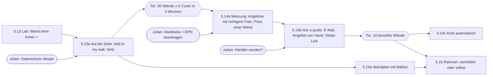

# Von der Wand im Browser zur gerahmten Wand im Flur

> **Stand 2026-09-28, abends.** Stufe 1 ist als Lab-Prototyp gebaut (`lab/walls/`, ROADMAP 5.13) und nach **E22** auf eine Besucher-ID wie bei taketest umgestellt. **Julian: erst ein MVP — Stufe 1 auf der Seite (5.13a); Stufen 2 und 3 sind zurückgestellt** („lass uns über des rest später nachdenken“), ebenso die Anträge bei AbeBooks/EPN und die Händlerfrage. Die Abschnitte dazu bleiben als Plan stehen. Julian, 2026-09-28: „I want to use the website as a funnel for art creation, of framed cover walls in the actual physical world … focus on step one for now but make a roadmap/plan for the entire funnel".

## Der Funnel in einem Satz je Stufe

| Stufe | Der Leser … | Die Seite … | Roadmap |
|---|---|---|---|
| **1 Kuratieren** | stellt aus Covern eine eigene Wand zusammen und behält den Link | speichert die Wand ohne Konto; ein Schlüssel im Browser darf sie ändern | **5.13** (Lab gebaut), 5.13a (auf die Seite) |
| **2 Kaufen** | kauft die ganze Wand in einem Schritt | sucht zu jedem Cover ein Angebot, dessen Foto dieses Cover zeigt, und legt einen Korb mit Gesamtpreis vor | 5.14, 5.14a–c |
| **3 Rahmen** | bekommt die Bücher gerahmt an die Wand | vermittelt an einen Rahmenladen gegen Provision — oder rahmt selbst | 5.15 |

Jede Stufe hat ein **Tor**: die nächste wird erst gebaut, wenn die vorige gemessen gezeigt hat, dass Leute sie benutzen. Das ist keine Vorsicht um ihrer selbst willen — Stufe 2 macht aus der Seite einen Händler mit Kundendaten (0.12, Gewerbe, Widerruf), und das lohnt nur, wenn es Nachfrage gibt.

**Warum diese Seite das kann und andere nicht:** Die Seite kennt Cover als eigene Dinge, nicht als Anhang einer ISBN (E8). Genau das braucht ein Käufer, der *dieses* Bild an der Wand will: eine ISBN nennt einen Druck, und unter derselben ISBN wechselt das Cover (CLAUDE.md, §2.3). Jeder Buchhändler verkauft „The Great Gatsby"; niemand verkauft „das Scribner-Cover von 2004, dunkelblau, mit den Augen". Das ist der Kern des Geschäfts und zugleich die Schwierigkeit von Stufe 2.

---

## Stufe 1 — Kuratieren ohne Konto

### Wie taketest.xyz es macht (angesehen am 2026-09-28)

taketest legt jedem **Besucher** eine UUID in ein Cookie (`visitor_id`) und zeigt sie in der Fußzeile als Textfeld mit „Save": „Your ID · sign in to keep results across devices". Wer die ID auf einem anderen Gerät einfügt, hat dort seine Ergebnisse. Wer mehr will, meldet sich an — ohne Passwort, per Link an die E-Mail oder mit Google; die Seite sagt: „Your results are kept with a cookie in this browser, so you do not need an account".

### Entschieden: wie taketest, mit einer Besucher-ID (E22)

Der erste Prototyp drehte taketest um und gab das Geheimnis der **Wand** statt dem Besucher (ein Schlüssel je Wand, Bearbeitungslink mit `#k=`, ein „Schlüsselbund“ zum Umziehen), um N11 einzuhalten. Julian hat N11 für diese Funktion aufgehoben („ich glaube n11 können wir für diese idee aufheben“), also gilt jetzt taketests Modell:

- Wer seine **erste Wand** anlegt, bekommt eine zufällige Besucher-ID (128 Bit) im Cookie `bb_visitor` (zwei Jahre, `SameSite=Lax`). **Wer nur schaut, bekommt keine.**
- Die Fußzeile zeigt die ID mit „Save“: auf einem anderen Gerät einfügen, und es ist derselbe Besucher mit denselben Wänden. Die Seite sagt, dass die ID wie ein Passwort ist.
- Der Server speichert je Wand nur den **SHA-256 der ID**; ein ausgelesener Speicher verrät weder, wem eine Wand gehört, noch lässt er sie ändern. Kein IP, kein User-Agent, kein Referrer.
- Schreiben nur als JSON — ein fremdes Formular kann das nicht ohne Preflight, und `SameSite=Lax` schickt das Cookie ohnehin nicht mit.
- Der Link `/w/<id>` zeigt die Wand jedem; ändern kann sie nur der Besitzer.

**Was damit wegfiel:** eine Wand gemeinsam mit jemandem bearbeiten, ohne ihm alle eigenen Wände zu geben. Käme das als Wunsch, wäre ein Bearbeitungslink je Wand der Zusatz — der erste Prototyp hatte ihn schon (Commit `d34218c`).

**Später, wie bei taketest:** Anmelden per E-Mail-Link, damit eine gelöschte Browser-Datenbank die Wände nicht kostet. Das braucht eine E-Mail-Adresse und damit 0.12 in voller Form — nicht im MVP.

### Was der Prototyp zeigt (gemessen 2026-09-28, lokal)

`npx tsx lab/walls/serve.ts` → http://localhost:4325. **Erste Fassung (Schlüssel je Wand):** Wand angelegt, zwei Werke gesucht (*The Left Hand of Darkness*, *Dune*), zwölf Cover gewählt, sechs Spalten; ohne Schlüssel schreibgeschützt, per Bearbeitungslink und Schlüsselbund wieder bearbeitbar, 403 mit falschem Schlüssel; 390 px ohne Überbreite. **12 von 12 Kacheln tragen mindestens eine ISBN** — die Einkaufsliste (`/api/walls/<id>/list`) ist schon der Eingang von Stufe 2. **Zweite Fassung (E22):** wer nur `/api/me` fragt, bekommt **kein** Cookie; die erste Wand setzt es, die zweite nicht noch einmal; der Besitzer ändert (200), eine fremde ID bekommt 403, ein Formular statt JSON 404; eine andere „Maschine“ ohne Cookie sieht die Wand schreibgeschützt, fügt die ID ein und hat beide Wände wieder; Unsinn wird abgelehnt; die ID steht nicht in der Speicherdatei.

**Befunde für den Umzug auf die Seite:**

1. **Die Auswahl faltet nicht.** Auf der Testwand steht das Minotauro-Motiv von *La mano izquierda de la oscuridad* zweimal (zwei Datensätze, ein Entwurf). Der Prototyp liest Open-Library-Ausgaben roh. Auf der Seite gehört der Knopf „Add to my wall" deshalb **an die gefaltete Wand der Buchseite** (Seitenleiste und Telefon-Blatt), nicht in einen eigenen Picker — dort ist jedes Cover schon eines.
2. **Die erste Ausgabenseite reicht nicht:** *Gatsby* hat auf Seite 0 nur **7** Cover, über drei Seiten **87**. Der Prototyp liest drei Seiten; auf der Seite erledigt das `useWorkPages`.
3. **Die Wand ist ein Rahmenplan, keine Galerie:** die Spaltenzahl ist die der echten Wand; der Bildschirm darf weniger zeigen, muss es aber sagen.

### Auf die Seite (5.13a) — was dazu nötig ist

- **Speicher:** die Redis des Cover-Spiels (SPEC F7.3), Schlüssel `wall:<id>`. Kein neuer Dienst.
- **Routen:** `POST /api/walls` (anlegen, gibt einmal den Schlüssel), `GET /api/walls/<id>`, `POST /api/walls/<id>` mit `x-wall-key` und Operationen (wie die Entwürfe aus 5.10b: Operationen, nie ganze Wände, damit zwei Tabs nur den kollidierenden Schritt verlieren). Rate-Limit-Eimer `walls`.
- **Seiten:** `/w/<id>` mit `noindex` (fremde Titel sind fremder Text), OG-Bild als Mosaik der Wand (5.5-Rechtefrage beachten), „Add to my wall" in der Seitenleiste der Buchseite, „Your walls" im Kopf, sobald der Browser eine kennt.
- **Missbrauch:** der einzige freie Text ist der Titel (80 Zeichen) → `noindex`, und ein Knopf „Report", der eine Wand verbirgt, bis Julian sie ansieht. Höchstens 60 Cover je Wand.
- **Spec:** erledigt als E22. Offen vor dem Deploy: ein Absatz zum Cookie in der Datenschutzerklärung (0.12).
- **Tor zu Stufe 2 (Messung):** vier Wochen nach dem Deploy: wie viele Wände mit **≥ 6 Covern** entstehen, und wie viele davon werden zweimal geöffnet (der Link wurde also behalten oder geteilt). Gezählt als Aggregat aus dem Speicher, ohne Besucherdaten. Schwelle vorgeschlagen: 30 solche Wände — sonst ist Stufe 2 ein Laden ohne Kundschaft.

---

### Gebaut (2026-09-28)

Das MVP steht auf dem Branch `claude/art-funnel-lab`, beschrieben in SPEC F9. Abweichungen vom Plan oben: der Knopf heißt „Add to wall“ und steht am Desktop **in der Zeile neben „Share“**, weil eine eigene Zeile den ersten Laden 40 px weiter unter ein 800-px-Fenster schob; der Melde-Knopf fehlt noch (der einzige freie Text ist der Titel, und `/w` ist `noindex`); dazu kam auf Julians Wunsch `/walls` mit **Fotoimport** aus `lab/shelf`.

### Wie lange, wie viel (Julians Frage vom 2026-09-28, ROADMAP 5.13e)

Heute: kein Ablauf, keine Grenze je ID. Gemessen: eine leere Wand 215 Byte, zwölf Cover 2,9–7,8 KB (je nach Zahl der Drucke), das Maximum 38 KB. Vorschlag: 20 Wände je ID, Verfall nach zwölf Monaten ohne Änderung und ohne fremden Aufruf (freigegebene nie), die Tarifgrenze der Redis in Vercel nachsehen. Entscheidung: Julian.

### Zeigen: „Walls by readers“ (5.13d, gebaut)

Der Besitzer schreibt einige Zeilen und bietet die Wand ab sechs Covern an; Julian gibt frei (`/walls/review`); was Leser schreiben, steht erst danach öffentlich, und nach jeder Änderung an Titel oder Zeilen wieder erst nach einer Freigabe. Aufrufe durch andere zählen; ab 25 (gesetzt) steht eine Wand auch unter den Sammlungen.

### Datenschutz-Absatz (Entwurf)

Für `/privacy`, zu prüfen und zu übernehmen von Julian, bevor `WALLS=on` in Produktion gesetzt wird:

> **Your cover walls.** If you make a wall, your browser gets a cookie named `bb_visitor` holding a random ID. It is set only when you make your first wall, lasts two years and does nothing else: it tells this site which walls you may change. We store your walls — their title, the covers on them and the editions those covers belong to — together with a one-way hash of that ID, not the ID itself, in a database run by our hosting provider’s storage partner. We store nothing else about you: no IP address, no device details, no referrer. We count how often a wall is opened by others, as a number per wall. If you offer a wall for “Walls by readers”, its title and the lines you wrote are shown there once we have read them. Anyone with the link to a wall can see it. You can delete the cookie at any time; your walls then stay online but can no longer be changed from this browser unless you paste your ID again. **Photos:** if you start a wall from a photo, the photo is sent once to Anthropic, which reads the book titles on it, and is not stored by us or kept in our logs.

Zu klären dabei (0.12): der Speicheranbieter der Redis (Region, Auftragsverarbeitung) und Anthropics Bedingungen für Bilder über die API.

## Stufe 2 — Die ganze Wand kaufen

### Die harte Wahrheit zuerst

Was die Seite über Läden gelernt hat, gilt hier doppelt (CLAUDE.md, SPEC §8.7): Amazon beantwortet automatisierte Abrufe mit einer Bot-Prüfung und verbietet sie in den Associates-Bedingungen; eBay, ThriftBooks, Blackwell's und Booklooker lehnen ab; vier von sechs Läden sperren den Pfad in der robots.txt. **Ein Agent, der Shops abgrast, ist ausgeschlossen.** Er geht nur über offizielle Schnittstellen:

| Quelle | Was sie kann | Zugang | Bild |
|---|---|---|---|
| **AbeBooks Search Web Services** | Angebote nach ISBN, Autor, Titel, Verlag, mit Preis, Versand, Verkäufer; dazu eine **Purchase API** | nur für Mitglieder des Affiliate-Programms (5 % Provision), Client Key auf Antrag | oft Verkäuferfoto, oft Katalogbild — pro Angebot zu prüfen |
| **eBay Browse API** | Suche nach GTIN (= ISBN), Angebote mit `itemAffiliateWebUrl` für das Partner Network | Sandbox frei; **Produktion nur für eBay-Partner, Antrag über EPN**; Checkout-Methoden gesperrt | meist echte Fotos des Exemplars — das Beste für den Cover-Abgleich |
| Booklooker / ZVAB (DE) | ZVAB gehört zur AbeBooks-Gruppe, Booklooker lehnt Abrufe ab | über AbeBooks / nichts | — |

Quellen: [eBay Browse API search](https://developer.ebay.com/api-docs/buy/browse/resources/item_summary/methods/search), [eBay Buy APIs requirements](https://developer.ebay.com/api-docs/buy/static/buy-requirements.html), [AbeBooks Search Web Services](https://www.abebooks.com/developer/search-web-services/overview), [AbeBooks Purchase API](https://www.abebooks.com/developer/purchaseapi/), [AbeBooks Affiliate](https://www.abebooks.com/books/affiliateprogram/) (alle abgerufen 2026-09-28). Beides deckt sich mit 4.3, das AbeBooks und EPN ohnehin als Partnerprogramme führt.

### Der Agent

Je Kachel: (1) alle ISBNs der Drucke, die dieses Cover trugen (liegen schon in der Wand); (2) Angebote über AbeBooks und eBay; (3) **das Angebotsfoto gegen die Cover-Signatur** der Kachel (`lib/dhash.ts`, dieselbe Rechnung wie die Faltung) → drei Urteile wie beim Verdikt (F2.9): *zeigt dieses Cover* / *zeigt ein anderes* / *Katalogbild oder kein Foto, kann es nicht sagen*; (4) Zustand, Preis, Versand, Verkäuferland. Dann **der Korb**: je Kachel das günstigste Angebot mit „zeigt dieses Cover", Versand je Verkäufer zusammengerechnet (20 Bücher von 20 Verkäufern sind 20 Versandkosten — das ist der Posten, den ein Mensch unterschätzt), und für jede Kachel ohne sicheres Angebot ehrlich: „kein Angebot, das dieses Cover zeigt".

**N12 gilt voll:** „kann es nicht sagen" darf nie als „hat dieses Cover" erscheinen; und ein leerer Korb nach einem Ausfall ist kein „nichts gefunden". Die Regel „A verdict must never claim more than was checked" (CLAUDE.md) wird hier zur Geldfrage: wer ein falsches Cover geliefert bekommt, hat für die falsche Wand bezahlt.

**Zuerst messen (5.14a), bevor irgendetwas bezahlt wird:** an drei echten Wänden (je 12 Cover, eine englische, eine deutsche, eine Reihe) — für wie viele Kacheln findet sich ein Angebot, dessen Foto das Cover zeigt, und was kostet die Wand mit Versand? Ohne AbeBooks-Schlüssel und EPN-Freigabe geht das nur von Hand (Julian sucht, Claude protokolliert) oder in der eBay-Sandbox, die keine echten Angebote hat. **Der Antrag bei AbeBooks und EPN ist deshalb Julians erster Schritt** (4.3 vorziehen).

### Bezahlen, ohne nach der Kreditkarte zu fragen

„Ohne zu viele Daten wie Kreditkarten" heißt: **die Seite sieht nie eine Kartennummer.** Drei Wege:

| Weg | Was der Leser tut | Was wir sind | Daten bei uns |
|---|---|---|---|
| **A Liste mit Links** | kauft jedes Buch einzeln über Affiliate-Links | Vermittler (wie heute) | keine |
| **B Concierge** | zahlt einmal über eine gehostete Kasse (Stripe Checkout: Karte, Apple Pay, Google Pay, PayPal, Klarna — der Anbieter hält die Zahlungsdaten); wir kaufen und lassen liefern | **Händler**: Gewerbe (4.4), AGB, Widerruf, Umsatzsteuer, Rückgaben, Haftung für falsche Cover | E-Mail, Lieferadresse, Bestellung |
| C Kasse bei eBay/AbeBooks über API | bezahlt beim Marktplatz, ein Korb über viele Verkäufer | Vermittler mit Provision | wenig — aber eBays Checkout-API ist Partnern vorbehalten und AbeBooks' Purchase API bindet an ihre Bedingungen; **zu prüfen**, nicht zu versprechen |

**Vorschlag:** A sofort als Rückfallebene (kostet nichts, ist 4.3); dann **B von Hand** für die ersten zehn Bestellungen: „Get a quote for this wall" nimmt nur eine E-Mail-Adresse, Julian schickt ein Angebot mit einem Stripe-Zahlungslink, die Lieferadresse sammelt die Kasse. Erst wenn zehn Wände bezahlt wurden, wird automatisiert. C bleibt die elegante Lösung und wird angefragt, sobald EPN oder AbeBooks antworten.

**Rechtlich festzuhalten:** verkauft werden **echte, gebrauchte oder neue Bücher** — der Weiterverkauf eines rechtmäßig in Verkehr gebrachten Exemplars ist erlaubt (Erschöpfung). **Nie Drucke oder Reproduktionen von Covern**: die Gestaltung ist urheberrechtlich geschützt; das trennt dieses Geschäft von jedem Poster-Shop und muss so bleiben (verwandt mit der Rechtefrage 5.5). Ausnahme nur für gemeinfreie Cover, und auch die erst nach Prüfung.

### Was Stufe 2 an der Seite ändert

Kaufen ist heute Phase 4 und wartet auf Besucher. Der Funnel zieht **4.3 (AbeBooks, EPN) und 4.4 (Gewerbe)** nach vorn, und macht 0.12 fällig (E-Mail, Adresse → Datenschutzerklärung, Auftragsverarbeitung mit Stripe und dem Speicher). E19 (Werberegeln) berührt er nicht.

---

## Stufe 3 — Rahmen

Offen und bewusst später (Julian: „that's a later problem"). Was vorher zu klären ist, damit Stufe 2 nichts verbaut:

- **Was wird gerahmt?** Drei Formen mit sehr verschiedenen Rahmen: (a) der **Schutzumschlag** eines Hardcovers, flach unter Glas; (b) das **ganze Buch** in einem Objektrahmen (Tiefe 3–5 cm); (c) der **Einband** eines Taschenbuchs, das dafür zerstört würde — (c) wohl nie, das widerspricht der Seite. Die Wand muss also je Kachel wissen, welches Format der gekaufte Druck hat (`format` liegt im Modell, `physical_dimensions` hat Open Library bei manchen Ausgaben).
- **Einheitliche Rahmen trotz verschiedener Formate:** ein Passepartout gleicher Außenmaße für alle Kacheln macht aus unterschiedlich großen Büchern eine ruhige Wand — so zeigt es schon der Prototyp (Rahmen 5:7, Cover darin eingepasst). Das ist auch die Rechnung für einen Rahmenladen: ein Maß, n Stück.
- **Vermitteln oder selbst:** Vermittlung an einen Online-Rahmenladen mit Partnerprogramm, oder an lokale Rahmer (wie 5.12 lokale Buchhandlungen findet), oder selbst: Rahmen in Serie kaufen, Bücher bei uns anliefern lassen, gerahmt verschicken — das ist Werkstatt und Lager, also eine Firma. **Zu recherchieren (5.15):** welche Rahmenläden in DE/UK/US ein Partnerprogramm haben, Objektrahmen in Serie anbieten und Ware annehmen, die ein Dritter anliefert.
- **Der Wandplan** ist das Bindeglied: aus Spaltenzahl, Rahmenmaß und Abstand ein maßstäbliches Bild mit Maßen zum Aufhängen. Er ist auch ohne Stufe 2 und 3 nützlich (ein Leser, der selbst kauft und rahmt), und deshalb der wahrscheinlich erste Baustein von Stufe 3.

---

## Entscheidungen für Julian

**Stand 2026-09-28:** 3 und 4 sind bis nach dem MVP zurückgestellt (Julian).

1. ~~N11~~ — entschieden als E22 (2026-09-28). Offen: der Datenschutz-Absatz zum Cookie vor dem Deploy.
2. **Tor-Schwelle** zwischen Stufe 1 und 2: 30 Wände mit ≥ 6 Covern in vier Wochen?
3. **AbeBooks-Affiliate und eBay Partner Network beantragen** (4.3 vorziehen) — ohne Schlüssel keine Messung 5.14a außer von Hand.
4. **Händler werden oder nicht** (Weg B): Gewerbe, AGB, Widerruf. Bis dahin nur Weg A.
5. Ob die Wand-Seite **öffentlich teilbar** mit OG-Bild sein darf — hängt an der Rechtefrage 5.5.

## Reihenfolge

