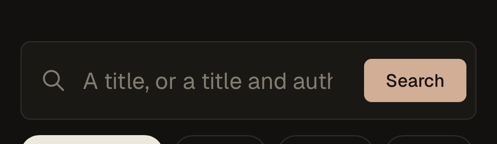
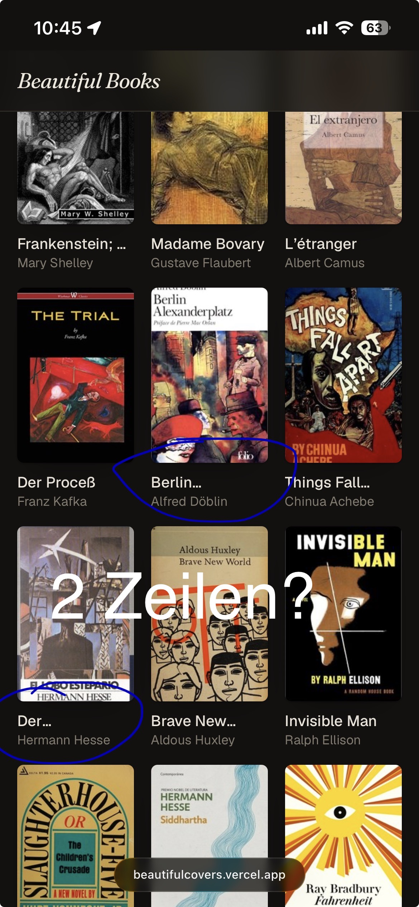
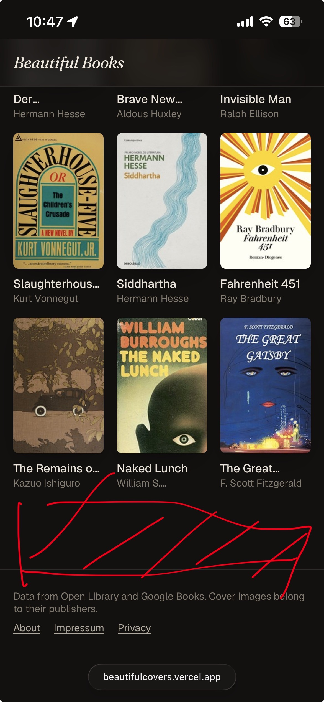
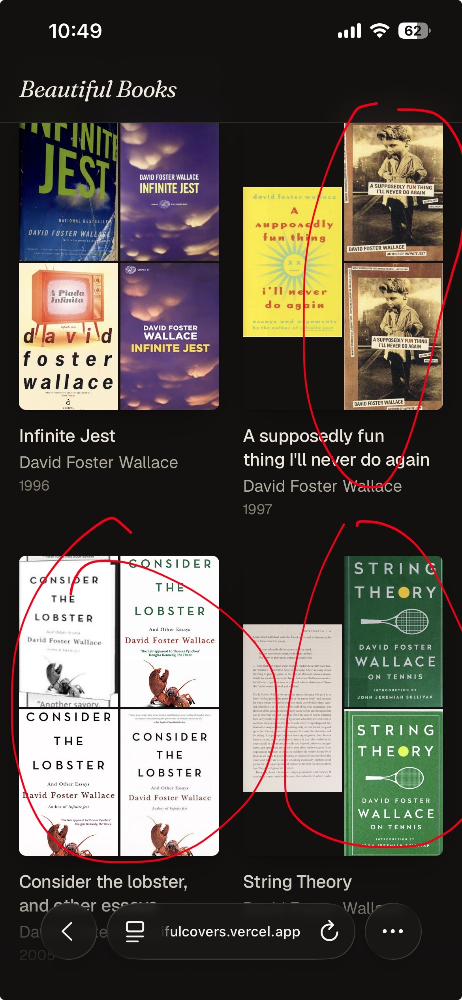
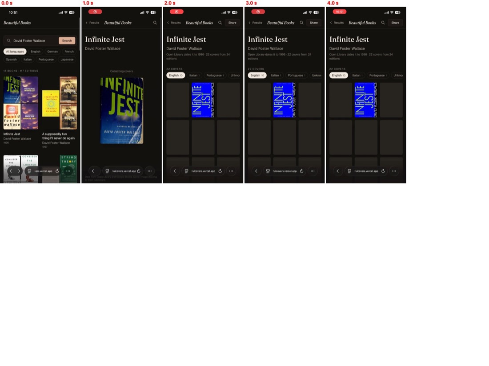
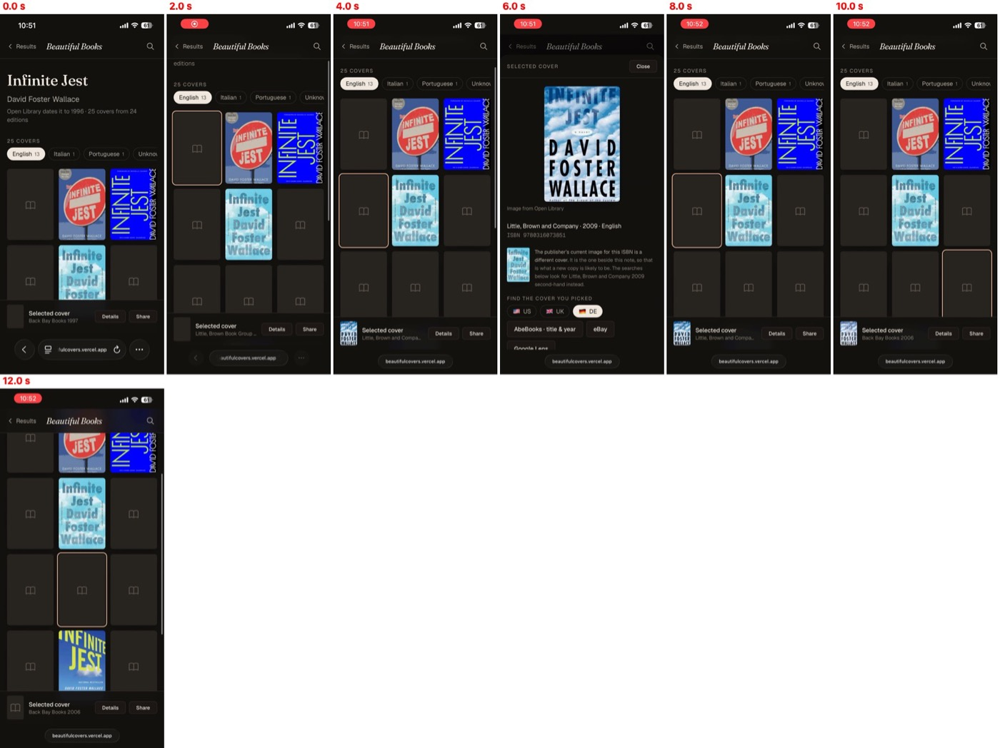
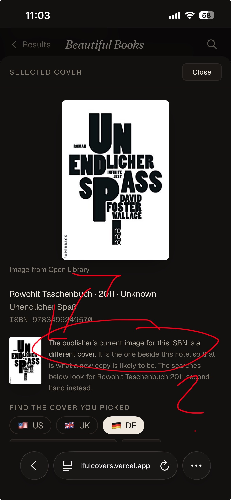
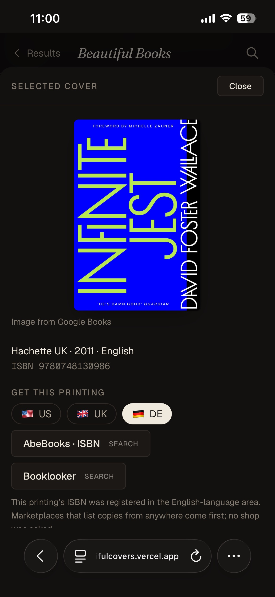
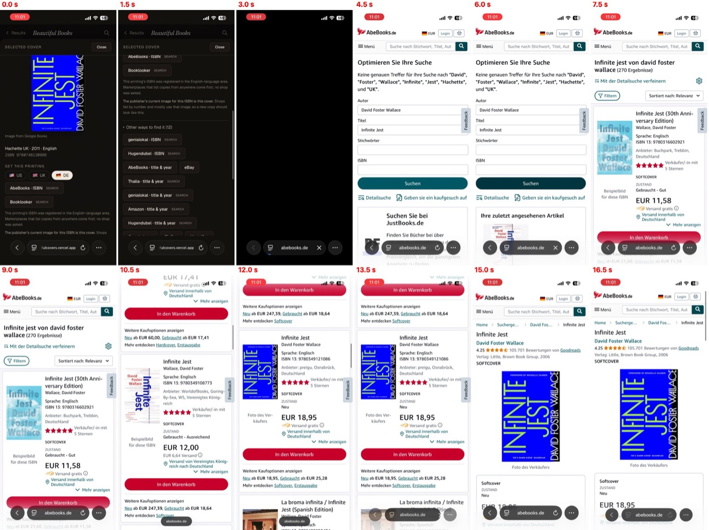

# Testbericht: Produktion auf dem Telefon, 2026-09-11

Aufgenommen von Julian auf dem iPhone gegen https://beautifulcovers.vercel.app, in mehreren Tranchen aus Screenshots und Bildschirmaufnahmen; zusammengefasst und am Dev-Server nachgemessen von Claude. Was daraus zu tun ist, kommt als Plan in [ROADMAP.md](../../ROADMAP.md), sobald alle Tranchen da sind. Dieses Dokument ist der Befund.

**Julians Anforderung dazu, sinngemäß:** Telefon und Desktop müssen in Zukunft eine *vergleichbare* Erfahrung bieten. Die Befunde unten sind deshalb jeweils mit dem Desktop verglichen: was dort funktioniert und auf dem Telefon nicht, ist der Kern.

---

## Tranche 1 — Startseite

Gemessen am Dev-Server bei 390 × 844 (iPhone) und 1280 × 800 (Desktop), Stand `35b171d`, der in diesen Punkten Produktion entspricht.

### M1 Der Platzhalter im Suchfeld ist abgeschnitten

„A title, or a title and auth…" — das Ende fehlt. Der Platzhalter braucht bei `text-lg` **218 px**, das Feld lässt ihm auf dem Telefon **196 px**, weil links 48 px für die Lupe und rechts 112 px für den „Search"-Knopf reserviert sind (`components/SearchBar.tsx`, `pl-12 pr-28`). Auf dem Desktop sind es 606 px.

### M2 Titel auf der Startwand sind einzeilig und auf dem Telefon zur Hälfte abgeschnitten

Julian: „2 Zeilen?" — markiert an „Berlin…" und „Der…". `components/CuratedWall.tsx` setzt Titel **und** Autor auf `line-clamp-1`.

| | Telefon (3 Spalten) | Desktop (6 Spalten) |
|---|---|---|
| abgeschnittene Titel | **9 von 18** | 1 von 18 |
| abgeschnittene Autoren | 1 („William S…." — Punkt plus Auslassung) | 0 |

Abgeschnitten auf dem Telefon: Gravity's Rainbow, Frankenstein; or, The Modern Prometheus, Berlin Alexanderplatz, Things Fall Apart, Der Steppenwolf, Brave New World, Slaughterhouse-Five, The Remains of the Day, The Great Gatsby. Aus „Der Steppenwolf" wird „Der…" — der Titel ist damit weg, nicht gekürzt. Auf dem Desktop nur Frankenstein, und das wegen des Untertitels.

Die Trefferkarten der Suche (`BookWorkCard.tsx`) haben schon `line-clamp-2`; die Startwand ist der Ausreißer.

### M3 Leerer Streifen zwischen Wand und Fußzeile

Julian hat ihn rot durchgestrichen. Es sind **96 px** `pb-24` unter der Wand (`app/page.tsx`, `<section className="pb-24">`), auf beiden Geräten gleich. Auf dem Desktop liest sich das als Luft vor der Fußzeile, auf dem Telefon als leere Fläche von einem Achtel Bildschirmhöhe.

### Nebenbei gesehen, nicht von Julian markiert

- Auf der Startwand stehen Titel und Cover teils in verschiedenen Sprachen: *Der Steppenwolf* mit „El lobo estepario", *L'étranger* mit „El extranjero", *Der Proceß* mit „The Trial". Ob das gewollt ist (das schönste Cover, egal in welcher Sprache), ist Julians Entscheidung.
- *Frankenstein; or, The Modern Prometheus* ist auf beiden Geräten zu lang; der Untertitel nach dem Semikolon trägt auf einer Kachel nichts.

---

## Tranche 2 — Dubletten und Kacheln, die nicht laden

Julians Material: ein Screenshot der Trefferliste für „David Foster Wallace", zwei Bildschirmaufnahmen der Werkseite *Infinite Jest* (aufgenommen 2026-09-10, 22:51 und 22:51:53, also **vor** `35b171d`), zwei Screenshots der Rowohlt-Ausgabe. Die Aufnahmen liegen hier als Kontaktbögen, ein Bild pro Sekunde bzw. alle zwei Sekunden.

### M4 Dubletten auf den Trefferkarten

Rot umkreist: *A supposedly fun thing* zeigt rechts zweimal dasselbe Bild, *String Theory* zweimal das grüne Cover und links eine gedruckte Textseite statt eines Covers, *Consider the Lobster* viermal dasselbe Motiv.

Nachgemessen am Dev-Server: Die Dubletten sind **verschiedene Open-Library-Cover-IDs** (verschiedene Uploads, keines bytegleich). Der Kartenweg (`?summary=1`, `coverImages` in `lib/seo.ts`) prüft nur Verlag und Jahr, nie das Bild. Abstände der dHash-Signaturen innerhalb jeder Karte, gemessen mit `lib/imagehash.ts`:

| Karte | kleinster Abstand | würde die Wand falten? |
|---|---|---|
| A supposedly fun thing | **0** (ol-6393621 / ol-191089) | ja (≤ 8) |
| Oblivion | **2** | ja |
| Consider the Lobster | **8**, die übrigen Paare 17–24 | ein Paar ja; der Rest sind verschiedene Drucke desselben Entwurfs |
| String Theory | 32 | nein — das untere Bild hat einen weißen Rahmen, das verschiebt den Hash |
| die übrigen vier | ≥ 13 | nein |

Drei von acht Karten zeigen also ein Paar, das die Wand selbst zusammenlegen würde. Die Textseite bei *String Theory* (ol-14337766) erkennt `looksLikeScannedPage` nicht: sie ist bedruckt, nicht leer, und die Regel sucht leere Seiten. Telefon und Desktop sind hier gleich betroffen — es ist dieselbe Karte.

### M5 Die Kartenkacheln laden in Größe L

Jede Kachel einer Trefferkarte lädt `/img/L/…` (≈ 500 px Höhe), angezeigt wird sie auf dem Telefon bei etwa 85 × 125 px. Gemessen an den 14 Covers der ersten vier Karten: **505 KB in L gegen 195 KB in M**, das 2,6-Fache. Eine Trefferseite mit 18 Karten lädt bis zu 72 solcher Bilder. Auf dem Telefon wiegt das doppelt: langsamere Leitung, und der Browser holt die Bilder erst beim Scrollen (`loading="lazy"`).

### M6 Die Wand übernimmt fast leer

Tippen auf *Infinite Jest* bei 0,5 s, das Karten-Cover steht mit „Collecting covers" bei 1,0 s, die Wand kommt bei 2,0 s mit „22 covers" — und von neun sichtbaren Kacheln ist **eine** gefüllt, bei 4,0 s immer noch. Das ist der Fehler aus 6.25a; die Übergabe erst nach den ersten sechs Wandcovern (`35b171d`) war zur Aufnahmezeit nicht in Produktion und ist es noch nicht.

### M7 Kacheln bleiben für immer leer

Zweiter Besuch derselben Werkseite, jetzt „25 covers". Nach 12 s tragen im Tab English die meisten Kacheln das **Buch-Symbol** — das ist in `CoverImage.tsx` der Zustand *failed*, nicht *lädt noch*. Tippt Julian eine solche Kachel an (6,0 s), zeigt die Schublade dasselbe Cover sofort: dort wird es in Größe L unter einer anderen Adresse geholt, und die klappt. Auch das Vorschaubild in der Leiste „Selected cover" bleibt leer (auch in M9 zu sehen).

Zwei Befunde daraus:

- **`CoverImage` versucht es nie ein zweites Mal.** Ein einziges fehlgeschlagenes Laden macht die Kachel für den ganzen Besuch zum Buch-Symbol; ein Zurück-und-wieder-hin hilft nur, wenn der Browser das Bild nicht als Fehler zwischenspeichert.
- **Auf dem Dev-Server ist dieselbe Wand vollständig:** 15 Cover, im Tab English 5 von 5 geladen, Unknown 8 statt 12. Produktion zählt 22–25. Das passt zu einer Ursache auf dem Server: kann Vercel ein Bild bei Open Library nicht holen, fehlt ihm *sowohl* die Signatur (also wird nichts gefaltet, und es bleiben mehr Cover) *als auch* das Bild für `/img` (also bleibt die Kachel leer). Welche Antwort Open Library dabei gibt, steht in den `bb.img`-Zeilen aus 6.25; lesen konnte ich sie nicht (Vercel-CLI nicht installiert, Vercel-MCP nicht autorisiert). **Vermutlich nicht telefonspezifisch** — der Desktop sollte an denselben Tagen dieselben Löcher zeigen.

### M8 Das Urteil „anderes Cover" neben einem gleichen Bild

Rowohlt Taschenbuch 2011, ISBN 9783499249570. Die Seite sagt: *The publisher's current image for this ISBN is a different cover* — und das Bild daneben ist erkennbar dasselbe. Julians Markierung 2.

Ursache im Code: `verifyIsbnCover` (`lib/works.ts`) sagt `differs`, sobald Googles Bild **nicht in das gewählte Cover gefaltet** wurde. Fehlt einer der beiden Seiten die Signatur — genau das, was M7 nahelegt —, wird nicht gefaltet, und aus „konnte nicht vergleichen" wird „ist ein anderes Cover". Das ist ein Fehler, der als Befund ausgegeben wird, also gegen die Regel in CLAUDE.md und SPEC N12. Am Dev-Server nicht nachstellbar: Google antwortet dort gerade `unavailable`.

**Julian dazu: „Das Rowohlt-Beispiel war auch ein Dubletten-Problem."** Das falsche Urteil ist also die Folge, nicht die Ursache: Googles Bild und der Open-Library-Scan sind *dasselbe Cover* und hätten zu einer Kachel gefaltet werden müssen. Weil sie nicht gefaltet wurden, steht Googles Bild als eigene Kachel da (die vierte *Unendlicher Spaß* in M9), und das Urteil liest daraus „anderes Cover". *(Claudes erste Deutung, Markierung 1 meine die Sprache „Unknown", war falsch; die fehlende Sprache bleibt eine Nebenbeobachtung.)*

Nachgemessen 2026-09-11. Open Library hat drei Scans der deutschen Ausgaben, alle im selben Entwurf:

| Paar | dHash-Abstand | gilt als | faltet heute? |
|---|---|---|---|
| Kiepenheuer & Witsch 2009 (ol-9343501) ↔ KiWi o. J. (ol-9051989) | 7 | gleicher Verlag | ja (≤ 8 immer) |
| Rowohlt Taschenbuch 2011 (ol-9390687) ↔ KiWi 2009 | 19 | verschiedene Verlage | **nein** — über Verlagsgrenzen nur bis 8 |
| Rowohlt 2011 ↔ KiWi o. J. | 22 | verschiedene Verlage | **nein** |
| Googles Bild für 9783499249570 ↔ Rowohlt-Scan | — | gleiche ISBN, Stufe ≤ 20 | nicht messbar: Googles Kontingent war heute erschöpft, auch anonym |

Daraus zwei getrennte Befunde:

- **Selbst wenn alles funktioniert, bleiben es nach den heutigen Regeln zwei Kacheln statt einer.** Die Übernahme eines Entwurfs von Kiepenheuer & Witsch ins Rowohlt-Taschenbuch ist für den Leser dasselbe Cover; die Regel „nie über Verlagsgrenzen oberhalb von 8" hält sie bewusst getrennt (SPEC E8, gesetzt gegen falsche Faltungen). Ob dieselbe Gestaltung bei verschiedenen Verlagen *eine* Kachel sein soll, ist eine Produktfrage an Julian — mit dem Risiko, dass die gelockerte Regel echte verschiedene Cover zusammenwirft.
- **Produktion zeigte vier statt der zwei, die die Regeln erlauben.** Selbst das Paar mit Abstand 7 blieb dort getrennt — das passt wieder zu fehlenden Signaturen (M7).

### M9 Dubletten auf der Wand

Im Tab **Unknown 12**: viermal *Unendlicher Spaß*, zweimal das weiß-blaue „David Foster Wallace / Infinite". Zwei Ursachen überlagern sich:

- Die Faltung fehlt, wo die Signatur fehlt (M7). Am Dev-Server hat derselbe Tab 8 statt 12.
- Die deutschen Ausgaben stehen unter **Unknown** statt German, weil Open Library ihnen keine Sprache gibt; ein Titel wie *Unendlicher Spaß* sagt es eigentlich.

---

## Tranche 3 — Das Cover gibt es, nur unter einer anderen ISBN

Julian: *„hier schlägt unsere Suche wegen schlechter Daten fehl, aber ich frage mich, wieso wir das Cover nicht via ISBN finden?"*

### M10 Die Suche nach der Ausgabe findet nichts, das Buch ist aber da

Gewählt ist das blaue *Infinite Jest* mit dem Vorwort von Michelle Zauner, **Bild von Google Books**, dort geführt als **Hachette UK · 2011 · ISBN 9780748130986**. Die Seite sagt richtig, Googles Bild für diese ISBN *ist* dieses Cover.

Die Aufnahme (22 s):

| Zeit | Was passiert |
|---|---|
| 0–1,5 s | Schublade, unter DE nur „AbeBooks · ISBN" und „Booklooker"; darunter „Other ways to find it (12)" |
| 4,5 s | AbeBooks.de nach Titel, Autor, Verlag und Jahr: **„Keine genauen Treffer für … Hachette und UK"** |
| 7,5 s | Julian nimmt den Verlag heraus: 270 Ergebnisse |
| 12–21 s | Er scrollt und findet das blaue Cover: **ISBN 9780349121086**, Little, Brown Book Group, Softcover neu, 18,95 €, 30 Angebote neu ab 18,95 € |

Warum unsere Links scheitern, am Code und an Open Library geprüft:

- **Der Suchlink fragt nach Verlag *und* Jahr** (`searchLinksFor` in `lib/buylinks.ts`: `pn=Hachette UK`, `yrl=yrh=2011`). Beides sind Googles Angaben für *diese* ISBN; die Händler führen das Buch unter Little, Brown und 2006. Zwei falsche Einschränkungen, null Treffer. Ein Link, der den Verlag weglässt, hätte es gefunden (Julians Schritt bei 7,5 s).
- **Die ISBN 9780748130986 ist sehr wahrscheinlich die E-Book-Ausgabe.** Open Library führt sie ohne Format und ohne Cover; Hachette UK 2011 ist das Digital-Impressum. Ein Antiquariat findet unter einer E-Book-ISBN nichts. *(Nicht bei AbeBooks nachgeprüft — die Seite fragt keinen Händler, und diese Prüfung auch nicht.)* Googles Parser (`googlebooks-parse.ts`) filtert nur `printType !== 'BOOK'` und behält die erste ISBN-13; ob ein Band ein E-Book ist, fragt er nicht.

### Warum wir das Cover nicht über die ISBN finden

Weil wir das Bild an die **falsche ISBN** gehängt haben — und die richtige schon haben, nur ohne Bild:

- **9780349121086 steht im selben Werk bei Open Library** (`OL29007775M`, Little, Brown Book Group Limited, ohne Cover, Jahr 1997). Sie ist eine unserer 24 Ausgaben — aber eine ohne Scan, und eine Ausgabe ohne Scan erscheint nicht auf der Wand. Nichts verbindet sie mit dem blauen Bild.
- Open Library hat unter **keiner der beiden ISBNs** ein Cover (`covers.openlibrary.org/b/isbn/…` antwortet 404).
- Googles ISBN-Abfrage würde es wohl wissen — AbeBooks zeigt unter 9780349121086 genau dieses Bild —, aber wir fragen Google nur für die **gewählte** Ausgabe nach ihrer ISBN, und die gewählte ist die E-Book-ISBN.

Was die Frage „welche ISBN liefert dieses Cover?" beantworten könnte, ohne das Google-Kontingent zu sprengen, ist Sache des Plans. Zwei Richtungen, beide noch ungemessen:

1. **Umsonst:** Die Google-Titelsuche auf Seite 0 liefert ohnehin bis zu 40 Bände mit ISBN und Bild. Faltet das Bild mehrerer Bände zu einem Cover, hat das Cover mehrere ISBNs — und die Druck-ISBN kann vor die E-Book-ISBN. Hilft nur, wenn der Taschenbuchband unter den 40 ist.
2. **Kostet Kontingent:** Für Ausgaben ohne Scan, deren ISBN wir kennen, Googles Bild erfragen — bei *Infinite Jest* bis zu 24 Anfragen, bei 1.000 am Tag nur auf Knopfdruck denkbar.

Telefon und Desktop sind hier gleich betroffen; auf dem Telefon kostet es mehr, weil das Suchen und Scrollen in einem fremden Shop dort mühsamer ist.
